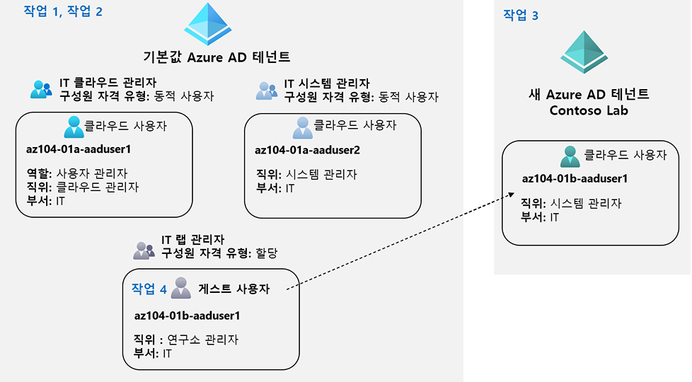

---
lab:
  title: 01 - Azure Active Directory ID 관리
  module: Administer Identity
---

# 랩 01 - Azure Active Directory ID 관리

# 학생용 랩 매뉴얼

## 랩 시나리오

In order to allow Contoso users to authenticate by using Azure AD, you have been tasked with provisioning users and group accounts. Membership of the groups should be updated automatically based on the user job titles. You also need to create a test Azure AD tenant with a test user account and grant that account limited permissions to resources in the Contoso Azure subscription.

## 목표

이 랩에서는 다음을 수행합니다.

+ 작업 1: Azure AD 사용자 만들기 및 구성
+ 작업 2: 할당된 동적 구성원을 사용하여 Azure AD 그룹 만들기
+ 작업 3: AD(Azure Active Directory) 테넌트 만들기(선택 사항 - 랩 환경 이슈)
+ 작업 4: Azure AD 게스트 사용자 관리(선택 사항 - 랩 환경 이슈)

## 예상 소요 시간: 30분

## 아키텍처 다이어그램

## 지침

### 연습 1

#### 작업 1: Azure AD 사용자 만들기 및 구성

이 작업에서는 Azure AD 사용자를 만들고 구성합니다.

>**참고**: 이전에 이 Azure AD 테넌트에서 Azure AD Premium용 평가판 라이선스를 사용했다면 새 Azure AD 테넌트를 만들고 새 Azure AD 테넌트에서 작업 3 후에 작업 2를 수행해야 합니다.

1. [Azure Portal](https://portal.azure.com)에 로그인합니다.

1. Azure Portal에서 **Azure Active Directory**를 검색하고 선택합니다.

1. Azure Active Directory 블레이드에서 **관리** 섹션까지 아래로 스크롤하여 **사용자 설정**을 클릭하고 사용 가능한 구성 옵션을 검토합니다.

1. Azure Active Directory 블레이드의 **관리** 섹션에서 **사용자**를 클릭한 다음 사용자 계정을 클릭하여 **프로필** 설정을 표시합니다. 

1. **편집**을 클릭하고 **설정** 섹션에서 **사용 위치**를 **미국**으로 설정하고 **저장**을 클릭하여 변경 내용을 저장합니다.

    >**참고**: 이것은 이 랩의 후반부에서 사용자 계정에 Azure AD Premium P2 라이선스를 할당하려면 필요합니다.

1. **사용자 - 모든 사용자** 블레이드로 다시 이동한 다음 **+ 새 사용자**를 선택하세요.

1. 다음 설정을 사용하여 새 사용자를 만듭니다(다른 설정은 기본값으로 유지).

    | 설정 | 값 |
    | --- | --- |
    | 사용자 이름 | **az104-01a-aaduser1** |
    | Name | **az104-01a-aaduser1** |
    | 암호 직접 만들기 | 사용 |
    | 초기 암호 | **보안 암호 제공** |
    | 사용 위치 | **미국** |
    | 직함 | **클라우드 관리자** |
    | department | **IT** |

    ><bpt id="p1">**</bpt>Note<ept id="p1">**</ept>: <bpt id="p2">**</bpt>Copy to clipboard<ept id="p2">**</ept> the full <bpt id="p3">**</bpt>User Principal Name<ept id="p3">**</ept> (user name plus domain). You will need it later in this task.

1. 사용자 목록에서 새로 만든 사용자 계정을 클릭하여 해당 블레이드를 표시합니다.

1. **관리** 섹션에서 사용할 수 있는 옵션을 검토하고 사용자 계정에 할당된 Azure AD 역할 및 Azure 리소스에 대한 사용자 계정의 권한을 식별할 수 있습니다.

1. **관리** 섹션에서 **할당된 역할**을 클릭한 다음, **+ 할당 추가** 단추를 클릭하고 **사용자 관리자** 역할을 **az104-01a-aaduser1**에 할당합니다.

    >**참고**: 새 사용자를 프로비전하는 경우 Azure AD 역할을 할당할 수도 있습니다.

1. Open an <bpt id="p1">**</bpt>InPrivate<ept id="p1">**</ept> browser window and sign in to the <bpt id="p2">[</bpt>Azure portal<ept id="p2">](https://portal.azure.com)</ept> using the newly created user account. When prompted to update the password, change the password to a secure password of your choosing. 

    >**참고**: 사용자 이름(도메인 이름 포함)을 입력하는 대신 클립보드의 콘텐츠를 붙여 넣을 수 있습니다.

1. **InPrivate** 브라우저 창의 Azure Portal에서 **Azure Active Directory**를 검색하고 선택합니다.

    ><bpt id="p1">**</bpt>Note<ept id="p1">**</ept>: While this user account can access the Azure Active Directory tenant, it does not have any access to Azure resources. This is expected, since such access would need to be granted explicitly by using Azure Role-Based Access Control. 

1. **InPrivate** 브라우저 창의 Azure AD 블레이드에서 **관리** 섹션으로 아래로 스크롤하여 **사용자 설정**을 클릭합니다. 구성 옵션을 수정할 수 있는 권한이 없다는 것에 유의하십시오.

1. **InPrivate** 브라우저 창의 Azure AD 블레이드의 **관리** 섹션에서 **사용자**를 클릭한 다음, **+ 새 사용자**를 클릭합니다.

1. 다음 설정을 사용하여 새 사용자를 만듭니다(다른 설정은 기본값으로 유지).

    | 설정 | 값 |
    | --- | --- |
    | 사용자 이름 | **az104-01a-aaduser2** |
    | Name | **az104-01a-aaduser2** |
    | 암호 직접 만들기 | 사용 |
    | 초기 암호 | **보안 암호 제공** |
    | 사용 위치 | **미국** |
    | 직함 | **시스템 관리자** |
    | department | **IT** |

1. Azure Portal에서 az104-aaduser1 사용자로 로그아웃하고 InPrivate 브라우저 창을 닫습니다.

#### 작업 2: 할당된 동적 구성원을 사용하여 Azure AD 그룹 만들기

이 작업에서는 할당된 동적 구성원을 사용하여 Azure Active Directory 그룹을 만듭니다.

1. **사용자 계정**으로 로그인한 Azure Portal로 돌아가서 Azure AD 테넌트의 **개요** 블레이드로 다시 이동한 다음, **관리** 섹션에서 **라이선스**를 클릭합니다.

    >**참고**: 동적 그룹을 구현하려면 Azure AD Premium P1 또는 P2 라이선스가 필요합니다.

1. **관리** 섹션에서 **모든 제품**을 클릭합니다.

1. **+ 시용/구매** 클릭하여 Azure AD Premium P2의 무료 평가판을 활성화합니다.

1. 브라우저 창을 새로 고치고 성공적으로 활성화되었는지 확인합니다. 

 ><bpt id="p1">**</bpt>Note<ept id="p1">**</ept>: It can take up to 10 minutes for the licenses to activate. Continue refreshing the page until it appears. Do not proceed until the licenses have been activated.

1. **라이선스 - 모든 제품** 블레이드에서 **Azure Active Directory Premium P2** 항목을 선택하고 Azure AD Premium P2의 모든 라이선스 옵션을 사용자 계정 및 새로 만든 두 사용자 계정에 할당합니다.

1. Azure Portal에서 Azure AD 테넌트 블레이드로 돌아가서 **그룹**을 클릭합니다.

1. **+ 새 그룹** 단추를 사용하여 다음 설정을 사용하여 새 그룹을 만듭니다.

    | 설정 | 값 |
    | --- | --- |
    | 그룹 형식 | **보안** |
    | 그룹 이름 | **IT 클라우드 관리자** |
    | 그룹 설명 | **Contoso IT 클라우드 관리자** |
    | 멤버 자격 유형 | **동적 사용자** |

    >**참고**: **멤버십 유형** 드롭다운 목록이 회색으로 표시되면 잠시 기다렸다가 브라우저 페이지를 새로 고칩니다.

1. **동적 쿼리 추가**를 클릭합니다.

1. **동적 구성원 규칙** 블레이드의 **규칙 구성** 탭에서 다음 설정으로 새 규칙을 만듭니다.

    | 설정 | 값 |
    | --- | --- |
    | 속성 | **jobTitle** |
    | 연산자 | **같음** |
    | 값 | **클라우드 관리자** |

1. Contoso 사용자가 Azure AD를 사용하여 인증할 수 있도록 하려면 사용자 및 그룹 계정을 프로비전해야 합니다. 

1. Azure AD 테넌트의 **그룹 - 모든 그룹** 블레이드로 돌아와서 **+ 새 그룹** 단추를 클릭하고 다음 설정을 사용하여 새 그룹을 만듭니다.

    | 설정 | 값 |
    | --- | --- |
    | 그룹 형식 | **보안** |
    | 그룹 이름 | **IT 시스템 관리자** |
    | 그룹 설명 | **Contoso IT 시스템 관리자** |
    | 멤버 자격 유형 | **동적 사용자** |

1. **동적 쿼리 추가**를 클릭합니다.

1. **동적 구성원 규칙** 블레이드의 **규칙 구성** 탭에서 다음 설정으로 새 규칙을 만듭니다.

    | 설정 | 값 |
    | --- | --- |
    | 속성 | **jobTitle** |
    | 연산자 | **같음** |
    | 값 | **시스템 관리자** |

1. 그룹의 구성원은 사용자 직위에 따라 자동으로 업데이트되어야 합니다. 

1. Azure AD 테넌트의 **그룹 - 모든 그룹** 블레이드로 돌아와서 **+ 새 그룹** 단추를 클릭하고 다음 설정을 사용하여 새 그룹을 만듭니다.

    | 설정 | 값 |
    | --- | --- |
    | 그룹 형식 | **보안** |
    | 그룹 이름 | **IT 랩 관리자** |
    | 그룹 설명 | **Contoso IT 랩 관리자** |
    | 멤버 자격 유형 | **할당됨** |
    
1. **선택한 구성원 없음**을 클릭합니다.

1. **구성원 추가** 블레이드에서 **IT 클라우드 관리자** 및 **IT 시스템 관리자** 그룹을 검색 및 선택하고 **새 그룹** 블레이드로 돌아가서 **만들기**를 클릭합니다.

1. 또한 테스트 사용자 계정이 있는 Azure AD 테넌트를 만들고 Contoso Azure 구독의 리소스에 대한 제한된 권한을 해당 계정에 부여해야 합니다.

    ><bpt id="p1">**</bpt>Note<ept id="p1">**</ept>: You might experience delays with updates of the dynamic membership groups. To expedite the update, navigate to the group blade, display its <bpt id="p1">**</bpt>Dynamic membership rules<ept id="p1">**</ept> blade, <bpt id="p2">**</bpt>Edit<ept id="p2">**</ept> the rule listed in the <bpt id="p3">**</bpt>Rule syntax<ept id="p3">**</ept> textbox by adding a whitespace at the end, and <bpt id="p4">**</bpt>Save<ept id="p4">**</ept> the change.

1. Navigate back to the <bpt id="p1">**</bpt>Groups - All groups<ept id="p1">**</ept> blade, click the entry representing the <bpt id="p2">**</bpt>IT System Administrators<ept id="p2">**</ept> group and, on then display its <bpt id="p3">**</bpt>Members<ept id="p3">**</ept> blade. Verify that the <bpt id="p1">**</bpt>az104-01a-aaduser2<ept id="p1">**</ept> appears in the list of group members.

#### 작업 3: AD(Azure Active Directory) 테넌트 만들기(선택 사항 - 랩 환경 이슈)

이 작업에서는 새 Azure AD 테넌트를 만듭니다.

   ><bpt id="p1">**</bpt>Note<ept id="p1">**</ept>: There is a known issue with the Captcha verification in the lab environment. If you experience this issue, please skip both this task and the next. We are working on a solution.

1. Azure Portal에서 **Azure Active Directory**를 검색하고 선택합니다.

1. **테넌트 관리**를 클릭한 후, 다음 화면에서 **+ 만들기**를 클릭하고, 다음 설정을 지정합니다.

    | 설정 | 값 |
    | --- | --- |
    | 디렉터리 유형 | **Azure Active Directory** |
    
1. **다음: 구성** 클릭

    | 설정 | 값 |
    | --- | --- |
    | 조직 이름 | **Contoso 랩** |
    | 초기 도메인 이름 | 소문자와 숫자로 구성된 유효하며 문자로 시작하는 DNS 이름 | 
    | 국가/지역 | **미국** |

   > <bpt id="p1">**</bpt>Note<ept id="p1">**</ept>: The <bpt id="p2">**</bpt>Initial domain name<ept id="p2">**</ept> should not be a legitimate name that potentially matches your organization or another. The green check mark in the <bpt id="p1">**</bpt>Initial domain name<ept id="p1">**</ept> text box will indicate that the domain name you typed in is valid and unique.

1. **검토 + 만들기**를 클릭한 다음, **만들기**를 클릭합니다.

1. Azure Portal 도구 모음의 **새 테넌트로 이동하려면 여기를 클릭: Contoso 랩** 링크 또는 **디렉터리 + 구독** 단추(Cloud Shell 단추의 바로 오른쪽에 있음)를 사용하여 새로 만든 Azure AD 테넌트의 블레이드를 표시합니다.

#### 작업 4: Azure AD 게스트 사용자 관리.

이 작업에서는 Azure AD 게스트 사용자를 만들어 Azure 구독의 리소스에 대한 액세스 권한을 부여합니다.

1. Contoso 랩 Azure AD 테넌트를 표시하는 Azure Portal의 **관리** 섹션에서 **사용자**를 클릭한 다음, **+ 새 사용자**를 클릭합니다.

1. 다음 설정을 사용하여 새 사용자를 만듭니다(다른 설정은 기본값으로 유지).

    | 설정 | 값 |
    | --- | --- |
    | 사용자 이름 | **az104-01b-aaduser1** |
    | Name | **az104-01b-aaduser1** |
    | 암호 직접 만들기 | 사용 |
    | 초기 암호 | **보안 암호 제공** |
    | 직함 | **시스템 관리자** |
    | department | **IT** |

1. 새로 만든 프로필을 클릭합니다.

    ><bpt id="p1">**</bpt>Note<ept id="p1">**</ept>: <bpt id="p2">**</bpt>Copy to clipboard<ept id="p2">**</ept> the full <bpt id="p3">**</bpt>User Principal Name<ept id="p3">**</ept> (user name plus domain). You will need it later in this task.

1. Azure Portal 도구 모음에서 **디렉터리 + 구독** 단추(Cloud Shell 단추 바로 오른쪽)를 사용해 기본 Azure AD 테넌트로 다시 전환합니다.

1. **사용자 - 모든 사용자** 블레이드로 다시 이동한 다음 **+ 새 게스트 사용자**를 클릭하세요.

1. 다음 설정을 사용하여 새 게스트 사용자를 초대합니다(다른 설정은 기본값으로 유지).

    | 설정 | 값 |
    | --- | --- |
    | Name | **az104-01b-aaduser1** |
    | 전자 메일 주소 | 이 작업의 앞부분에서 복사한 사용자 주체 이름 |
    | 사용 위치 | **미국** |
    | 직함 | **랩 관리자** |
    | department | **IT** |

1. **초대**를 클릭합니다. 

1. 다시 **사용자 - 모든 사용자** 블레이드로 돌아와서 새로 만들어진 게스트 사용자 계정을 나타내는 항목을 클릭하세요.

1. **az104-01b-aaduser1- 프로필** 블레이드에서 **그룹**을 클릭하세요.

1. **+ 멤버십 추가**를 클릭하고 게스트 사용자 계정을 **IT 랩 관리자** 그룹에 추가합니다.

#### 작업 5: 리소스 정리

> <bpt id="p1">**</bpt>Note<ept id="p1">**</ept>: Remember to remove any newly created Azure resources that you no longer use. Removing unused resources ensures you will not incur unexpected costs. While, in this case, there are no additional charges associated with Azure Active Directory tenants and their objects, you might want to consider removing the user accounts, the group accounts, and the Azure Active Directory tenant you created in this lab.

 > <bpt id="p1">**</bpt>Note<ept id="p1">**</ept>:  Don't worry if the lab resources cannot be immediately removed. Sometimes resources have dependencies and take a longer time to delete. It is a common Administrator task to monitor resource usage, so just periodically review your resources in the Portal to see how the cleanup is going. 

1. In the <bpt id="p1">**</bpt>Azure Portal<ept id="p1">**</ept> search for <bpt id="p2">**</bpt>Azure Active Directory<ept id="p2">**</ept> in the search bar. Within <bpt id="p1">**</bpt>Azure Active Directory<ept id="p1">**</ept> under <bpt id="p2">**</bpt>Manage<ept id="p2">**</ept> select <bpt id="p3">**</bpt>Licenses<ept id="p3">**</ept>. Once at <bpt id="p1">**</bpt>Licenses<ept id="p1">**</ept> under <bpt id="p2">**</bpt>Manage<ept id="p2">**</ept> select <bpt id="p3">**</bpt>All Products<ept id="p3">**</ept> and then select <bpt id="p4">**</bpt>Azure Active Directory Premium P2<ept id="p4">**</ept> item in the list. Proceed by then selecting <bpt id="p1">**</bpt>Licensed Users<ept id="p1">**</ept>. Select the user accounts <bpt id="p1">**</bpt>az104-01a-aaduser1<ept id="p1">**</ept> and <bpt id="p2">**</bpt>az104-01a-aaduser2<ept id="p2">**</ept> to which you assigned licenses in this lab, click <bpt id="p3">**</bpt>Remove license<ept id="p3">**</ept>, and, when prompted to confirm, click <bpt id="p4">**</bpt>Yes<ept id="p4">**</ept>.

1. Azure Portal에서 **사용자 - 모든 사용자** 블레이드로 이동하여 **az104-01b-aaduser1** 게스트 사용자 계정을 나타내는 항목을 클릭하고 **az104-01b-aaduser1 - 프로필** 블레이드에서 **삭제**를 클릭한 후 확인하라는 메시지가 표시되면 **확인**을 클릭합니다.

1. 이 랩에서 만든 남은 사용자 계정을 삭제하려면 동일한 단계 시퀀스를 반복하세요.

1. **그룹- 모든 그룹** 블레이드로 이동해서 이 랩에서 만든 그룹을 선택하고 **삭제**를 클릭하고 확인하라는 메시지가 표시되면 **확인**을 클릭합니다.

1. Azure Portal에서 Azure Portal 도구 모음의 **디렉터리 + 구독**단추(Cloud Shell 단추 오른쪽)을 이용해 Contoso 랩 Azure Azure AD 테넌트의 블레이드를 표시하세요.

1. **사용자 - 모든 사용자** 블레이드로 이동하여 **az104-01b-aaduser1** 사용자 계정을 나타내는 항목을 클릭하고, **az104-01b-aaduser1 - 프로필** 블레이드에서 **삭제**를 클릭한 후 확인하라는 메시지가 표시되면 **확인**을 클릭하세요.

1. Navigate to the <bpt id="p1">**</bpt>Contoso Lab - Overview<ept id="p1">**</ept> blade of the Contoso Lab Azure AD tenant, click <bpt id="p2">**</bpt>Manage tenants<ept id="p2">**</ept> and then on the next screen, select the box next to <bpt id="p3">**</bpt>Contoso Lab<ept id="p3">**</ept>, click <bpt id="p4">**</bpt>Delete<ept id="p4">**</ept>, on the <bpt id="p5">**</bpt>Delete tenant 'Contoso Labs'?<ept id="p5">**</ept> blade, click the <bpt id="p1">**</bpt>Get permission to delete Azure resources<ept id="p1">**</ept> link, on the <bpt id="p2">**</bpt>Properties<ept id="p2">**</ept> blade of Azure Active Directory, set <bpt id="p3">**</bpt>Access management for Azure resources<ept id="p3">**</ept> to <bpt id="p4">**</bpt>Yes<ept id="p4">**</ept> and click <bpt id="p5">**</bpt>Save<ept id="p5">**</ept>.

1. **테넌트 삭제 ‘Contoso 랩’ 삭제** 블레이드로 돌아가서, **새로 고침**을 클릭하고, **삭제**를 클릭합니다.

> <bpt id="p1">**</bpt>Note<ept id="p1">**</ept>: If a tenant has a trial license, then you would have to wait for the trial license expiration before you could delete the tenant. This would not incur any additional cost.

#### 검토

이 랩에서는 다음을 수행합니다.

- Azure AD 사용자 만들기 및 구성
- 할당된 동적 구성원을 사용하여 Azure AD 그룹 만들기
- Azure Active Directory(AD) 테넌트 만들기
- Azure AD 게스트 사용자 관리 
