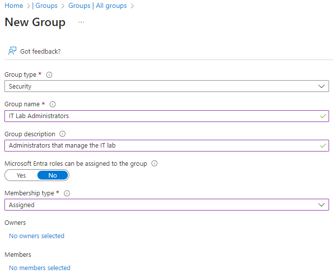

---
lab:
  title: '랩 01: Microsoft Entra ID ID 관리'
  module: Administer Identity
---

# 랩 01 - Microsoft Entra ID ID 관리

## 랩 소개

이는 Azure 관리자를 위한 일련의 랩 중 첫 번째입니다. 이 랩에서는 사용자와 그룹에 대해 알아봅니다. 사용자와 그룹은 ID 솔루션의 기본 구성 요소입니다. 

이 랩을 수행하려면 Azure 구독이 필요합니다. 구독 유형은 이 랩의 기능 가용성에 영향을 미칠 수 있습니다. 지역을 변경할 수 있지만 단계는 **미국 동부**를 사용하여 작성됩니다. 

## 예상 소요 시간: 30분

## 랩 시나리오

사용자의 조직에서는 앱 및 서비스의 사전 프로덕션 테스트를 위한 새로운 랩 환경을 빌드하고 있습니다.  가상 머신을 포함한 랩 환경을 관리하기 위해 몇 명의 엔지니어를 고용하고 있습니다. 엔지니어가 Microsoft Entra ID를 사용하여 인증할 수 있도록 사용자 및 그룹을 프로비전하는 업무를 담당합니다. 관리 오버헤드를 최소화하려면 직함에 따라 그룹 멤버 자격을 자동으로 업데이트해야 합니다. 

## 대화형 랩 시뮬레이션

이 랩에서는 대화형 랩 시뮬레이션을 사용합니다. 시뮬레이션을 통해 고유의 속도에 맞춰 유사한 시나리오를 클릭할 수 있습니다. 대화형 시뮬레이션과 이 랩에는 차이점이 있지만 핵심 개념은 대부분 동일합니다. Azure 구독은 필요하지 않습니다.

>**참고:** 이 시뮬레이션은 업데이트 중입니다. Microsoft Entra ID는 Azure AD(Azure Active Directory)의 새 이름입니다. 

+ [Entra ID ID를 관리합니다](https://mslabs.cloudguides.com/guides/AZ-104%20Exam%20Guide%20-%20Microsoft%20Azure%20Administrator%20Exercise%201). 사용자를 만들기 및 구성하고 그룹에 할당합니다. Azure 테넌트를 만들고 게스트 계정을 관리합니다. 

## 아키텍처 다이어그램

## 작업 기술

+ 작업 1: 사용자 계정을 만들고 구성합니다.
+ 작업 2: 그룹을 만들고 멤버를 추가합니다.

## 작업 1: 사용자 계정 만들기 및 구성

이 작업에서는 사용자 계정을 만들고 구성합니다. 사용자 계정은 이름, 부서, 위치, 연락처 정보와 같은 사용자 데이터를 저장합니다.

1. **Azure Portal** - `https://portal.azure.com`에 로그인합니다.

    >**참고:** Azure Portal은 모든 랩에서 사용됩니다. Azure를 처음 사용하는 경우 `Quickstart Center`를 검색하여 선택합니다. **Azure Portal 시작** 동영상을 시청해 보세요. 이전에 포털을 사용한 적이 있더라도 인터페이스 탐색 및 사용자 지정에 대한 몇 가지 팁과 요령을 확인할 수 있습니다.
    
1. `Microsoft Entra ID`을 검색하고 선택합니다. Microsoft Entra ID는 Azure의 클라우드 기반 ID 및 액세스 관리 솔루션입니다. 왼쪽 창에 나열된 일부 기능을 숙지하는 것이 좋습니다. 

1. **개요** 블레이드를 선택한 다음 **테넌트 관리** 탭을 선택합니다. 

    >**유용한 정보** 테넌트는 계정과 그룹을 포함하는 Microsoft Entra ID의 특정 인스턴스입니다. 상황에 따라 더 많은 테넌트를 만들고 테넌트 간에 **전환**할 수 있습니다. 

1. **Entra ID** 페이지로 돌아가서 **라이선스**를 선택합니다. 여기에서 라이선스를 구매하고, 보유한 라이선스를 관리하고, 사용자 및 그룹에 라이선스를 할당할 수 있습니다. 사용 가능한 기능을 보려면 **라이선스가 부여된 기능**을 선택합니다.
   
### 새 사용자 만들기

1. **사용자**를 선택한 다음 **새 사용자** 드롭다운에서 **새 사용자 만들기**를 선택합니다. 

1. 다음 설정을 사용하여 새 사용자를 만듭니다(다른 설정은 기본값으로 유지). **속성** 탭에서 사용자 계정에 포함될 수 있는 다양한 형식의 정보를 모두 확인합니다. 

    | 설정 | 값 |
    | --- | --- |
    | 사용자 계정 이름 | `az104-user1` |
    | 표시 이름 | `az104-user1` |
    | 암호 자동 생성 | **checked** |
    | 계정 사용 | **checked** |
    | 직함(속성 탭) | `IT Lab Administrator` |
    | 부서(속성 탭) | `IT` |
    | 사용 위치(속성 탭) | **미국** |

1. 검토가 끝나면 **검토 + 만들기**를 선택한 다음 **만들기**를 선택합니다.

1. 페이지를 새로 고치고 새 사용자가 만들어졌는지 확인합니다. 

### 외부 사용자 초대

1. **새 사용자** 드롭다운에서 **외부 사용자 초대**를 선택합니다. 

    | 설정 | 값 |
    | --- | --- |
    | 전자 메일 | 메일 주소 |
    | 표시 이름 | 사용자 이름 |
    | 초대 메시지 보내기 | **확인란 선택** |
    | 메시지 | `Welcome to Azure and our group project` |

1. **속성** 탭으로 이동합니다. 다음 필드를 포함하여 기본 정보를 작성합니다. 

    | 설정 | 값 |
    | --- | --- |
    | 직함  | `IT Lab Administrator` |
    | 부서  | `IT` |
    | 사용 위치(속성 탭) | **미국** |

1. **검토 + 초대**를 선택한 다음 **초대**를 선택합니다.

1. 페이지를 **새로 고침**하고 초대된 사용자가 만들어졌는지 확인합니다. 곧 초대 이메일을 받게 됩니다. 

    >**참고:** 사용자 계정을 개별적으로 만들 가능성은 거의 없습니다. 조직에서 사용자 계정을 어떻게 만들고 관리할 계획인지 알고 계시나요?
    
## 작업 2: 그룹 만들기 및 멤버 추가

이 작업에서는 그룹 계정을 만듭니다. 그룹 계정에는 사용자 계정이나 디바이스가 포함될 수 있습니다. 다음은 멤버를 그룹에 할당하는 두 가지 기본 방법입니다. 정적 할당 및 동적 할당. 정적 그룹에서는 관리자가 멤버를 수동으로 추가하고 제거해야 합니다.  동적 그룹은 사용자 계정 또는 디바이스의 속성에 따라 자동으로 업데이트됩니다. 예: 직함. 

1. Azure Portal에서 `Groups`을 검색하여 선택합니다.

1. 왼쪽 창의 그룹 설정을 숙지하는 것이 좋습니다.

   + **만료**를 사용하면 그룹 수명을 일 단위로 구성할 수 있습니다. 그 이후에는 소유자가 그룹을 갱신해야 합니다.
   + **명명 정책**을 사용하면 차단된 단어를 구성하고 그룹 이름에 접두사 또는 접미사를 추가할 수 있습니다.

1. **모든 그룹** 블레이드에서 **+ 새 그룹**을 선택하고 새 그룹을 만듭니다.     

    | 설정 | 값 |
    | --- | --- |
    | 그룹 형식 | **보안** |
    | 그룹 이름 | `IT Lab Administrators` |
    | 그룹 설명 | `Administrators that manage the IT lab` |
    | 멤버 자격 유형 | **할당됨** |

    >**참고**: 동적 멤버십을 위해서는 Entra ID Premium P1 또는 P2 라이선스가 필요합니다. 다른 **멤버 자격 형식**을 사용할 수 있는 경우 해당 옵션이 드롭다운에 표시됩니다. 
    
    

1. **선택한 소유자가 없음**을 선택합니다.

1. **소유자 추가** 페이지에서 소유자로 본인(오른쪽 위 모서리에 표시됨)을 검색하고 **선택**합니다. 소유자가 두 명 이상일 수 있습니다. 

1. 
          **선택한 구성원이 없습니다**를 선택합니다.

1. **멤버 추가** 창에서 초대한 **az104-user1** 및 **게스트 사용자**를 검색하고 **선택**합니다. 두 사용자를 모두 그룹에 추가합니다. 

1. 그룹을 배포하려면 **만들기**를 선택합니다.

1. 페이지를 **새로 고침**하고 그룹이 만들어졌는지 확인합니다.

1. 새 그룹을 선택하고 **멤버** 및 **소유자** 정보를 검토합니다.

>**참고:** 많은 수의 그룹을 관리하고 있을 수 있습니다. 사용자의 조직에는 그룹을 만들고 멤버를 추가할 계획이 있나요?
   
## 리소스 정리

**고유의 구독**으로 작업하는 경우 랩 리소스를 삭제해 보세요. 이렇게 하면 리소스가 확보되고 비용이 최소화됩니다. 랩 리소스를 삭제하려면 랩 리소스 그룹을 삭제하는 것이 가장 쉽습니다. 

+ Azure Portal에서 리소스 그룹을 선택하고 **리소스 그룹 삭제**, **리소스 그룹 이름 입력**을 선택한 다음 **삭제**를 클릭합니다.
+ Azure PowerShell 사용, `Remove-AzResourceGroup -Name resourceGroupName`.
+ CLI 사용, `az group delete --name resourceGroupName`.
  

## Copilot을 사용하여 학습 확장

Copilot은 Azure 스크립팅 도구를 사용하는 방법을 익히는 데 도움을 줍니다. 또한 Copilot은 랩에서 다루지 않는 영역이나 추가 정보가 필요한 영역을 지원할 수 있습니다. Edge 브라우저를 열고 Copilot(오른쪽 위)을 선택하거나 *copilot.microsoft.com*으로 이동하세요. 몇 분 정도 시간을 내어 이러한 프롬프트를 사용해 보세요.
+ IT 관리자라는 보안 그룹을 만드는 Azure PowerShell 및 CLI 명령은 무엇인가요? 공식 명령 참조 페이지를 제공합니다.  
+ Microsoft Entra ID에서 사용자 및 그룹 관리를 위한 단계별 전략을 제공합니다.
+ 사용자 및 그룹을 대량으로 만드는 Azure Portal의 단계는 무엇인가요?
+ 내부 및 외부 Microsoft Entra ID 사용자 계정의 비교표를 제공합니다. 

## 자기 주도적 학습을 통해 자세히 알아보기

+ [Microsoft Entra ID를 이해합니다](https://learn.microsoft.com/training/modules/understand-azure-active-directory/). Microsoft Entra ID를 Active Directory DS와 비교하고, Microsoft Entra ID P1 및 P2에 대해 알아보고, 클라우드에서 도메인에 가입된 디바이스 및 앱을 관리하기 위한 Microsoft Entra Domain Services를 살펴보세요.
+ [Microsoft Entra ID에서 Azure 사용자 및 그룹을 만듭니다](https://learn.microsoft.com//training/modules/create-users-and-groups-in-azure-active-directory/). Microsoft Entra ID에서 사용자를 만듭니다. 여러 유형의 그룹을 이해합니다. 그룹을 만들고 멤버를 추가합니다. B2B 게스트 계정을 관리합니다.
+ [사용자가 Microsoft Entra 셀프 서비스 암호 재설정을 통해 암호를 초기화할 수 있도록 허용합니다](https://learn.microsoft.com/training/modules/allow-users-reset-their-password/). 조직의 사용자가 암호를 다시 설정하거나 계정의 잠금을 해제할 수 있도록 셀프 서비스 암호 재설정을 평가합니다. 셀프 서비스 암호 재설정을 설정, 구성 및 테스트합니다.

## 핵심 내용

축하합니다. 랩을 완료했습니다. 이 랩의 몇 가지 주요 내용은 다음과 같습니다.

+ 테넌트는 조직을 대표하며 내외부 사용자를 위한 Microsoft 클라우드 서비스의 특정 인스턴스를 관리하는 데 도움이 됩니다.
+ Microsoft Entra ID에는 사용자 계정과 게스트 계정이 있습니다. 각 계정에는 수행할 것으로 예상되는 작업 범위에 특정한 액세스 수준이 있습니다.
+ 그룹은 관련된 사용자 또는 디바이스를 함께 결합합니다. 보안과 Microsoft 365를 비롯하여 두 가지 형식의 그룹이 있습니다.
+ 그룹 멤버 자격은 정적으로 또는 동적으로 할당될 수 있습니다.
