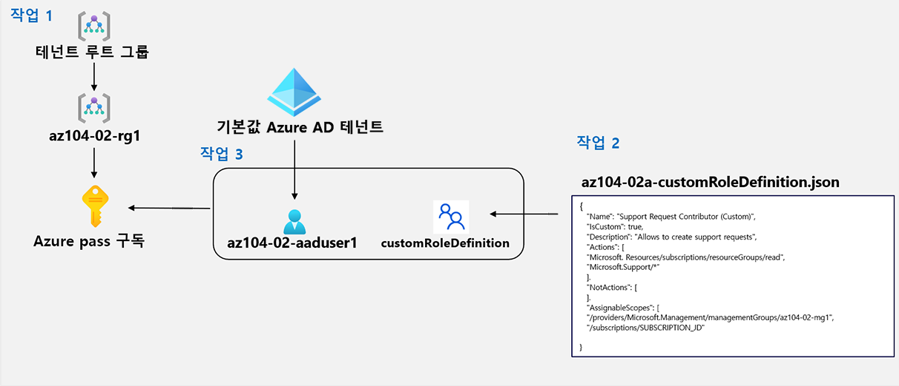

---
lab:
    title: '02a - 구독과 RBAC 관리'
    module: '모듈 02 - 거버넌스 및 규정 준수'
---

# 02a - 구독과 RBAC 관리
# 학생 랩 매뉴얼

## 랩 요구 사항:

이 랩에서는 Azure Active Directory(Azure AD) 사용자를 만들고, 사용자 지정 Azure RBAC(역할 기반 액세스 제어) 역할을 만들고, 해당 역할을 Azure AD 사용자에게 할당하기 위한 사용 권한이 필요합니다. 모든 랩 호스터가 이 기능을 제공하는 것은 아닙니다. 이 랩에서 사용 가능한지 여부는 강사에게 문의하세요.

## 랩 시나리오

Contoso에서 Azure 리소스 관리를 개선하기 위해 다음 기능을 구현하는 작업을 맡았습니다.

- Contoso의 모든 Azure 구독을 포함하는 관리 그룹 만들기

- 관리 그룹의 모든 구독에 대한 지원 요청을 지정된 Azure Active Directory 사용자에게 제출할 수 있는 권한 부여하기 해당 사용자의 사용 권한은 다음으로만 제한되어야 합니다. 

    - 지원 요청 티켓 만들기
    - 리소스 그룹 보기 

## 목표

이 랩에서는 다음 작업을 수행합니다.

+ 작업 1: 관리 그룹 구현
+ 작업 2: 사용자 지정 RBAC 역할 만들기 
+ 작업 3: RBAC 역할 할당


## 예상 시간: 30분

## 아키텍처 다이어그램




## 지침

### 연습 1:

#### 작업 1: 관리 그룹 구현

이 작업에서는 관리 그룹을 만들고 구성합니다. 

1. [Azure Portal](https://portal.azure.com)에 로그인합니다.

1. **관리 그룹**을 검색하고 선택하여 **관리 그룹** 블레이드로 이동합니다.

1. **관리 그룹** 블레이드 상단에 있는 메시지를 검토합니다. **디렉터리 관리자로 등록되어 있지만 루트 관리 그룹에 액세스하는 데 필요한 사용 권한을 가지고 있지 않습니다**라는 메시지가 표시되면 다음 단계를 따릅니다.

    1. Azure Portal에서 **Azure Active Directory**를 검색하고 선택합니다.
    
    1.  Azure Active Directory 테넌트의 속성을 표시하는 블레이드로 이동해 왼쪽의 세로 메뉴에 있는 **관리** 섹션에서 **속성**을 선택합니다.
    
    1.  Azure Active Directory 테넌트의 **속성** 블레이드에 있는 **Azure 리소스 액세스 관리** 섹션에서 **예**를 선택한 후에 **저장**을 선택합니다.
    
    1.  **관리 그룹** 블레이드로 돌아가고 **새로 고침**을 선택합니다.

1. **관리 그룹** 블레이드에서 **+ 만들기**를 클릭합니다.

    >**참고**: 이전에 관리 그룹을 만들지 않은 경우 **관리 그룹 사용 시작**을 선택합니다.

1. 다음 설정을 사용하여 새 관리 그룹을 만듭니다.

    | 설정 | 값 |
    | --- | --- |
    | 관리 그룹 ID | **az104-02-mg1** |
    | 관리 그룹 표시 이름 | **az104-02-mg1** |

1. 관리 그룹 목록에서 새로 만든 관리 그룹을 나타내는 항목을 클릭합니다.

1. **az104-02-mg1** 블레이드에서 **구독**을 클릭합니다. 

1. **az104-02-mg1 \| 구독** 블레이드에서 **+ 추가**를 클릭하고, **구독 추가** 블레이드의 **구독** 드롭다운 목록에서 이 랩에 사용 중인 구독을 선택하고, **저장**을 클릭합니다.

    >**참고**: **az104-02-mg1 \| 구독** 블레이드에서 Azure 구독의 ID를 클립보드에 복사합니다. 다음 작업에서 해당 값이 필요합니다.

#### 작업 2: 사용자 지정 RBAC 역할 만들기

이 작업에서는 사용자 지정 RBAC 역할의 정의를 만듭니다.

1. 랩 컴퓨터에서 **\\Allfiles\\Labs\\02\\az104-02a-customRoleDefinition.json** 파일을 메모장으로 열어 내용을 검토합니다.

   ```json
   {
      "Name": "Support Request Contributor (Custom)",
      "IsCustom": true,
      "Description": "Allows to create support requests",
      "Actions": [
          "Microsoft.Resources/subscriptions/resourceGroups/read",
          "Microsoft.Support/*"
      ],
      "NotActions": [
      ],
      "AssignableScopes": [
          "/providers/Microsoft.Management/managementGroups/az104-02-mg1",
          "/subscriptions/SUBSCRIPTION_ID"
      ]
   }
   ```
    > **참고**: 랩 환경의 로컬에서 파일이 어디에 저장되는지 확실치 않으면 강사에게 물어보세요.

1. JSON 파일의 `SUBSCRIPTION_ID` 자리 표시자를 클립보드에 복사한 구독 ID로 바꾸고 변경 사항을 저장합니다.

1. Azure Portal에서 검색 텍스트 상자 오른쪽에 있는 도구 모음 아이콘을 클릭하여 **Cloud Shell** 창을 엽니다.

1. **Bash** 또는 **PowerShell**을 선택하라는 메시지가 표시되면 **PowerShell**을 선택합니다. 

    >**참고**: **Cloud Shell**을 처음 시작했는데 **탑재된 스토리지 없음**이라는 메시지가 표시되면 이 랩에서 사용하는 구독을 선택하고 **스토리지 만들기**를 클릭합니다. 

1. Cloud Shell 창의 도구 모음에서 **파일 업로드/다운로드** 아이콘을 클릭하고 드롭다운 메뉴에서 **업로드**를 클릭하여 파일 **\\Allfiles\\Labs\\02\\az104-02a-customRoleDefinition.json**을 Cloud Shell 홈 디렉터리에 업로드합니다.

1. Cloud Shell 창에서 다음을 실행하여 사용자 지정 역할 정의를 만듭니다.

   ```powershell
   New-AzRoleDefinition -InputFile $HOME/az104-02a-customRoleDefinition.json
   ```

1. Cloud Shell 창을 닫습니다.

#### 작업 3: RBAC 역할 할당

이 작업에서는, Azure Active Directory 사용자를 만들고 사용자에게 이전 작업에서 만든 RBAC 역할을 할당하여 사용자가 RBAC 역할 정의에 지정된 작업을 수행할 수 있는지 확인합니다.

1. Azure Portal에서 **Azure Active Directory**를 검색하여 선택하고, Azure Active Directory 블레이드에서 **사용자**를 클릭한 다음, **+ 새 사용자**를 클릭합니다.

1. 다음 설정을 사용하여 새 사용자를 만듭니다(다른 설정은 기본값으로 유지).

    | 설정 | 값 |
    | --- | --- |
    | 사용자 이름 | **az104-02-aaduser1**|
    | 이름 | **az104-02-aaduser1**|
    | 암호 직접 만들기 | 사용 |
    | 초기 암호 | **Pa55w.rd1234** |

    >**참고**: 전체 **사용자 이름**을 **클립보드에 복사합니다**. 이 랩 뒷부분에서 해당 이름이 필요합니다.

1. Azure Portal에서 **az104-02-mg1** 관리 그룹으로 돌아가서 해당 **세부 정보**를 표시합니다.

1. **액세스 제어(IAM)** 를 클릭하고 **+ 추가**와 **역할 할당**을 차례로 클릭합니다. 그리고 새로 만든 사용자 계정에 **지원 요청 기여자(사용자 지정)** 역할을 할당합니다.

1. **InPrivate** 브라우저 창을 열고 새로 만든 사용자 계정을 사용하여 [Azure Portal](https://portal.azure.com)에 로그인합니다. 암호를 업데이트하라는 메시지가 표시되면 사용자 암호를 변경합니다.

    >**참고**: 사용자 이름을 입력하는 대신 클립보드의 내용을 붙여넣을 수 있습니다.

1. **InPrivate** 브라우저 창의 Azure Portal에서 **리소스 그룹**을 검색 및 선택하여 az104-02-aaduser1 사용자가 모든 리소스 그룹을 볼 수 있는지 확인합니다.

1. **InPrivate** 브라우저 창의 Azure Portal에서 **모든 리소스**를 검색하고 선택하여 az104-02-aaduser1 사용자가 리소스를 볼 수 없는지 확인합니다.

1. **InPrivate** 브라우저 창의 Azure Portal에서 **도움말 + 지원**을 검색하여 선택한 다음 **+ 지원 요청 만들기**를 클릭합니다. 

1. **InPrivate** 브라우저 창에 있는 **도움말 + 지원 - 새 지원 요청** 블레이드의 **문제 설명/요약** 탭으로 이동합니다. 요약 필드에 **서비스 및 구독 제한**을 입력하고 **서비스 및 구독 제한(할당량)** 문제 유형을 선택합니다. 이 랩에서 사용 중인 구독이 **구독** 드롭다운 목록에 나열됩니다.

    >**참고**: **구독** 드롭다운 목록에 이 랩에서 사용 중인 구독이 있다면 이는 사용 중인 계정에 구독 전용 지원 요청을 만들기 위해 필요한 권한이 있음을 의미합니다.

    >**참고**: **서비스 및 구독 제한(할당량)** 옵션이 표시되지 않으면 Azure Portal에서 로그아웃한 다음 다시 로그인합니다.

1. 지원 요청 만들기로 진행하지 마세요. 대신 Azure Portal에서 az104-02-aaduser1 사용자로 로그아웃하고 InPrivate 브라우저 창을 닫습니다.

#### 리소스 정리

   >**참고**: 더 이상 사용하지 않는 새로 만든 Azure 리소스를 제거해야 합니다. 

   >**참고**: 이 랩에서 만든 리소스는 추가 비용이 들지 않지만 사용하지 않는 리소스를 제거하면 예상하지 못한 비용이 발생하지 않습니다.

1. Azure Portal에서 **Azure Active Directory**를 검색하고 선택한 다음 Azure Active Directory 블레이드에서 **사용자**를 클릭합니다.

1. **사용자 - 모든 사용자** 블레이드에서 **az104-02-aaduser1**를 클릭합니다.

1. **az104-02-aaduser1-프로필** 블레이드에서 **개체 ID** 특성의 값을 복사합니다.

1. Azure Portal에서 **Cloud Shell**내의 **PowerShell** 세션을 시작합니다.

1. Cloud Shell 창에서 다음 명령을 실행하여 사용자 지정 역할 정의 할당을 제거합니다(`[object_ID]` 자리 표시자를 이 작업에서 이전에 복사한 **az104-02-aaduser1** Azure Active Directory 사용자 계정의 **개체 ID** 특성 값으로 바꿈).

   ```powershell
   $scope = (Get-AzRoleAssignment -RoleDefinitionName 'Support Request Contributor (Custom)').Scope

   Remove-AzRoleAssignment -ObjectId '[object_ID]' -RoleDefinitionName 'Support Request Contributor (Custom)' -Scope $scope
   ```

1. Cloud Shell 창에서 다음을 실행하여 사용자 지정 역할 정의를 삭제합니다.

   ```powershell
   Remove-AzRoleDefinition -Name 'Support Request Contributor (Custom)' -Force
   ```

1. Azure Portal에서 **Azure Active Directory**의 **사용자 - 모든 사용자** 블레이드로 돌아가 **az104-02-aaduser1** 사용자 계정을 삭제합니다.

1. Azure Portal에서 **관리 그룹** 블레이드로 돌아갑니다. 

1. **관리 그룹** 블레이드에서 **az104-02-mg1** 관리 그룹 아래 구독 옆에 있는 **줄임표** 아이콘을 클릭한 다음 **이동**을 선택하여 해당 구독을 **테넌트 루트 관리 그룹**으로 이동합니다.

   >**참고**: 이 랩을 실행하기 전에 사용자 지정 그룹 계층 구조를 만들지 않았다면 대상 관리 그룹이 **테넌트 루트 관리 그룹**일 가능성이 큽니다.
   
1. **새로 고침**을 선택하여 해당 구독이 **테넌트 루트 관리 그룹**으로 이동했는지 확인합니다.

1. **관리 그룹** 블레이드로 다시 돌아가서 **az104-02-mg1** 관리 그룹의 오른쪽에 있는 **줄임표** 아이콘을 클릭하고 **삭제**를 클릭합니다.

#### 복습

이 랩에서는 다음 작업을 수행했습니다.

- 관리 그룹 구현
- 사용자 지정 RBAC 역할 만들기 
- RBAC 역할 할당
