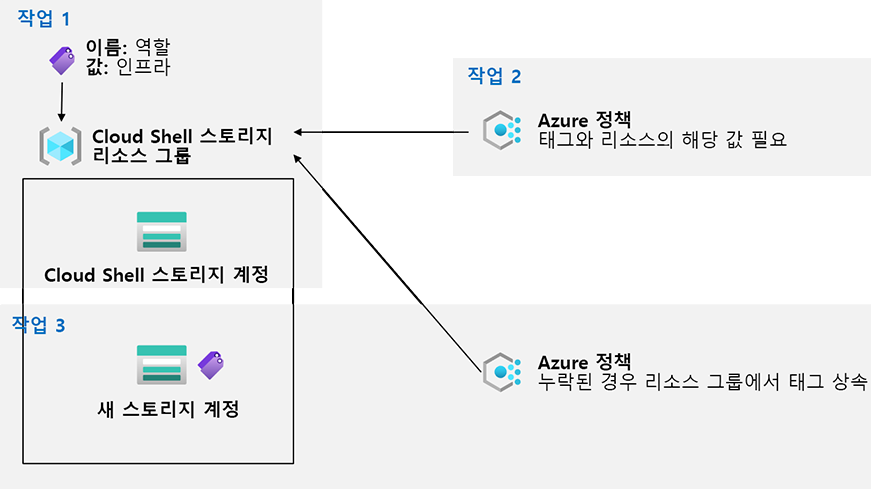

---
lab:
    title: '02b - Azure Policy를 통한 거버넌스 관리'
    module: '모듈 02 - 거버넌스 및 규정 준수'
---

# 랩 02b - Azure Policy를 통한 거버넌스 관리
# 학생 랩 매뉴얼

## 랩 시나리오

Contoso에서 Azure 리소스 관리를 개선하기 위해 다음 기능을 구현하는 작업을 맡았습니다.

- 인프라 리소스(예: Cloud Shell 스토리지 계정)만 포함하는 리소스 그룹을 태그 지정합니다.

- 적절하게 태그가 지정된 인프라 리소스만 인프라 리소스 그룹에 추가할 수 있도록 합니다.

- 모든 비준수 리소스를 수정합니다. 

## 목표

이 랩에서는 다음 작업을 수행합니다.

+ 작업 1: Azure Portal을 통한 태그 만들기 및 할당
+ 작업 2: Azure Policy를 통한 강제 태그 지정
+ 작업 3: Azure Policy를 통한 태그 지정 적용

## 예상 시간: 30분

## 아키텍처 다이어그램



## 지침

### 연습 1:

#### 작업 1: Azure Portal을 통한 태그 할당

이 작업에서는 Azure Portal을 통해 Azure 리소스 그룹에 태그를 만들고 할당합니다.

1. Azure Portal에서 **Cloud Shell**내의 **PowerShell** 세션을 시작합니다.

    >**참고**: **Cloud Shell**을 처음 시작했는데 **탑재된 스토리지 없음**이라는 메시지가 표시되면 이 랩에서 사용하는 구독을 선택하고 **스토리지 만들기**를 클릭합니다. 

1. Cloud Shell 창에서 다음을 실행하여 Cloud Shell에서 사용하는 스토리지 계정의 이름을 식별합니다.

   ```powershell
   df
   ```

1. 명령의 출력에 Cloud Shell 홈 드라이브 탑재를 지정하는 정규화된 경로의 첫 번째 부분을 기록합니다.(다음과 같이 표시됩니다. `xxxxxxxxxxxxxx`:

   ```
   //xxxxxxxxxxxxxx.file.core.windows.net/cloudshell   (..)  /usr/csuser/clouddrive
   ```

1. Azure Portal에서 **스토리지 계정**을 검색하여 선택하고 스토리지 계정 목록에서 이전 단계에서 식별한 스토리지 계정을 나타내는 항목을 클릭합니다.

1. 스토리지 계정 블레이드에서 스토리지 계정을 포함하는 리소스 그룹의 이름을 나타내는 링크를 클릭합니다.

    **참고**: 스토리지 계정이 어떤 리소스 그룹에 있는지 메모해 두세요. 나중에 랩에서 필요합니다.

1. 리소스 그룹 블레이드에서 **태그**를 클릭합니다.

1. 다음 설정을 사용하여 태그를 만들고 변경 사항을 적용합니다.

    | 설정 | 값 |
    | --- | --- |
    | 이름 | **역할** |
    | 값 | **인프라** |

1. 스토리지 계정 블레이드로 돌아갑니다. **개요** 정보를 검토하고 새 태그가 스토리지 계정에 자동으로 할당되지 않았다는 점에 유의하세요. 

#### 작업 2: Azure Policy를 통한 강제 태그 지정

본 작업에서는 *리스스에 대한 태그 및 값 필요* 기본 제공 정책을 리소스 그룹에 할당하고 결과를 평가합니다. 

1. Azure Portal에서 **정책**을 찾아서 선택합니다. 

1. **작성** 섹션에서 **정의**를 클릭합니다. 잠시 시간을 내어 사용할 수 있는 기본 제공 정책 정의 목록을 탐색합니다. **범주** 드롭다운 목록에서 **태그** 항목을 선택(그리고 다른 모든 항목을 선택 해제)하여 태그 사용을 포함하는 모든 기본 제공 정책을 나열합니다. 

1. **리소스에 대한 태그 및 값 필요** 기본 제공 정책을 나타내는 항목을 클릭하고 해당 정의를 검토합니다.

1. **리소스에 대한 태그 및 값 필요** 기본 제공 정책 정의 블레이드에서 **할당**을 클릭합니다.

1. 줄임표 단추를 클릭하고 다음 값을 선택하여 **범위**를 지정합니다.

    | 설정 | 값 |
    | --- | --- |
    | 구독 | 이 랩에서 사용 중인 Azure 구독의 이름 |
    | 리소스 그룹 | 이전 작업에서 식별한 Cloud Shell 계정을 포함하는 리소스 그룹의 이름 |

    >**참고**: 범위는 정책 할당이 적용되는 리소스 또는 리소스 그룹을 결정합니다. 관리 그룹, 구독 또는 리소스 그룹 수준에 정책을 할당할 수 있습니다. 또한 개별 구독, 리소스 그룹 또는 리소스와 같은 제외를 지정하는 옵션도 있습니다(할당 범위에 따라 다름). 

1. 다음 설정을 지정하여 할당의 **기본** 속성을 구성합니다(다른 설정은 기본값으로 유지).

    | 설정 | 값 |
    | --- | --- |
    | 할당 이름 | **인프라 값이 있는 역할 태그 필요**|
    | 설명 | **Cloud Shell 리소스 그룹의 모든 리소스에 대해 인프라 값이 있는 역할 태그 필요**|
    | 정책 적용 | 사용 |

    >**참고**: **할당 이름**에는 선택한 정책 이름이 자동으로 입력됩니다. 하지만 이 이름은 변경할 수 있습니다. 원하는 경우 **설명**을 추가할 수도 있습니다. **할당자**는 할당을 만드는 사용자 이름에 따라 자동으로 채워집니다. 

1. **다음**을 클릭하고 **매개 변수**를 다음 값으로 설정합니다.

    | 설정 | 값 |
    | --- | --- |
    | 태그 이름 | **역할** |
    | 태그 값 | **인프라** |

1. **다음**을 클릭하여 **수정** 탭을 검토합니다. **관리 ID 만들기** 체크박스는 선택하지 않은 상태로 유지합니다. 

    >**참고**: 본 설정은 정책 또는 이니셔티브에 **deployIfNotExists** 또는 **수정** 효과가 포함될 때 사용할 수 있습니다.

1. **검토 + 만들기**와 **만들기**를 차례로 클릭합니다.

    >**참고**: 이제 필요한 태그를 명시적으로 추가하지 않고 리소스 그룹에 다른 Azure Storage 계정을 만들어 새 정책 할당이 적용되었는지 확인합니다. 
    
    >**참고**: 정책이 적용되기까지 5~15분 정도 걸릴 수 있습니다.

1. 이전 작업에서 식별한 Cloud Shell 홈 드라이브에 사용된 스토리지 계정을 호스트하는 리소스 그룹의 블레이드로 돌아갑니다.

1. 리소스 그룹 블레이드에서 **+ 만들기**를 클릭한 다음 **스토리지 계정**을 검색하여 **+ 만들기**를 클릭합니다. 

1. **스토리지 계정 만들기** 블레이드의 **기본** 탭에서 정책이 적용된 리소스 그룹을 사용하고 있는지 확인한 후 다음 설정을 지정하고(다른 설정은 기본값으로 유지) **검토 + 만들기**를 클릭한 후에 **만들기**를 클릭합니다.

    | 설정 | 값 |
    | --- | --- |
    | 스토리지 계정 이름 | 문자로 시작하며 3~24개의 소문자와 숫자로 이루어진 전역적으로 고유한 조합 |

1. 배포를 만들면 포털의 **알림** 목록에 **배포 실패** 메시지가 표시됩니다. **알림** 목록에서 배포 개요로 이동하고 **배포 실패**를 클릭합니다. **자세한 내용을 보려면 여기를 클릭하세요** 메시지를 클릭하여 실패의 원인을 식별합니다. 

    >**참고**: 오류 메시지에서 리소스 배포가 정책상 허용되지 않는 것인지를 확인합니다. 

    >**참고**: **태그** 탭을 클릭하면 **인프라 값이 있는 역할 태그 필요** 역할 정의의 이름을 포함하여 오류에 대한 자세한 내용을 찾을 수 있습니다. 만들려고 시도한 스토리지 계정에 해당 값이 **인프라**로 설정된 **역할**이라는 태그가 없기 때문에 배포에 실패했습니다.

#### 작업 3: Azure Policy를 통한 태그 지정 적용

이 작업에서는 다른 정책 정의를 사용하여 비준수 리소스를 수정합니다. 

1. Azure Portal에서 **정책**을 찾아서 선택합니다. 

1. **작성** 섹션에서 **할당**을 클릭합니다. 

1. 할당 목록에서 **인프라 값이 있는 역할 태그 필요** 정책을 나타내는 행의 줄임표 아이콘을 마우스 오른쪽 단추로 클릭하고 **할당 삭제** 메뉴 항목을 사용하여 할당을 삭제합니다. 

1. **정책 할당**을 클릭한 다음 줄임표 단추를 클릭하고 다음 값을 선택하여 **범위**를 지정합니다.

    | 설정 | 값 |
    | --- | --- |
    | 구독 | 이 랩에서 사용 중인 Azure 구독의 이름 |
    | 리소스 그룹 | 첫 번째 작업에서 식별한 Cloud Shell 계정이 포함된 리소스 그룹의 이름 |

1. **정책 정의**를 지정하려면 줄임표 단추를 클릭한 다음 **누락된 경우 리소스 그룹에서 태그 상속**을 검색하고 선택합니다.

1. 다음 설정을 지정(다른 설정은 기본값으로 유지)하여 할당의 나머지 **기본** 속성을 구성합니다.

    | 설정 | 값 |
    | --- | --- |
    | 할당 이름 | **누락된 경우 Cloud Shell 리소스 그룹에서 역할 태그 및 해당 인프라 값 상속**|
    | 설명 | **누락된 경우 Cloud Shell 리소스 그룹에서 역할 태그 및 해당 인프라 값 상속**|
    | 정책 적용 | 사용 |

1. **다음**을 클릭하고 **매개 변수**를 다음 값으로 설정합니다.

    | 설정 | 값 |
    | --- | --- |
    | 태그 이름 | **역할** |

1. **다음**을 클릭하고 **수정** 탭에서 다음 설정을 구성합니다(다른 설정은 기본값으로 유지).

    | 설정 | 값 |
    | --- | --- |
    | 수정 작업 만들기 | 사용 |
    | 수정해야 하는 정책 | **누락된 경우 리소스 그룹에서 태그 상속** |

    >**참고**: 이 정책 정의에는 **수정** 효과가 포함됩니다.

1. **검토 + 만들기**와 **만들기**를 차례로 클릭합니다.

    >**참고**: 새 정책 할당이 적용되는지 확인하려면 필요한 태그를 명시적으로 추가하지 않고 동일한 리소스 그룹에 다른 Azure Storage 계정을 만듭니다. 
    
    >**참고**: 정책이 적용되기까지 5~15분 정도 걸릴 수 있습니다.

1. 첫 번째 작업에서 식별한 Cloud Shell 홈 드라이브에 사용된 스토리지 계정을 호스트하는 리소스 그룹의 블레이드로 돌아갑니다.

1. 리소스 그룹 블레이드에서 **+ 만들기**를 클릭한 다음 **스토리지 계정**을 검색하여 **+ 만들기**를 클릭합니다. 

1. **스토리지 계정 만들기** 블레이드의 **기본** 탭에서 정책이 적용된 리소스 그룹을 사용하고 있는지 확인한 후 다음 설정을 지정하고(다른 설정은 기본값으로 유지) **검토 + 만들기**를 클릭합니다.

    | 설정 | 값 |
    | --- | --- |
    | 스토리지 계정 이름 | 문자로 시작하며 3~24개의 소문자와 숫자로 이루어진 전역적으로 고유한 조합 |

1. 유효성 검사를 통과했는지 확인하고 **만들기**를 클릭합니다.

1. 새 스토리지 계정이 프로비전되면 **리소스로 이동** 단추를 클릭하고 새로 만든 스토리지 계정의 **개요** 블레이드에서 **인프라** 값이 있는 **역할** 태그가 리소스에 자동으로 할당된 것을 확인합니다.

#### 작업 4: 리소스 정리

   >**참고**: 더 이상 사용하지 않는 새로 만든 Azure 리소스를 제거해야 합니다. 

   >**참고**: Azure 정책에는 추가 비용이 발생하지 않지만 사용하지 않는 리소스를 제거하면 예기치 않은 요금이 발생하지 않습니다.

1. 포털에서 **정책**을 검색하여 선택합니다.

1. **작성** 섹션에서 **할당**을 클릭하고 이전 작업에서 만든 할당의 오른쪽에 있는 줄임표 아이콘을 클릭한 다음 **할당 삭제**를 클릭합니다. 

1. 포털에서 **스토리지 계정**을 검색하여 선택합니다.

1. 이 랩의 마지막 작업에서 만든 스토리지 계정에 해당하는 리소스 그룹을 스토리지 계정 목록에서 선택합니다. **태그**를 선택하고 **삭제**(**Role:Infra** 태그 오른쪽의 휴지통)를 클릭한 다음 **적용**을 누릅니다. 

1. **삭제**를 클릭하고 삭제를 확인하라는 메시지가 표시되면 **스토리지 계정 삭제** 블레이드에 스토리지 계정 이름을 입력하여 삭제를 확인한 후 **삭제**를 클릭합니다. 

#### 복습

이 랩에서는 다음 작업을 수행했습니다.

- Azure Portal을 통한 태그 만들기 및 할당
- Azure Policy를 통한 강제 태그 지정
- Azure Policy를 통한 태그 지정 적용
