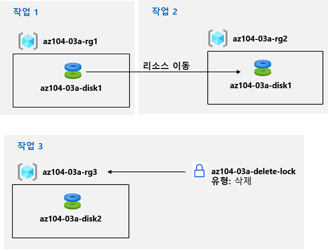

---
lab:
    title: '03a - Azure Portal을 사용하여 Azure 리소스 관리'
    module: '모듈 03 - Azure 관리'
---

# 랩 03a - Azure Portal을 사용하여 Azure 리소스 관리
# 학생 랩 매뉴얼

## 랩 시나리오

리소스 프로비전 및 리소스 그룹 간 리소스 이동 등 리소스 그룹에 기반한 리소스 구성과 관련된 기본 Azure 관리 기능을 살펴봐야 합니다. 또한, 디스크 리소스가 실수로 삭제되지 않도록 보호하는 동시에 성능 특성과 크기를 수정할 수 있는 옵션을 알아봅니다.

## 목표

이 랩에서는 다음 작업을 수행합니다.

+ 작업 1: 리소스 그룹을 만들고 리소스 그룹에 리소스 배포
+ 작업 2: 리소스 그룹 간 리소스 이동
+ 작업 3: 리소스 잠금 구현 및 테스트

## 예상 시간: 20분

## 아키텍처 다이어그램

## 지침

### 연습 1:

#### 작업 1: 리소스 그룹을 만들고 리소스 그룹에 리소스 배포

이 작업에서는 Azure Portal을 사용하여 리소스 그룹을 만들고 리소스 그룹에 디스크를 만듭니다.

1. [Azure Portal](https://portal.azure.com)에 로그인합니다.

1. Azure Portal에서 **디스크**를 검색하여 선택하고 **+ 추가, + 만들기 또는 새로 만들기**를 클릭한 후 다음 설정을 지정합니다.

    |설정|값|
    |---|---|
    |구독| 리소스 그룹을 만든 Azure 구독의 이름 |
    |리소스 그룹| 새 리소스 그룹 **az104-03a-rg1**의 이름 |
    |디스크 이름| **az104-03a-disk1** |
    |지역| 리소스 그룹을 만든 Azure 지역 이름 |
    |가용성 영역| **없음** |
    |원본 유형| **없음** |

    >**참고**: 리소스를 만들 때 새 리소스 그룹을 만들거나 기존 리소스 그룹을 사용할 수 있습니다.

1. 디스크 유형과 크기를 각각 **표준 HDD** 및 **32GiB**로 변경합니다.

1. **검토 + 만들기**를 클릭하고 **만들기**를 클릭합니다.

    >**참고**: 디스크가 만들어질 때까지 기다립니다. 이 작업에는 1분 미만이 소요됩니다.

#### 작업 2: 리소스 그룹 간 리소스 이동 

본 작업에서는 이전 작업에서 만든 디스크 리소스를 새 리소스 그룹으로 이동합니다. 

1. **리소스 그룹**을 검색하여 선택합니다. 

1. **리소스 그룹** 블레이드에서 이전 작업에서 만든 **az104-03a-rg1** 리소스 그룹을 나타내는 항목을 클릭합니다.

1. 리소스 그룹의 **개요** 블레이드에서 리소스 그룹 목록에서 새로 만든 디스크를 나타내는 항목을 선택합니다. 도구 모음에서 **이동**을 클릭하고 드롭다운 목록에서 **다른 리소스 그룹으로 이동**을 선택합니다.

    >**참고**: 이 방법으로 동시에 여러 리소스를 이동할 수 있습니다. 

1. **리소스 그룹** 텍스트 상자 아래에서 **새로 만들기**를 클릭한 다음 텍스트 상자에 **az104-03a-rg2**를 입력합니다. 검토 탭에서 **이동된 리소스와 관련된 도구 및 스크립트가 새 리소스 아이디를 사용하도록 업데이트할 때까지 작동하지 않는다는 것을 알고 있음** 체크박스를 선택하고 **이동**을 클릭합니다.

    >**참고**: 이동이 완료될 때까지 기다리지 말고 다음 작업으로 진행합니다. 이동에는 약 10분이 소요될 수 있습니다. 원본 또는 대상 리소스 그룹의 활동 로그 항목을 모니터링하여 작업이 완료되었는지 확인할 수 있습니다. 다음 작업을 완료하면 이 단계를 수행합니다.

#### 작업 3: 리소스 잠금 구현

이 작업에서는 디스크 리소스를 포함하는 Azure 리소스 그룹에 리소스 잠금을 적용합니다.

1. Azure Portal에서 **디스크**를 검색하여 선택하고 **+ 추가, + 만들기 또는 새로 만들기**를 클릭한 후 다음 설정을 지정합니다.

    |설정|값|
    |---|---|
    |구독| 이 랩에서 사용 중인 구독 이름 |
    |리소스 그룹| 리소스 그룹 **새로 만들기**를 클릭하고 이름을 **az104-03a-rg3**로 지정합니다. |
    |디스크 이름| **az104-03a-disk2** |
    |지역| 이 랩에서 다른 리소스 그룹을 만든 Azure 지역의 이름 |
    |가용성 영역| **없음** |
    |원본 유형| **없음** |

1. 디스크 유형과 크기를 각각 **표준 HDD** 및 **32GiB**로 설정합니다.

1. **검토 + 만들기**를 클릭하고 **만들기**를 클릭합니다.

1. 리소스로 이동을 클릭합니다. 

1. **az104-03a-rg3** 리소스 그룹 블레이드에서 **잠금**과 **+ 추가**를 차례로 클릭하고 다음 설정을 지정합니다.

    |설정|값|
    |---|---|
    |잠금 이름| **az104-03a-delete-lock** |
    |잠금 유형| **삭제** |
    
1. **확인**을 클릭합니다.    

1. **az104-03a-rg3** 리소스 그룹 블레이드에서 **개요**를 클릭하고 리소스 그룹 리소스 목록에서 이 작업의 전반부에서 만든 디스크를 나타내는 항목을 선택하고 도구 모음에서 **삭제**를 클릭합니다. 

1. **선택한 모든 리소스를 삭제하시겠습니까?** 라는 메시지가 표시되면 **삭제 확인** 텍스트 상자에서 **예**를 입력하고 **삭제**를 클릭합니다.

1. 삭제 작업이 실패했음을 알리는 오류 메시지가 표시됩니다. 

    >**참고**: 오류 메시지에 명시된대로 리소스 그룹 수준에 적용된 잠금 삭제로 인한 것으로 예상됩니다.

1. **az104-03a-rg3** 리소스 그룹의 리소스 목록으로 돌아가 **az104-03a-disk2** 리소스를 나타내는 항목을 클릭합니다. 

1. **az104-03a-disk2** 블레이드의 **설정** 섹션에서 **크기 + 성능**을 클릭하고 디스크 유형과 크기를 각각 **프리미엄 SSD** 및 **64GiB**로 설정한 후에 **크기 조정**을 클릭하여 변경 내용을 적용합니다. 변경이 성공했는지 확인합니다.

    >**참고**: 리소스 그룹 수준 잠금은 삭제 작업에만 적용되므로 예상된 결과입니다. 

#### 리소스 정리

   >**참고**: 이 랩에서 배포한 리소스는 삭제하지 마세요. 이 모듈의 다음 랩에서 필요합니다. 이 랩에서 만든 리소스 잠금만 제거합니다.

1. **az104-03a-rg3** 리소스 그룹 블레이드로 이동하여 **잠금** 블레이드를 표시하고 **삭제** 잠금 항목의 오른쪽에 있는 **삭제** 링크를 클릭하여 **az104-03a-delete-lock** 잠금을 제거합니다.

#### 복습

이 랩에서는 다음을 수행했습니다.

- 리소스 그룹 만들기 및 리소스 그룹에 리소스 배포
- 리소스 그룹 간 리소스 이동
- 리소스 잠금 구현 및 테스트
