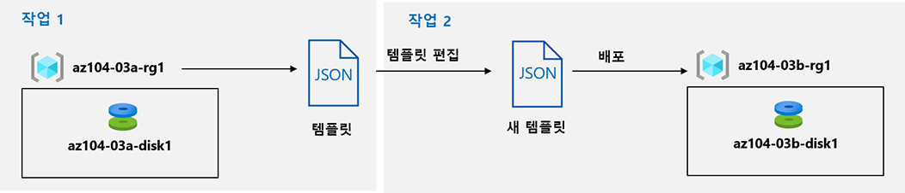

---
lab:
    title: '03b - ARM 템플릿을 사용하여 Azure 리소스 관리'
    module: '모듈 03 - Azure 관리'
---

# 랩 03b - ARM 템플릿을 사용하여 Azure 리소스 관리
# 학생 랩 매뉴얼

## 랩 시나리오
지금까지 Azure Portal을 사용한 리소스 프로비전 및 리소스 그룹에 기반한 리소스 구성과 관련된 기본 Azure 관리 기능을 살펴보았습니다. 이제 Azure Resource Manager 템플릿을 사용하여 같은 작업을 수행해야 합니다.

## 목표

이 랩에서는 다음 작업을 수행합니다.

+ 작업 1: Azure 관리 디스크 배포에 사용할 ARM 템플릿 검토
+ 작업 2: ARM 템플릿을 사용하여 Azure 관리 디스크 만들기
+ 작업 3: 관리 디스크의 ARM 템플릿 기반 배포 검토

## 예상 시간: 20분

## 아키텍처 다이어그램



## 지침

### 연습 1:

#### 작업 1: Azure 관리 디스크 배포에 사용할 ARM 템플릿 검토

이 작업에서는 Azure Resource Manager 템플릿을 사용하여 Azure 디스크 리소스를 만듭니다.

1. [**Azure Portal**](https://portal.azure.com)에 로그인합니다.

1. Azure Portal에서 **리소스 그룹**을 검색하고 선택합니다. 

1. 리소스 그룹 목록에서 **az104-03a-rg1** 을 클릭합니다.

1. **az104-03a-rg1** 리소스 그룹 블레이드의 **설정** 섹션에서 **배포**를 클릭합니다.

1. **az104-03a-rg1 - 배포** 블레이드에서 배포 목록의 첫 번째 항목을 클릭합니다.

1. **Microsoft.ManagedDisk-*XXXXXXXXX* \| 개요** 블레이드에서 **템플릿**을 클릭합니다.

    >**참고**: 템플릿 내용을 검토하고 템플릿을 로컬 컴퓨터에 **다운로드**하거나 **라이브러리에 추가**하거나 **배포**하는 옵션이 있는지 확인합니다.

1. **다운로드**를 클릭하여 템플릿 및 매개 변수 파일이 포함된 압축 파일을 랩 컴퓨터의 **다운로드** 폴더에 저장합니다.

1. **Microsoft.ManagedDisk-*XXXXXXXXX* \| 템플릿** 블레이드에서 **입력**을 클릭합니다.

1. **location** 매개 변수의 값을 메모해 둡니다. 다음 작업에 필요합니다.

1. 랩 컴퓨터의 **다운로드** 폴더에 다운로드한 콘텐츠의 압축을 풉니다.

    >**참고**: **\\Allfiles\\Labs\\03\\az104-03b-md-template.json** 및 **\\Allfiles\\Labs\\03\\az104-03b-md-parameters.json** 파일도 사용할 수 있습니다.
    
1. **파일 탐색기** 창을 모두 닫습니다.

#### 작업 2: ARM 템플릿을 사용하여 Azure 관리 디스크 만들기

1. Azure Portal에서 **사용자 지정 템플릿 배포**를 검색하여 선택합니다.

1. **마켓플레이스** 그룹에서 **템플릿 배포(사용자 지정 템플릿을 사용하여 배포)** 를 클릭합니다.

1. **사용자 지정 배포** 블레이드에서 **편집기에서 사용자 고유의 템플릿을 빌드합니다**를 클릭합니다.

1. **템플릿 편집** 블레이드에서 **파일 로드**를 클릭하고 이전 작업에서 다운로드한 **template.json** 파일을 업로드합니다.

1. 편집기 창에서 다음 줄을 제거합니다.

   ```json
   "sourceResourceId": {
       "type": "String"
   },
   "sourceUri": {
       "type": "String"
   },
   "osType": {
       "type": "String"
   },
   ```

   ```json
   "hyperVGeneration": {
       "defaultValue": "V1",
       "type": "String"
   },      
   ```

   ```json
   "osType": "[parameters('osType')]",
   ```

    >**참고**: 이러한 매개 변수는 현재 배포에 적용할 수 없으므로 제거됩니다. 특히 sourceResourceId, sourceUri, osType 및 hyperVGeneration 매개 변수는 기존 VHD 파일에서 Azure 디스크를 만드는 데 적용할 수 있습니다.

1. 변경 내용을 **저장**합니다.

1. **사용자 지정 배포** 블레이드로 돌아가서 **매개 변수 편집**을 클릭합니다. 

1. **매개 변수 편집** 블레이드에서 **파일 로드**를 클릭하고 이전 작업에서 다운로드한 **parameters.json** 파일을 업로드한 후 변경 내용을 **저장**합니다.

1. **사용자 지정 배포** 블레이드로 돌아가서 다음 설정을 지정합니다.

    | 설정 | 값 |
    | --- |--- |
    | 구독 | *이 랩에서 사용 중인 Azure 구독의 이름* |
    | 리소스 그룹 | **새** 리소스 그룹 **az104-03b-rg1**의 이름 |
    | 지역 | 이 랩에서 사용 중인 구독에서 사용할 수 있는 모든 Azure 지역의 이름 |
    | 디스크 이름 | **az104-03b-disk1** |
    | 위치 | 이전 작업에서 메모해 둔 location 매개 변수의 값 |
    | SkU | **Standard_LRS** |
    | 디스크 크기(GB) | **32** |
    | 옵션 만들기 | **비어 있음** |
    | 디스크 암호화 집합 유형 | **EncryptionAtRestWithPlatformKey** |
    | 네트워크 액세스 정책 | **AllowAll** |

1. **검토 + 만들기** 를 선택하고 **만들기**를 클릭합니다.

1. 배포가 정상적으로 완료되었는지 확인합니다.

#### 작업 3: 관리 디스크의 ARM 템플릿 기반 배포 검토

1. Azure Portal에서 **리소스 그룹**을 검색하고 선택합니다. 

1. 리소스 그룹 목록에서 **az104-03b-rg1** 을 클릭합니다.

1. **az104-03b-rg1** 리소스 그룹 블레이드의 **설정** 섹션에서 **배포**를 클릭합니다.

1. **az104-03b-rg1 - 배포** 블레이드에서 배포 목록의 첫 번째 항목을 클릭하고 **입력** 및 **템플릿** 블레이드의 내용을 검토합니다.

#### 리소스 정리

   >**참고**: 이 랩에서 배포한 리소스는 삭제하지 마세요. 이 모듈의 다음 랩에서 참조해야 합니다.

#### 복습

이 랩에서는 다음을 수행했습니다.

- Azure 관리 디스크 배포에 사용할 ARM 템플릿 검토
- ARM 템플릿을 사용하여 Azure 관리 디스크 만들기
- 관리 디스크의 ARM 템플릿 기반 배포 검토
