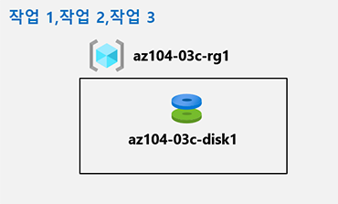

---
lab:
  title: 03c - Azure PowerShell을 사용하여 Azure 리소스 관리
  module: Administer Azure Resources
---

# <a name="lab-03c---manage-azure-resources-by-using-azure-powershell"></a>랩 03c - Azure PowerShell을 사용하여 Azure 리소스 관리
# <a name="student-lab-manual"></a>학생용 랩 매뉴얼

## <a name="lab-scenario"></a>랩 시나리오

Now that you explored the basic Azure administration capabilities associated with provisioning resources and organizing them based on resource groups by using the Azure portal and Azure Resource Manager templates, you need to carry out the equivalent task by using Azure PowerShell. To avoid installing Azure PowerShell modules, you will leverage PowerShell environment available in Azure Cloud Shell.

대화형 가이드 형식으로 이 랩을 미리 보려면 **[여기를 클릭하세요](https://mslabs.cloudguides.com/en-us/guides/AZ-104%20Exam%20Guide%20-%20Microsoft%20Azure%20Administrator%20Exercise%206)** .

## <a name="objectives"></a>목표

이 랩에서는 다음을 수행합니다.

+ 작업 1: Azure Cloud Shell에서 PowerShell 세션 시작하기
+ 작업 2: Azure PowerShell을 사용하여 리소스 그룹 및 Azure 관리 디스크 만들기
+ 작업 3: Azure PowerShell을 사용하여 관리 디스크 구성

## <a name="estimated-timing-20-minutes"></a>예상 소요 시간: 20분

## <a name="architecture-diagram"></a>아키텍처 다이어그램



## <a name="instructions"></a>Instructions

> <bpt id="p1">**</bpt>Note<ept id="p1">**</ept>:  Always create your own secure password for any virtual machine or user account you create. If the virtual machine is created for you, use <bpt id="p1">**</bpt>Reset password<ept id="p1">**</ept> in the Portal to update the password. 

### <a name="exercise-1"></a>연습 1

#### <a name="task-1-start-a-powershell-session-in-azure-cloud-shell"></a>작업 1: Azure Cloud Shell에서 PowerShell 세션 시작하기

이 작업에서는 Cloud Shell에서 PowerShell 세션을 엽니다. 

1. 포털에서 Azure Portal 오른쪽 상단에 있는 아이콘을 클릭하여 **Azure Cloud Shell**을 엽니다.

1. **Bash**와 **PowerShell** 중에서 선택하라는 메시지가 표시되면 **PowerShell**을 선택합니다. 

    >**참고**: **Cloud Shell**을 처음 시작했는데 **탑재된 스토리지 없음**이라는 메시지가 표시되면 이 랩에서 사용하는 구독을 선택하고 **스토리지 만들기**를 클릭합니다. 

1. 메시지가 표시되면 **스토리지 만들기**를 클릭하고 Azure Cloud Shell 창이 표시될 때까지 기다립니다. 

1. Cloud Shell 창의 왼쪽 상단 모서리에 있는 드롭다운 메뉴에 **PowerShell**이 나타나는지 확인합니다.

#### <a name="task-2-create-a-resource-group-and-an-azure-managed-disk-by-using-azure-powershell"></a>작업 2: Azure PowerShell을 사용하여 리소스 그룹 및 Azure 관리 디스크 만들기

이 작업에서는 Cloud Shell 내에 있는 Azure PowerShell 세션을 사용하여 리소스 그룹 및 Azure 관리 디스크를 만듭니다.

1. Cloud Shell 내의 PowerShell 세션에서 이전 랩에서 만든 **az104-03b-rg1** 리소스 그룹과 동일한 Azure 지역에 있는 리소스 그룹을 만들려면 다음 명령을 실행합니다.

   ```powershell
   $location = (Get-AzResourceGroup -Name az104-03b-rg1).Location

   $rgName = 'az104-03c-rg1'

   New-AzResourceGroup -Name $rgName -Location $location
   ```
1. 새로 만든 리소스 그룹의 속성을 검색하려면 다음 명령을 실행합니다.

   ```powershell
   Get-AzResourceGroup -Name $rgName
   ```
1. 본 모듈의 이전 랩에서 만든 것과 동일한 특성을 가진 새 관리 디스크를 만들려면 다음 명령을 실행합니다.

   ```powershell
   $diskConfig = New-AzDiskConfig `
    -Location $location `
    -CreateOption Empty `
    -DiskSizeGB 32 `
    -Sku Standard_LRS

   $diskName = 'az104-03c-disk1'

   New-AzDisk `
    -ResourceGroupName $rgName `
    -DiskName $diskName `
    -Disk $diskConfig
   ```

1. 새로 만든 디스크의 속성을 검색하려면 다음 명령을 실행합니다.

   ```powershell
   Get-AzDisk -ResourceGroupName $rgName -Name $diskName
   ```

#### <a name="task-3-configure-the-managed-disk-by-using-azure-powershell"></a>작업 3: Azure PowerShell을 사용하여 관리 디스크 구성

본 작업에서는 Cloud Shell 내에서 Azure PowerShell 세션을 사용하여 Azure 관리 디스크의 구성을 관리합니다. 

1. Cloud Shell 내의 PowerShell 세션에서 Azure 관리 디스크의 크기를 **64 GB**로 늘리려면 다음 명령을 실행합니다.

   ```powershell
   New-AzDiskUpdateConfig -DiskSizeGB 64 | Update-AzDisk -ResourceGroupName $rgName -DiskName $diskName
   ```

1. 변경이 적용되었는지 확인하려면 다음 명령을 실행합니다.

   ```powershell
   Get-AzDisk -ResourceGroupName $rgName -Name $diskName
   ```

1. 현재 SKU(**Standard_LRS**)를 확인하려면 다음 명령을 실행합니다.

   ```powershell
   (Get-AzDisk -ResourceGroupName $rgName -Name $diskName).Sku
   ```

1. Cloud Shell 내의 PowerShell 세션에서 디스크 성능 SKU를 **Premium_LRS**로 변경하려면 다음 명령을 실행합니다.

   ```powershell
   New-AzDiskUpdateConfig -Sku Premium_LRS | Update-AzDisk -ResourceGroupName $rgName -DiskName $diskName
   ```

1. 변경이 적용되었는지 확인하려면 다음 명령을 실행합니다.

   ```powershell
   (Get-AzDisk -ResourceGroupName $rgName -Name $diskName).Sku
   ```

#### <a name="clean-up-resources"></a>리소스 정리

   ><bpt id="p1">**</bpt>Note<ept id="p1">**</ept>: Do not delete resources you deployed in this lab. You will reference them in the next lab of this module.

#### <a name="review"></a>검토

이 랩에서는 다음을 수행합니다.

- Azure Cloud Shell에서 PowerShell 세션 시작
- Azure PowerShell을 사용하여 리소스 그룹 및 Azure 관리 디스크 만들기
- Azure PowerShell을 사용하여 관리 디스크 구성
