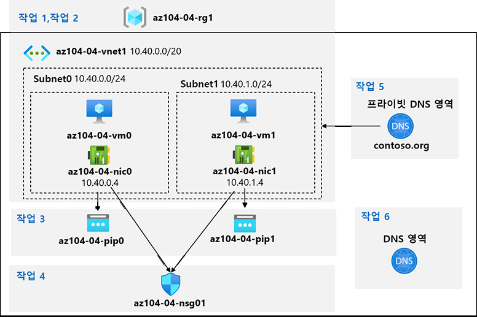

---
lab:
    title: '04 - 가상 네트워킹 구현'
    module: '모듈 04 - 가상 네트워킹'
---

# 랩 04 - 가상 네트워킹 구현

# 학생 랩 매뉴얼

## 랩 시나리오

Azure 가상 네트워킹 기능을 탐색해야 합니다. 우선, Azure에서 몇 개의 Azure 가상 머신을 호스트하는 가상 네트워크를 만들 계획을 세웁니다. 네트워크 기반 세분화를 구현하려는 경우 가상 네트워크의 다른 서브넷에 배포합니다. 또한 개인 IP 주소와 공용 IP 주소가 시간이 지남에 따라 변경되지 않도록 해야 합니다. Contoso 보안 요구 사항을 준수하려면 인터넷에서 액세스할 수 있는 Azure 가상 머신의 공용 엔드포인트를 보호해야 합니다. 마지막으로 가상 네트워크와 인터넷 모두에서 Azure 가상 머신에 대한 DNS 이름 확인을 구현해야 합니다.

## 목표

이 랩에서는 다음 작업을 수행합니다.

+ 작업 1: 가상 네트워크 만들기 및 구성
+ 작업 2: 가상 네트워크에 가상 머신 배포
+ 작업 3: Azure VM의 개인 및 공용 IP 주소 구성
+ 작업 4: 네트워크 보안 그룹 구성
+ 작업 5: 내부 이름 확인용 Azure DNS 구성
+ 작업 6: 외부 이름 확인용 Azure DNS 구성

## 예상 시간: 40분

## 아키텍처 다이어그램



## 지침

### 연습 1:

#### 작업 1: 가상 네트워크 만들기 및 구성

이 작업에서는 Azure Portal을 사용하여 다중 서브넷을 포함한 가상 네트워크를 만듭니다

1. [Azure Portal](https://portal.azure.com)에 로그인합니다.

1. Azure Portal에서 **가상 네트워크**를 검색하여 선택하고 **가상 네트워크** 블레이드에서 **+ 만들기**를 클릭합니다.

1. 다음 설정을 사용하여 가상 네트워크를 만듭니다(다른 값은 기본값을 그대로 둡니다).

    | 설정 | 값 |
    | --- | --- |
    | 구독 | 이 랩에서 사용할 Azure 구독의 이름 |
    | 리소스 그룹 | **새** 리소스 그룹 **az104-04-rg1**의 이름 |
    | 이름 | **az104-04-vnet1** |
    | 지역 | 이 랩에서 사용할 구독에서 사용할 수 있는 Azure 지역의 이름 |

1. **다음: IP 주소**를 클릭하고 다음 값을 입력합니다.

    | 설정 | 값 |
    | --- | --- |
    | IPv4 주소 공간 | **10.40.0.0/20** |

1. **+ 서브넷 추가**를 클릭하고 다음 값을 입력한 후에 **추가**를 클릭합니다.

    | 설정 | 값 |
    | --- | --- |
    | 서브넷 이름 | **subnet0** |
    | 서브넷 주소 범위 | **10.40.0.0/24** |

1. 기본값을 그대로 적용하고 **검토 후 만들기**를 클릭합니다. 유효성 검사가 완료될 때까지 기다렸다가 **만들기**를 다시 클릭하여 배포를 제출합니다.

    >**참고:** 가상 네트워크가 프로비전될 때까지 기다립니다. 이 작업에는 1분 미만이 소요됩니다.

1. **리소스로 이동**을 클릭합니다.

1. **az104-04-vnet1** 가상 네트워크 블레이드에서 **서브넷**을 클릭한 다음 **+ 서브넷**을 클릭합니다.

1. 다음 설정을 사용하여 서브넷을 만듭니다(다른 값은 기본값을 그대로 둡니다).

    | 설정 | 값 |
    | --- | --- |
    | 이름 | **subnet1** |
    | 주소 범위(CIDR 블록) | **10.40.1.0/24** |
    | 네트워크 보안 그룹 | **없음** |
    | 경로 테이블 | **없음** |

1. **저장**을 클릭합니다.

#### 작업 2: 가상 네트워크에 가상 머신 배포

이 작업에서는 ARM 템플릿을 사용하여 가상 네트워크의 여러 서브넷에 Azure 가상 머신을 배포합니다.

1. Azure Portal에서 오른쪽 상단의 아이콘을 클릭하여 **Azure Cloud Shell**을 엽니다.

1. **Bash** 또는 **PowerShell**을 선택하라는 메시지가 표시되면 **PowerShell**을 선택합니다.

    >**참고**: **Cloud Shell**을 처음 시작했는데 **탑재된 스토리지 없음**이라는 메시지가 표시되면 이 랩에서 사용하는 구독을 선택하고 **스토리지 만들기**를 클릭합니다.

1. Cloud Shell 창의 도구 모음에서 **파일 업로드/다운로드** 아이콘을 클릭하고 드롭다운 메뉴에서 **업로드**를 클릭하여 **\\Allfiles\\Labs\\04\\az104-04-vms-loop-template.json** 및 **\\Allfiles\\Labs\\04\\az104-04-vms-loop-parameters.json** 파일을 Cloud Shell 홈 디렉터리에 업로드합니다.

    >**참고**: 각 파일을 별도로 업로드해야 할 수 있습니다.

1. Cloud Shell 창에서 다음을 실행하여 업로드한 템플릿 및 매개 변수 파일로 두 개의 가상 머신을 배포합니다.

   ```powershell
   $rgName = 'az104-04-rg1'

   New-AzResourceGroupDeployment `
      -ResourceGroupName $rgName `
      -TemplateFile $HOME/az104-04-vms-loop-template.json `
      -TemplateParameterFile $HOME/az104-04-vms-loop-parameters.json
   ```

    >**참고**: 이 ARM 템플릿 배포 방법에서는 Azure PowerShell을 사용합니다. 동등한 Azure CLI 명령 **az deployment create**를 실행하여 동일한 작업을 수행할 수 있습니다(자세한 내용은 [Resource Manager 템플릿 및 Azure CLI를 사용한 리소스 배포](https://docs.microsoft.com/ko-kr/azure/azure-resource-manager/templates/deploy-cli) 참조).

    >**참고**: 배포가 완료될 때까지 기다렸다가 다음 작업을 진행합니다. 약 2분이 소요됩니다.

    >**참고**: 해당 지역에서 VM 크기를 사용할 수 없다는 오류가 나타나면 다음 단계를 진행하세요.
    > 1. CloudShell에서 `{}` 단추를 클릭하고, 왼쪽 사이드 바에서 **az104-04-vms-loop-parameters.json**을 선택하고, `vmSize` 매개 변수 값을 메모합니다.
    > 1. 'az104-04-rg1' 리소스 그룹이 배포되는 위치를 확인합니다. CloudShell에서 `az group show -n az104-04-rg1 --query location`를 실행하여 확인할 수 있습니다.
    > 1. CloudShell에서 `az vm list-skus --location <Replace with your location> -o table --query "[? contains(name,'Standard_D2s')].name"`을 실행합니다.
    > 1. `vmSize` 매개 변수의 값을 방금 실행한 명령에서 반환된 값 중 하나로 바꿉니다.
    > 1. 이제 `New-AzResourceGroupDeployment` 명령을 다시 실행하여 템플릿을 재배포합니다. 위로 단추를 몇 번 눌러서 마지막으로 실행한 명령을 가져올 수 있습니다.

1. Cloud Shell 창을 닫습니다.

#### 작업 3: Azure VM의 개인 및 공용 IP 주소 구성

이 작업에서는 Azure 가상 머신의 네트워크 인터페이스에 할당된 공용 및 개인 IP 주소에 대한 정적 할당을 구성합니다.

   >**참고**: 개인 및 공용 IP 주소는 실제로 네트워크 인터페이스에 할당되어 Azure 가상 머신에 연결되지만, 일반적으로는 Azure VM에 할당된 IP 주소를 참조합니다.

1. Azure Portal에서 **리소스 그룹**을 검색하여 선택하고 **리소스 그룹** 블레이드에서 **az104-04-rg1**을 클릭합니다.

1. **az104-04-rg1** 리소스 그룹 블레이드의 리소스 목록에서 **az104-04-vnet1**을 클릭합니다.

1. **az104-04-vnet1** 가상 네트워크 블레이드에서 **연결된 디바이스** 섹션을 검토하여 가상 네트워크에 연결된 두 개의 네트워크 인터페이스 **az104-04-nic0** 및 **az104-04-nic1**이 있는지 확인합니다.

1. **az104-04-nic0**을 클릭하고 **az104-04-nic0** 블레이드에서 **IP 구성**을 클릭합니다.

    >**참고**: **ipconfig1**이 현재 동적 개인 IP 주소로 설정되어 있는지 확인합니다.

1. 목록 IP 구성에서 **ipconfig1**을 클릭합니다.

1. **ipconfig1** 블레이드의 **공용 IP 주소 설정** 섹션에서 **연결**을 선택하고 **+ 새로 만들기**를 클릭합니다. 다음 설정을 지정하고 **확인**을 클릭합니다.

    | 설정 | 값 |
    | --- | --- |
    | 이름 | **az104-04-pip0** |
    | SKU | **표준** |

1. **ipconfig1** 블레이드에서 **할당**을 **정적**으로 설정하고 **IP 주소**의 기본값을 **10.40.0.4**로 설정한 상태로 둡니다.

1. **ipconfig1** 블레이드로 돌아가서 변경 내용을 저장합니다. 작업 저장이 완료될 때까지 기다렸다가 다음 단계를 진행해야 합니다.

1. **az104-04-vnet1** 블레이드로 다시 돌아갑니다.

1. **az104-04-nic1**을 클릭하고 **az104-04-nic1** 블레이드에서 **IP 구성**을 클릭합니다.

    >**참고**: **ipconfig1**이 현재 동적 개인 IP 주소로 설정되어 있는지 확인합니다.

1. 목록 IP 구성에서 **ipconfig1**을 클릭합니다.

1. **ipconfig1** 블레이드의 **공용 IP 주소 설정** 섹션에서 **연결**을 선택하고 **+ 새로 만들기**를 클릭합니다. 다음 설정을 지정하고 **확인**을 클릭합니다.

    | 설정 | 값 |
    | --- | --- |
    | 이름 | **az104-04-pip1** |
    | SKU | **표준** |

1. **ipconfig1** 블레이드에서 **할당**을 **정적**으로 설정하고 **IP 주소**의 기본값을 **10.40.1.4**로 설정한 상태로 둡니다.

1. **ipconfig1** 블레이드로 돌아가서 변경 내용을 저장합니다.

1. **az104-04-rg1** 리소스 그룹 블레이드로 다시 이동하여 리소스 목록에서 **az104-04-vm0**을 클릭하고 **az104-04-vm0** 가상 머신 블레이드에서 공용 IP 주소 항목을 기록합니다.

1. **az104-04-rg1** 리소스 그룹 블레이드로 다시 이동하여 리소스 목록에서 **az104-04-vm1**을 클릭하고 **az104-04-vm1** 가상 머신 블레이드에서 공용 IP 주소 항목을 기록합니다.

    >**참고**: 이 랩의 마지막 작업에서 두 IP 주소가 필요합니다.

#### 작업 4: 네트워크 보안 그룹 구성

이 작업에서는 Azure 가상 머신에 대한 제한된 연결을 허용하도록 네트워크 보안 그룹을 구성합니다.

1. Azure Portal에서 **az104-04-rg1** 리소스 그룹 블레이드로 다시 이동하여 리소스 목록에서 **az104-04-vm0**을 클릭합니다.

1. **az104-04-vm0** 개요 블레이드에서 **연결**을 클릭하고, 드롭다운 메뉴에서 **RDP**를 클릭하고, **RDP와 연결** 블레이드에서 공용 IP 주소를 사용하여 **RDP 파일 다운로드**를 클릭하고 프롬프트를 따라 원격 데스크톱 세션을 시작합니다.

1. 연결이 실패하는지 확인합니다.

    >**참고**: 기본적으로 표준 SKU의 공용 IP 주소는 할당된 네트워크 인터페이스를 네트워크 보안 그룹으로 보호할 것을 요구하기 때문에 이러한 실패는 예상된 결과입니다. 원격 데스크탑에 연결하려면 인터넷에서 인바운드 RDP 트래픽을 명시적으로 허용하는 네트워크 보안 그룹을 만들고 이 그룹을 두 가상 머신의 네트워크 인터페이스에 할당합니다.

1. Azure Portal에서 **네트워크 보안 그룹**을 검색하여 선택하고 **네트워크 보안 그룹** 블레이드에서 **+ 만들기**를 클릭합니다.

1. 다음 설정을 사용하여 네트워크 보안 그룹을 만듭니다(다른 설정은 기본값으로 유지).

    | 설정 | 값 |
    | --- | --- |
    | 구독 | 이 랩에서 사용 중인 Azure 구독의 이름 |
    | 리소스 그룹 | **az104-04-rg1** |
    | 이름 | **az104-04-nsg01** |
    | 지역 | 이 랩에서 다른 모든 리소스를 배포한 Azure 지역의 이름 |

1. **검토 후 만들기**를 클릭합니다. 유효성 검사가 완료될 때까지 기다리고 **만들기**를 클릭하여 배포를 제출합니다.

    >**참고**: 배포가 완료될 때까지 기다립니다. 약 2분이 소요됩니다.

1. 배포 블레이드에서 **리소스로 이동**을 클릭하여 **az104-04-nsg01** 네트워크 보안 그룹 블레이드를 엽니다.

1. **az104-04-nsg01** 네트워크 보안 그룹 블레이드의 **설정** 섹션에서 **인바운드 보안 규칙**을 클릭합니다.

1. 다음 설정을 사용하여 인바운드 규칙을 추가합니다(다른 설정은 기본값으로 유지).

    | 설정 | 값 |
    | --- | --- |
    | 원본 | **모두** |
    | 원본 포트 범위 | * |
    | 대상 | **모두** |
    | 서비스 | **RDP** |
    | 작업 | **허용** |
    | 우선 순위 | **300** |
    | 이름 | **AllowRDPInBound** |

1. **az104-04-nsg01** 네트워크 보안 그룹 블레이드의 **설정** 섹션에서 **네트워크 인터페이스**를 클릭한 다음 **+ 연결**을 클릭합니다.

1. **az104-04-nsg01** 네트워크 보안 그룹을 **az104-04-nic0** 및 **az104-04-nic1** 네트워크 인터페이스와 연결합니다.

    >**참고**: 새로 만든 네트워크 보안 그룹의 규칙이 네트워크 인터페이스 카드에 적용되려면 최대 5분이 소요될 수 있습니다.

1. **Az104-04-vm0** 가상 머신 블레이드로 다시 돌아갑니다.

    >**참고**: 후속 단계에서는 사용자 이름 **Student**와 암호 **Pa55w.rd1234**를 사용하여 대상 가상 머신에 성공적으로 연결하고 로그인할 수 있는지 확인합니다.

1. **az104-04-vm0** 블레이드에서 **연결**을 클릭하고, **RDP**를 클릭하고, **RDP와 연결** 블레이드에서 공용 IP 주소를 사용하여 **RDP 파일 다운로드**를 클릭하고 프롬프트를 따라 원격 데스크톱 세션을 시작합니다.

    >**참고**: 이 단계는 Windows 컴퓨터에서 원격 데스크톱을 통해 연결하는 것을 말합니다. Mac에서는 Mac App Store에서 원격 데스크톱 클라이언트를 사용할 수 있고 Linux 컴퓨터에서는 오픈 소스 RDP 클라이언트 소프트웨어를 사용할 수 있습니다.

    >**참고**: 대상 가상 머신에 연결할 때 경고 프롬프트는 무시해도 됩니다.

1. 메시지가 표시되면 사용자 이름 **Student**와 암호 **Pa55w.rd1234**를 사용하여 로그인합니다.

    >**참고**: 원격 데스크톱 세션을 열린 상태로 둡니다. 다음 작업에서 해당 값이 필요합니다.

#### 작업 5: 내부 이름 확인용 Azure DNS 구성

이 작업에서는 Azure 프라이빗 DNS 영역을 사용하여 가상 네트워크 내에서 DNS 이름 확인을 구성합니다.

1. Azure Portal에서 **프라이빗 DNS 영역**을 검색하여 선택하고 **프라이빗 DNS 영역** 블레이드에서 **+ 만들기**를 클릭합니다.

1. 다음 설정을 사용하여 프라이빗 DNS 영역을 만듭니다(다른 설정은 기본값으로 유지).

    | 설정 | 값 |
    | --- | --- |
    | 구독 | 이 랩에서 사용 중인 Azure 구독의 이름 |
    | 리소스 그룹 | **az104-04-rg1** |
    | 이름 | **contoso.org** |

1. **검토 후 만들기**를 클릭합니다. 유효성 검사가 완료될 때까지 기다렸다가 **만들기**를 다시 클릭하여 배포를 제출합니다.

    >**참고**: 프라이빗 DNS 영역이 만들어질 때까지 기다립니다. 약 2분이 소요됩니다.

1. **리소스로 이동**을 클릭하여 **contoso.org** DNS 프라이빗 영역 블레이드를 엽니다.

1. **contoso.org** 프라이빗 DNS 영역 블레이드의 **설정** 섹션에서 **가상 네트워크 링크**를 클릭합니다.

1. **+ 추가**를 클릭하여 다음 설정으로 가상 네트워크 링크를 만듭니다(다른 설정은 기본값으로 유지).

    | 설정 | 값 |
    | --- | --- |
    | 링크 이름 | **az104-04-vnet1-link** |
    | 구독 | 이 랩에서 사용 중인 Azure 구독의 이름 |
    | 가상 네트워크 | **az104-04-vnet1** |
    | 자동 등록 사용 | 사용 |

1. **확인**을 클릭합니다.

    >**참고:** 가상 네트워크 링크가 만들어질 때까지 기다립니다. 1분 미만이 소요됩니다.

1. **contoso.org** 프라이빗 DNS 영역 블레이드의 사이드바에서 **개요**를 클릭합니다.

1. **az104-04-vm0** 및 **az104-04-vm1**에 대한 DNS 레코드가 레코드 집합 목록에 **자동 등록됨**으로 나타나는지 확인합니다.

    >**참고:** 레코드 집합이 나열되지 않은 경우 몇 분 동안 기다렸다가 페이지를 새로 고침합니다.

1. **az104-04-vm0**에 대한 원격 데스크톱 세션으로 전환하여 **시작** 단추를 마우스 오른쪽 단추로 클릭하고, 나타나는 메뉴에서, **Windows PowerShell(관리자)** 을 클릭합니다.

1. Windows PowerShell 콘솔 창에서 다음을 실행하여 새로 만든 프라이빗 DNS 영역에서 내부 이름 확인을 테스트합니다.

   ```powershell
   nslookup az104-04-vm0.contoso.org
   nslookup az104-04-vm1.contoso.org
   ```

1. 명령의 출력에 **az104-04-vm1**의 개인 IP 주소(**10.40.1.4**)가 포함되어 있는지 확인합니다.

#### 작업 6: 외부 이름 확인용 Azure DNS 구성

이 작업에서는 Azure 공용 DNS 영역을 사용하여 외부 DNS 이름 확인을 구성합니다.

1. **SEA-DEV** 랩 시스템의 웹 브라우저에서 새 탭을 열고 <https://www.godaddy.com/domains/domain-name-search>로 이동합니다.

1. 도메인 이름 검색을 사용하여 사용되지 않는 도메인 이름을 확인합니다.

1. Azure Portal에서 **DNS 영역**을 검색하여 선택하고 **DNS 영역** 블레이드에서 **+ 만들기**를 클릭합니다.

1. 다음 설정을 사용하여 DNS 영역을 만듭니다(다른 설정은 기본값으로 유지).

    | 설정 | 값 |
    | --- | --- |
    | 구독 | 이 랩에서 사용 중인 Azure 구독의 이름 |
    | 리소스 그룹 | **az104-04-rg1** |
    | 이름 | 이 작업의 앞부분에서 확인한 DNS 도메인 이름 |

1. 검토 후 만들기를 클릭합니다. 유효성 검사가 완료될 때까지 기다렸다가 만들기를 다시 클릭하여 배포를 제출합니다.

    >**참고**: DNS 영역이 만들어질 때까지 기다립니다. 약 2분이 소요됩니다.

1. **리소스로 이동**을 클릭하여 새로 만들어진 DNS 영역의 블레이드를 엽니다.

1. DNS 영역 블레이드에서 **+ 레코드 집합**을 클릭합니다.

1. 다음 설정을 사용하여 레코드 집합을 추가합니다(다른 설정은 기본값으로 유지).

    | 설정 | 값 |
    | --- | --- |
    | 이름 | **az104-04-vm0** |
    | 유형 | **A** |
    | 별칭 레코드 집합 | **없음** |
    | TTL | **1** |
    | TTL 단위 | **시간** |
    | IP 주소 | 이 랩의 세 번째 연습에서 식별한 **az104-04-vm0**의 공용 IP 주소 |

1. **확인**을 클릭합니다.

1. DNS 영역 블레이드에서 **+ 레코드 집합**을 클릭합니다.

1. 다음 설정을 사용하여 레코드 집합을 추가합니다(다른 설정은 기본값으로 유지).

    | 설정 | 값 |
    | --- | --- |
    | 이름 | **az104-04-vm1** |
    | 유형 | **A** |
    | 별칭 레코드 집합 | **없음** |
    | TTL | **1** |
    | TTL 단위 | **시간** |
    | IP 주소 | 이 랩의 세 번째 연습에서 식별한 **az104-04-vm1**의 공용 IP 주소 |

1. **확인**을 클릭합니다.

1. DNS 영역 블레이드에서 **이름 서버 1** 항목의 이름을 기록합니다.

1. Azure Portal에서 오른쪽 상단에 있는 아이콘을 클릭하여 **Cloud Shell**에서 **PowerShell** 세션을 엽니다.

1. Cloud Shell 창에서 다음을 실행하여 새로 만든 DNS 영역에서 **az104-04-vm0** DNS 레코드 집합의 외부 이름 확인을 테스트합니다(`[Name server 1]` 자리 표시자는 이 작업의 앞부분에서 적어 둔 **이름 서버 1**의 이름으로 바꾸고, `[domain name]` 자리 표시자는 이 작업의 앞부분에서 만든 DNS 도메인의 이름으로 바꿈).

   ```powershell
   nslookup az104-04-vm0.[domain name] [Name server 1]
   ```

1. 명령의 출력에 **az104-04-vm0**의 공용 IP 주소가 포함되어 있는지 확인합니다.

1. Cloud Shell 창에서 다음을 실행하여 새로 만든 DNS 영역에서 **az104-04-vm1** DNS 레코드 집합의 외부 이름 확인을 테스트합니다(`[Name server 1]` 자리 표시자는 이 작업의 앞부분에서 적어 둔 **이름 서버 1**의 이름으로 바꾸고, `[domain name]` 자리 표시자는 이 작업의 앞부분에서 만든 DNS 도메인의 이름으로 바꿈).

   ```powershell
   nslookup az104-04-vm1.[domain name] [Name server 1]
   ```

1. 명령의 출력에 **az104-04-vm1**의 공용 IP 주소가 포함되어 있는지 확인합니다.

#### 리소스 정리

   >**참고**: 더 이상 사용하지 않는 새로 만든 Azure 리소스를 제거해야 합니다. 사용하지 않는 리소스를 제거하면 예상하지 못한 비용이 발생하지 않습니다.

1. Azure Portal에서 **Cloud Shell** 창의 **PowerShell** 세션을 엽니다.

1. 다음 명령을 실행하여 이 모듈의 전체 랩에서 생성된 모든 리소스 그룹을 나열합니다.

   ```powershell
   Get-AzResourceGroup -Name 'az104-04*'
   ```

1. 다음 명령을 실행하여 이 모듈의 전체 랩에서 만든 모든 리소스 그룹을 삭제합니다.

   ```powershell
   Get-AzResourceGroup -Name 'az104-04*' | Remove-AzResourceGroup -Force -AsJob
   ```

    >**참고**: 명령은 비동기적으로 실행되므로(-AsJob 매개 변수에 의해 결정됨) 동일한 PowerShell 세션 내에서 즉시 다른 PowerShell 명령을 실행할 수 있지만 리소스 그룹이 실제로 제거되기까지 몇 분 정도 걸릴 것입니다.

#### 복습

이 랩에서는 다음 작업을 수행했습니다.

+ 가상 네트워크 만들기 및 구성
+ 가상 네트워크에 가상 머신 배포
+ Azure VM의 프라이빗 및 공용 IP 주소 구성
+ 네트워크 보안 그룹 구성
+ 내부 이름 확인용 Azure DNS 구성
+ 외부 이름 확인용 Azure DNS 구성
