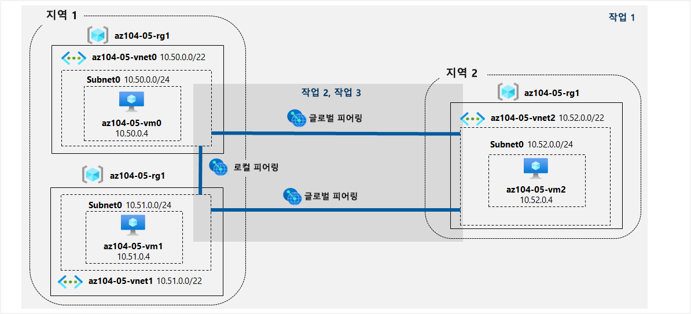

---
lab:
    title: '05 - 사이트 간 연결 구현'
    module: '모듈 05 - 사이트 간 연결'
---

# 랩 05 - 사이트 간 연결 구현
# 학생 랩 매뉴얼

## 랩 시나리오

Contoso는 보스턴, 뉴욕 및 시애틀 지사에 있는 메시 광역 네트워크 링크를 통해 연결된 데이터 센터를 보유하고 있으며, 이들 사이의 전체 연결이 가능합니다. Contoso 온-프레미스 네트워크의 토폴로지를 반영하고 그 기능을 확인하는 랩 환경을 구현해야 합니다.

## 목표

이 랩에서는 다음 작업을 수행합니다.

+ 작업 1: 랩 환경 프로비전
+ 작업 2: 로컬 및 전역 가상 네트워크 피어링을 구성합니다.
+ 작업 3: 사이트 간 연결을 테스트합니다.

## 예상 시간: 30분

## 아키텍처 다이어그램



### 지침

#### 작업 1: 랩 환경 프로비전

이 작업에서는 세 개의 가상 머신을 각각 별도의 가상 네트워크에 배포하고 그 중 두 개는 동일한 Azure 지역에, 나머지 하나는 다른 Azure 지역에 배포합니다.

1. [Azure Portal](https://portal.azure.com)에 로그인합니다.

1. Azure Portal에서 오른쪽 상단의 아이콘을 클릭하여 **Azure Cloud Shell**을 엽니다.

1. **Bash** 또는 **PowerShell**을 선택하라는 메시지가 표시되면 **PowerShell**을 선택합니다.

    >**참고**: 처음으로 **Cloud Shell**을 시작하고 **탑재된 스토리지가 없음** 메시지가 표시되면, 이 랩에서 사용하는 구독을 선택하고 **스토리지 만들기**를 클릭합니다.

1. Cloud Shell 창의 도구 모음에서 **파일 업로드/다운로드** 아이콘을 클릭하고 드롭다운 메뉴에서 **업로드**를 클릭하여 **\\Allfiles\\Labs\\05\\az104-05-vnetvm-loop-template.json** 및 **\\Allfiles\\Labs\\05\\az104-05-vnetvm-loop-parameters.json** 파일을 Cloud Shell 홈 디렉터리에 업로드합니다.

1. Cloud Shell 창에서 다음을 실행하여 랩 환경을 호스트할 리소스 그룹을 만듭니다. 처음 두 개의 가상 네트워크와 한 쌍의 가상 머신이 `[Azure_region_1]`에 배포됩니다. 세 번째 가상 네트워크와 세 번째 가상 머신이 같은 리소스 그룹의 다른 지역인 `[Azure_region_2]`에 배포됩니다 (`[Azure_region_1]` 및 `[Azure_region_2]` 자리 표시자를 해당 Azure 가상 머신을 배포할 서로 다른 두 Azure 지역의 이름으로 바꿈).

   ```powershell
   $location1 = '[Azure_region_1]'

   $location2 = '[Azure_region_2]'

   $rgName = 'az104-05-rg1'

   New-AzResourceGroup -Name $rgName -Location $location1
   ```

   >**참고**: Cloud Shell의 PowerShell 세션에서 Azure 지역을 식별하려면 **(Get-AzLocation).Location** 을 실행합니다.

1. Cloud Shell 창에서 세 개의 가상 네트워크를 만들고 업로드한 템플릿 및 매개 변수 파일을 사용하여 가상 머신을 배포합니다.

   ```powershell
   New-AzResourceGroupDeployment `
      -ResourceGroupName $rgName `
      -TemplateFile $HOME/az104-05-vnetvm-loop-template.json `
      -TemplateParameterFile $HOME/az104-05-vnetvm-loop-parameters.json `
      -location1 $location1 `
      -location2 $location2
   ```

    >**참고**: 배포가 완료될 때까지 기다렸다가 다음 단계를 진행합니다. 약 2분이 소요됩니다.

1. Cloud Shell 창을 닫습니다.

#### 작업 2: 로컬 및 전역 가상 네트워크 피어링을 구성합니다.

이 작업에서는 이전 작업에서 배포된 가상 네트워크 간의 로컬 및 글로벌 피어링을 구성합니다.

1. Azure Portal에서 **가상 네트워크**를 검색하고 선택합니다.

1. 이전 작업에서 만든 가상 네트워크를 검토하고 처음 두 개가 동일한 Azure 지역에 있고 나머지 하나가 다른 Azure 지역에 있는지 확인합니다.

    >**참고**: 세 개의 가상 네트워크 배포에 사용된 템플릿은 가상 네트워크 세 개의 IP 주소 범위가 겹치지 않도록 합니다.

1. 가상 네트워크 목록에서 **az104-05-vnet0** 을 클릭합니다.

1. **az104-05-vnet0** 가상 네트워크 블레이드의 **설정** 섹션에서 **피어링**을 클릭한 다음 **+ 추가**를 클릭합니다.

1. 다음 설정을 사용하여 피어링을 추가하고(다른 설정은 기본값으로 유지) **추가**를 클릭합니다.

    | 설정 | 값|
    | --- | --- |
    | 이 가상 네트워크: 링크 이름 피어링 | **az104-05-vnet0_to_az104-05-vnet1** |
    | 이 가상 네트워크: 원격 가상 네트워크로의 트래픽 | **허용(기본값)** |
    | 이 가상 네트워크: 원격 가상 네트워크로부터 전달된 트래픽 | **이 가상 네트워크 바깥에서 온 트래픽 차단** |
    | 가상 네트워크 게이트웨이 | **없음** |
    | 원격 가상 네트워크: 링크 이름 피어링 | **az104-05-vnet1_to_az104-05-vnet0** |
    | 가상 네트워크 배포 모델 | **Resource Manager** |
    | 리소스 ID를 알고 있음 | 선택 안 함 |
    | 구독 | 이 랩에서 사용 중인 Azure 구독의 이름 |
    | 가상 네트워크 | **az104-05-vnet1** |
    | 원격 가상 네트워크로의 트래픽 | **허용(기본값)** |
    | 원격 가상 네트워크로부터 전달된 트래픽 | **이 가상 네트워크 바깥에서 온 트래픽 차단** |
    | 가상 네트워크 게이트웨이 | **없음** |

    >**참고**: 이 단계에서 하나는 az104-05-vnet0에서 az104-05-vnet1로, 다른 하나는 az104-05-vnet1에서 az104-05-vnet0으로인 두 개의 로컬 피어링을 설정합니다.

    >**참고**: 이전 작업에서 만든 가상 네트워크가 Azure Portal 인터페이스에 표시되지 않는 문제가 발생할 경우, Cloud Shell에서 다음 PowerShell 명령을 실행하여 피어링을 구성할 수 있습니다.
    
   ```powershell
   $rgName = 'az104-05-rg1'

   $vnet0 = Get-AzVirtualNetwork -Name 'az104-05-vnet0' -ResourceGroupName $rgname

   $vnet1 = Get-AzVirtualNetwork -Name 'az104-05-vnet1' -ResourceGroupName $rgname

   Add-AzVirtualNetworkPeering -Name 'az104-05-vnet0_to_az104-05-vnet1' -VirtualNetwork $vnet0 -RemoteVirtualNetworkId $vnet1.Id

   Add-AzVirtualNetworkPeering -Name 'az104-05-vnet1_to_az104-05-vnet0' -VirtualNetwork $vnet1 -RemoteVirtualNetworkId $vnet0.Id
   ``` 

1. **az104-05-vnet0** 가상 네트워크 블레이드의 **설정** 섹션에서 **피어링**을 클릭한 다음 **+ 추가**를 클릭합니다.

1. 다음 설정을 사용하여 피어링을 추가하고(다른 설정은 기본값으로 유지) **추가**를 클릭합니다.

    | 설정 | 값|
    | --- | --- |
    | 이 가상 네트워크: 링크 이름 피어링 | **az104-05-vnet0_to_az104-05-vnet2** |
    | 이 가상 네트워크: 원격 가상 네트워크로의 트래픽 | **허용(기본값)** |
    | 이 가상 네트워크: 원격 가상 네트워크로부터 전달된 트래픽 | **이 가상 네트워크 바깥에서 온 트래픽 차단** |
    | 가상 네트워크 게이트웨이 | **없음** |
    | 원격 가상 네트워크: 링크 이름 피어링 | **az104-05-vnet2_to_az104-05-vnet0** |
    | 가상 네트워크 배포 모델 | **Resource Manager** |
    | 리소스 ID를 알고 있음 | 선택 안 함 |
    | 구독 | 이 랩에서 사용 중인 Azure 구독의 이름 |
    | 가상 네트워크 | **az104-05-vnet2** |
    | 원격 가상 네트워크로의 트래픽 | **허용(기본값)** |
    | 원격 가상 네트워크로부터 전달된 트래픽 | **이 가상 네트워크 바깥에서 온 트래픽 차단** |
    | 가상 네트워크 게이트웨이 | **없음** |

    >**참고**: 이 단계에서 하나는 az104-05-vnet0에서 az104-05-vnet2로, 다른 하나는 az104-05-vnet2에서 az104-05-vnet0으로인 두 개의 전역 피어링을 설정합니다.

    >**참고**: 이전 작업에서 만든 가상 네트워크가 Azure Portal 인터페이스에 표시되지 않는 문제가 발생할 경우, Cloud Shell에서 다음 PowerShell 명령을 실행하여 피어링을 구성할 수 있습니다.
    
   ```powershell
   $rgName = 'az104-05-rg1'

   $vnet0 = Get-AzVirtualNetwork -Name 'az104-05-vnet0' -ResourceGroupName $rgname

   $vnet2 = Get-AzVirtualNetwork -Name 'az104-05-vnet2' -ResourceGroupName $rgname

   Add-AzVirtualNetworkPeering -Name 'az104-05-vnet0_to_az104-05-vnet2' -VirtualNetwork $vnet0 -RemoteVirtualNetworkId $vnet2.Id

   Add-AzVirtualNetworkPeering -Name 'az104-05-vnet2_to_az104-05-vnet0' -VirtualNetwork $vnet2 -RemoteVirtualNetworkId $vnet0.Id
   ``` 

1. **가상 네트워크** 블레이드로 돌아가 가상 네트워크 목록에서 **az104-05-vnet1** 을 클릭합니다.

1. **az104-05-vnet1** 가상 네트워크 블레이드의 **설정** 섹션에서 **피어링**을 클릭한 다음 **+ 추가**를 클릭합니다.

1. 다음 설정을 사용하여 피어링을 추가하고(다른 설정은 기본값으로 유지) **추가**를 클릭합니다.

    | 설정 | 값|
    | --- | --- |
    | 이 가상 네트워크: 링크 이름 피어링 | **az104-05-vnet1_to_az104-05-vnet2** |
    | 이 가상 네트워크: 원격 가상 네트워크로의 트래픽 | **허용(기본값)** |
    | 이 가상 네트워크: 원격 가상 네트워크로부터 전달된 트래픽 | **이 가상 네트워크 바깥에서 온 트래픽 차단** |
    | 가상 네트워크 게이트웨이 | **없음** |
    | 원격 가상 네트워크: 링크 이름 피어링 | **az104-05-vnet2_to_az104-05-vnet1** |
    | 가상 네트워크 배포 모델 | **Resource Manager** |
    | 리소스 ID를 알고 있음 | 선택 안 함 |
    | 구독 | 이 랩에서 사용 중인 Azure 구독의 이름 |
    | 가상 네트워크 | **az104-05-vnet2** |
    | 원격 가상 네트워크로의 트래픽 | **허용(기본값)** |
    | 원격 가상 네트워크로부터 전달된 트래픽 | **이 가상 네트워크 바깥에서 온 트래픽 차단** |
    | 가상 네트워크 게이트웨이 | **없음** |

    >**참고**: 이 단계에서 하나는 az104-05-vnet1에서 az104-05-vnet2로, 다른 하나는 az104-05-vnet2에서 az104-05-vnet1으로인 두 개의 전역 피어링을 설정합니다.

    >**참고**: 이전 작업에서 만든 가상 네트워크가 Azure Portal 인터페이스에 표시되지 않는 문제가 발생할 경우, Cloud Shell에서 다음 PowerShell 명령을 실행하여 피어링을 구성할 수 있습니다.
    
   ```powershell
   $rgName = 'az104-05-rg1'

   $vnet1 = Get-AzVirtualNetwork -Name 'az104-05-vnet1' -ResourceGroupName $rgname

   $vnet2 = Get-AzVirtualNetwork -Name 'az104-05-vnet2' -ResourceGroupName $rgname

   Add-AzVirtualNetworkPeering -Name 'az104-05-vnet1_to_az104-05-vnet2' -VirtualNetwork $vnet1 -RemoteVirtualNetworkId $vnet2.Id

   Add-AzVirtualNetworkPeering -Name 'az104-05-vnet2_to_az104-05-vnet1' -VirtualNetwork $vnet2 -RemoteVirtualNetworkId $vnet1.Id
   ``` 

#### 작업 3: 사이트 간 연결을 테스트합니다.

이 작업에서는 이전 작업의 로컬 및 전역 피어링을 통해 연결된 세 개의 가상 네트워크에서 가상 머신 간의 연결을 테스트합니다.

1. Azure Portal에서 **가상 머신**을 찾아서 선택합니다.

1. 가상 머신 목록에서 **az104-05-vm0**을 클릭합니다.

1. **az104-05-vm0** 블레이드에서 **연결**을 클릭하고 드롭다운 메뉴에서 **RDP**를 클릭하고 **RDP와 연결** 블레이드에서 **RDP 파일 다운로드**를 클릭하고 프롬프트를 따라 원격 데스크톱 세션을 시작합니다.

    >**참고**: 이 단계는 Windows 컴퓨터에서 원격 데스크톱을 통해 연결하는 것을 말합니다. Mac에서는 Mac App Store의 원격 데스크톱 클라이언트를 사용할 수 있고 Linux 컴퓨터에서는 오픈 소스 RDP 클라이언트 소프트웨어를 사용할 수 있습니다.

    >**참고**: 대상 가상 머신에 연결할 때 경고 프롬프트를 무시하세요.

1. 메시지가 표시되면 사용자 이름 **Student**와 암호 **Pa55w.rd1234**를 사용하여 로그인합니다.

1. **az104-05-vm0** 에 대한 원격 데스크톱 세션 내에서 **시작** 단추를 마우스 오른쪽 단추로 클릭하고 나타나는 메뉴에서 **Windows PowerShell(관리자)** 를 클릭합니다.

1. Windows PowerShell 콘솔 창에서 다음을 실행하여 TCP 포트 3389를 통해 **az104-05-vm1** (프라이빗 IP 주소가 **10.51.0.4**)에 대한 연결을 테스트합니다.

   ```powershell
   Test-NetConnection -ComputerName 10.51.0.4 -Port 3389 -InformationLevel 'Detailed'
   ```

    >**참고**: 테스트에서는 운영 체제 방화벽에 의해 기본적으로 허용되는 포트 TCP 3389를 사용합니다.

1. 출력 명령을 검사하여 연결되었는지 확인합니다.

1. Windows PowerShell 콘솔 창에서 다음을 실행하여 **az104-05-vm2** 에 대한 연결을 테스트합니다(프라이빗 IP 주소가 **10.52.0.4**입니다).

   ```powershell
   Test-NetConnection -ComputerName 10.52.0.4 -Port 3389 -InformationLevel 'Detailed'
   ```

1. 랩 컴퓨터에서 Azure Portal로 다시 전환하여 **가상 머신** 블레이드로 다시 돌아옵니다.

1. 가상 머신 목록에서 **az104-05-vm1** 을 클릭합니다.

1. **az104-05-vm1** 블레이드에서 **연결**을 클릭하고 드롭다운 메뉴에서 **RDP**를 클릭하고 **RDP와 연결** 블레이드에서 **RDP 파일 다운로드**를 클릭하고 프롬프트를 따라 원격 데스크톱 세션을 시작합니다.

    >**참고**: 이 단계는 Windows 컴퓨터에서 원격 데스크톱을 통해 연결하는 것을 말합니다. Mac에서는 Mac App Store의 원격 데스크톱 클라이언트를 사용할 수 있고 Linux 컴퓨터에서는 오픈 소스 RDP 클라이언트 소프트웨어를 사용할 수 있습니다.

    >**참고**: 대상 가상 머신에 연결할 때 경고 프롬프트를 무시하세요.

1. 메시지가 표시되면 사용자 이름 **Student**와 암호 **Pa55w.rd1234**를 사용하여 로그인합니다.

1. **az104-05-vm1**에 대한 원격 데스크톱 세션 내에서 **시작** 단추를 마우스 오른쪽 단추로 클릭하고 나타나는 메뉴에서 **Windows PowerShell(관리자)** 를 클릭합니다.

1. Windows PowerShell 콘솔 창에서 다음 명령을 실행하여 TCP 포트 3389를 통해 **az104-05-vm2** (프라이빗 IP 주소가 **10.52.0.4**)에 대한 연결을 테스트합니다.

   ```powershell
   Test-NetConnection -ComputerName 10.52.0.4 -Port 3389 -InformationLevel 'Detailed'
   ```

    >**참고**: 테스트에서는 운영 체제 방화벽에 의해 기본적으로 허용되는 포트 TCP 3389를 사용합니다.

1. 출력 명령을 검사하여 연결되었는지 확인합니다.

#### 리소스 정리

   >**참고**: 더 이상 사용하지 않는 새로 만든 Azure 리소스를 제거해야 합니다. 사용하지 않는 리소스를 제거하면 예기치 않은 비용이 발생하지 않습니다.

1. Azure Portal에서 **Cloud Shell** 창 내의 **PowerShell** 세션을 엽니다.

1. 다음 명령을 실행하여 이 모듈의 전체 랩에서 생성된 모든 리소스 그룹을 나열합니다.

   ```powershell
   Get-AzResourceGroup -Name 'az104-05*'
   ```

1. 다음 명령을 실행하여 이 모듈의 전체 랩에서 만든 모든 리소스 그룹을 삭제합니다.

   ```powershell
   Get-AzResourceGroup -Name 'az104-05*' | Remove-AzResourceGroup -Force -AsJob
   ```

    >**참고**: 명령은 비동기적으로 실행되므로(-AsJob 매개 변수에 의해 결정됨), 동일한 PowerShell 세션 내에서 즉시 다른 PowerShell 명령을 실행할 수 있지만 리소스 그룹이 실제로 제거되기까지 몇 분 정도 걸립니다.

#### 복습

이 랩에서는 다음을 수행했습니다.

+ 랩 환경 프로비전
+ 로컬 및 전역 가상 네트워크 피어링 구성
+ 사이트 간 연결 테스트
