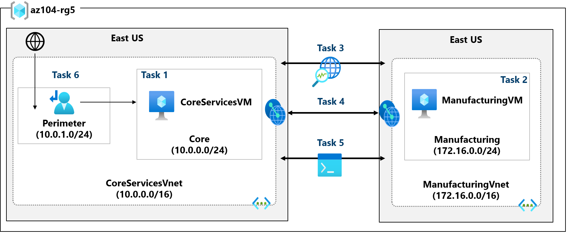

---
lab:
  title: '랩 05: 사이트 간 연결 구현'
  module: Administer Intersite Connectivity
---

# 랩 05 - 사이트 간 연결 구현

## 랩 소개

이 랩에서는 가상 네트워크 간의 통신을 살펴봅니다. 가상 네트워크 피어링을 구현하고 연결을 테스트합니다. 또한 사용자 지정 경로를 만듭니다. 

이 랩을 수행하려면 Azure 구독이 필요합니다. 구독 유형은 이 랩의 기능 가용성에 영향을 미칠 수 있습니다. 지역을 변경할 수 있지만 단계는 **미국 동부**를 사용하여 작성됩니다. 

## 예상 소요 시간: 50분
    
## 랩 시나리오 

조직은 제조 부서를 포함하여 비즈니스의 다른 부분에서 핵심 IT 앱 및 서비스(예: DNS 및 보안 서비스)를 분할합니다. 그러나 일부 시나리오에서는 핵심 영역의 앱 및 서비스가 제조 영역의 앱 및 서비스와 통신해야 합니다. 이 랩에서는 분할된 영역 간의 연결을 구성합니다. 이는 프로덕션과 개발을 분리하거나 한 자회사를 다른 자회사와 분리하는 일반적인 시나리오입니다.  

## 대화형 랩 시뮬레이션

이 항목에 유용할 수 있는 몇 가지 대화형 랩 시뮬레이션이 있습니다. 시뮬레이션을 통해 고유의 속도에 맞춰 유사한 시나리오를 클릭할 수 있습니다. 대화형 시뮬레이션과 이 랩에는 차이점이 있지만 핵심 개념은 대부분 동일합니다. Azure 구독은 필요하지 않습니다. 

+ [전역 가상 네트워크 피어링을 사용해 Azure Virtual Network 2개를 연결합니다](https://mslabs.cloudguides.com/guides/AZ-700%20Lab%20Simulation%20-%20Connect%20two%20Azure%20virtual%20networks%20using%20global%20virtual%20network%20peering). 서로 다른 가상 네트워크에 있는 두 가상 머신 간의 연결을 테스트합니다. 가상 네트워크 피어링을 만들고 다시 테스트합니다.

+ [가상 네트워크에 대한 모니터링 구성](https://learn.microsoft.com/training/modules/configure-monitoring-virtual-networks/). Azure Network Watcher 연결 모니터, 흐름 로그, NSG 진단 및 패킷 캡처를 사용하여 Azure IaaS 네트워크 리소스 전반의 연결을 모니터링하는 방법을 파악합니다.

+ [사이트 간 연결을 구현합니다](https://mslabs.cloudguides.com/en-us/guides/AZ-104%20Exam%20Guide%20-%20Microsoft%20Azure%20Administrator%20Exercise%209). 템플릿을 실행하여 여러 가상 머신으로 가상 네트워크 인프라를 만듭니다. 가상 네트워크 피어링을 구성하고 연결을 테스트합니다. 

## 아키텍처 다이어그램



## 작업 기술

+ 작업 1: 가상 네트워크에서 가상 머신을 만듭니다.
+ 작업 2: 다른 가상 네트워크에 가상 머신을 만듭니다.
+ 작업 3: Network Watcher를 사용하여 가상 머신 간의 연결을 테스트합니다. 
+ 작업 4: 서로 다른 가상 네트워크 간에 가상 네트워크 피어링을 구성합니다.
+ 작업 5: Azure PowerShell을 사용하여 가상 머신 간의 연결을 테스트합니다.
+ 작업 6: 사용자 지정 경로를 만듭니다. 

## 작업 1:  핵심 서비스 가상 머신 및 가상 네트워크 만들기

이 작업에서는 가상 머신을 사용하여 핵심 서비스 가상 네트워크를 만듭니다. 

1. **Azure Portal** - `https://portal.azure.com`에 로그인합니다.

1. `Virtual Machines`을 검색하고 선택합니다.

1. 가상 머신 페이지에서 **만들기**를 선택한 다음 **Azure Virtual Machine**을 선택합니다.

1. 기본 사항 탭에서 다음 정보를 사용하여 양식을 작성한 후 **다음: 디스크 >** 를 클릭합니다. 지정되지 않은 설정은 기본값을 그대로 둡니다.
 
    | 설정 | 값 | 
    | --- | --- |
    | 구독 |  *구독* |
    | 리소스 그룹 |  `az104-rg5`(필요한 경우 **새로 만들기**. )
    | 가상 머신 이름 |    `CoreServicesVM` |
    | 지역 | **(미국) 미국 동부** |
    | 가용성 옵션 | 인프라 중복 필요 없음 |
    | 보안 유형 | **Standard** |
    | 이미지 | **Windows Server 2019 Datacenter: x64 Gen2**(다른 선택 사항 확인) |
    | 크기 | **Standard_DS2_v3** |
    | 사용자 이름 | `localadmin` | 
    | 암호 | **복잡한 암호 제공** |
    | 퍼블릭 인바운드 포트 | **없음** |

    
   
1. **디스크** 탭에서 기본값을 사용한 후 **다음: 네트워킹 >** 을 선택합니다.

1. **네트워킹** 탭의 가상 네트워크에서 **새로 만들기**를 선택합니다.

1. 다음 정보를 사용하여 가상 네트워크를 구성한 다음 **OK**를 선택합니다. 필요한 경우 기존 정보를 제거하거나 바꿉니다.

    | 설정 | 값 | 
    | --- | --- |
    | 속성 | `CoreServicesVnet`(새로 만들기) |
    | 주소 범위 | `10.0.0.0/16`  |
    | 서브넷 이름 | `Core` | 
    | 서브넷 주소 범위 | `10.0.0.0/24` |

1. **모니터링** 탭을 선택합니다. 부트 진단에 대해 **사용 안 함**을 선택합니다.

1. **검토 + 만들기**를 선택한 후 **만들기**를 선택합니다.

1. 리소스가 만들어질 때까지 기다릴 필요가 없습니다. 계속해서 다음 작업을 진행합니다.

    >**참고:** 이 작업에서 가상 머신을 만들 때 가상 네트워크도 만들었다는 사실을 확인했나요? 가상 네트워크 인프라를 만든 다음 가상 머신을 추가할 수도 있습니다. 

## 작업 2: 다른 가상 네트워크에 가상 머신 만들기

이 작업에서는 가상 머신을 사용하여 제조 서비스 가상 네트워크를 만듭니다. 

1. Azure Portal에서 **Virtual Machines**를 검색하여 이동합니다.

1. 가상 머신 페이지에서 **만들기**를 선택한 다음 **Azure Virtual Machine**을 선택합니다.

1. 기본 사항 탭에서 다음 정보를 사용하여 양식을 작성한 후 **다음: 디스크 >** 를 클릭합니다. 지정되지 않은 설정은 기본값을 그대로 둡니다.
 
    | 설정 | 값 | 
    | --- | --- |
    | 구독 |  *구독* |
    | 리소스 그룹 |  `az104-rg5` |
    | 가상 머신 이름 |    `ManufacturingVM` |
    | 지역 | **(미국) 미국 동부** |
    | 보안 유형 | **Standard** |
    | 가용성 옵션 | 인프라 중복 필요 없음 |
    | 이미지 | **Windows Server 2019 Datacenter: x64 Gen2** |
    | 크기 | **Standard_DS2_v3** | 
    | 사용자 이름 | `localadmin` | 
    | 암호 | **복잡한 암호 제공** |
    | 퍼블릭 인바운드 포트 | **없음** |

1. **디스크** 탭에서 기본값을 사용한 후 **다음: 네트워킹 >** 을 선택합니다.

1. 네트워킹 탭에서 가상 네트워크에 대해 **새로 만들기**를 선택합니다.

1. 다음 정보를 사용하여 가상 네트워크를 구성한 다음 **OK**를 선택합니다.  필요한 경우 기존 주소 범위를 제거하거나 바꿉니다.

    | 설정 | 값 | 
    | --- | --- |
    | 속성 | `ManufacturingVnet` |
    | 주소 범위 | `172.16.0.0/16`  |
    | 서브넷 이름 | `Manufacturing` |
    | 서브넷 주소 범위 | `172.16.0.0/24` |

1. **모니터링** 탭을 선택합니다. 부트 진단에 대해 **사용 안 함**을 선택합니다.

1. **검토 + 만들기**를 선택한 후 **만들기**를 선택합니다.

## 작업 3: Network Watcher를 사용하여 가상 머신 간의 연결 테스트 


이 작업에서는 피어링된 가상 네트워크의 리소스가 서로 통신할 수 있는지 확인합니다. Network Watcher는 연결을 테스트하는 데 사용됩니다. 계속하기 전에 두 가상 머신이 모두 배포되어 실행 중인지 확인합니다. 

1. Azure Portal에서 `Network Watcher`을 검색하여 선택합니다.

1. Network Watcher의 네트워크 진단 도구 메뉴에서 **연결 문제 해결**을 선택합니다.

1. 다음 정보를 사용하여 **연결 문제 해결** 페이지의 필드를 완료합니다.

    | 필드 | 값 | 
    | --- | --- |
    | 소스 형식           | **가상 머신**   |
    | 가상 머신       | **CoreServicesVM**    | 
    | 대상 형식      | **가상 머신**   |
    | 가상 머신       | **ManufacturingVM**   | 
    | 기본 설정 IP 버전  | **둘 다**              | 
    | 프로토콜              | **TCP**               |
    | 대상 포트      | `3389`                |  
    | 원본 포트           | *Blank*         |
    | 진단 테스트      | *Defaults*      |

    

1. **진단 테스트 실행**을 선택합니다.

    >**참고**: 결과가 반환될 때까지 몇 분 정도 걸릴 수 있습니다. 결과가 수집되는 동안 화면 선택은 회색으로 표시됩니다. **연결 테스트**에 **UnReachable**이 표시됩니다. 이는 가상 머신이 서로 다른 가상 네트워크에 있기 때문에 중요합니다. 

 
## 작업 4: 가상 네트워크 간의 가상 네트워크 피어링 구성

이 작업에서는 가상 네트워크의 리소스 간 통신을 사용하도록 설정하는 가상 네트워크 피어링을 만듭니다. 

1. Azure Portal에서 `CoreServicesVnet` 가상 네트워크를 선택합니다.

1. CoreServicesVnet의 **설정**에서 **피어링**을 선택합니다.

1. CoreServicesVnet의 피어링에서 **+ 추가**를 선택합니다. 지정되지 않은 경우 기본값을 사용합니다. 

    | **매개 변수**                                    | **값**                             |
    | --------------------------------------------- | ------------------------------------- |                                
    | 피어링 링크 이름                             | `CoreServicesVnet-to-ManufacturingVnet` |
    | 가상 네트워크    | **ManufacturingVM-net (az104-rg5)**  |
    | ManufacturingVnet이 CoreServicesVnet에 액세스하도록 허용  | 선택됨(기본값) |
    | ManufacturingVnet이 CoreServicesVnet에서 전달된 트래픽을 수신하도록 허용 | 선택됨  |
    | 피어링 링크 이름                             | `ManufacturingVnet-to-CoreServicesVnet` |
    | CoreServicesVnet이 피어링된 가상 네트워크에 액세스하도록 허용            | 선택됨(기본값) |
    | CoreServicesVnet이 피어링된 가상 네트워크에서 전달된 트래픽을 수신하도록 허용 | 선택됨 |

4. **추가**를 클릭합니다.

5. CoreServicesVnet의 피어링에서 **CoreServicesVnet-to-ManufacturingVnet** 피어링이 나열되어 있는지 확인합니다. 페이지를 새로 고쳐 **피어링 상태**가 **연결됨**인지 확인합니다.

6. **ManufacturingVnet**으로 전환하고 **ManufacturingVnet-to-CoreServicesVnet** 피어링이 나열되어 있는지 확인합니다. **피어링 상태**가 **연결됨**이어야 합니다. 페이지를 **새로 고침**해야 할 수도 있습니다. 

## 작업 5: Azure PowerShell을 사용하여 가상 머신 간의 연결 테스트

이 작업에서는 서로 다른 가상 네트워크에 있는 가상 머신 간의 연결을 다시 테스트합니다. 

### CoreServicesVM의 개인 IP 주소 확인

1. Azure Portal에서 `CoreServicesVM` 가상 머신을 검색하여 선택합니다.

1. **개요** 블레이드의 **네트워킹** 섹션에서 컴퓨터의 **개인 IP 주소**를 기록합니다. 연결을 테스트하려면 이 정보가 필요합니다.
   
### **ManufacturingVM**에서 CoreServicesVM에 대한 연결을 테스트합니다.

>**유용한 정보** 연결을 확인하는 방법에는 여러 가지가 있습니다. 이 작업에서는 **명령 실행**을 사용합니다. Network Watcher를 계속 사용할 수도 있습니다. 또는 [원격 데스크톱 연결](https://learn.microsoft.com/azure/virtual-machines/windows/connect-rdp#connect-to-the-virtual-machine)을 사용하여 가상 머신에 액세스할 수 있습니다. 연결되면 **test-connection**을 사용합니다. RDP를 사용해 보세요. 

1. `ManufacturingVM` 가상 머신으로 전환합니다.

1. **작업** 블레이드에서 **명령 실행** 블레이드를 선택합니다.

1. **RunPowerShellScript**를 선택하고 **Test-NetConnection** 명령을 실행합니다. **CoreServicesVM**의 개인 IP 주소를 사용해야 합니다.

    ```Powershell
    Test-NetConnection <CoreServicesVM private IP address> -port 3389
    ```
1. 스크립트 시간이 초과되는 데 몇 분 정도 걸릴 수 있습니다. 페이지 상단에는 *스크립트 실행 중*라는 정보 메시지가 표시됩니다.

   
1. 피어링이 구성되었으므로 연결 테스트가 성공해야 합니다. 이 그림에 나오는 컴퓨터 이름과 원격 주소는 다를 수 있습니다. 
   
   

## 작업 6: 사용자 지정 경로 만들기 

이 작업에서는 경계 서브넷과 내부 핵심 서비스 서브넷 간의 네트워크 트래픽을 제어하려고 합니다. 가상 네트워크 어플라이언스가 핵심 서비스 서브넷에 설치되며 모든 트래픽은 해당 어플라이언스에 라우팅되어야 합니다. 

1. `CoreServicesVnet`을 검색하여 선택합니다.

1. **서브넷**을 선택한 다음 **+서브넷**을 선택합니다. **추가**를 선택하여 변경 내용을 저장합니다. 

    | 설정 | 값 | 
    | --- | --- |
    | 속성 | `perimeter` |
    | 서브넷 주소 범위 | `10.0.1.0/24`  |

   
1. Azure Portal에서 `Route tables`을(를) 검색하여 선택하고, **검토 + 만들기**를 선택한 다음 **만들기**를 선택합니다. 

    | 설정 | 값 | 
    | --- | --- |
    | 구독 | 구독 |
    | 리소스 그룹 | `az104-rg5`  |
    | 지역 | **미국 동부** |
    | 이름 | `rt-CoreServices` |
    | 게이트웨이 경로 전파 | **No** |

1. 경로 테이블이 배포된 후 **경로 테이블**을 검색하여 선택합니다.
   
1. 리소스(확인란 아님) **rt-CoreServices**를 선택합니다.

1. **설정**을 확장한 다음 **경로**, **추가**를 차례로 선택합니다. 향후 NVA(네트워크 가상 어플라이언스)에서 CoreServices 가상 네트워크로의 경로를 만듭니다. 

    | 설정 | 값 | 
    | --- | --- |
    | 경로 이름 | `PerimetertoCore` |
    | 대상 형식 | **IP 주소** |
    | 대상 IP 주소 | `10.0.0.0/16`(핵심 서비스 가상 네트워크) |
    | 다음 홉 유형 | **가상 어플라이언스**(다른 선택 사항 확인) |
    | 다음 홉 주소 | `10.0.1.7`(향후 NVA) |

1. **+ 추가**를 선택합니다. 마지막으로, 경로를 서브넷과 연결해야 합니다.

1. **서브넷**을 선택한 다음 **+ 연결**을 선택합니다. 구성을 완료합니다.

    | 설정 | 값 | 
    | --- | --- |
    | 가상 네트워크 | **CoreServicesVnet** |
    | 서브넷 | **핵심**
           |    

>**참고**: DMZ에서 새 NVA로 트래픽을 전달하기 위한 사용자 정의 경로를 만들었습니다.  

## 리소스 정리

**고유의 구독**으로 작업하는 경우 랩 리소스를 삭제해 보세요. 이렇게 하면 리소스가 확보되고 비용이 최소화됩니다. 랩 리소스를 삭제하려면 랩 리소스 그룹을 삭제하는 것이 가장 쉽습니다. 

+ Azure Portal에서 리소스 그룹을 선택하고 **리소스 그룹 삭제**, **리소스 그룹 이름 입력**을 선택한 다음 **삭제**를 클릭합니다.
+ Azure PowerShell 사용, `Remove-AzResourceGroup -Name resourceGroupName`.
+ CLI 사용, `az group delete --name resourceGroupName`.

## Copilot을 사용하여 학습 확장
Copilot은 Azure 스크립팅 도구를 사용하는 방법을 익히는 데 도움을 줍니다. 또한 Copilot은 랩에서 다루지 않는 영역이나 추가 정보가 필요한 영역을 지원할 수 있습니다. Edge 브라우저를 열고 Copilot(오른쪽 위)을 선택하거나 *copilot.microsoft.com*으로 이동하세요. 몇 분 정도 시간을 내어 이러한 프롬프트를 사용해 보세요.

+ Azure PowerShell 또는 Azure CLI 명령을 사용하여 vnet1과 vnet2 간에 가상 네트워크 피어링을 추가하려면 어떻게 해야 하나요?
+ Azure에서 지원되는 다양한 Azure 및 타사 모니터링 도구를 강조 표시하는 테이블을 만듭니다. 각 도구를 사용하는 시기를 강조 표시합니다. 
+ Azure에서 사용자 지정 네트워크 경로는 언제 만드나요?

## 자기 주도적 학습을 통해 자세히 알아보기

+ [Azure Virtual Network에 서비스 배포하여 가상 네트워크 피어링을 사용하여 통합합니다](https://learn.microsoft.com/en-us/training/modules/integrate-vnets-with-vnet-peering/). 가상 네트워크 피어링을 사용하여 안전하며 복잡성을 최소로 하는 방법으로 가상 네트워크 간에 통신을 사용하도록 설정합니다.
+ [경로를 사용하여 Azure 배포에서 트래픽 흐름을 관리 및 제어합니다](https://learn.microsoft.com/training/modules/control-network-traffic-flow-with-routes/). 사용자 지정 경로를 구현하여 Azure 가상 네트워크 트래픽을 제어하는 방법을 알아봅니다.


## 핵심 내용

축하합니다. 랩을 완료했습니다. 이 랩의 주요 내용은 다음과 같습니다. 

+ 기본적으로 서로 다른 가상 네트워크의 리소스는 통신할 수 없습니다.
+ 가상 네트워크 피어링을 사용하면 Azure에서 두 개 이상의 가상 네트워크를 원활하게 연결할 수 있습니다.
+ 피어링된 가상 네트워크는 연결을 위해 하나로 표시됩니다.
+ 피어링된 가상 네트워크에 있는 가상 머신 간의 트래픽은 Microsoft 백본 인프라를 사용합니다.
+ 시스템 정의 경로는 가상 네트워크의 각 서브넷에 대해 자동으로 만들어집니다. 사용자 정의 경로는 기본 시스템 경로를 재정의하거나 추가합니다. 
+ Azure Network Watcher는 Azure IaaS 리소스에 대한 메트릭과 로그를 모니터링하고, 진단하고, 볼 수 있는 도구 모음을 제공합니다.
