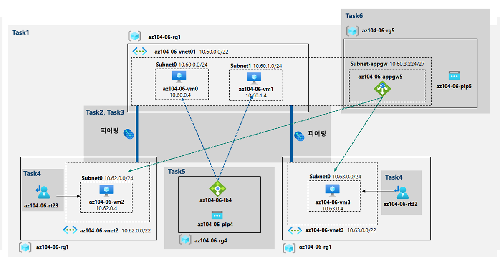

---
lab:
    title: '06 - 트래픽 관리 구현'
    module: '모듈 06 - 네트워크 트래픽 관리'
---

# 랩 06 - 트래픽 관리 구현
# 학생 랩 매뉴얼

## 랩 시나리오

(이전 랩에서 테스트한 메시 토폴로지를 만드는 대신) Contoso가 Azure 환경에서 구현하는 것을 고려하는 허브 및 스포크 네트워크 토폴로지에서 Azure 가상 머신을 대상으로 하는 네트워크 트래픽 관리를 테스트해야 합니다. 이 테스트에는 허브를 통해 트래픽이 흐르도록 하는 사용자 정의 경로에 의존하여 스포크 간의 연결을 구현하고 계층 4 및 계층 7 부하 분산 장치를 사용하여 가상 머신 전반의 트래픽 분포를 구현해야 합니다. 이 목적을 위해 Azure Load Balancer(계층 4) 및 Azure Application Gateway(계층 7)를 사용하려고 합니다.

>**참고**: 이 랩은 기본적으로 Standard_D2s_v3 SKU의 4개의 Azure VM 배포가 포함되기 때문에, 배포를 위해 선택한 지역의 Standard_Dsv3 시리즈에서 사용할 수 있는 총 8개의 vCPU가 필요합니다. 수강생이 4개의 vCPU 한도가 있는 평가판 계정을 사용하는 경우, vCPU가 하나만 필요한 VM 크기(예: Standard_B1s)를 사용할 수 있습니다.

## 목표

이 랩에서는 다음 작업을 수행합니다.

+ 작업 1: 랩 환경 프로비전
+ 작업 2: 허브 및 스포크 네트워크 토폴로지 구성
+ 작업 3: 가상 네트워크 피어링의 전이성 테스트
+ 작업 4: 허브 및 스포크 토폴로지에서 라우팅 구성
+ 작업 5: Azure Load Balancer 구현
+ 작업 6: Azure Application Gateway 구현

## 예상 시간: 60분

## 아키텍처 다이어그램




## 지침

### 연습 1:

#### 작업 1: 랩 환경 프로비전

이 작업에서는 동일한 Azure 지역에 4개의 가상 머신을 배포합니다. 처음 두 개는 허브 가상 네트워크에 상주하고 나머지 각각은 별도의 스포크 가상 네트워크에 상주합니다.

1. [Azure Portal](https://portal.azure.com)에 로그인합니다.

1. Azure Portal에서 오른쪽 상단의 아이콘을 클릭하여 **Azure Cloud Shell**을 엽니다.

1. **Bash** 또는 **PowerShell**을 선택하라는 메시지가 표시되면 **PowerShell**을 선택합니다.

    >**참고**: **Cloud Shell**을 처음 시작했는데 **탑재된 스토리지 없음**이라는 메시지가 표시되면 이 랩에서 사용하는 구독을 선택하고 **스토리지 만들기**를 클릭합니다.

1. Cloud Shell 창의 도구 모음에서 **파일 업로드/다운로드** 아이콘을 클릭하고 드롭다운 메뉴에서 **업로드**를 클릭하여 **\\Allfiles\\Labs\\06\\az104-06-vms-loop-template.json** 및 **\\Allfiles\\Labs\\06\\az104-06-vms-loop-parameters.json** 파일을 Cloud Shell 홈 디렉터리에 업로드합니다.

1. Cloud Shell 창에서 다음을 실행하여 랩 환경을 호스트할 첫 번째 리소스 그룹을 만듭니다('[Azure_region]' 자리 표시자는 Azure 가상 머신을 배포할 Azure 지역 이름으로 바꿈). "(Get-AzLocation).Location" cmdlet을 사용하면 지역 목록을 확인할 수 있습니다.

    ```powershell 
    $location = '[Azure_region]'
    ```
    이번에는 리소스 그룹 이름을 입력합니다.
    ```powershell
    $rgName = 'az104-06-rg1'
    ```
    그리고 마지막으로 원하는 위치에 리소스 그룹을 만듭니다.
    ```powershell
    New-AzResourceGroup -Name $rgName -Location $location
    ```


1. Cloud Shell 창에서 가상 네트워크를 세 개를 만들고 업로드한 템플릿 및 매개 변수 파일을 사용하여 Azure VM 네 개를 배포합니다.

   ```powershell
   New-AzResourceGroupDeployment `
      -ResourceGroupName $rgName `
      -TemplateFile $HOME/az104-06-vms-loop-template.json `
      -TemplateParameterFile $HOME/az104-06-vms-loop-parameters.json
   ```

    >**참고**: 배포가 완료될 때까지 기다렸다가 다음 단계를 진행합니다. 이 프로세스는 5분 정도 걸립니다.

1. Cloud Shell 창에서 다음을 실행하여 이전 단계에서 배포한 Azure VM에 Network Watcher 확장 프로그램을 설치합니다.

   ```powershell
   $rgName = 'az104-06-rg1'
   $location = (Get-AzResourceGroup -ResourceGroupName $rgName).location
   $vmNames = (Get-AzVM -ResourceGroupName $rgName).Name

   foreach ($vmName in $vmNames) {
     Set-AzVMExtension `
     -ResourceGroupName $rgName `
     -Location $location `
     -VMName $vmName `
     -Name 'networkWatcherAgent' `
     -Publisher 'Microsoft.Azure.NetworkWatcher' `
     -Type 'NetworkWatcherAgentWindows' `
     -TypeHandlerVersion '1.4'
   }
   ```

    >**참고**: 배포가 완료될 때까지 기다렸다가 다음 단계를 진행합니다. 이 프로세스는 5분 정도 걸립니다.

1. Cloud Shell 창을 닫습니다.

#### 작업 2: 허브 및 스포크 네트워크 토폴로지 구성

이 작업에서는 허브 및 스포크 네트워크 토폴로지를 만들기 위해 이전 작업에서 배포한 가상 네트워크 간의 로컬 피어링을 구성합니다.

1. Azure Portal에서 **가상 네트워크**를 검색하고 선택합니다.

1. 이전 작업에서 만든 가상 네트워크를 검토합니다.

    >**참고**: 세 개의 가상 네트워크 배포에 사용된 템플릿은 가상 네트워크 세 개의 IP 주소 범위가 겹치지 않도록 합니다.

1. 가상 네트워크 목록에서 **az104-06-vnet2**를 선택합니다.

1. **az104-06-vnet2** 블레이드에서 **속성**을 선택합니다. 

1. **az104-06-vnet2 \| 속성** 블레이드에서 **리소스 ID** 속성의 값을 기록합니다.

1. 가상 네트워크 목록으로 돌아가서 **az104-06-vnet3**을 선택합니다.

1. **az104-06-vnet3** 블레이드에서 **속성**을 선택합니다. 

1. **az104-06-vnet3 \| 속성** 블레이드에서 **리소스 ID** 속성의 값을 기록합니다.

    >**참고**: 이 작업의 후반부에서 두 가상 네트워크 모두에 대해 ResourceID 속성의 값이 필요합니다.

    >**참고**: 이것은 가상 네트워크 피어링을 만들 때 새로 프로비전된 가상 네트워크가 Azure Portal에서 간혹 표시되지 않는 문제를 해결하는 방법입니다.

1. 가상 네트워크 목록에서 **az104-06-vnet01**을 클릭합니다.

1. **az104-06-vnet01** 가상 네트워크 블레이드의 **설정** 섹션에서 **피어링**을 클릭한 다음 **+ 추가**를 클릭합니다.

1. 다음 설정을 사용하여 피어링을 추가하고(다른 설정은 기본값으로 유지) **추가**를 클릭합니다.

    | 설정 | 값 |
    | --- | --- |
    | 이 가상 네트워크: 피어링 링크 이름 | **az104-06-vnet01_to_az104-06-vnet2** |
    | 원격 가상 네트워크로의 트래픽 | **허용(기본값)** |
    | 원격 가상 네트워크로부터 전달된 트래픽 | **이 가상 네트워크 바깥에서 온 트래픽 차단** |
    | 가상 네트워크 게이트웨이 | **없음(기본값)** |
    | 원격 가상 네트워크: 피어링 링크 이름 | **az104-06-vnet2_to_az104-06-vnet01** |
    | 가상 네트워크 배포 모델 | **Resource Manager** |
    | 리소스 ID를 알고 있음 | 사용 |
    | 리소스 ID | 이 작업의 앞부분에서 기록한 **az104-06-vnet2**의 resourceID 매개 변수 값 |
    | 원격 가상 네트워크로의 트래픽 | **허용(기본값)** |
    | 원격 가상 네트워크로부터 전달된 트래픽 | **허용(기본값)** |
    | 가상 네트워크 게이트웨이 | **없음(기본값)** |

    >**참고**: 작업이 완료될 때까지 기다립니다.

    >**참고**: 이 단계에서 하나는 az104-06-vnet01에서 az104-06-vnet2로, 다른 하나는 az104-06-vnet2에서 az104-06-vnet01으로인 두 개의 로컬 피어링을 설정합니다.

    >**참고**: 이 랩의 후반부에서 구현할 스포크 가상 네트워크 간의 라우팅을 쉽게 하기 위해 **트래픽 전달 허용**을 사용 설정해야 합니다.

1. **az104-06-vnet01** 가상 네트워크 블레이드의 **설정** 섹션에서 **피어링**을 클릭한 다음 **+ 추가**를 클릭합니다.

1. 다음 설정을 사용하여 피어링을 추가하고(다른 설정은 기본값으로 유지) **추가**를 클릭합니다.

    | 설정 | 값 |
    | --- | --- |
    | 이 가상 네트워크: 피어링 링크 이름 | **az104-06-vnet01_to_az104-06-vnet3** |
    | 원격 가상 네트워크로의 트래픽 | **허용(기본값)** |
    | 원격 가상 네트워크로부터 전달된 트래픽 | **이 가상 네트워크 바깥에서 온 트래픽 차단** |
    | 가상 네트워크 게이트웨이 | **없음(기본값)** |
    | 원격 가상 네트워크: 피어링 링크 이름 | **az104-06-vnet3_to_az104-06-vnet01** |
    | 가상 네트워크 배포 모델 | **Resource Manager** |
    | 리소스 ID를 알고 있음 | 사용 |
    | 리소스 ID | 이 작업의 앞부분에서 기록한 **az104-06-vnet3**의 resourceID 매개 변수 값 |
    | 원격 가상 네트워크로의 트래픽 | **허용(기본값)** |
    | 원격 가상 네트워크로부터 전달된 트래픽 | **허용(기본값)** |
    | 가상 네트워크 게이트웨이 | **없음(기본값)** |

    >**참고**: 이 단계에서 하나는 az104-06-vnet01에서 az104-06-vnet3로, 다른 하나는 az104-06-vnet3에서 az104-06-vnet01으로인 두 개의 로컬 피어링을 설정합니다. 이렇게 하면 허브 및 스포크 토폴로지 설정(두 개의 스포크 가상 네트워크를 갖춘)이 완료됩니다.

    >**참고**: 이 랩의 후반부에서 구현할 스포크 가상 네트워크 간의 라우팅을 쉽게 하기 위해 **트래픽 전달 허용**을 사용 설정해야 합니다.

#### 작업 3: 가상 네트워크 피어링의 전이성 테스트

이 작업에서는 Network Watcher를 사용하여 가상 네트워크 피어링의 전이성을 테스트합니다.

1. Azure Portal에서 **Network Watcher**를 검색하고 선택합니다.

1. **Network Watcher** 블레이드에서 Azure 지역 목록을 펼치고 이 랩의 첫 번째 작업에 리소스를 배포한 Azure에서 서비스가 사용 설정되어 있는지 확인합니다.

1. **Network Watcher** 블레이드에서 **연결 문제 해결**로 이동합니다.

1. **Network Watcher - 연결 문제 해결** 블레이드에서 다음 설정을 사용하여 확인을 시작합니다(다른 설정은 기본값으로 유지).

    | 설정 | 값 |
    | --- | --- |
    | 구독 | 이 랩에서 사용 중인 Azure 구독의 이름 |
    | 리소스 그룹 | **az104-06-rg1** |
    | 원본 유형 | **가상 머신** |
    | 가상 머신 | **az104-06-vm0** |
    | 대상 | **수동으로 지정** |
    | URI, FQDN 혹은 IPv4: | **10.62.0.4** |
    | 프로토콜 | **TCP** |
    | 대상 포트 | **3389** |

    > **참고**: **10.62.0.4는**는 **az104-06-vm2**의 개인 IP 주소를 나타냅니다.

1. **확인**을 클릭하고 연결 확인 결과가 반환될 때까지 기다립니다. **연결 가능** 상태인지 확인합니다. 네트워크 경로를 검토하고 VM 간 중간 홉이 없고 대기 시간이 최소화된 직접적 연결입니다.

    > **참고**: 허브 가상 네트워크가 첫 번째 스포크 가상 네트워크로 직접 피어링하기 때문에 예상된 결과입니다.

1. **Network Watcher - 연결 문제 해결** 블레이드에서 다음 설정을 사용하여 확인을 시작합니다(다른 설정은 기본값으로 유지).

    | 설정 | 값 |
    | --- | --- |
    | 구독 | 이 랩에서 사용 중인 Azure 구독의 이름 |
    | 리소스 그룹 | **az104-06-rg1** |
    | 원본 유형 | **가상 머신** |
    | 가상 머신 | **az104-06-vm0** |
    | 대상 | **수동으로 지정** |
    | URI, FQDN 혹은 IPv4: | **10.63.0.4** |
    | 프로토콜 | **TCP** |
    | 대상 포트 | **3389** |

    > **참고**: **10.63.0.4**는 **az104-06-vm3**의 개인 IP 주소를 나타냅니다.

1. **확인**을 클릭하고 연결 확인 결과가 반환될 때까지 기다립니다. **연결 가능** 상태인지 확인합니다. 네트워크 경로를 검토하고 VM 간 중간 홉이 없고 대기 시간이 최소화된 직접적 연결입니다.

    > **참고**: 허브 가상 네트워크는 두 번째 스포크 가상 네트워크로 직접 피어링하므로 예상된 결과입니다.

1. **Network Watcher - 연결 문제 해결** 블레이드에서 다음 설정을 사용하여 확인을 시작합니다(다른 설정은 기본값으로 유지).

    | 설정 | 값 |
    | --- | --- |
    | 구독 | 이 랩에서 사용 중인 Azure 구독의 이름 |
    | 리소스 그룹 | **az104-06-rg1** |
    | 원본 유형 | **가상 머신** |
    | 가상 머신 | **az104-06-vm2** |
    | 대상 | **수동으로 지정** |
    | URI, FQDN 혹은 IPv4: | **10.63.0.4** |
    | 프로토콜 | **TCP** |
    | 대상 포트 | **3389** |

1. **확인**을 클릭하고 연결 확인 결과가 반환될 때까지 기다립니다. **연결할 수 없음** 상태입니다.

    > **참고**: 두 스포크 가상 네트워크가 서로 피어링되지 않기 때문에 예상된 결과입니다(가상 네트워크 피어링은 전이되지 않음).

#### 작업 4: 허브 및 스포크 토폴로지에서 라우팅 구성

이 작업에서는 **az104-06-vm0** 가상 머신의 네트워크 인터페이스에서 IP 전달을 활성화하여 두 개의 스포크 가상 네트워크 간 라우팅을 구성하고 테스트합니다. 이로써 운영 체제 내 라우팅을 활성화하고 스포크 가상 네트워크에서 사용자 정의 경로를 구성합니다.

1. Azure Portal에서 **가상 머신**을 검색하고 선택합니다.

1. **가상 머신** 블레이드의 가상 머신 목록에서 **az104-06-vm0**을 클릭합니다.

1. **az104-06-vm0** 가상 머신 블레이드의 **설정** 섹션에서 **네트워킹**을 클릭합니다.

1. **네트워크 인터페이스** 레이블 옆에 있는 **az104-06-nic0** 링크를 클릭한 다음 **az104-06-nic0** 네트워크 인터페이스 블레이드의 **설정** 섹션에서 **IP 구성**을 클릭합니다.

1. **IP 전달**을 **사용** 설정하고 변경 사항을 저장합니다.

   > **참고**: 이 설정은 **az104-06-vm0**이 라우터로 작동하기 위해 필요하며, 두 스포크 가상 네트워크 간의 트래픽을 라우팅합니다.

   > **참고**: 이제 라우팅을 지원하도록 **az104-06-vm0** 가상 머신의 운영 체제를 구성해야 합니다.

1. Azure Portal에서 **az104-06-vm0** Azure 가상 머신 블레이드로 돌아가서 **개요**를 클릭합니다.

1. **az104-06-vm0** 블레이드의 **작업** 섹션에서 **실행 명령**을 클릭하고 명령 목록에서 **RunPowerShellScript**를 클릭합니다.

1. **실행 명령 스크립트** 블레이드에서 다음 명령을 입력하고 **실행**을 클릭하여 원격 액세스 Windows Server 역할을 설치합니다.

   ```powershell
   Install-WindowsFeature RemoteAccess -IncludeManagementTools
   ```

   > **참고**: 명령이 성공적으로 완료되었음을 알리는 확인을 기다립니다.

1. **실행 명령 스크립트** 블레이드에서 다음 명령을 입력하고 **실행**을 클릭하여 라우팅 역할 서비스를 설치합니다.

   ```powershell
   Install-WindowsFeature -Name Routing -IncludeManagementTools -IncludeAllSubFeature

   Install-WindowsFeature -Name "RSAT-RemoteAccess-Powershell"

   Install-RemoteAccess -VpnType RoutingOnly

   Get-NetAdapter | Set-NetIPInterface -Forwarding Enabled
   ```

   > **참고**: 명령이 성공적으로 완료되었음을 알리는 확인을 기다립니다.

   > **참고**: 이제 스포크 가상 네트워크에서 사용자 정의 경로를 만들고 구성해야 합니다.

1. Azure Portal에서 **경로 테이블**을 검색하여 선택하고 **경로 테이블** 블레이드에서 **+ 만들기**를 클릭합니다.

1. 다음 설정을 사용하여 경로 테이블을 만듭니다(다른 설정은 기본값으로 유지).

    | 설정 | 값 |
    | --- | --- |
    | 구독 | 이 랩에서 사용 중인 Azure 구독의 이름 |
    | 리소스 그룹 | **az104-06-rg1** |
    | 위치 | 가상 네트워크를 만든 Azure 지역의 이름 |
    | 이름 | **az104-06-rt23** |
    | 게이트웨이 경로 전파 | **없음** |

1. **검토 후 만들기**를 클릭합니다. 유효성 검사가 완료될 때까지 기다리고 **만들기**를 클릭하여 배포를 제출합니다.

   > **참고**: 경로 테이블이 만들어질 때까지 기다립니다. 약 3분이 소요됩니다.

1. **리소스로 이동**을 클릭합니다.

1. **az104-06-rt23** 경로 테이블 블레이드의 **설정** 섹션에서 **경로**를 클릭한 다음 **+추가**를 클릭합니다.

1. 다음 설정을 사용하여 새 경로를 추가합니다.

    | 설정 | 값 |
    | --- | --- |
    | 경로 이름 | **az104-06-route-vnet2-to-vnet3** |
    | 주소 접두사 | **10.63.0.0/20** |
    | 다음 홉 유형 | **가상 어플라이언스** |
    | 다음 홉 주소 | **10.60.0.4** |

1. **확인**을 클릭합니다.

1. **az104-06-rt23** 경로 테이블 블레이드로 돌아가 **설정** 섹션에서 **서브넷**을 클릭한 다음 **+ 연결**을 클릭합니다.

1. 경로 테이블 **az104-06-rt23**를 다음 서브넷과 연결합니다.

    | 설정 | 값 |
    | --- | --- |
    | 가상 네트워크 | **az104-06-vnet2** |
    | 서브넷 | **subnet0** |

1. **확인**을 클릭합니다.

1. **경로 테이블** 블레이드로 돌아가서 **+ 만들기**를 클릭합니다.

1. 다음 설정을 사용하여 경로 테이블을 만듭니다(다른 설정은 기본값으로 유지).

    | 설정 | 값 |
    | --- | --- |
    | 구독 | 이 랩에서 사용 중인 Azure 구독의 이름 |
    | 리소스 그룹 | **az104-06-rg1** |
    | 지역 | 가상 네트워크를 만든 Azure 지역의 이름 |
    | 이름 | **az104-06-rt32** |
    | 게이트웨이 경로 전파 | **없음** |

1. 검토 후 만들기를 클릭합니다. 유효성 검사가 완료될 때까지 기다리고 만들기를 클릭하여 배포를 제출합니다.

   > **참고**: 경로 테이블이 만들어질 때까지 기다립니다. 약 3분이 소요됩니다.

1. **리소스로 이동**을 클릭합니다.

1. **az104-06-rt32** 경로 테이블 블레이드의 **설정** 섹션에서 **경로**를 클릭한 다음 **+추가**를 클릭합니다.

1. 다음 설정을 사용하여 새 경로를 추가합니다.

    | 설정 | 값 |
    | --- | --- |
    | 경로 이름 | **az104-06-route-vnet3-to-vnet2** |
    | 주소 접두사 | **10.62.0.0/20** |
    | 다음 홉 유형 | **가상 어플라이언스** |
    | 다음 홉 주소 | **10.60.0.4** |

1. **확인**을 클릭합니다.

1. **az104-06-rt32** 경로 테이블 블레이드로 돌아가 **설정** 섹션에서 **서브넷**을 클릭한 다음 **+ 연결**을 클릭합니다.

1. 경로 테이블 **az104-06-rt32**를 다음 서브넷과 연결합니다.

    | 설정 | 값 |
    | --- | --- |
    | 가상 네트워크 | **az104-06-vnet3** |
    | 서브넷 | **subnet0** |

1. **확인**을 클릭합니다.

1. Azure Portal에서 **Network Watcher - 연결 문제해결** 블레이드로 이동합니다.

1. **Network Watcher - 연결 문제 해결** 블레이드에서 다음 설정을 사용하여 확인을 시작합니다(다른 설정은 기본값으로 유지).

    | 설정 | 값 |
    | --- | --- |
    | 구독 | 이 랩에서 사용 중인 Azure 구독의 이름 |
    | 리소스 그룹 | **az104-06-rg1** |
    | 원본 유형 | **가상 머신** |
    | 가상 머신 | **az104-06-vm2** |
    | 대상 | **수동으로 지정** |
    | URI, FQDN 혹은 IPv4: | **10.63.0.4** |
    | 프로토콜 | **TCP** |
    | 대상 포트 | **3389** |

1. **확인**을 클릭하고 연결 확인 결과가 반환될 때까지 기다립니다. **연결 가능** 상태인지 확인합니다. 네트워크 경로를 검토하고 트래픽이 **10.60.0.4**를 통해 라우팅되고 **az104-06-nic0** 네트워크 어댑터에 할당되어있습니다. 상태가 **연결할 수 없음**이면 az104-06-vm0을 다시 시작해야 합니다.

    > **참고**: 스포크 가상 네트워크 간의 트래픽이 라우터로 작동하는 허브 가상 네트워크에 있는 가상 머신을 통해 라우팅되므로 예상된 결과입니다.

    > **참고**: **Network Watcher**를 사용하여 네트워크의 토폴로지를 볼 수 있습니다.

#### 작업 5: Azure Load Balancer 구현

이 작업에서는 허브 가상 네트워크의 두 Azure 가상 머신 앞에 Azure Load Balancer를 구현합니다.

1. Azure Portal에서 **부하 분산 장치**를 검색하여 선택한 다음 **부하 분산 장치** 블레이드에서 **+ 만들기**를 클릭합니다.

1. 다음 설정을 사용하여 부하 분산 장치를 만들고(다른 설정은 기본값으로 유지) **다음: 프런트 엔드 IP 구성**을 클릭합니다.

    | 설정 | 값 |
    | --- | --- |
    | 구독 | 이 랩에서 사용 중인 Azure 구독의 이름 |
    | 리소스 그룹 | **az104-06-rg1** |
    | 이름 | **az104-06-lb4** |
    | 지역| 이 랩에서 다른 모든 리소스를 배포한 Azure 지역의 이름 |
    | SKU | **표준** |
    | 유형 | **공용** |
    
1. **프런트 엔드 IP 구성** 탭에서 **프런트 엔드 IP 구성 추가**를 클릭하고 다음 설정을 지정한 후에 **추가**를 클릭합니다.   
     
    | 설정 | 값 |
    | --- | --- |
    | 이름 | 모든 고유 이름 |
    | 공용 IP 주소 | **새로 만들기** |
    | 공용 IP 주소 이름 | **az104-06-pip4** |
    | 가용성 영역 | **영역 없음** |
    | 공용 IPv6 주소 추가 | **없음** |

1. **검토 후 만들기**를 클릭합니다. 유효성 검사가 완료될 때까지 기다리고 **만들기**를 클릭하여 배포를 제출합니다.

    > **참고**: Azure 부하 분산 장치가 프로비전될 때까지 기다립니다. 약 2분이 소요됩니다.

1. 배포 블레이드에서 **리소스로 이동**을 클릭합니다.

1. **az104-06-lb4** 부하 분산 장치 블레이드의 **설정** 섹션에서 **백 엔드 풀**을 클릭한 다음 **+추가**를 클릭합니다.

1. 다음 설정을 사용하여 백 엔드 풀을 추가합니다(다른 설정은 기본값으로 유지).

    | 설정 | 값 |
    | --- | --- |
    | 이름 | **az104-06-lb4-be1** |
    | 가상 네트워크 | **az104-06-vnet01** |
    | IP 버전 | **IPv4** |
    | 가상 머신 | **az104-06-vm0** |
    | 가상 머신 IP 주소 | **ipconfig1 (10.60.0.4)** |
    | 가상 머신 | **az104-06-vm1** |
    | 가상 머신 IP 주소 | **ipconfig1 (10.60.1.4)** |

1. **추가**를 클릭합니다.

1. 백 엔드 풀이 생성되면 **설정** 섹션에서 **상태 프로브**를 클릭한 다음 **+ 추가**를 클릭합니다.

1. 다음 설정을 사용하여 상태 프로브를 추가합니다.

    | 설정 | 값 |
    | --- | --- |
    | 이름 | **az104-06-lb4-hp1** |
    | 프로토콜 | **TCP** |
    | 포트 | **80** |
    | 간격 | **5** |
    | 비정상 임계값 | **2** |

1. **추가**를 클릭합니다.

1. 상태 프로브가 만들어질 때까지 기다렸다가 설정 섹션에서 **부하 분산 규칙**을 클릭한 다음 **+ 추가**를 클릭합니다.

1. 다음 설정을 사용하여 부하 분산 규칙을 추가합니다(다른 설정은 기본값으로 유지).

    | 설정 | 값 |
    | --- | --- |
    | 이름 | **az104-06-lb4-lbrule1** |
    | IP 버전 | **IPv4** |
    | 프런트 엔드 IP 주소 | **드롭다운 목록에서 LoadBalancerFrontEnd 선택**
    | 프로토콜 | **TCP** |
    | 포트 | **80** |
    | 백 엔드 포트 | **80** |
    | 백 엔드 풀 | **az104-06-lb4-be1** |
    | 상태 프로브 | **az104-06-lb4-hp1** |
    | 세션 지속성 | **없음** |
    | 유휴 시간 초과(분) | **4** |
    | TCP 재설정 | **사용 안 함** |
    | 부동 IP(Direct Server Return) | **사용 안 함** |

1. **추가**를 클릭합니다.

1. 부하 분산 규칙이 만들어질 때까지 기다린 다음, **설정** 섹션에서 **프런트 엔드 IP 구성**을 클릭하고 **공용 IP 주소**의 값을 기록합니다.

1. 다른 브라우저 창을 시작하고 이전 단계에서 식별한 IP 주소로 이동합니다.

1. 브라우저 창에 **az104-06-vm0의 Hello World** 또는 **az104-06-vm1의 Hello World** 메시지가 표시되는지 확인합니다.

1. 다른 브라우저 창을 열어서 이번에는 InPrivate 모드를 사용하여 대상 VM이 메시지에 표시된 대로 변경되는지 확인합니다.

    > **참고**: 브라우저 창을 새로 고치거나 InPrivate 모드를 사용하여 다시 열어야 할 수도 있습니다.

#### 작업 6: Azure Application Gateway 구현

이 작업에서는 스포크 가상 네트워크의 두 Azure 가상 머신 앞에 Azure Application Gateway를 구현합니다.

1. Azure Portal에서 **가상 네트워크**를 검색하여 선택합니다.

1. **가상 네트워크** 블레이드의 가상 네트워크 목록에서 **az104-06-vnet01**을 클릭합니다.

1. **az104-06-vnet01** 가상 네트워크 블레이드의 **설정** 섹션에서 **서브넷**을 클릭한 다음 **+ 서브넷**을 클릭합니다.

1. 다음 설정을 사용하여 서브넷을 추가합니다(다른 설정은 기본값으로 유지).

    | 설정 | 값 |
    | --- | --- |
    | 이름 | **subnet-appgw** |
    | 서브넷 주소 범위 | **10.60.3.224/27** |

1. **저장**을 클릭합니다.

    > **참고**: 이 서브넷은 Azure Application Gateway 인스턴스에서 사용되며 이 작업의 후반부에서 배포합니다. Application Gateway에는 27 또는 그 이상 크기의 전용 서브넷이 필요합니다.

1. Azure Portal에서 **Application Gateway**를 검색하여 선택하고 **Application Gateway** 블레이드에서 **+ 만들기**를 클릭합니다.

1. **Application Gateway 만들기** 블레이드의 **기본** 탭에서 다음 설정을 지정합니다(다른 설정은 기본값으로 유지).

    | 설정 | 값 |
    | --- | --- |
    | 구독 | 이 랩에서 사용 중인 Azure 구독의 이름 |
    | 리소스 그룹 | **az104-06-rg1** |
    | 애플리케이션 게이트웨이 이름 | **az104-06-appgw5** |
    | 지역 | 이 랩에서 다른 모든 리소스를 배포한 Azure 지역의 이름 |
    | 계층 | **표준 V2** |
    | 자동 크기 조정 사용 | **없음** |
    | HTTP2 | **사용 안 함** |
    | 가상 네트워크 | **az104-06-vnet01** |
    | 서브넷 | **subnet-appgw** |

1. **다음: 프런트 엔드 >** 를 클릭하고 **애플리케이션 게이트웨이 만들기** 블레이드의 **프런트 엔드** 탭에서 **새로 추가**를 클릭하고 다음 설정을 지정합니다(다른 설정은 기본값으로 유지).

    | 설정 | 값 |
    | --- | --- |
    | 프런트 엔드 IP 주소 유형 | **공용** |
    | 공용 IP 주소| 새 공용 IP 주소 **az104-06-pip5**의 이름 |

1. **다음: 백 엔드 >** 를 차례로 클릭하고 **애플리케이션 게이트웨이 만들기** 블레이드의 **백 엔드** 탭에서 **+ 백 엔드 풀 추가**를 클릭하고 **백 엔드 풀 추가** 블레이드에서 다음 설정을 지정합니다(다른 설정은 기본값으로 유지).

    | 설정 | 값 |
    | --- | --- |
    | 이름 | **az104-06-appgw5-be1** |
    | 대상 없이 백 엔드 풀 추가 | **없음** |
    | 대상 유형 | **IP 주소 또는 FQDN** |
    | 대상 | **10.62.0.4** |
    | 대상 유형 | **IP 주소 또는 FQDN** |
    | 대상 | **10.63.0.4** |

    > **참고**: 대상은 스포크 가상 네트워크 **az104-06-vm2** 및 **az104-06-vm3**에서 가상 머신의 개인 IP 주소를 나타냅니다.

1. **추가**, **다음: 구성 >** 을 차례로 클릭하고 **애플리케이션 게이트웨이 만들기** 블레이드의 **구성** 탭에서 **+ 라우팅 규칙 추가**를 클릭합니다.

1. **라우팅 규칙 추가** 블레이드의 **수신기** 탭에서 다음 설정을 지정합니다.

    | 설정 | 값 |
    | --- | --- |
    | 규칙 이름 | **az104-06-appgw5-rl1** |
    | 수신기 이름 | **az104-06-appgw5-rl1l1** |
    | 프런트 엔드 IP | **공용** |
    | 프로토콜 | **HTTP** |
    | 포트 | **80** |
    | 수신기 유형 | **기본** |
    | 오류 페이지 URL | **없음** |

1. **라우팅 규칙 추가** 블레이드의**백 엔드 대상** 탭으로 전환하고 다음 설정을 지정합니다(다른 설정은 기본값으로 유지).

    | 설정 | 값 |
    | --- | --- |
    | 대상 유형 | **백 엔드 풀** |
    | 백 엔드 대상 | **az104-06-appgw5-be1** |

1. **HTTP 설정** 텍스트 상자 아래의 **새로 추가**를 클릭하고 **HTTP 설정 추가** 블레이드에서 다음 설정을 지정합니다(다른 설정은 기본값으로 유지).

    | 설정 | 값 |
    | --- | --- |
    | HTTP 설정 이름 | **az104-06-appgw5-http1** |
    | 백 엔드 프로토콜 | **HTTP** |
    | 백 엔드 포트 | **80** |
    | 쿠키 기반 선호도 | **사용 안 함** |
    | 연결 드레이닝 | **사용 안 함** |
    | 요청 시간 초과(초) | **20** |

1. **HTTP 설정 추가** 블레이드에서 **추가**를 클릭하고 **라우팅 규칙 추가** 블레이드로 돌아와서 **추가**를 클릭합니다.

1. **다음: 태그 >** 뒤의  **다음: 검토 + 만들기>** 를 차례로 클릭한 후에 **만들기**를 클릭합니다.

    > **참고**: Application Gateway 인스턴스가 만들어질 때까지 기다리세요. 완료되려면 약 8분이 소요됩니다.

1. Azure Portal에서 **Application Gateway**를 선택한 후 **Application Gateway** 블레이드에서 **az104-06-appgw5**를 클릭합니다.

1. **az104-06-appgw5** Application Gateway 블레이드에서 **프런트 엔드 공용 IP 주소**의 값을 기록하세요.

1. 다른 브라우저 창을 시작하고 이전 단계에서 식별한 IP 주소로 이동합니다.

1. 브라우저 창에 **az104-06-vm2의 Hello World** 또는 **az104-06-vm3의 Hello World** 메시지가 표시되는지 확인합니다.

1. 다른 브라우저 창을 열어 이번에는 InPrivate 모드를 사용하여 대상 VM이 웹 페이지에 표시된 메시지대로 변경되는지 확인합니다.

    > **참고**: 브라우저 창을 새로 고치거나 InPrivate 모드를 사용하여 다시 열어야 할 수도 있습니다.

    > **참고**: 여러 가상 네트워크에서 가상 머신을 대상으로 하는 것은 일반적인 구성은 아닙니다. 그러나 Application Gateway가 동일한 가상 네트워크의 가상 머신 간 부하를 분산하는 Azure Load Balancer와는 달리 여러 가상 네트워크(및 다른 Azure 지역 혹은 심지어 Azure 외부의 엔드포인트)에서 가상 머신을 대상으로 할 수 있다는 점을 설명하기 위한 것입니다.

#### 리소스 정리

   >**참고**: 더 이상 사용하지 않는 새로 만든 Azure 리소스를 제거해야 합니다. 사용하지 않는 리소스를 제거하면 예상하지 못한 비용이 발생하지 않습니다.

1. Azure Portal에서 **Cloud Shell** 창의 **PowerShell** 세션을 엽니다.

1. 다음 명령을 실행하여 이 모듈의 전체 랩에서 생성된 모든 리소스 그룹을 나열합니다.

   ```powershell
   Get-AzResourceGroup -Name 'az104-06*'
   ```

1. 다음 명령을 실행하여 이 모듈의 전체 랩에서 만든 모든 리소스 그룹을 삭제합니다.

   ```powershell
   Get-AzResourceGroup -Name 'az104-06*' | Remove-AzResourceGroup -Force -AsJob
   ```

    >**참고**: 명령은 비동기적으로 실행되므로(-AsJob 매개 변수에 의해 결정됨) 동일한 PowerShell 세션 내에서 즉시 다른 PowerShell 명령을 실행할 수 있지만 리소스 그룹이 실제로 제거되기까지 몇 분 정도 걸릴 것입니다.

#### 복습

이 랩에서는 다음 작업을 수행했습니다.

+ 랩 환경 프로비전
+ 허브 및 스포크 네트워크 토폴로지 구성
+ 가상 네트워크 피어링의 전이성 테스트
+ 작업 4: 허브 및 스포크 토폴로지에서 라우팅 구성
+ 작업 5: Azure Load Balancer 구현
+ 작업 6: Azure Application Gateway 구현
