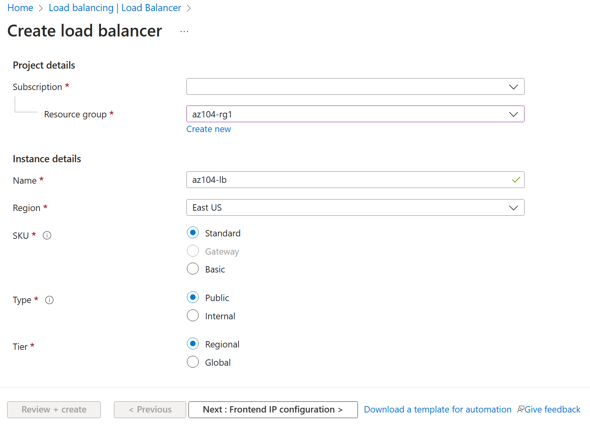

---
lab:
  title: '랩 06: 트래픽 관리 구현'
  module: Administer Network Traffic Management
---

# 랩 06 - 트래픽 관리 구현

## 랩 소개

이 랩에서는 공용 Load Balancer 및 Application Gateway를 구성하고 테스트하는 방법을 알아봅니다.

이 랩을 수행하려면 Azure 구독이 필요합니다. 구독 유형은 이 랩의 기능 가용성에 영향을 미칠 수 있습니다. 지역을 변경할 수 있지만 단계는 **미국 동부**를 사용하여 작성됩니다.

## 예상 소요 시간: 50분

## 랩 시나리오

사용자의 조직에는 공용 웹 사이트가 있습니다. 여러 가상 머신에 걸쳐 들어오는 공용 요청의 부하를 분산해야 합니다. 또한 다양한 가상 머신의 이미지와 동영상을 제공해야 합니다. Azure Load Balancer 및 Azure Application Gateway를 구현할 계획입니다. 모든 리소스는 동일한 지역에 있습니다.

## 대화형 랩 시뮬레이션

이 항목에 유용할 수 있는 대화형 랩 시뮬레이션이 있습니다. 시뮬레이션을 통해 고유의 속도에 맞춰 유사한 시나리오를 클릭할 수 있습니다. 대화형 시뮬레이션과 이 랩에는 차이점이 있지만 핵심 개념은 대부분 동일합니다. Azure 구독은 필요하지 않습니다.

+ [Azure Load Balancer를 만들고 구성](https://mslabs.cloudguides.com/guides/AZ-700%20Lab%20Simulation%20-%20Create%20and%20configure%20an%20Azure%20load%20balancer). 가상 네트워크, 백 엔드 서버, 부하 분산 장치를 만든 다음 부하 분산 장치를 테스트합니다.
+ [Azure Application Gateway 배포](https://mslabs.cloudguides.com/guides/AZ-700%20Lab%20Simulation%20-%20Deploy%20Azure%20Application%20Gateway). 애플리케이션 게이트웨이를 만들고, 가상 머신을 만들고, 백 엔드 풀을 만들고, 게이트웨이를 테스트합니다.
+ [트래픽 관리 구현](https://mslabs.cloudguides.com/guides/AZ-104%20Exam%20Guide%20-%20Microsoft%20Azure%20Administrator%20Exercise%2010). 가상 머신, 가상 네트워크, 피어링, 부하 분산 장치 및 애플리케이션 게이트웨이를 포함한 완전한 허브 및 스포크 네트워크를 구현합니다.

## 작업 기술

+ 작업 1: 템플릿을 사용하여 인프라를 프로비전합니다.
+ 작업 2: Azure Load Balancer 구성
+ 작업 3: Azure Application Gateway 구성

## 작업 1: 템플릿을 사용하여 인프라 프로비전

이 작업에서는 템플릿을 사용하여 가상 네트워크 1개, 네트워크 보안 그룹 1개 및 가상 머신 2개를 배포합니다.

1. **\\Allfiles\\Lab06** 랩 파일(템플릿 및 매개 변수)을 다운로드합니다.

1. **Azure Portal** - `https://portal.azure.com`에 로그인합니다.

1. `Deploy a custom template`을 검색하고 선택합니다.

1. 사용자 지정 배포 페이지에서 **편집기에서 사용자 고유의 템플릿 빌드**를 선택합니다.

1. 템플릿 편집 페이지에서 **파일 로드**를 선택합니다.

1. **\\Allfiles\\Lab06\\az104-06-vms-template.json** 파일을 찾아 선택하고 **열기**를 선택합니다.

1. **저장**을 선택합니다.

1. **매개 변수 편집**을 선택하고 **\\Allfiles\\Lab06\\az104-06-vms-parameters.json** 파일을 로드합니다.

1. **저장**을 선택합니다.

1. 다음 정보를 사용하여 사용자 지정 배포 페이지의 필드를 완료하고 다른 모든 필드는 기본값으로 둡니다.

    | 설정       | 값         |
    | ---           | ---           |
    | Subscription  | Azure 구독 |
    | Resource group | `az104-rg6`(필요한 경우 **새로 만들기** 선택) |
    | 암호      | 보안 암호 제공 |

    >**참고**: VM 크기를 사용할 수 없다는 오류가 표시되면 구독에서 사용할 수 있고 코어가 2개 이상인 SKU를 선택합니다.

1. **검토 + 생성**를 선택한 다음, **생성**를 선택합니다.

    >**참고**: 다음 작업으로 이동하기 전에 배포가 완료될 때까지 기다립니다. 배포에는 약 5분이 소요됩니다.

    >**참고**: 배포 중인 리소스를 검토합니다. 3개의 서브넷이 있는 하나의 가상 네트워크가 있습니다. 각 서브넷에는 가상 머신이 있습니다.

## 작업 2: Azure Load Balancer 구성

이 작업에서는 가상 네트워크의 두 Azure Virtual Machines 앞에 Azure 부하 분산 장치를 구현합니다. Azure의 Load Balancer는 가상 머신과 같은 리소스 전반에 걸쳐 계층 4 연결을 제공합니다. Load Balancer 구성에는 연결을 허용하는 프런트 엔드 IP 주소, 백 엔드 풀, 연결이 부하 분산 장치를 트래버스하는 방법을 정의하는 규칙이 포함됩니다.

## 아키텍처 다이어그램 - Load Balancer

>**참고**: Load Balancer는 동일한 가상 네트워크에 있는 두 개의 가상 머신에 분산되어 있습니다.

1. Azure Portal에서 `Load balancers`를 검색하여 선택하고 **부하 분산 장치** 블레이드에서 **+ 만들기**를 클릭합니다.

1. 다음 설정을 사용하여 부하 분산 장치를 만든 다음(다른 설정은 기본값으로 유지), **다음: 프런트 엔드 IP 구성**을 클릭합니다.

    | 설정 | 값 |
    | --- | --- |
    | Subscription | Azure 구독 |
    | Resource group | **az104-rg6** |
    | 이름 | `az104-lb` |
    | 지역 | VM을 배포한 **동일한** 지역 |
    | SKU  | **표준** |
    | Type | **공용** |
    | 서비스 계층 | **Regional** |

     

1. **프런트 엔드 IP 구성** 탭에서 **프런트 엔드 IP 구성 추가**를 클릭하고 다음 설정을 사용합니다.  

    | 설정 | 값 |
    | --- | --- |
    | 속성 | `az104-fe` |
    | IP 유형 | IP 주소 |
    | 게이트웨이 부하 분산 장치 | 없음 |
    | 공용 IP 주소 | **새로 만들기**를 선택합니다(다음 단계의 지침을 따릅니다). |

1. **공용 IP 주소 추가** 팝업에서 **확인**을 클릭한 다음 **추가**를 클릭하여 다음 설정을 사용합니다. 완료되면 **다음: 백 엔드 풀**을 클릭합니다.

    | 설정 | 값 |
    | --- | --- |
    | 속성 | `az104-lbpip` |
    | SKU | 표준 |
    | 서비스 계층 | 지역 |
    | 할당 | 정적 |
    | 라우팅 기본 설정 | **Microsoft 네트워크** |

    >**참고:** 표준 SKU는 고정 IP 주소를 제공합니다. 고정 IP 주소는 리소스가 만들어질 때 할당되고, 리소스가 삭제되면 해제됩니다.  

1. **백 엔드 풀** 탭에서 **백 엔드 풀 추가**를 클릭합니다(다른 설정은 기본값으로 유지). **+ 추가**(두 번)를 클릭한 후 **다음: 인바운드 규칙**을 클릭합니다.

    | 설정 | 값 |
    | --- | --- |
    | 속성 | `az104-be` |
    | 가상 네트워크 | **az104-06-vnet1** |
    | 백 엔드 풀 구성 | **NIC** |
    | **추가**를 클릭하여 가상 머신을 추가합니다. |  |
    | az104-06-vm0 | **확인란 선택** |
    | az104-06-vm1 | **확인란 선택** |

1. 시간이 있으므로 다른 탭을 검토한 다음 **검토 + 만들기**를 클릭합니다. 유효성 검사 오류가 없는지 확인하고 **만들기**를 클릭합니다.

1. 부하 분산 장치가 배포되기를 기다린 다음 **리소스로 이동**을 클릭합니다.

**수신 트래픽이 분산되는 방식을 결정하는 규칙을 추가합니다.**

1. **설정** 블레이드에서 **부하 분산 규칙**을 선택합니다.

1. **+ 추가**를 선택합니다. 다음 설정을 사용하여 부하 분산 규칙을 추가합니다(다른 설정은 기본값으로 유지).  규칙을 구성할 때 정보 아이콘을 사용하여 각 설정에 대해 알아봅니다. 완료되면 **저장**을 클릭합니다.

    | 설정 | 값 |
    | --- | --- |
    | 속성 | `az104-lbrule` |
    | IP 버전 | **IPv4** |
    | 프런트 엔드 IP 주소 | **az104-fe** |
    | 백 엔드 풀 | **az 104-b** |
    | 프로토콜 | **TCP** |
    | 포트 | `80` |
    | 백 엔드 포트 | `80` |
    | 상태 프로브 | **새로 만들기** |
    | 이름 | `az104-hp` |
    | 프로토콜 | **TCP** |
    | 포트 | `80` |
    | Interval | `5` |
    | 상태 프로브 만들기 창 닫기 | **저장** |
    | 세션 지속성 | **없음** |
    | 유휴 제한 시간(분) | `4` |
    | TCP 재설정 | **사용 안 함** |
    | 부동 IP | **사용 안 함** |
    | 아웃바운드 SNAT(Source Network Address Translation) | **권장** |

1. Load Balancer 페이지에서 **프런트 엔드 IP 구성**을 선택합니다. 공용 IP 주소를 복사합니다.

1. 다른 브라우저 탭을 열고 IP 주소로 이동합니다. 브라우저 창에 **az104-06-vm0의 Hello World** 또는 **az104-06-vm1의 Hello World** 메시지가 표시되는지 확인합니다.

1. 창을 새로 고쳐 메시지가 다른 가상 머신으로 변경되었는지 확인합니다. 이는 가상 머신을 통해 회전하는 부하 분산 장치를 나타냅니다.

    > **참고**: InPrivate 모드에서 브라우저 창을 두 번 이상 새로 고치거나 새로 열어야 할 수 있습니다.

## 작업 3: Azure Application Gateway 구성

이 작업에서는 두 개의 Azure Virtual Machines 앞에 Azure Application Gateway를 구현합니다. Application Gateway는 백 엔드 풀에 정의된 리소스에 계층 7 부하 분산, WAF(Web Application Firewall), SSL 종료 및 엔드투엔드 암호화를 제공합니다. Application Gateway는 이미지를 하나의 가상 머신으로 라우팅하고 동영상을 다른 가상 머신으로 라우팅합니다.

## 아키텍처 다이어그램 - Application Gateway

>**참고**: 이 Application Gateway는 Load Balancer와 동일한 가상 네트워크에서 작동합니다. 이는 프로덕션 환경에서는 일반적이지 않을 수 있습니다.

1. Azure Portal에서 `Virtual networks`를 검색하고 선택합니다.

1. **가상 네트워크** 블레이드의 가상 네트워크 목록에서 **az104-06-vnet1**을 클릭합니다.

1. **az104-06-vnet1** 가상 네트워크 블레이드의 **설정** 섹션에서 **서브넷**을 클릭한 다음 **+ 서브넷**을 클릭합니다.

1. 다음 설정을 사용하여 서브넷을 추가합니다(다른 설정은 기본값으로 유지).

    | 설정 | 값 |
    | --- | --- |
    | 속성 | `subnet-appgw` |
    | 서브넷 주소 범위 | `10.60.3.224/27` |

1. 페이지 맨 아래에 있는 **저장**

    > **참고**: 이 서브넷은 Azure Application Gateway에서 사용됩니다. Application Gateway에는 27 또는 그 이상 크기의 전용 서브넷이 필요합니다.

1. Azure Portal에서 `Application gateways`를 검색하여 선택하고 **Application Gateways** 블레이드에서 **+ 만들기**를 클릭합니다.

1. **기본 사항** 탭에서 다음 설정을 지정합니다(다른 설정은 기본값으로 유지).

    | 설정 | 값 |
    | --- | --- |
    | Subscription | Azure 구독 |
    | Resource group | `az104-rg6` |
    | Application Gateway 이름 | `az104-appgw` |
    | 지역 | 작업 1에서 사용한 **동일한** Azure 지역 |
    | 서비스 계층 | **표준 V2** |
    | 자동 크기 조정 사용 | **문제** |
    | 최소 인스턴스 수 | `2` |
    | 가용성 영역 | **영역 1** |
    | HTTP2 | **사용 안 함** |
    | 가상 네트워크 | **az104-06-vnet1** |
    | 서브넷 | **subnet-appgw (10.60.3.224/27)** |

    

1. **다음: 프런트 엔드 >** 를 클릭하고 다음 설정을 지정합니다(다른 설정은 기본값으로 유지). 완료한 경우 **확인**을 클릭합니다.

    | 설정 | 값 |
    | --- | --- |
    | 프런트 엔드 IP 주소 유형 | **공용** |
    | 공용 IP 주소| **새로 추가** |
    | 이름 | `az104-gwpip` |
    | 가용성 영역 | **없음** |

    >**참고:** Application Gateway에는 공용 IP 주소와 개인 IP 주소가 모두 있을 수 있습니다.
 
1. **다음: 백 엔드 >** 를 클릭한 다음 **백 엔드 풀 추가**를 클릭합니다. 다음 설정을 지정합니다(다른 설정은 기본값으로 유지). 완료되면 **추가**를 클릭합니다.

    | 설정 | 값 |
    | --- | --- |
    | 속성 | `az104-appgwbe` |
    | 대상 없이 백 엔드 풀 추가 | **문제** |
    | 가상 머신 | **az104-rg6-nic1(10.60.1.4)** |
    | 가상 머신 | **az104-rg6-nic2(10.60.2.4)** |

1. **백 엔드 풀 추가**를 클릭합니다. 이는 **이미지**에 대한 백 엔드 풀입니다. 다음 설정을 지정합니다(다른 설정은 기본값으로 유지). 완료되면 **추가**를 클릭합니다.

    | 설정 | 값 |
    | --- | --- |
    | 속성 | `az104-imagebe` |
    | 대상 없이 백 엔드 풀 추가 | **문제** |
    | 가상 머신 | **az104-rg6-nic1(10.60.1.4)** |

1. **백 엔드 풀 추가**를 클릭합니다. 이는 **동영상**용 백 엔드 풀입니다. 다음 설정을 지정합니다(다른 설정은 기본값으로 유지). 완료되면 **추가**를 클릭합니다.

    | 설정 | 값 |
    | --- | --- |
    | 속성 | `az104-videobe` |
    | 대상 없이 백 엔드 풀 추가 | **문제** |
    | 가상 머신 | **az104-rg6-nic2(10.60.2.4)** |

1. **다음: 구성 >** 을 클릭한 다음 **라우팅 규칙을 추가**합니다. 정보를 완료합니다.

    | 설정 | 값 |
    | --- | --- |
    | 규칙 이름 | `az104-gwrule` |
    | 우선 순위 | `10` |
    | 수신기 이름 | `az104-listener` |
    | 프런트 엔드 IP | **Public IPv4** |
    | 프로토콜 | **HTTP** |
    | 포트 | `80` |
    | 수신기 유형 | **기본** |

1. **백 엔드 대상** 탭으로 이동합니다. 기본 정보를 입력한 후 **추가**를 선택합니다.

   | 설정 | 값 |
    | --- | --- |
    | 백 엔드 대상 | `az104-appgwbe` |
    | 백 엔드 설정 | `az104-http` (새로 만들기) |

   >**참고:** **쿠키 기반 유사성** 및 **연결 드레이닝**에 대한 정보를 참조하세요.

1. **경로 기반 라우팅** 섹션에서 **여러 대상을 추가하여 경로 기반 규칙 만들기**를 선택합니다. 두 가지 규칙을 만듭니다. 첫 번째 규칙 다음에 **추가**를 클릭하고 두 번째 규칙 다음에 **추가**를 클릭합니다. 

    **규칙 - 이미지 백 엔드로 라우팅**

    | 설정 | 값 |
    | --- | --- |
    | Path | `/image/*` |
    | 대상 이름 | `images` |
    | 백 엔드 설정 | **az104-http** |
    | 백 엔드 대상 | `az104-imagebe` |

    **규칙 - 동영상 백 엔드로 라우팅**

    | 설정 | 값 |
    | --- | --- |
    | Path | `/video/*` |
    | 대상 이름 | `videos` |
    | 백 엔드 설정 | **az104-http** |
    | 백 엔드 대상 | `az104-videobe` |

1. 변경 내용을 **저장**하고 확인한 후 **다음: 태그 >** 를 선택할 수 있습니다. 변경할 필요는 없습니다.

1. **다음: 검토 + 만들기>** 를 차례로 클릭한 후에 **만들기**를 클릭합니다.

    > **참고**: Application Gateway 인스턴스가 만들어질 때까지 기다리세요. 약 5~10분이 소요됩니다. 기다리는 동안 이 페이지 끝에 있는 자습형 학습 링크 중 일부를 검토해 보세요.

1. 애플리케이션 게이트웨이가 배포된 후 **az104-appgw**를 검색하여 선택합니다.

1. **Application Gateway** 리소스의 **모니터링** 섹션에서 **백 엔드 상태**를 선택합니다.

1. 백 엔드 풀의 두 서버 모두 **정상**으로 표시되는지 확인합니다.

1. **개요** 블레이드에서 **프런트 엔드 공용 IP 주소** 값을 복사합니다.

1. 다른 브라우저 창을 시작하고 이 URL(`http://<frontend ip address>/image/`)을 테스트합니다.

1. 이미지 서버(vm1)로 이동되었는지 확인합니다.

1. 다른 브라우저 창을 시작하고 이 URL(`http://<frontend ip address>/video/`)을 테스트합니다.

1. 동영상 서버(vm2)로 이동되었는지 확인합니다.

> **참고**: InPrivate 모드에서 브라우저 창을 두 번 이상 새로 고치거나 새로 열어야 할 수 있습니다.

## 리소스 정리

**고유의 구독**으로 작업하는 경우 랩 리소스를 삭제해 보세요. 이렇게 하면 리소스가 확보되고 비용이 최소화됩니다. 랩 리소스를 삭제하려면 랩 리소스 그룹을 삭제하는 것이 가장 쉽습니다. 

+ Azure Portal에서 리소스 그룹을 선택하고 **리소스 그룹 삭제**, **리소스 그룹 이름 입력**을 선택한 다음 **삭제**를 클릭합니다.
+ Azure PowerShell 사용, `Remove-AzResourceGroup -Name resourceGroupName`.
+ CLI 사용, `az group delete --name resourceGroupName`.
  
## 핵심 내용

축하합니다. 랩을 완료했습니다. 이 랩의 주요 내용은 다음과 같습니다.

+ Azure Load Balancer는 전송 계층(OSI 계층 4 - TCP 및 UDP)에서 여러 가상 머신에 네트워크 트래픽을 분산하는 데 탁월한 선택입니다.
+ 공용 Load Balancer는 인터넷 트래픽 부하를 VM에 분산하는 데 사용됩니다. 내부(또는 개인) 부하 분산 장치는 프라이빗 IP가 프런트 엔드에서만 필요한 경우에 사용됩니다.
+ 기본 부하 분산 장치는 고가용성이나 중복성이 필요하지 않은 소규모 애플리케이션을 위해 사용합니다. 표준 Load Balancer는 고성능 및 매우 짧은 대기 시간을 위해 사용합니다.
+ Azure Application Gateway는 웹 애플리케이션 트래픽을 관리할 수 있는 웹 트래픽(OSI 계층 7) 부하 분산 장치입니다.
+ Application Gateway 표준 계층은 부하 분산을 포함한 모든 L7 기능을 제공하며, WAF 계층은 악성 트래픽을 확인하기 위해 방화벽을 추가합니다.
+ Application Gateway가 URI 경로 또는 호스트 헤더와 같은 HTTP 요청의 추가 특성에 따라 라우팅 결정을 내릴 수 있습니다.

## 자기 주도적 학습을 통해 자세히 알아보기

+ [Azure Load Balancer를 사용하여 애플리케이션 확장성 및 복원력을 개선합니다](https://learn.microsoft.com/training/modules/improve-app-scalability-resiliency-with-load-balancer/). Azure의 다양한 부하 분산 장치 및 요구 사항을 충족하는 적절한 Azure Load Balancer 솔루션을 선택하는 방법에 관해 논의합니다.
+ [Application Gateway를 사용하여 웹 서비스 트래픽 부하를 분산합니다](https://learn.microsoft.com/training/modules/load-balance-web-traffic-with-application-gateway/). 부하를 여러 서버에 분산시키고 경로 기반 라우팅을 사용하여 웹 트래픽을 전달함으로써 애플리케이션 복원력을 향상시킵니다.
