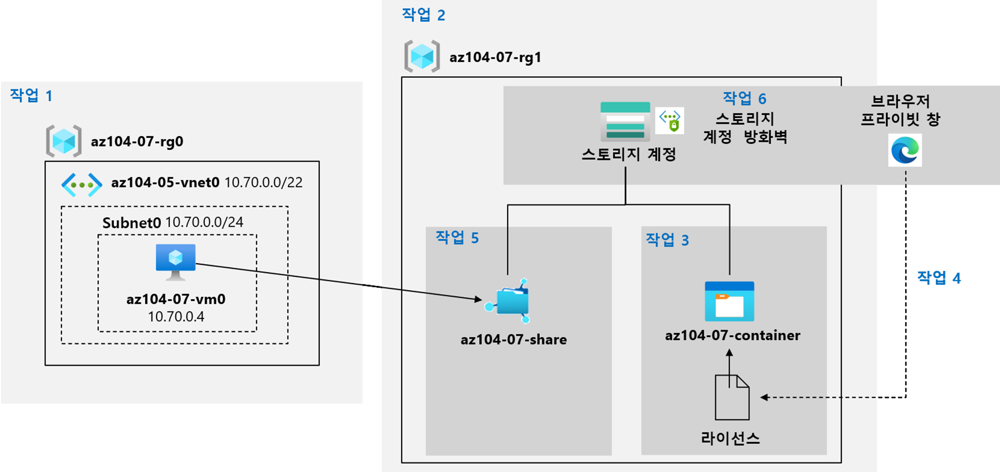

---
lab:
  title: 07 - Azure 스토리지 관리
  module: Administer Azure Storage
---

# <a name="lab-07---manage-azure-storage"></a>랩 07 - Azure Storage 관리
# <a name="student-lab-manual"></a>학생용 랩 매뉴얼

## <a name="lab-scenario"></a>랩 시나리오

You need to evaluate the use of Azure storage for storing files residing currently in on-premises data stores. While majority of these files are not accessed frequently, there are some exceptions. You would like to minimize cost of storage by placing less frequently accessed files in lower-priced storage tiers. You also plan to explore different protection mechanisms that Azure Storage offers, including network access, authentication, authorization, and replication. Finally, you want to determine to what extent Azure Files service might be suitable for hosting your on-premises file shares.

대화형 가이드 형식으로 이 랩을 미리 보려면 **[여기를 클릭하세요](https://mslabs.cloudguides.com/en-us/guides/AZ-104%20Exam%20Guide%20-%20Microsoft%20Azure%20Administrator%20Exercise%2011)** .

## <a name="objectives"></a>목표

이 랩에서는 다음을 수행합니다.

+ 작업 1: 랩 환경 프로비전
+ 작업 2: Azure Storage 계정 만들기 및 구성
+ 작업 3: Blob Storage 관리
+ 작업 4: Azure Storage에 대한 인증 및 권한 부여 관리
+ 작업 5: Azure Files 공유 만들기 및 구성
+ 작업 6: Azure Storage에 대한 네트워크 액세스 관리

## <a name="estimated-timing-40-minutes"></a>예상 소요 시간: 40분

## <a name="architecture-diagram"></a>아키텍처 다이어그램




## <a name="instructions"></a>Instructions

### <a name="exercise-1"></a>연습 1

#### <a name="task-1-provision-the-lab-environment"></a>작업 1: 랩 환경 프로비전

이 작업에서는 이 랩의 후반부에서 사용할 Azure 가상 머신을 배포합니다.

1. [Azure Portal](https://portal.azure.com)에 로그인합니다.

1. Azure Portal에서 오른쪽 상단의 아이콘을 클릭하여 **Azure Cloud Shell**을 엽니다.

1. **Bash**와 **PowerShell** 중에서 선택하라는 메시지가 표시되면 **PowerShell**을 선택합니다.

    >**참고**: **Cloud Shell**을 처음 시작했는데 **탑재된 스토리지 없음**이라는 메시지가 표시되면 이 랩에서 사용하는 구독을 선택하고 **스토리지 만들기**를 클릭합니다.

1. Cloud Shell 창의 도구 모음에서 **파일 업로드/다운로드** 아이콘을 클릭한 다음, 드롭다운 메뉴에서 **업로드**를 클릭하여 파일 **\\Allfiles\\Labs\\07\\az104-07-vm-template.json** 및 **\\Allfiles\\Labs\\07\\az104-07-vm-parameters.json**을 Cloud Shell 홈 디렉터리에 업로드합니다.

1. Edit the <bpt id="p1">**</bpt>Parameters<ept id="p1">**</ept> file you just uploaded and change the password. If you need help editing the file in the Shell please ask your instructor for assistance. As a best practice, secrets, like passwords, should be more securely stored in the Key Vault. 

1. Cloud Shell 창에서 다음을 실행하여 가상 머신을 호스트할 리소스 그룹을 만듭니다(‘[Azure_region]’ 자리 표시자를 Azure 가상 머신을 배포하려는 Azure 지역의 이름으로 바꿈).

    >**참고**: Azure 지역의 이름을 나열하려면 `(Get-AzLocation).Location`**참고**를 실행하세요. 아래의 각 명령은 별도로 입력해야 합니다.

    ```powershell
    $location = '[Azure_region]'
    ```
  
    ```powershell
     $rgName = 'az104-07-rg0'
    ```

    ```powershell
    New-AzResourceGroup -Name $rgName -Location $location
    ```
    
1. Cloud Shell 창에서 다음을 실행하여 업로드된 템플릿 및 매개 변수 파일을 사용해 가상 머신을 배포합니다.

   ```powershell
   New-AzResourceGroupDeployment `
      -ResourceGroupName $rgName `
      -TemplateFile $HOME/az104-07-vm-template.json `
      -TemplateParameterFile $HOME/az104-07-vm-parameters.json `
      -AsJob
   ```

    >**참고**: 배포가 끝날 때까지 기다리지 말고 다음 작업으로 진행하세요.

    >**참고**: VM 크기를 사용할 수 없다는 오류가 발생하면 강사에게 도움을 요청하고 다음 단계를 시도하세요.
    > 1. CloudShell의 `{}` 단추를 클릭하고, 왼쪽 사이드바에서 **az104-07-vm-parameters.json**을 선택하고, `vmSize` 매개 변수 값을 기록해 둡니다.
    > 1. Check the location in which the 'az104-04-rg1' resource group is deployed. You can run <ph id="ph1">`az group show -n az104-04-rg1 --query location`</ph> in your CloudShell to get it.
    > 1. CloudShell에서 `az vm list-skus --location <Replace with your location> -o table --query "[? contains(name,'Standard_D2s')].name"`을 실행합니다.
    > 1. `vmSize` 매개 변수 값을 방금 실행한 명령에서 반환된 값 중 하나로 바꿉니다.
    > 1. Now redeploy your templates by running the <ph id="ph1">`New-AzResourceGroupDeployment`</ph> command again. You can press the up button a few times which would bring the last executed command.

1. Cloud Shell 창을 닫습니다.

#### <a name="task-2-create-and-configure-azure-storage-accounts"></a>작업 2: Azure Storage 계정 만들기 및 구성

이 작업에서는 Azure Storage 계정을 만들고 구성합니다.

1. Azure Portal에서 **스토리지 계정**을 검색 및 선택하고 **+ 만들기**를 클릭합니다.

1. **스토리지 계정 만들기** 블레이드의 **기본** 탭에서 다음 설정을 지정합니다(나머지는 기본값을 그대로 유지).

    | 설정 | 값 |
    | --- | --- |
    | Subscription | 이 랩에서 사용 중인 Azure 구독의 이름 |
    | Resource group | **새** 리소스 그룹 **az104-07-rg1**의 이름 |
    | 스토리지 계정 이름 | 3~24자 사이의 문자와 숫자로 구성된 전역적으로 고유한 이름 |
    | 지역 | Azure Storage 계정을 만들 수 있는 Azure 지역의 이름  |
    | 성능 | **Standard** |
    | 중복 | **GRS(지역 중복 스토리지)** |

1. **다음: 고급 >** , **스토리지 계정 만들기** 블레이드의 **고급** 탭에서 사용 가능한 옵션을 검토하고 기본값을 수락한 후 **다음: 네트워킹 >** 을 선택합니다.

1. **스토리지 계정 만들기** 블레이드의 **네트워킹** 탭에서 사용 가능한 옵션을 검토하고 기본 옵션 **모든 네트워크에서 퍼블릭 액세스 사용**을 수락하고 **다음: 데이터 보호 >** 를 클릭합니다.

1. **스토리지 계정 만들기** 블레이드의 **데이터 보호** 탭에서 사용 가능한 옵션을 검토하고 기본값을 수락하고 **검토 + 만들기**를 클릭한 다음 유효성 검사 프로세스가 완료될 때까지 기다렸다가 **만들기**를 클릭합니다.

    ><bpt id="p1">**</bpt>Note<ept id="p1">**</ept>: Wait for the Storage account to be created. This should take about 2 minutes.

1. 배포 블레이드에서 **리소스로 이동**을 클릭하여 Azure Storage 계정 블레이드를 표시합니다.

1. 스토리지 계정 블레이드의 **데이터 관리** 섹션에서 **지역 복제**를 클릭하고 보조 위치를 기록합니다. 

1. 스토리지 계정 블레이드의 **설정** 섹션에서 **구성**을 선택한 다음 **복제** 드롭다운 목록에서 **LRS(로컬 중복 스토리지)** 를 선택하고 변경 사항을 저장합니다.

1. **지역 복제** 블레이드로 다시 전환합니다. 이 시점에서 스토리지 계정은 기본 위치만 있음을 확인하세요.

1. 스토리지 계정의**구성** 블레이드를 다시 표시하고 **Blob 액세스 계층(기본값)** 을 **쿨**로 설정하고 변경 사항을 저장합니다.

    > **참고**: 쿨 액세스 계층은 자주 액세스하지 않는 데이터에 최적입니다.

#### <a name="task-3-manage-blob-storage"></a>작업 3: Blob Storage 관리

이 작업에서는 Blob 컨테이너를 만들고 Blob을 업로드합니다.

1. 스토리지 계정 블레이드의 **데이터 스토리지** 섹션에서 **컨테이너**를 클릭합니다.

1. **+ 컨테이너**를 클릭하고 다음 설정을 사용하여 컨테이너를 만듭니다.

    | 설정 | 값 |
    | --- | --- |
    | Name | **az104-07-container**  |
    | 공용 액세스 수준 | **프라이빗(익명 액세스 없음)** |

1. 컨테이너 목록에서 **az104-07-container**를 클릭한 다음 **업로드**를 클릭합니다.

1. 랩 컴퓨터에서 **\\Allfiles\\Labs\\07\\LICENSE**를 찾아 **열기**를 클릭합니다.

1. **Blob 업로드** 블레이드에서 **고급** 섹션을 확장하고 다음 설정을 지정합니다(다른 설정은 기본값으로 유지).

    | 설정 | 값 |
    | --- | --- |
    | 인증 유형 | **계정 키**  |
    | Blob 유형 | **블록 Blob** |
    | 블록 크기 | **4MB** |
    | 액세스 계층 | **핫** |
    | 폴더에 업로드 | **라이선스** |

    > **참고**: 개별 Blob에 대해 액세스 계층을 설정할 수 있습니다.

1. **업로드**를 클릭합니다.

    > **참고**: 업로드하면 **라이선스**라는 하위 폴더가 자동으로 만들어집니다.

1. 다시 **az104-07-container** 블레이드로 돌아가서 **라이선스**를 클릭한 다음 **LICENSE**를 클릭합니다.

1. **라이선스/LICENSE** 블레이드에서 사용 가능한 옵션을 검토합니다.

    > 현재 온-프레미스 데이터 저장소에 있는 파일을 저장하는 데 Azure Storage를 사용하는 안을 평가해야 합니다.

#### <a name="task-4-manage-authentication-and-authorization-for-azure-storage"></a>작업 4: Azure Storage에 대한 인증 및 권한 부여 관리

이 작업에서는 Azure Storage에 대한 인증 및 권한 부여를 구성합니다.

1. **라이선스/LICENSE** 블레이드 **개요** 탭에서 **URL** 항목 **옆의 클립보드** 단추를 클릭합니다.

1. InPrivate 모드를 사용하여 다른 브라우저 창을 열고 이전 단계에서 복사한 URL로 이동합니다.

1. **ResourceNotFound** 또는 **PublicAccessNotPermitted**가 표시된 XML 서식 메시지가 표시됩니다.

    > **참고**: 컨테이너에 공용 액세스 수준이 **프라이빗(익명 액세스 없음)** 으로 설정되어 있기 때문에 예상된 결과입니다.

1. InPrivate 모드 브라우저 창을 닫고 Azure Storage 컨테이너의 **라이선스/LICENSE** 블레이드를 표시하는 브라우저 창으로 돌아가서 **SAS 생성** 탭으로 전환합니다.

1. **라이선스/LICENSE** 블레이드의 **SAS 생성** 탭에서 다음 설정을 지정합니다(다른 설정은 기본값으로 유지).

    | 설정 | 값 |
    | --- | --- |
    | 서명 키 | **키 1** |
    | 사용 권한 | **읽기** |
    | 시작 날짜 | 어제 날짜 |
    | 시작 시간 | 현재 시간 |
    | 만료 날짜 | 내일 날짜 |
    | 만료 시간 | 현재 시간 |
    | 허용된 IP 주소 | 비워 둡니다. |
    

1. **SAS 토큰 및 URL 생성**을 클릭합니다.

1. **Blob SAS URL** 항목 옆에 있는 **클립보드에 복사** 단추를 클릭합니다.

1. InPrivate 모드를 사용하여 다른 브라우저 창을 열고 이전 단계에서 복사한 URL로 이동합니다.

    > 이러한 파일의 대부분은 몇 가지 예외를 제외하고는 자주 액세스하지 않습니다.

    > **참고**: 이것은 이제 새로 생성된 SAS 토큰을 기반으로 액세스 권한이 부여되므로 예상된 결과입니다.

    > 사용자는 자주 액세스하지 않는 파일을 저렴한 스토리지 계층에 배치하여 스토리지 비용을 최소화하려고 합니다.

1. InPrivate 브라우저 창을 닫고 Azure Storage 컨테이너의 **라이선스/LICENSE** 블레이드가 표시된 브라우저 창으로 돌아가서 다시 **az104-07-container** 블레이드로 이동합니다.

1. **인증 방법** 레이블 옆에 있는 **Azure AD 사용자 계정으로 전환 ** 링크를 클릭합니다.

    > 또한 네트워크 액세스, 인증, 권한 부여 및 복제를 포함하여 Azure Storage가 제공하는 다양한 보호 메커니즘을 알아볼 계획입니다.  

    > **참고**: 이 시점에서는 인증 방법을 변경할 권한이 없습니다.

1. **az104-07-container** 블레이드에서 **액세스 제어(IAM)** 를 클릭합니다.

1. **액세스 확인** 탭에서 **역할 할당 추가**를 클릭합니다.

1. **역할 할당 추가** 블레이드에서 다음 설정을 지정합니다.

    | 설정 | 값 |
    | --- | --- |
    | 역할 | **Storage Blob 데이터 소유자** |
    | 다음에 대한 액세스 할당 | **사용자, 그룹 또는 서비스 주체** |
    | 멤버 | 이름을 선택합니다. |

1. **검토 + 할당**, **검토 + 할당**을 차례로 클릭하고 **az104-07-container** 컨테이너의 **개요** 블레이드로 돌아가 인증 방법을 변경할 수 있는지 확인합니다(Azure AD 사용자 계정으로 전환).

    > **참고**: 이 변경 사항이 적용되는 데 5분 정도 소요될 수 있습니다.

#### <a name="task-5-create-and-configure-an-azure-files-shares"></a>작업 5: Azure Files 공유 만들기 및 구성

이 작업에서는 Azure Files 공유를 만들고 구성합니다.

> **참고**: 본 작업을 시작하기 전에 이 랩의 첫 번째 작업에서 프로비전한 가상 머신이 실행 중인지 확인하세요.

1. Azure Portal에서 이 랩의 첫 번째 작업에서 만든 스토리지 계정의 블레이드로 다시 이동하여 **데이터 스토리지** 섹션에서 **파일 공유**를 클릭합니다.

1. **+ 파일 공유**를 클릭하고 다음 설정을 사용하여 파일 공유를 만듭니다.

    | 설정 | 값 |
    | --- | --- |
    | Name | **az104-07-share** |

1. 새로 만든 파일 공유를 클릭한 다음 **연결**을 클릭합니다.

1. 마지막으로 Azure Files 서비스가 온-프레미스 파일 공유를 호스트하는 데 어느 정도 적합한지를 결정해야 합니다.

1. Azure Portal에서 **가상 머신**을 검색하여 선택하고 가상 머신 목록에서 **az104-07-vm0**을 클릭합니다.

1. **az104-07-vm0** 블레이드의 **작업** 섹션에서 **실행 명령**을 클릭합니다.

1. **az104-07-vm0 - 실행 명령** 블레이드에서 **RunPowerShellScript**를 클릭합니다.

1. **실행 명령 스크립트** 블레이드에서 이 작업의 앞에서 복사한 스크립트를 **PowerShell 스크립트** 창에 붙여넣고 **실행**을 클릭합니다.

1. 스크립트가 성공적으로 완료되었는지 확인합니다.

1. **PowerShell 스크립트** 창의 내용을 다음 스크립트로 바꾸고 **실행**을 클릭합니다.

   ```powershell
   New-Item -Type Directory -Path 'Z:\az104-07-folder'

   New-Item -Type File -Path 'Z:\az104-07-folder\az-104-07-file.txt'
   ```

1. 스크립트가 성공적으로 완료되었는지 확인합니다.

1. **az104-07-share** 파일 공유 블레이드로 다시 이동하여 **새로 고침**을 클릭하고 **az104-07-folder**가 폴더 목록에 나타나는지 확인합니다.

1. **az104-07-folder**를 클릭하고 **az104-07-file.txt**가 파일 목록에 나타나는지 확인합니다.

#### <a name="task-6-manage-network-access-for-azure-storage"></a>작업 6: Azure Storage에 대한 네트워크 액세스 관리

이 작업에서는 Azure Storage에 대한 네트워크 액세스를 구성합니다.

1. Azure Portal에서 이 랩의 첫 번째 작업에서 만든 스토리지 계정의 블레이드로 다시 이동하고 **보안 + 네트워킹** 섹션에서 **네트워킹**을 클릭한 다음 **방화벽 및 가상 네트워크**를 클릭합니다.

1. **선택한 가상 네트워크 및 IP 주소 옵션에서 사용**을 클릭하고 이 옵션을 사용하도록 설정하면 사용할 수 있는 구성 설정을 검토합니다.

    > **참고**: 이러한 설정으로 서비스 엔드포인트를 사용하여 가상 네트워크의 지정된 서브넷에 있는 Azure 가상 머신과 스토리지 계정 간의 직접 연결을 구성할 수 있습니다.

1. **클라이언트 IP 주소 추가** 체크박스를 클릭하고 변경 사항을 저장합니다.

1. InPrivate 모드를 사용하여 다른 브라우저 창을 열고 이전 작업에서 생성한 Blob SAS URL로 이동합니다.

    > <bpt id="p1">**</bpt>Note<ept id="p1">**</ept>: If you did not record the SAS URL from task 4, you should generate a new one with the same configuration. Use Task 4 steps 4-6 as a guide for generating a new blob SAS URL. 

1. **MIT 라이선스(MIT)** 페이지의 콘텐츠가 표시됩니다.

    > **참고**: 클라이언트 IP 주소에서 연결하므로 이것은 예상한 것입니다.

1. InPrivate 모드 브라우저 창을 닫고 Azure Storage 계정의 **네트워킹** 블레이드를 표시하는 브라우저 창으로 돌아갑니다.

1. Azure Portal에서 오른쪽 상단의 아이콘을 클릭하여 **Azure Cloud Shell**을 엽니다.

1. **Bash**와 **PowerShell** 중에서 선택하라는 메시지가 표시되면 **PowerShell**을 선택합니다.

1. Cloud Shell 창에서 다음 명령을 실행하여 스토리지 계정의 **az104-07-container** 컨테이너에서 LICENSE Blob 다운로드를 시도합니다(`[blob SAS URL]` 자리 표시자를 이전 작업에서 생성한 Blob SAS URL로 바꿈).

   ```powershell
   Invoke-WebRequest -URI '[blob SAS URL]'
   ```
1. 다운로드 시도가 실패하였는지 확인합니다.

    > <bpt id="p1">**</bpt>Note<ept id="p1">**</ept>: You should receive the message stating <bpt id="p2">**</bpt>AuthorizationFailure: This request is not authorized to perform this operation<ept id="p2">**</ept>. This is expected, since you are connecting from the IP address assigned to an Azure VM hosting the Cloud Shell instance.

1. Cloud Shell 창을 닫습니다.

#### <a name="clean-up-resources"></a>리소스 정리

><bpt id="p1">**</bpt>Note<ept id="p1">**</ept>: Remember to remove any newly created Azure resources that you no longer use. Removing unused resources ensures you will not see unexpected charges.

><bpt id="p1">**</bpt>Note<ept id="p1">**</ept>:  Don't worry if the lab resources cannot be immediately removed. Sometimes resources have dependencies and take a long time to delete. It is a common Administrator task to monitor resource usage, so just periodically review your resources in the Portal to see how the cleanup is going. You might also try to delete the Resource Group where the resources reside. That is a quick Administrator shortcut. If you have concerns speak to your instructor.

1. Azure Portal의 **Cloud Shell** 창에서 **PowerShell** 세션을 엽니다.

1. 다음 명령을 실행하여 이 모듈의 전체 랩에서 생성된 모든 리소스 그룹을 나열합니다.

   ```powershell
   Get-AzResourceGroup -Name 'az104-07*'
   ```

1. 다음 명령을 실행하여 이 모듈의 랩 전체에서 만든 모든 리소스 그룹을 삭제합니다.

   ```powershell
   Get-AzResourceGroup -Name 'az104-07*' | Remove-AzResourceGroup -Force -AsJob
   ```

    >**참고**: 이 명령은 -AsJob 매개 변수에 의해 결정되어 비동기로 실행되므로, 동일한 PowerShell 세션 내에서 이 명령을 실행한 직후 다른 PowerShell 명령을 실행할 수 있지만 리소스 그룹이 실제로 제거되기까지는 몇 분 정도 걸립니다.

#### <a name="review"></a>검토

이 랩에서는 다음을 수행합니다.

- 랩 환경 프로비전
- Azure Storage 계정 만들기 및 구성
- Blob Storage 관리
- Azure Storage에 대한 인증 및 권한 부여 관리
- Azure Files 공유 만들기 및 구성
- Azure Storage에 대한 네트워크 액세스 관리
