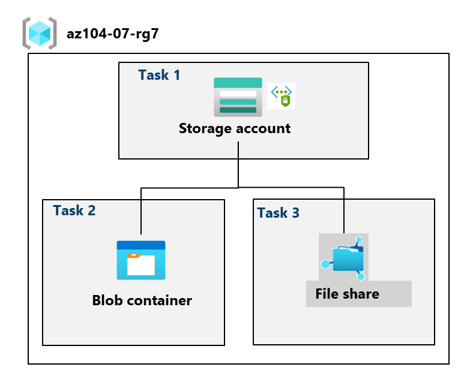

---
lab:
  title: '랩 07: Azure Storage 관리'
  module: Administer Azure Storage
---

# 랩 07 - Azure Storage 관리

## 랩 소개

이 랩에서는 Azure Blob 및 Azure 파일에 대한 스토리지 계정을 만드는 방법을 알아봅니다. Blob 컨테이너를 구성하고 보호하는 방법을 알아봅니다. 또한 Storage Browser를 사용하여 Azure 파일 공유를 구성하고 보호하는 방법도 알아봅니다. 

이 랩을 수행하려면 Azure 구독이 필요합니다. 구독 유형은 이 랩의 기능 가용성에 영향을 미칠 수 있습니다. 지역을 변경할 수 있지만 단계는 **미국 동부**를 사용하여 작성됩니다.

## 예상 소요 시간: 50분

## 랩 시나리오

사용자의 조직은 현재 온-프레미스 데이터 저장소에 데이터를 저장하고 있습니다. 이러한 파일의 대부분은 자주 액세스되지 않습니다. 자주 액세스하지 않는 파일을 저렴한 스토리지 계층에 배치하여 스토리지 비용을 최소화하려고 합니다. 또한 네트워크 액세스, 인증, 권한 부여 및 복제를 포함하여 Azure Storage가 제공하는 다양한 보호 메커니즘을 알아볼 계획입니다. 마지막으로 Azure Files가 온-프레미스 파일 공유를 호스팅하는 데 어느 정도 적합한지 결정하려고 합니다.

## 대화형 랩 시뮬레이션

이 항목에 유용할 수 있는 대화형 랩 시뮬레이션이 있습니다. 시뮬레이션을 통해 고유의 속도에 맞춰 유사한 시나리오를 클릭할 수 있습니다. 대화형 시뮬레이션과 이 랩에는 차이점이 있지만 핵심 개념은 대부분 동일합니다. Azure 구독은 필요하지 않습니다. 

+ [Blob Storage를 만듭니다](https://mslearn.cloudguides.com/en-us/guides/AZ-900%20Exam%20Guide%20-%20Azure%20Fundamentals%20Exercise%205). 스토리지 계정을 만들고, Blob Storage를 관리하고, 스토리지 작업을 모니터링합니다. 
  
+ [Azure Storage를 관리합니다](https://mslabs.cloudguides.com/guides/AZ-104%20Exam%20Guide%20-%20Microsoft%20Azure%20Administrator%20Exercise%2011). 스토리지 계정을 만들고 구성을 검토합니다. Blob 스토리지 컨테이너를 관리합니다. 스토리지 네트워킹을 구성합니다. 

## 아키텍처 다이어그램

## 작업 기술

+ 작업 1: 스토리지 계정을 만들고 구성합니다. 
+ 작업 2: 보안 Blob Storage를 만들고 구성합니다.
+ 작업 3: 보안 Azure 파일 스토리지를 만들고 구성합니다.

## 작업 1: 스토리지 계정을 만들고 구성합니다. 

이 작업에서는 스토리지 계정을 만들고 구성합니다. 스토리지 계정은 지역 중복 스토리지를 사용하며 공용 액세스가 없습니다. 

1. **Azure Portal** - `https://portal.azure.com`에 로그인합니다.

1. `Storage accounts`를 검색하여 선택한 다음 **+ 만들기**를 클릭합니다.

1. **스토리지 계정 만들기** 블레이드의 **기본** 탭에서 다음 설정을 지정합니다(다른 설정은 기본값으로 유지).

    | 설정 | 값 |
    | --- | --- |
    | 구독          | Azure 구독의 이름  |
    | Resource group        | **az104-rg7**(새로 만들기) |
    | 스토리지 계정 이름  | 3~24자 사이의 문자와 숫자로 구성된 전역적으로 고유한 이름 |
    | 지역                | **(미국) 미국 동부**  |
    | 성능           | **표준**(프리미엄 옵션 확인) |
    | 중복            | **지역 중복 스토리지**(다른 옵션 확인)|
    | 지역별 가용성이 있는 경우 데이터에 대한 읽기 권한 부여 | 확인란 선택 |

    >**유용한 정보** 대부분의 애플리케이션에는 표준 성능 계층을 사용해야 합니다. 엔터프라이즈 또는 고성능 애플리케이션에는 프리미엄 성능 계층을 사용합니다. 

1. **고급** 탭에서 정보 아이콘을 사용하여 선택 항목에 대해 자세히 알아봅니다. 기본값을 사용합니다. 

1. **네트워킹** 탭의 **공용 네트워크 액세스** 섹션에서 **사용 안 함**을 선택합니다. 이렇게 하면 아웃바운드 액세스를 허용하는 동안 인바운드 액세스가 제한됩니다. 

1. **데이터 보호** 탭을 검토합니다. 공지 7일이 기본 일시 삭제 보존 정책입니다. Blob 버전 관리를 사용하도록 설정할 수 있습니다. 기본값을 그대로 적용합니다.

1. **암호화** 탭을 검토합니다. 추가 보안 옵션을 확인합니다. 기본값을 그대로 적용합니다.

1. **검토 + 만들기**를 선택하고 유효성 검사 프로세스가 완료될 때까지 기다린 다음 **만들기**를 클릭합니다.

1. 스토리지 계정이 배포되면 **리소스로 이동**을 선택합니다.

1. **개요** 블레이드와 변경할 수 있는 추가 구성을 검토합니다. 이는 스토리지 계정에 대한 전역 설정입니다. 스토리지 계정은 Blob 컨테이너, 파일 공유, 큐 및 테이블에 사용될 수 있습니다.

1. **보안 + 네트워킹** 블레이드에서 **네트워킹**을 선택합니다. **공용 네트워크 액세스**를 사용하지 않도록 설정되었습니다.

    + **관리**에서 **공용 네트워크 액세스**를 선택합니다.
    + **공용 네트워크 액세스**를 **사용**으로 변경합니다.
    + **기본 작업**을 **선택한 네트워크에서 사용**으로 변경합니다.
    + **IP 주소** 섹션에서 **클라이언트 IP 주소 추가**를 선택합니다.
    + 변경 내용을 **저장**합니다.
  
1. **데이터 관리** 블레이드에서 **중복도**를 선택합니다. 기본 및 보조 데이터 센터 위치에 대한 정보를 확인합니다.

1. **데이터 관리** 블레이드에서 **수명 주기 관리**를 선택한 다음 **규칙 추가**를 선택합니다.

    + 규칙 `Movetocool`의 **이름을 지정합니다**. 규칙 범위를 제한하기 위한 옵션을 확인합니다.
    
    + **기본 Blob** 탭에서 *조건* 기반 Blob이 `30 days` 이전에 마지막으로 *수정되면* **쿨 스토리지로 이동합니다**. 다른 선택 사항을 확인합니다. 
    
    + 다른 조건을 구성할 수 있습니다. 탐색을 마치면 **추가**를 선택합니다.

    

## 작업 2: 보안 Blob Storage 만들기 및 구성

이 작업에서는 Blob 컨테이너를 만들고 이미지를 업로드합니다. Blob 컨테이너는 구조화되지 않은 데이터를 저장하는 디렉터리와 유사한 구조입니다.

### Blob 컨테이너 및 시간 기반 보존 정책 만들기

1. Azure Portal에서 계속해서 스토리지 계정으로 작업합니다.

1. **데이터 스토리지** 블레이드에서 **컨테이너**를 선택합니다. 

1. **+ 컨테이너 추가** 및 **만들기**를 클릭하여 다음 설정으로 컨테이너를 만듭니다.

    | 설정 | 값 |
    | --- | --- |
    | 속성 | `data`  |
    | 공용 액세스 수준 | 액세스 수준이 프라이빗으로 설정되어 있는지 확인합니다. |

    

1. 컨테이너에서 맨 오른쪽에 있는 줄임표(...)로 스크롤하고 **액세스 정책**을 선택합니다.

1. **변경이 불가능한 Blob Storage** 영역에서 **정책 추가**를 선택합니다.

    | 설정 | 값 |
    | --- | --- |
    | 정책 유형 | **시간 기반 보존**  |
    | 다음에 대한 보존 기간 설정 | `180`일 |

1. **저장**을 선택합니다.

### Blob 업로드 관리

1. 컨테이너 페이지로 돌아가서 **데이터** 컨테이너를 선택한 다음 **업로드**를 클릭합니다.

1. **Blob 업로드** 블레이드에서 **고급** 섹션을 확장합니다.

    >**참고**: 업로드할 파일을 찾습니다. 모든 형식의 파일이 될 수 있지만 작은 파일이 가장 좋습니다. 샘플 파일은 AllFiles 디렉터리에서 다운로드할 수 있습니다. 

    | 설정 | 값 |
    | --- | --- |
    | 파일 찾아보기 | 업로드하기로 선택한 파일 추가 |
    | **고급**을 선택합니다. | |
    | Blob 유형 | **블록 Blob** |
    | 블록 크기 | **4MiB** |
    | 액세스 계층 | **핫**(다른 옵션 확인) |
    | 폴더에 업로드 | `securitytest` |
    | 암호화 범위 | 기존 기본 컨테이너 범위 사용 |

1. **업로드**를 클릭합니다.

1. 새 폴더가 있고 파일이 업로드되었는지 확인합니다. 

1. 업로드 파일을 선택하고 **다운로드**, **삭제**, **계층 변경**, **임대 취득** 등의 옵션을 검토합니다.

1. **URL** 파일(속성 블레이드)을 복사하여 새 **Inprivate** 탐색 창에 붙여넣습니다.

1. **ResourceNotFound** 또는 **PublicAccessNotPermitted**가 표시된 XML 서식 메시지가 표시됩니다.

    > **참고**: 컨테이너에 공용 액세스 수준이 **프라이빗(익명 액세스 없음)** 으로 설정되어 있기 때문에 예상된 결과입니다.

### Blob Storage에 대한 제한된 액세스 구성

1. 업로드된 파일을 선택한 다음 **SAS 생성** 탭을 선택합니다. 맨 오른쪽에 줄임표(...)를 사용할 수도 있습니다. 다음 설정을 지정합니다(다른 설정은 기본값으로 유지).

    | 설정 | 값 |
    | --- | --- |
    | 서명 키 | **키 1** |
    | 사용 권한 | **읽기**(다른 선택 사항 확인) |
    | 시작 날짜 | 어제 날짜 |
    | 시작 시간 | 현재 시간 |
    | 만료 날짜 | 내일 날짜 |
    | 만료 시간 | 현재 시간 |
    | 허용된 IP 주소 | 비워 둡니다. |

1. **SAS 토큰 및 URL 생성**을 클릭합니다.

1. **Blob SAS URL** 항목을 클립보드에 복사합니다.

1. 다른 InPrivate 브라우저 창을 열고 이전 단계에서 복사한 Blob SAS URL로 이동합니다.

    >**참고**: 파일의 콘텐츠를 볼 수 있어야 합니다. 

## 작업 3: Azure File Storage 만들기 및 구성

이 작업에서는 Azure 파일 공유를 만들고 구성합니다. Storage Browser를 사용하여 파일 공유를 관리합니다. 

### 파일 공유 만들기 및 파일 업로드

1. Azure Portal에서 스토리지 계정으로 돌아가 **데이터 스토리지** 블레이드에서 **파일 공유**를 클릭합니다.

1. **+ 파일 공유**를 클릭하고 **기본 사항** 탭에서 파일 공유 이름을 `share1`로 지정합니다. 

1.  **액세스 계층** 옵션을 확인합니다. 기본 **트랜잭션 최적화**를 유지합니다.
   
1. **백업** 탭으로 이동하여 **백업 사용**이 선택되지 **않았는지** 확인합니다. 랩 구성을 간소화하기 위해 백업을 사용하지 않도록 설정하고 있습니다.

1. **검토 + 만들기**를 클릭하고 **만들기**를 클릭합니다. 파일 공유가 배포될 때까지 기다립니다.

    

### Storage Browser를 탐색하고 파일을 업로드합니다.

1. 스토리지 계정으로 돌아가서 **스토리지 브라우저**를 선택합니다. Azure Storage Browser는 계정의 모든 스토리지 서비스를 빠르게 볼 수 있는 포털 도구입니다.

1. **파일 공유**를 선택하고 **share1** 디렉터리가 있는지 확인합니다.

1. **share1** 디렉터리를 선택하고 **+ 디렉터리 추가**를 할 수 있는지 확인합니다. 이를 통해 폴더 구조를 만들 수 있습니다.

1. **업로드**를 선택합니다. 원하는 파일을 찾은 다음 **업로드**를 클릭합니다.

    >**참고**: Storage Browser에서 파일 공유를 보고 해당 공유를 관리할 수 있습니다. 현재 제한 사항은 없습니다.

### 스토리지 계정에 대한 네트워크 액세스를 제한합니다.

1. 포털에서 **가상 네트워크**를 검색하여 선택합니다.

1. **+ 만들기**를 선택합니다. 리소스 그룹을 선택합니다. 가상 네트워크에 **이름**, `vnet1`을 지정합니다.

1. 다른 매개 변수에 대해서는 기본값을 사용하고 **검토 + 만들기**를 선택한 다음 **만들기**를 선택합니다.

1. 가상 네트워크가 배포될 때까지 기다린 다음 **리소스로 이동**을 선택합니다.

1. **설정** 섹션에서 **서비스 엔드포인트** 블레이드를 선택합니다.
    + **추가**를 선택합니다. 
    + **서비스** 드롭다운에서 **Microsoft.Storage**를 선택합니다.
    + **서브넷** 드롭다운에서 **기본** 서브넷을 확인합니다.
    + 변경 내용을 저장하려면 **추가**를 클릭합니다.  

1. 스토리지 계정으로 돌아갑니다.

1. **보안 + 네트워킹** 블레이드에서 **네트워킹**을 선택합니다.

1. **기존 가상 네트워크 추가**를 선택하고 **vnet1** 및 **기본** 서브넷을 선택한 후 **추가**를 선택합니다.

1. **방화벽** 섹션에서 컴퓨터 IP 주소를 **삭제**합니다. 허용된 트래픽은 가상 네트워크에서만 발생해야 합니다. 

1. 변경 내용을 **저장**합니다.

    >**참고:** 이제 방금 만든 가상 네트워크에서만 스토리지 계정에 액세스해야 합니다. 

1. **스토리지 브라우저**를 선택하고 페이지를 **새로 고침**합니다. 파일 공유 또는 Blob 콘텐츠로 이동합니다.  

    >**참고:** *이 작업을 수행할 권한이 없음*이라는 메시지가 표시됩니다. 가상 네트워크에서 연결하고 있지 않습니다. 이 내용이 적용되려면 몇 분 정도 걸릴 수 있습니다.

## 리소스 정리

**고유의 구독**으로 작업하는 경우 랩 리소스를 삭제해 보세요. 이렇게 하면 리소스가 확보되고 비용이 최소화됩니다. 랩 리소스를 삭제하려면 랩 리소스 그룹을 삭제하는 것이 가장 쉽습니다. 

+ Azure Portal에서 리소스 그룹을 선택하고 **리소스 그룹 삭제**, **리소스 그룹 이름 입력**을 선택한 다음 **삭제**를 클릭합니다.
+ Azure PowerShell 사용, `Remove-AzResourceGroup -Name resourceGroupName`.
+ CLI 사용, `az group delete --name resourceGroupName`.

## Copilot을 사용하여 학습 확장
Copilot은 Azure 스크립팅 도구를 사용하는 방법을 익히는 데 도움을 줍니다. 또한 Copilot은 랩에서 다루지 않는 영역이나 추가 정보가 필요한 영역을 지원할 수 있습니다. Edge 브라우저를 열고 Copilot(오른쪽 위)을 선택하거나 *copilot.microsoft.com*으로 이동하세요. 몇 분 정도 시간을 내어 이러한 프롬프트를 사용해 보세요.

+ Blob 컨테이너로 스토리지 계정을 만들려면 Azure PowerShell 스크립트를 제공합니다. 
+ 내 Azure Storage 계정이 안전한지 확인하는 데 사용할 수 있는 검사 목록을 제공합니다.
+ Azure Storage 중복성 모델을 비교하는 테이블을 만듭니다.

## 자기 주도적 학습을 통해 자세히 알아보기

+ [Azure Blob Storage를 사용하여 비용을 최적화합니다](https://learn.microsoft.com/training/modules/optimize-your-cost-azure-blob-storage/). Azure Blob Storage를 사용하여 비용을 최적화하는 방법을 알아봅니다.
+ [공유 액세스 서명을 사용하여 Azure Storage에 대한 액세스를 제어합니다](https://learn.microsoft.com/training/modules/control-access-to-azure-storage-with-sas/). 공유 액세스 서명을 사용하여 안전하게 Azure Storage 계정에 저장된 데이터에 대한 액세스 권한을 부여합니다.

## 핵심 내용

축하합니다. 랩을 완료했습니다. 이 랩의 주요 내용은 다음과 같습니다. 

+ Azure Storage 계정에는 Blob, 파일, 큐, 테이블 및 디스크 등, 모든 Azure Storage 데이터 개체가 포함됩니다. 스토리지 계정은 Azure Storage 데이터에 고유한 네임스페이스를 제공하여 전 세계 어디서나 HTTP 또는 HTTPS를 통해 액세스할 수 있도록 합니다.
+ Azure Storage는 LRS(로컬 중복 스토리지), ZRS(영역 중복 스토리지) 및 GRS(지역 중복 스토리지)를 포함한 여러 중복 모델을 제공합니다. 
+ Azure Blob Storage를 사용하면 Microsoft의 데이터 스토리지 플랫폼에 대량의 구조화되지 않은 데이터를 저장할 수 있습니다. Blob은 Binary Large Object를 의미하며 이미지나 멀티미디어 파일 같은 개체를 포함합니다.
+ Azure 파일 스토리지는 구조화된 데이터를 위한 공유 스토리지를 제공합니다. 데이터는 폴더로 구성될 수 있습니다.
+ 변경이 불가능한 스토리지는 데이터를 WORM(Write Once, Read Many) 상태로 저장하는 기능을 제공합니다. 변경 불가능한 스토리지 정책은 시간 기반이거나 법적 보존일 수 있습니다.
