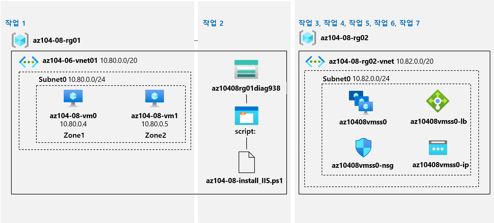

---
lab:
    title: '08 - 가상 머신 관리'
    module: '모듈 08 - 가상 머신'
---

# 랩 08 - 가상 머신 관리
# 학생 랩 매뉴얼

## 랩 시나리오

Azure 가상 머신의 배포 및 구성을 위한 다양한 옵션을 식별하는 작업을 수행해야 합니다. 먼저 Azure 가상 머신을 사용할 경우 구현할 수 있는 다양한 컴퓨팅 및 스토리지 복원력과 확장성 옵션을 결정해야 합니다. 다음으로 Azure 가상 머신 확장 집합을 사용할 경우 사용할 수 있는 컴퓨팅 및 스토리지 복원력과 확장성 옵션을 조사해야 합니다. 또한 Azure 가상 머신 사용자 지정 스크립트 확장을 사용하여 가상 머신 및 가상 머신 확장 집합을 자동으로 구성하는 기능을 탐색하고자 합니다.

## 목표

이 랩에서는 다음 작업을 수행합니다.

+ 작업 1: Azure Portal 및 Azure Resource Manager 템플릿을 사용하여 영역 복원력이 있는 Azure 가상 머신 배포
+ 작업 2: 가상 머신 확장을 사용하여 Azure 가상 머신 구성
+ 작업 3: Azure Virtual Machines에 사용할 컴퓨팅 및 스토리지 크기 조정
+ 작업 4: Microsoft.Insights 및 Microsoft.AlertsManagement 리소스 공급자 등록
+ 작업 5: Azure Portal을 사용하여 영역 복원력이 있는 Azure 가상 머신 확장 집합 배포
+ 작업 6: 가상 머신 확장을 사용하여 Azure 가상 머신 확장 집합 구성
+ 작업 7: Azure 가상 머신 확장 집합에 사용할 컴퓨팅 및 스토리지 크기 조정(선택 사항)

## 예상 시간: 50분

## 아키텍처 다이어그램




## 지침

### 연습 1:

#### 작업 1: Azure Portal 및 Azure Resource Manager 템플릿을 사용하여 영역 복원력이 있는 Azure 가상 머신 배포

이 작업에서는 Azure Portal 및 Azure Resource Manager 템플릿을 사용하여 Azure 가상 머신을 다른 가용성 영역에 배포합니다.

1. [Azure Portal](http://portal.azure.com)에 로그인합니다.

1. Azure Portal에서 **가상 머신**을 검색 및 선택하고 **가상 머신** 블레이드에서 **+ 만들기**, **+ 가상 머신**을 차례로 클릭합니다.

1. **가상 머신 만들기** 블레이드의 **기본** 탭에서 다음 설정을 지정합니다(다른 설정은 기본값으로 유지).

    | 설정 | 값 |
    | --- | --- |
    | 구독 | 이 랩에서 사용할 Azure 구독의 이름 |
    | 리소스 그룹 | 새 리소스 그룹 **az104-08-rg01**의 이름 |
    | 가상 머신 이름 | **az104-08-vm0** |
    | 지역 | 가용성 영역을 지원하고 Azure 가상 머신을 프로비전할 수 있는 지역 중 하나를 선택합니다. |
    | 가용성 옵션 | **가용성 영역** |
    | 가용성 영역 | **1** |
    | 이미지 | **Windows Server 2019 Datacenter - Gen1/Gen2** |
    | Azure Spot 인스턴스 | **없음** |
    | 크기 | **표준 D2s v3** |
    | 사용자 이름 | **Student** |
    | 암호 | **Pa55w.rd1234** |
    | 공용 인바운드 포트 | **없음** |
    | 기존 Windows 서버 라이선스를 사용하시겠습니까? | **없음** |

1. **다음: 디스크 >** 를 클릭하고 **가상 머신 만들기** 블레이드의 **디스크** 탭에서 다음 설정을 지정합니다(다른 설정은 기본값으로 유지).

    | 설정 | 값 |
    | --- | --- |
    | OS 디스크 유형 | **프리미엄 SSD** |
    | Ultra Disk 호환성 사용 | **없음** |

1. **다음: 네트워킹 >** 을 클릭하고 **가상 머신 만들기** 블레이드의 **네트워킹** 탭에서 **가상 네트워크** 텍스트 상자 아래의 **새로 만들기**를 클릭합니다.

1. **Virtual Network 만들기** 블레이드에서 다음 설정을 지정합니다(나머지는 기본값을 그대로 유지).

    | 설정 | 값 |
    | --- | --- |
    | 이름 | **az104-08-rg01-vnet** |
    | 주소 범위 | **10.80.0.0/20** |
    | 서브넷 이름 | **subnet0** |
    | 서브넷 범위 | **10.80.0.0/24** |

1. **확인**을 클릭하고, **가상 머신 만들기** 블레이드의 **네트워킹** 탭으로 돌아와서 다음 설정을 지정합니다(다른 설정은 기본값으로 유지).

    | 설정 | 값 |
    | --- | --- |
    | 서브넷 | **subnet0** |
    | 공용 IP | **기본값** |
    | NIC 네트워크 보안 그룹 | **기본** |
    | 공용 인바운드 포트 | **없음** |
     | 가속화된 네트워킹 | **끄기**
    | 기존 부하 분산 솔루션 뒤에 이 가상 머신을 배치합니까? | **없음** |

1. **다음: 관리 >** 를 클릭하고 **가상 머신 만들기** 블레이드의 **관리** 탭에서 다음 설정을 지정합니다(다른 설정은 기본값으로 유지).

    | 설정 | 값 |
    | --- | --- |
    | 부팅 진단 | **사용자 지정 스토리지 계정으로 사용** |
    | 진단 스토리지 계정 | 기본값 수락 |
    | 오케스트레이션 옵션 패치 | **수동 업데이트** |  

    >**참고**: 필요한 경우 드롭다운 목록에서 기존 스토리지 계정을 선택합니다. 스토리지 계정 이름을 기록합니다. 이 이름은 다음 작업에서 사용합니다.

1. **다음: 고급 >** 을 클릭하고 **가상 머신 만들기**의 **고급** 탭에서 아무것도 수정하지 말고 사용 가능한 설정을 검토한 후 **검토 + 만들기**를 클릭합니다.

1. **검토 + 만들기** 블레이드에서 **만들기**를 클릭합니다.

1. 배포 블레이드에서 **템플릿**을 클릭합니다.

1. 진행 중인 배포를 나타내는 템플릿을 검토하고 **배포**를 클릭합니다.

    >**참고**: 이 옵션을 사용하여 가용성 영역을 제외하고 일치하는 구성과 함께 두 번째 가상 머신을 배포합니다.

1. **사용자 지정 배포** 블레이드에서 다음 설정을 지정합니다(다른 설정은 기본값으로 유지).

    | 설정 | 값 |
    | --- | --- |
    | 네트워크 인터페이스 이름 | **az104-08-vm1-nic1** |
    | 공용 IP 주소 이름 | **az104-08-vm1-ip** |
    | 가상 머신 이름 | **az104-08-vm1** |
    | 가상 머신 컴퓨터 이름 | **az104-08-vm1** |
    | 가상 머신 RG | **az104-08-rg01** |    
    | 관리자 사용자 이름 | **Student** |
    | 관리자 암호 | **Pa55w.rd1234** |
    | 핫패치 사용 | **false** |
    | 영역 | **2** |

    >**참고**: 가상 머신 및 해당 네트워크 인터페이스를 비롯해 템플릿을 사용하여 배포하는 고유한 리소스의 속성에 해당하는 매개 변수를 수정해야 합니다.

1. **검토 + 만들기**를 클릭하고 **검토 + 만들기** 블레이드에서 **만들기**를 클릭합니다.

    >**참고**: 다음 작업으로 진행하기 전에 두 배포가 모두 완료될 때까지 기다립니다. 5분 정도 걸릴 수 있습니다.

#### 작업 2: 가상 머신 확장을 사용하여 Azure 가상 머신 구성

이 작업에서는 사용자 지정 스크립트 가상 머신 확장을 사용하여 이전 작업에서 배포한 두 Azure 가상 머신에 Windows Server 웹 서버 역할을 설치합니다.

1. Azure Portal에서 **스토리지 계정**을 검색 및 선택하고 **스토리지 계정** 블레이드에서 이전 작업에서 만든 진단 스토리지 계정을 나타내는 항목을 클릭합니다.

1. 스토리지 계정 블레이드의 **데이터 스토리지** 섹션에서 **컨테이너**와 **+ 컨테이너**를 차례로 클릭합니다.

1. **새 컨테이너** 블레이드에서 다음 설정을 지정하고(다른 설정은 기본값으로 유지) **만들기**를 클릭합니다.

    | 설정 | 값 |
    | --- | --- |
    | 이름 | **스크립트** |
    | 공용 액세스 수준 | **프라이빗(익명 액세스 불가**) |

1. 컨테이너 목록을 표시하는 스토리지 계정 블레이드로 돌아가서 **스크립트**를 클릭합니다.

1. **스크립트** 블레이드에서 **업로드**를 클릭합니다.

1. **Blob 업로드** 블레이드에서 폴더 아이콘을 선택하고 **열기** 대화 상자에서 **\\Allfiles\\Labs\\08** 폴더로 이동하여 **az104-08-install_IIS.ps1**을 선택하고 **열기**를 클릭합니다. 그런 후에 **Blob 업로드** 블레이드로 돌아와 **업로드**를 클릭합니다.

1. Azure Portal에서 **가상 머신**을 검색 및 선택하고 **가상 머신** 블레이드에서 **az104-08-vm0**을 클릭합니다.

1. **az104-08-vm0** 가상 머신 블레이드의 **설정** 섹션에서 **확장 + 애플리케이션**을 클릭하고 **+ 추가**를 클릭합니다.

1. **확장 설치** 블레이드에서 **사용자 지정 스크립트 확장**을 클릭하고 **다음**을 클릭합니다.

1. **사용자 지정 스크립트 확장 구성** 블레이드에서 **찾아보기**를 클릭합니다.

1. **스토리지 계정** 블레이드에서 **az104-08-install_IIS.ps1** 스크립트를 업로드한 스토리지 계정의 이름을 클릭하고, **컨테이너** 블레이드에서 **스크립트**를 클릭한 후, **스크립트**블레이드에서 **az104-08-install_IIS.ps1**을 클릭한 다음 **선택**을 클릭합니다.

1. **확장 설치** 블레이드로 돌아가서 **검토+만들기**를 클릭한 다음 **만들기**를 클릭합니다.

1. Azure Portal에서 **가상 머신**을 검색 및 선택하고 **가상 머신** 블레이드에서 **az104-08-vm1**을 클릭합니다.

1. **az104-08-vm1** 블레이드의 **자동화** 섹션에서 **템플릿 내보내기**를 클릭합니다.

1. **az104-08-vm1 - 템플릿 내보내기** 블레이드에서 **배포**를 클릭합니다.

1. **사용자 지정 배포** 블레이드에서 **템플릿 편집**을 클릭합니다.

    >**참고**: **템플릿에 있는 하나 이상의 리소스가 지원하지 않는 위치에 리소스 그룹이 있습니다. 다른 리소스 그룹을 선택하세요**. 라는 메시지가 표시되는 것은 정상적인 현상이므로 무시해도 됩니다.

1. **템플릿 편집** 블레이드의 템플릿 내용을 표시하는 섹션에서 다음 코드를 **20**번째 줄(`"resources": [` 줄 바로 아래)에 삽입합니다.

   >**참고**: 코드를 한 줄씩 붙여넣는 도구를 사용하는 경우 Intellisense가 유효성 검사 오류를 일으키는 괄호를 추가할 수 있습니다. 코드를 먼저 메모장에 붙여넣은 다음 20번째 줄에 붙여넣으세요.

   ```json
        {
            "type": "Microsoft.Compute/virtualMachines/extensions",
            "name": "az104-08-vm1/customScriptExtension",
            "apiVersion": "2018-06-01",
            "location": "[resourceGroup().location]",
            "dependsOn": [
                "az104-08-vm1"
            ],
            "properties": {
                "publisher": "Microsoft.Compute",
                "type": "CustomScriptExtension",
                "typeHandlerVersion": "1.7",
                "autoUpgradeMinorVersion": true,
                "settings": {
                    "commandToExecute": "powershell.exe Install-WindowsFeature -name Web-Server -IncludeManagementTools && powershell.exe remove-item 'C:\\inetpub\\wwwroot\\iisstart.htm' && powershell.exe Add-Content -Path 'C:\\inetpub\\wwwroot\\iisstart.htm' -Value $('Hello World from ' + $env:computername)"
              }
            }
        },

   ```

   >**참고**: 템플릿의 이 섹션에서는 Azure PowerShell을 통해, 이전에 첫 번째 가상 머신에 배포했던 것과 동일한 Azure 가상 머신 사용자 지정 스크립트 확장을 정의합니다.

1. **저장**을 클릭하고, **사용자 지정 템플릿** 블레이드로 돌아와서 **검토 + 만들기**를 클릭하고 **검토 + 만들기** 블레이드에서 **만들기**를 클릭합니다.

    >**참고**: 템플릿 배포가 완료될 때까지 기다립니다. **az104-08-vm0** 및 **az104-08-vm1** 가상 머신의 **확장** 블레이드에서 진행 상황을 모니터링할 수 있습니다. 작업은 3분 이내에 완료됩니다.

1. 사용자 지정 스크립트 확장 기반 구성이 정상적으로 적용되었는지 확인하려면 **az104-08-vm1** 블레이드로 다시 이동한 후 **작업** 섹션에서 **명령 실행**을 클릭하고 명령 목록에서 **RunPowerShellScript**를 클릭합니다.

1. **실행 명령 스크립트** 블레이드에서 다음을 입력하고 **실행**을 클릭하여 **az104-08-vm0**에서 호스팅되는 웹 사이트에 액세스합니다.

   ```powershell
   Invoke-WebRequest -URI http://10.80.0.4 -UseBasicParsing
   ```

    >**참고**: **-UseBasicParsing** 매개 변수는 Internet Explorer의 종속성을 제거하여 cmdlet의 실행을 완료하기 위해 필요합니다.

    >**참고**: **az104-08-vm0**에 연결하고 `Invoke-WebRequest -URI http://10.80.0.5 -UseBasicParsing`을 실행하여 **az104-08-vm1**에서 호스팅되는 웹 사이트에 액세스할 수도 있습니다.

#### 작업 3: Azure Virtual Machines에 사용할 컴퓨팅 및 스토리지 크기 조정

이 작업에서는 데이터 디스크를 연결하고 구성하여 크기를 조정하고 스토리지를 확장하여 Azure 가상 머신의 컴퓨팅을 확장합니다.

1. Azure Portal에서 **가상 머신**을 검색 및 선택하고 **가상 머신** 블레이드에서 **az104-08-vm0**을 클릭합니다.

1. **az104-08-vm0** 가상 머신 블레이드에서 **크기**를 클릭하고 가상 머신 크기를 **표준 DS1_v2**로 설정하고 **크기 조정**을 클릭합니다.

    >**참고**: **표준 DS1_v2**를 사용할 수 없는 경우 다른 크기를 선택합니다.

1. **az104-08-vm0** 가상 머신 블레이드에서 **디스크**를 클릭한 후 **데이터 디스크**에서 **+ 새 디스크 만들기 및 연결**을 클릭합니다.

1. 다음 설정을 사용하여 관리 디스크를 만듭니다(다른 설정은 기본값으로 유지).

    | 설정 | 값 |
    | --- | --- |
    | 디스크 이름 | **az104-08-vm0-datadisk-0** |
    | 스토리지 유형 | **프리미엄 SSD** |
    | 크기(GiB)| **1024** |

1. **az104-08-vm0 - 디스크** 블레이드로 다시 이동한 뒤, **데이터 디스크**에서 **+ 새 디스크 만들기 및 연결**을 클릭합니다.

1. 다음 설정을 사용하여 관리 디스크를 만들고(다른 설정은 기본값으로 유지) 변경 사항을 저장합니다.

    | 설정 | 값 |
    | --- | --- |
    | 디스크 이름 | **az104-08-vm0-datadisk-1** |
    | 스토리지 유형 | **프리미엄 SSD** |
    | 크기(GiB)| **1024GiB** |

1. **az104-08-vm0 - 디스크** 블레이드로 다시 돌아가서 **저장**을 클릭합니다.

1. **az104-08-vm0** 블레이드의 **작업** 섹션에서 **명령 실행**을 클릭하고 명령 목록에서 **RunPowerShellScript**를 클릭합니다.

1. **명령 스크립트 실행** 블레이드에서 다음을 입력하고 **실행**을 클릭하여 간단한 레이아웃과 고정 프로비저닝을 사용하여 새로 연결된 두 개의 디스크로 구성된 드라이브 Z:를 만듭니다.

   ```powershell
   New-StoragePool -FriendlyName storagepool1 -StorageSubsystemFriendlyName "Windows Storage*" -PhysicalDisks (Get-PhysicalDisk -CanPool $true)

   New-VirtualDisk -StoragePoolFriendlyName storagepool1 -FriendlyName virtualdisk1 -Size 2046GB -ResiliencySettingName Simple -ProvisioningType Fixed

   Initialize-Disk -VirtualDisk (Get-VirtualDisk -FriendlyName virtualdisk1)

   New-Partition -DiskNumber 4 -UseMaximumSize -DriveLetter Z
   ```

    > **참고**: 명령이 성공적으로 완료되었다는 확인을 기다립니다.

1. Azure Portal에서 **가상 머신**을 검색 및 선택하고 **가상 머신** 블레이드에서 **az104-08-vm1**을 클릭합니다.

1. **az104-08-vm1** 블레이드의 **자동화** 섹션에서 **템플릿 내보내기**를 클릭합니다.

1. **az104-08-vm1 - 템플릿 내보내기** 블레이드에서 **배포**를 클릭합니다.

1. **사용자 지정 배포** 블레이드에서 **템플릿 편집**을 클릭합니다.

    >**참고**: **템플릿에 있는 하나 이상의 리소스가 지원하지 않는 위치에 리소스 그룹이 있습니다. 다른 리소스 그룹을 선택하세요**. 라는 메시지가 표시되는 것은 정상적인 현상이므로 무시해도 됩니다.

1. **템플릿 편집** 블레이드의 템플릿 내용을 표시하는 섹션에서 **30**번째 줄인 `"vmSize": "Standard_D2s_v3"`를 다음 줄로 교체합니다.

   ```json
                    "vmSize": "Standard_DS1_v2"

   ```

    >**참고**: 템플릿의 이 섹션에서는 Azure Portal을 통해 첫 번째 가상 머신에 대해 지정한 것과 동일한 Azure 가상 머신 크기를 정의합니다.

1. **템플릿 편집** 블레이드의 템플릿 내용을 표시하는 섹션에서 **50**번째 줄(`"dataDisks": [ ]` 줄)을 다음 코드로 교체합니다.

   ```json
                    "dataDisks": [
                      {
                        "lun": 0,
                        "name": "az104-08-vm1-datadisk0",
                        "diskSizeGB": "1024",
                        "caching": "ReadOnly",
                        "createOption": "Empty"
                      },
                      {
                        "lun": 1,
                        "name": "az104-08-vm1-datadisk1",
                        "diskSizeGB": "1024",
                        "caching": "ReadOnly",
                        "createOption": "Empty"
                      }
                    ]
   ```

    >**참고**: 코드를 한 줄씩 붙여넣는 도구를 사용하는 경우 Intellisense가 유효성 검사 오류를 일으키는 괄호를 추가할 수 있습니다. 코드를 먼저 메모장에 붙여넣은 다음 49번째 줄에 붙여넣으세요.

    >**참고**: 템플릿의 이 섹션에서는 두 개의 관리 디스크를 만들고 Azure Portal을 통한 첫 번째 가상 머신의 스토리지 구성과 유사하게 **az104-08-vm1**에 연결합니다.


1. **저장**을 클릭하고, **사용자 지정 배포** 블레이드로 돌아와서 **검토 + 만들기**를 클릭하고 **검토 + 만들기** 블레이드에서 **만들기**를 클릭합니다.

    >**참고**: 템플릿 배포가 완료될 때까지 기다립니다. **az104-08-vm1** 가상 머신의 **디스크** 블레이드에서 진행 상황을 모니터링할 수 있습니다. 작업은 3분 이내에 완료됩니다.

1. **az104-08-vm1** 블레이드로 돌아와서, **작업** 섹션에서 **실행 명령**을 클릭하고, 명령 목록에서 **RunPowerShellScript**를 클릭합니다.

1. **명령 스크립트 실행** 블레이드에서 다음을 입력하고 **실행**을 클릭하여 간단한 레이아웃과 고정 프로비저닝을 사용하여 새로 연결된 두 개의 디스크로 구성된 드라이브 Z:를 만듭니다.

   ```powershell
   New-StoragePool -FriendlyName storagepool1 -StorageSubsystemFriendlyName "Windows Storage*" -PhysicalDisks (Get-PhysicalDisk -CanPool $true)

   New-VirtualDisk -StoragePoolFriendlyName storagepool1 -FriendlyName virtualdisk1 -Size 2046GB -ResiliencySettingName Simple -ProvisioningType Fixed

   Initialize-Disk -VirtualDisk (Get-VirtualDisk -FriendlyName virtualdisk1)

   New-Partition -DiskNumber 4 -UseMaximumSize -DriveLetter Z
   ```

    > **참고**: 명령이 성공적으로 완료되었다는 확인을 기다립니다.

#### 작업 4: Microsoft.Insights 및 Microsoft.AlertsManagement 리소스 공급자 등록

1. Azure Portal에서 오른쪽 상단의 아이콘을 클릭하여 **Azure Cloud Shell**을 엽니다.

1. **Bash** 또는 **PowerShell**을 선택하라는 메시지가 표시되면 **PowerShell**을 선택합니다.

    >**참고**: **Cloud Shell**을 처음 시작했는데 **탑재된 스토리지 없음**이라는 메시지가 표시되면 이 랩에서 사용하는 구독을 선택하고 **스토리지 만들기**를 클릭합니다.

1. Cloud Shell 창에서 다음을 실행하여 Microsoft.Insights와 Microsoft.AlertsManagement 리소스 공급자를 등록합니다.

   ```powershell
   Register-AzResourceProvider -ProviderNamespace Microsoft.Insights

   Register-AzResourceProvider -ProviderNamespace Microsoft.AlertsManagement
   ```

#### 작업 5: Azure Portal을 사용하여 영역 복원력이 있는 Azure 가상 머신 확장 집합 배포

이 작업에서는 Azure Portal을 사용하여 가용성 영역 전반에 Azure 가상 머신 확장 집합을 배포합니다.

1. Azure Portal에서 **가상 머신 확장 집합**을 검색 및 선택하고 **가상 머신 확장 집합** 블레이드에서 **+ 추가**(또는 **+ 만들기**)를 클릭합니다.

1. **가상 머신 확장 집합 만들기** 블레이드의 **기본** 탭에서 다음 설정을 지정하고(다른 설정은 기본값으로 유지) **다음: 디스크 >** 를 클릭합니다.

    | 설정 | 값 |
    | --- | --- |
    | 구독 | 이 랩에서 사용 중인 Azure 구독의 이름 |
    | 리소스 그룹 | 새 리소스 그룹 **az104-08-rg02**의 이름 |
    | 가상 머신 확장 집합 이름 | **az10408vmss0** |
    | 지역 | 가용성 영역을 지원하고 이 랩 앞부분에서 가상 머신을 배포하는 데 사용한 것과 다른 Azure 가상 머신을 프로비전할 수 있는 지역 중 하나를 선택합니다. |
    | 가용성 영역 | **영역 1, 2, 3** |
    | 이미지 | **Windows Server 2019 Datacenter - Gen2** |
    | Azure Spot 인스턴스 | **없음** |
    | 크기 | **Standard D2s_v3** |
    | 사용자 이름 | **Student** |
    | 암호 | **Pa55w.rd1234** |
    | 이미 Windows Server 라이선스가 있으신가요? | **없음** |

    >**참고**: Windows Virtual Machines를 가용성 영역에 배포하는 것을 지원하는 Azure 영역 목록은 [Azure의 가용성 영역이란 무엇인가요?](https://docs.microsoft.com/ko-kr/azure/availability-zones/az-overview)를 참조하세요.

1. **가상 머신 확장 집합 만들기** 블레이드의 **디스크** 탭에서 기본값을 그대로 적용하고 **다음: 네트워킹 >** 을 클릭합니다.

1. **가상 머신 확장 집합 만들기** 블레이드의 **네트워킹** 탭에서 **가상 네트워크** 텍스트 상자 아래에 **가상 네트워크 만들기** 링크를 클릭하고 다음 설정으로 새 가상 네트워크를 만듭니다(다른 설정은 기본값으로 남겨둡니다).

    | 설정 | 값 |
    | --- | --- |
    | 이름 | **az104-08-rg02-vnet** |
    | 주소 범위 | **10.82.0.0/20** |
    | 서브넷 이름 | **subnet0** |
    | 서브넷 범위 | **10.82.0.0/24** |

    >**참고**: 새 가상 네트워크를 만들고 **가상 머신 확장 집합 만들기** 블레이드의 **네트워킹** 탭으로 돌아가면 **가상 네트워크** 값이 자동으로 **az104-08-rg02-vnet**으로 설정됩니다.

1. **가상 머신 확장 집합 만들기** 블레이드의 **네트워킹** 탭에서 네트워크 인터페이스 항목 오른쪽에 있는 **네트워크 인터페이스 편집** 아이콘을 클릭합니다.

1. **NIC 네트워크 보안 그룹** 섹션의 **네트워크 인터페이스 편집** 블레이드에서 **고급**을 클릭하고 **네트워크 보안 그룹 구성** 드롭다운 목록에서 **새로 만들기**를 클릭합니다.

1. **네트워크 보안 그룹 만들기** 블레이드에서 다음 설정을 지정합니다(다른 설정은 기본값을 그대로 유지).

    | 설정 | 값 |
    | --- | --- |
    | 이름 | **az10408vmss0-nsg** |

1. **인바운드 규칙 추가**를 클릭하고 다음 설정으로 인바운드 보안 규칙을 추가합니다(다른 설정은 기본값으로 유지).

    | 설정 | 값 |
    | --- | --- |
    | 원본 | **모두** |
    | 원본 포트 범위 | **\*** |
    | 대상 | **모두** |
    | 대상 포트 범위 | **80** |
    | 프로토콜 | **TCP** |
    | 작업 | **허용** |
    | 우선 순위 | **1010** |
    | 이름 | **custom-allow-http** |

1. **추가**를 클릭하고 **네트워크 보안 그룹 만들기** 블레이드로 돌아와서 **확인**을 클릭합니다.

1. **네트워크 인터페이스 편집** 블레이드로 돌아와 **공용 IP 주소** 섹션에서 **사용**, **확인**을 차례로 클릭합니다.

1. **가상 머신 확장 집합 만들기** 블레이드의 **네트워킹** 탭으로 돌아가 **부하 분산 장치** 섹션에서 **부하 분산 장치 사용** 항목이 선택되어 있는지 확인하고 다음 **부하 분산 설정**을 지정하고(다른 설정은 기본값으로 유지) **다음: 크기 조정 >** 을 클릭합니다.

    | 설정 | 값 |
    | --- | --- |
    | 부하 분산 옵션 | **Azure Load Balancer** |
    | 부하 분산 장치 선택 | **(신규) az10408vmss0-lb** |
    | 백 엔드 풀 선택 | **(신규) bepool** |

1. **가상 머신 확장 집합 만들기** 블레이드의 **크기 조정** 탭에서 다음 설정을 지정하고(다른 설정은 기본값으로 유지) **다음: 관리 >** 를 클릭합니다.

    | 설정 | 값 |
    | --- | --- |
    | 초기 인스턴스 수 | **2** |
    | 크기 조정 정책 | **수동** |

1. **가상 머신 확장 집합 만들기** 블레이드의 **관리** 탭에서 다음 설정을 지정합니다(다른 설정은 기본값으로 유지).

    | 설정 | 값 |
    | --- | --- |
    | 부팅 진단 | **사용자 지정 스토리지 계정으로 사용** |
    | 진단 스토리지 계정 | 기본값 수락 |

    >**참고**: 다음 작업에서 이 스토리지 계정의 이름이 필요합니다.

   **다음: 상태 >** 를 클릭합니다.

1. **가상 머신 확장 집합 만들기** 블레이드의 **상태** 탭에서 기본 설정을 변경하지 않고 검토한 후 **다음: 고급 >** 을 클릭합니다.

1. **가상 머신 확장 집합 만들기** 블레이드의 **고급** 탭에서 다음 설정을 지정하고(다른 설정은 기본값으로 유지) **검토 + 만들기**를 클릭합니다.

    | 설정 | 값 |
    | --- | --- |
    | 확산 알고리즘 | **고정 확산(영역에는 권장되지 않음)** |

    >**참고**: **최대 확산** 설정은 현재 작동하지 않습니다.

1. **가상 머신 확장 집합 만들기** 블레이드의 **검토 + 만들기** 탭에서 유효성 검사가 통과되었는지 확인하고 **만들기**를 클릭합니다.

    >**참고**: 가상 머신 확장 집합 배포가 완료될 때까지 기다립니다. 이 프로세스는 5분 정도 걸립니다.

#### 작업 6: 가상 머신 확장을 사용하여 Azure 가상 머신 확장 집합 구성

이 작업에서는 사용자 지정 스크립트 가상 머신 확장을 사용하여 이전 작업에서 배포한 Azure 가상 머신 확장 집합의 인스턴스에 Windows Server 웹 서버 역할을 설치합니다.

1. Azure Portal에서 **스토리지 계정**을 검색 및 선택하고 **스토리지 계정** 블레이드에서 이전 작업에서 만든 진단 스토리지 계정을 나타내는 항목을 클릭합니다.

1. 스토리지 계정 블레이드의 **데이터 스토리지** 섹션에서 **컨테이너**와 **+ 컨테이너**를 차례로 클릭합니다.

1. **새 컨테이너** 블레이드에서 다음 설정을 지정하고(다른 설정은 기본값으로 유지) **만들기**를 클릭합니다.

    | 설정 | 값 |
    | --- | --- |
    | 이름 | **스크립트** |
    | 공용 액세스 수준 | **프라이빗(익명 액세스 불가**) |

1. 컨테이너 목록을 표시하는 스토리지 계정 블레이드로 돌아가서 **스크립트**를 클릭합니다.

1. **스크립트** 블레이드에서 **업로드**를 클릭합니다.

1. **Blob 업로드** 블레이드에서 폴더 아이콘을 선택하고 **열기** 대화 상자에서 **\\Allfiles\\Labs\\08** 폴더로 이동하여 **az104-08-install_IIS.ps1**을 선택하고 **열기**를 클릭합니다. 그런 후에 **Blob 업로드** 블레이드로 돌아와 **업로드**를 클릭합니다.

1. Azure Portal에서 **가상 머신 확장 집합** 블레이드로 돌아간 후 **az10408vmss0**를 클릭합니다.

1. **az10408vmss0** 블레이드의 **설정** 섹션에서 **확장**을 클릭하고 **+ 추가**를 클릭합니다.

1. **새 리소스** 블레이드에서 **사용자 지정 스크립트 확장**을 클릭하고 **다음**을 클릭합니다.

1. **확장 설치** 블레이드에서 **찾아보기**를 클릭하여 이 작업 앞부분에서 스토리지 계정의 **scripts** 컨테이너에 업로드한 **az104-08-install_IIS.ps1** 스크립트를 **선택**하고 **만들기**를 클릭합니다.

    >**참고**: 확장 설치가 완료될 때까지 기다렸다가 다음 단계를 진행합니다.

1. **az10408vmss0** 블레이드의 **설정** 섹션에서 **인스턴스**를 클릭하고, 가상 머신 확장 집합의 두 인스턴스 옆에 있는 체크박스를 선택하고 **업그레이드**를 클릭한 다음, 확인을 요청하면 **예**를 클릭합니다.

    >**참고**: 업그레이드가 완료될 때까지 기다렸다가 다음 단계를 진행합니다.

1. Azure Portal에서 **부하 분산 장치**를 검색 및 선택하고 부하 분산 장치 목록에서 **az10408vmss0**를 클릭합니다.

1. **az10408vmss0** 블레이드에서 부하 분산 장치의 프런트 엔드에 할당된 **공용 IP 주소**의 값을 기록하고 새 브라우저 탭을 열어 해당 IP 주소로 이동합니다.

    >**참고**: 브라우저 페이지에 Azure 가상 머신 확장 집합 **az10408vmss0**의 인스턴스 중 하나의 이름이 표시되는지 확인합니다.

#### 작업 7: Azure 가상 머신 확장 집합에 사용할 컴퓨팅 및 스토리지 크기 조정

이 작업에서는 가상 머신 확장 집합 인스턴스의 크기를 변경하고 자동 크기 조정 설정을 구성하고 디스크를 연결합니다.

1. Azure Portal에서 **Virtual Machine Scale Sets**를 검색하여 선택하고 **az10408vmss0** 확장 집합을 선택합니다.

1. **az10408vmss0** 블레이드의 **설정** 섹션에서 **크기**를 클릭합니다.

1. 사용 가능한 크기 목록에서 **표준 DS1_v2**를 선택하고 **크기 조정**을 클릭합니다.

1. **설정** 섹션에서 **인스턴스**를 클릭하고 가상 머신 확장 집합의 두 인스턴스 옆에 있는 체크박스를 선택한 후 **업그레이드**를 클릭한 다음 확인을 요청하면 **예**를 클릭합니다.

1. 인스턴스 목록에서 첫 번째 인스턴스를 나타내는 항목을 클릭하고 확장 집합 인스턴스 블레이드에서 해당 **위치**를 기록합니다(Azure 가상 머신 확장 집합을 배포한 대상 Azure 지역의 영역 중 하나여야 합니다).

1. **az10408vmss0 - 인스턴스** 블레이드로 돌아가서, 두 번째 인스턴스를 나타내는 항목을 클릭하고, 확장 집합 인스턴스 블레이드에서 해당 **위치**를 기록합니다(Azure 가상 머신 확장 집합을 배포한 대상 Azure 지역의 다른 두 영역 중 하나여야 합니다).

1. **az10408vmss0 - 인스턴스** 블레이드로 돌아가 **설정** 섹션에서 **크기 조정**을 클릭합니다.

1. **az10408vmss0 - 스케일링** 블레이드에서 **사용자 지정 자동 크기 조정** 옵션을 선택하고 다음 설정을 사용하여 자동 크기 조정을 구성합니다(다른 설정은 기본값으로 유지).

    | 설정 | 값 |
    | --- |--- |
    | 크기 조정 모드 | **메트릭을 기반으로 크기 조정** |

1. **+ 규칙 추가** 링크를 클릭하고 **크기 조정 규칙** 블레이드에서 다음 설정을 지정합니다(다른 설정은 기본값으로 유지).

    | 설정 | 값 |
    | --- |--- |
    | 메트릭 원본 | **현재 리소스(az10480vmss0)** |
    | 시간 집계 | **평균** |
    | 메트릭 네임스페이스 | **가상 머신 호스트** |
    | 메트릭 이름 | **네트워크 합계** |
    | 연산자 | **보다 큼** |
    | 크기 조정 작업을 트리거하는 메트릭 임계값 | **10** |
    | 지속 시간(분) | **1** |
    | 시간 조직 통계 | **평균** |
    | 작업 | **개수 증가 기준** |
    | 인스턴스 개수 | **1** |
    | 휴지 기간(분) | **5** |

    >**참고**: 이러한 값은 대기 기간이 연장되지 않고 가능한 한 빨리 자동 크기 조정을 트리거하는 것이 목적이기 때문에 사실적인 구성을 나타내지 않습니다.

1. **추가**를 클릭하고 다시 **az10408vmss0 - 크기 조정** 블레이드에서 다음 설정을 지정합니다(다른 설정은 기본값으로 유지).

    | 설정 | 값 |
    | --- |--- |
    | 인스턴스 한도 최소 | **1** |
    | 인스턴스 한도 최대 | **3** |
    | 인스턴스 한도 기본 | **1** |

1. **저장**을 클릭합니다.

1. Azure Portal에서 오른쪽 상단의 아이콘을 클릭하여 **Azure Cloud Shell**을 엽니다.

1. **Bash** 또는 **PowerShell**을 선택하라는 메시지가 표시되면 **PowerShell**을 선택합니다.

1. Cloud Shell 창에서 다음 명령을 실행하여 Azure 가상 머신 확장 집합 **az10408vmss0** 앞에 있는 부하 분산 장치의 공용 IP 주소를 식별합니다.

   ```powershell
   $rgName = 'az104-08-rg02'

   $lbpipName = 'az10408vmss0-ip'

   $pip = (Get-AzPublicIpAddress -ResourceGroupName $rgName -Name $lbpipName).IpAddress
   ```

1. Cloud Shell 창에서 다음을 실행하여 Azure 가상 머신 확장 집합 **az10408vmss0** 인스턴스에서 호스팅되는 웹 사이트에 HTTP 요청을 전송하는 무한 루프를 시작합니다.

   ```powershell
   while ($true) { Invoke-WebRequest -Uri "http://$pip" }
   ```

1. Cloud Shell 창을 최소화하지만 닫지 않고, **az10408vmss0 - 인스턴스** 블레이드로 다시 전환하여 인스턴스 수를 모니터링합니다.

    >**참고**: 몇 분 정도 기다린 다음 **새로 고침**을 클릭해야 할 수도 있습니다.

1. 세 번째 인스턴스가 프로비전되면 해당 블레이드로 이동하여 **위치**를 확인합니다(위치는 이 작업 앞부분에서 확인한 처음 두 영역과 달라야 함).

1. Cloud Shell 창을 닫습니다.

1. **az10408vmss0** 블레이드의 **설정** 섹션에서 **디스크**를 클릭하고, **+ 새 디스크 만들기 및 연결**을 클릭한 후, 다음 설정을 사용하여 새 관리 디스크를 연결합니다(다른 설정은 기본값으로 유지).

    | 설정 | 값 |
    | --- | --- |
    | LUN | **0** |
    | 스토리지 유형 | **표준 HDD** |
    | 크기(GiB) | **32** |

1. 변경 사항을 저장하고 **az10408vmss0** 블레이드의 **설정** 섹션에서 **인스턴스**를 클릭합니다. 그런 다음 가상 머신 확장 집합의 인스턴스 옆에 있는 체크박스를 선택하고 **업그레이드**를 클릭한 다음 확인을 요청하면 **예**를 클릭합니다.

    >**참고**: 이전 단계에서 연결된 디스크는 원시 디스크입니다. 사용하려면 먼저 파티션과 파일 시스템을 만든 후 탑재해야 합니다. 이를 위해 Azure 가상 머신 사용자 지정 스크립트 확장을 사용합니다. 먼저 기존 사용자 지정 스크립트 확장을 제거해야 합니다.

1. **az10408vmss0** 블레이드의 **설정** 섹션에서 **확장**을 클릭하고 **CustomScriptExtension**을 클릭한 다음 **제거**를 클릭합니다.

    >**참고**: 제거가 완료될 때까지 기다립니다.

1. Azure Portal에서 오른쪽 상단의 아이콘을 클릭하여 **Azure Cloud Shell**을 엽니다.

1. **Bash** 또는 **PowerShell**을 선택하라는 메시지가 표시되면 **PowerShell**을 선택합니다.

1. Cloud Shell 창의 도구 모음에서 **파일 업로드/다운로드** 아이콘을 클릭하고 드롭다운 메뉴에서 **업로드**를 클릭한 다음 Cloud Shell 홈 디렉터리에 **\\Allfiles\\Labs\\08\\az104-08-configure_VMSS_disks.ps1** 파일을 업로드합니다.

1. Cloud Shell 창에서 다음을 실행하여 스크립트의 내용을 표시합니다.

   ```powershell
   Set-Location -Path $HOME

   Get-Content -Path ./az104-08-configure_VMSS_disks.ps1
   ```

    >**참고**: 스크립트는 연결된 디스크를 구성하는 사용자 지정 스크립트 확장을 설치합니다.

1. Cloud Shell 창에서 다음 명령을 실행하여 스크립트를 실행하고 Azure 가상 머신 확장 집합의 디스크를 구성합니다.

   ```powershell
   ./az104-08-configure_VMSS_disks.ps1
   ```

1. Cloud Shell 창을 닫습니다.

1. **az10408vmss0** 블레이드의 **설정** 섹션에서 **인스턴스**를 클릭하고 가상 머신 확장 집합의 인스턴스 옆에 있는 체크박스를 선택합니다. 그런 다음 **업그레이드**를 클릭하고 확인을 요청하면 **예**를 클릭합니다.

#### 리소스 정리

   >**참고**: 더 이상 사용하지 않는 새로 만든 Azure 리소스를 제거해야 합니다. 사용하지 않는 리소스를 제거하면 예상하지 못한 비용이 발생하지 않습니다.

1. Azure Portal에서 **Cloud Shell** 창의 **PowerShell** 세션을 엽니다.

1. 다음 명령을 실행하여 az104-08-configure_VMSS_disks.ps1을 제거합니다.

   ```powershell
   rm ~\az104-08*
   ```

1. 다음 명령을 실행하여 이 모듈의 전체 랩에서 생성된 모든 리소스 그룹을 나열합니다.

   ```powershell
   Get-AzResourceGroup -Name 'az104-08*'
   ```

1. 다음 명령을 실행하여 이 모듈의 전체 랩에서 만든 모든 리소스 그룹을 삭제합니다.

   ```powershell
   Get-AzResourceGroup -Name 'az104-08*' | Remove-AzResourceGroup -Force -AsJob
   ```

    >**참고**: 명령은 비동기적으로 실행되므로(-AsJob 매개 변수에 의해 결정됨) 동일한 PowerShell 세션 내에서 즉시 다른 PowerShell 명령을 실행할 수 있지만 리소스 그룹이 실제로 제거되기까지 몇 분 정도 걸릴 것입니다.

#### 복습

이 랩에서는 다음 작업을 수행했습니다.

+ Azure Portal 및 Azure Resource Manager 템플릿을 사용하여 영역 복원력이 있는 Azure 가상 머신 배포
+ 가상 머신 확장을 사용하여 Azure 가상 머신 구성
+ Azure 가상 머신에 사용할 컴퓨팅 및 스토리지 크기 조정
+ Azure Portal을 사용하여 영역 복원력이 있는 Azure 가상 머신 확장 집합 배포
+ 가상 머신 확장을 사용하여 Azure 가상 머신 확장 집합 구성
+ Azure 가상 머신 확장 집합에 사용할 컴퓨팅 및 스토리지 크기 조정
