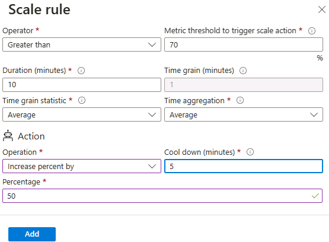

---
lab:
  title: '랩 08: Virtual Machines 관리'
  module: Administer Virtual Machines
---

# 랩 08 - 가상 머신 관리

## 랩 소개

이 랩에서는 가상 머신을 만들고 가상 머신 확장 집합과 비교합니다. 단일 가상 머신을 만들고, 구성하고, 해당 크기를 조정하는 방법을 알아봅니다. 가상 머신 확장 집합을 만들고 자동 크기 조정을 구성하는 방법을 알아봅니다.

이 랩을 수행하려면 Azure 구독이 필요합니다. 구독 유형은 이 랩의 기능 가용성에 영향을 미칠 수 있습니다. 지역을 변경할 수 있지만 단계는 **미국 동부**를 사용하여 작성됩니다.

## 예상 소요 시간: 50분

## 랩 시나리오

조직에서는 Azure Virtual Machines 배포 및 구성을 살펴보고 싶어합니다. 먼저 수동 크기 조정을 통해 Azure Virtual Machines를 구현합니다. 다음으로 가상 머신 확장 집합을 구현하고 자동 크기 조정을 살펴봅니다.

## 대화형 랩 시뮬레이션

이 항목에 유용할 수 있는 대화형 랩 시뮬레이션이 있습니다. 시뮬레이션을 통해 고유의 속도에 맞춰 유사한 시나리오를 클릭할 수 있습니다. 대화형 시뮬레이션과 이 랩에는 차이점이 있지만 핵심 개념은 대부분 동일합니다. Azure 구독은 필요하지 않습니다.

+ [포털에서 가상 머신을 만듭니다](https://mslearn.cloudguides.com/en-us/guides/AZ-900%20Exam%20Guide%20-%20Azure%20Fundamentals%20Exercise%201). 가상 머신을 만들고 웹 서버 역할을 연결 및 설치합니다.

+ [템플릿을 사용하여 가상 머신을 배포합니다](https://mslearn.cloudguides.com/en-us/guides/AZ-900%20Exam%20Guide%20-%20Azure%20Fundamentals%20Exercise%209). QuickStart 갤러리를 탐색하고 가상 머신 템플릿을 찾습니다. 템플릿을 배포하고 배포를 확인합니다.

+ [PowerShell을 사용하여 가상 머신 만들기](https://mslearn.cloudguides.com/en-us/guides/AZ-900%20Exam%20Guide%20-%20Azure%20Fundamentals%20Exercise%2010)를 참조하세요. Azure PowerShell을 사용하여 가상 머신을 배포합니다. Azure Advisor 권장 사항을 검토합니다.

+ [CLI를 사용하여 가상 머신을 만듭니다](https://mslearn.cloudguides.com/en-us/guides/AZ-900%20Exam%20Guide%20-%20Azure%20Fundamentals%20Exercise%2011). CLI를 사용하여 가상 머신을 배포합니다. Azure Advisor 권장 사항을 검토합니다.

## 작업 기술

+ 작업 1: Azure Portal을 사용하여 영역 복원력이 있는 Azure 가상 머신을 배포합니다.
+ 작업 2: 가상 머신의 컴퓨팅 및 스토리지 크기 조정을 관리합니다.
+ 작업 3: Azure Virtual Machine Scale Sets을 만들고 구성합니다.
+ 작업 4: Azure Virtual Machine Scale Sets의 크기를 조정합니다.
+ 작업 5: Azure PowerShell을 사용하여 가상 머신을 만듭니다(선택 사항 1).
+ 작업 6: CLI(선택 사항 2)를 사용하여 가상 머신을 만듭니다.

## Azure Virtual Machines 아키텍처 다이어그램


## 작업 1: Azure Portal을 사용하여 영역 복원력이 있는 Azure Virtual Machines 배포

이 작업에서는 Azure Portal을 사용하여 두 개의 Azure Virtual Machines를 서로 다른 가용성 영역에 배포합니다. 가용성 영역은 가상 머신에 대해 99.99%의 최고 수준의 가동 시간 SLA를 제공합니다. 이 SLA를 달성하려면 서로 다른 가용성 영역에 걸쳐 두 개 이상의 가상 머신을 배포해야 합니다.

1. Azure Portal - `https://portal.azure.com`에 로그인합니다.

1. `Virtual machines`를 검색하여 선택하고 **가상 머신** 블레이드에서 **+ 만들기**를 클릭한 다음 드롭다운에서 **Azure Virtual Machines**을 선택합니다. 다른 선택 사항을 확인합니다.

1. **기본 사항** 탭의 **가용성 영역** 드롭다운 메뉴에서 **영역 2** 옆에 확인 표시를 합니다. 그러면 **영역 1**과 **영역 2**가 모두 선택되어야 합니다.

    >**참고**: 이렇게 하면 선택한 지역에 각 영역에 하나씩 두 개의 가상 머신이 배포됩니다. 2개 이상의 영역에 2개 이상의 VM이 분산되어 있으므로 99.99% 가동 시간 SLA를 달성할 수 있습니다. VM이 하나만 필요한 시나리오에서는 VM을 다른 영역에 계속 배포하는 것이 모범 사례입니다.

1. 기본 탭에서 계속해서 구성을 완료합니다.

    | 설정 | 값 |
    | --- | --- |
    | 구독 | Azure 구독의 이름 |
    | Resource group |  **az104-rg8**(필요한 경우 **새로 만들기** 클릭) |
    | 가상 머신 이름 | `az104-vm1` 및 `az104-vm2`(두 가용성 영역을 모두 선택한 후 VM 이름 필드 아래에서 **이름 편집**을 선택합니다.) |
    | 지역 | **미국 동부** |
    | 가용성 옵션 | **가용성 영역** |
    | 가용성 영역 | **영역 1, 2**(가상 머신 확장 집합 사용에 대한 참고 사항 읽기) |
    | 보안 유형 | **Standard** |
    | 이미지 | **Windows Server 2019 Datacenter - x64 Gen2** |
    | Azure Spot 인스턴스 | **unchecked** |
    | 크기 | **표준 D2s v3** |
    | 사용자 이름 | `localadmin` |
    | 암호 | **보안 암호 제공** |
    | 공용 인바운드 포트 | **없음** |
    | 기존 Windows Server 라이선스를 사용하시겠습니까? | **선택 취소** |

    

1. **다음: 디스크 >** 를 클릭하고 다음 설정을 지정합니다(다른 설정은 기본값으로 유지).

    | 설정 | 값 |
    | --- | --- |
    | OS 디스크 유형 | **프리미엄 SSD** |
    | VM으로 삭제 | **선택됨**(기본값) |
    | Ultra Disk 호환성 사용 | **선택 취소** |

1. **다음: 네트워킹 >** 을 클릭하고 기본값을 사용하지만 부하 분산 장치는 제공하지 않습니다.

    | 설정 | 값 |
    | --- | --- |
    | VM 삭제 시 공용 IP 및 NIC 삭제 | **선택** |
    | 부하 분산 옵션 | **없음** |


1. **다음: 관리 >** 를 클릭하고 다음 설정을 지정합니다(다른 설정은 기본값으로 유지).

    | 설정 | 값 |
    | --- | --- |
    | 패치 오케스트레이션 옵션 | **Azure 오케스트레이션** |  

1. **다음: 모니터링 >** 을 클릭하고 다음 설정을 지정합니다(다른 설정은 기본값으로 유지).

    | 설정 | 값 |
    | --- | --- |
    | 부트 진단 | 사용 안 함 |

1. **다음: 고급 >** 을 클릭하고 기본값을 선택한 다음 **검토 + 만들기**를 클릭합니다.

1. 유효성 검사 후 **만들기**를 클릭합니다.

    >**참고:** 가상 머신이 NIC, 디스크 및 공용 IP 주소(구성된 경우)를 배포할 때 리소스가 독립적으로 만들어지고 관리됩니다.

1. 배포가 완료될 때까지 기다린 다음 **리소스로 이동**을 선택합니다.

   >**참고:** **알림** 메시지를 모니터링합니다.

## 작업 2: 가상 머신의 컴퓨팅 및 스토리지 크기 조정 관리

이 작업에서는 크기를 다른 SKU로 조정하여 가상 머신의 크기를 조정합니다. Azure는 더 많은(또는 더 적은) 컴퓨팅 및 메모리 할당이 필요한 경우 일정 기간 동안 VM을 조정할 수 있도록 VM 크기 선택에 유연성을 제공합니다. 이 개념은 디스크 성능을 수정하거나 할당된 용량을 늘릴 수 있는 디스크로 확장됩니다.

1. **az104-vm1** 가상 머신의 **가용성 + 규모** 블레이드에서 **크기**를 선택합니다.

1. 가상 머신 크기를 **DS1_v2**로 설정하고 **크기 조정**을 클릭합니다. 메시지가 표시되면 변경 내용을 확인합니다.

    >**참고**: **표준 DS1_v2**를 사용할 수 없는 경우 다른 크기를 선택합니다. 크기 조정은 수직 크기 조정(위 또는 아래로)이라고도 합니다.

    

1. **설정** 영역에서 **디스크**를 선택합니다.

1. **데이터 디스크**에서 **+ 새 디스크 만들기 및 연결**을 선택합니다. 설정을 구성합니다(다른 설정은 기본값으로 유지).

    | 설정 | 값 |
    | --- | --- |
    | 디스크 이름 | `vm1-disk1` |
    | 스토리지 유형 | **표준 HDD** |
    | 크기(GiB) | `32` |

1. **적용**을 클릭합니다.

1. 디스크가 만들어지면 **분리**를 클릭한 다음(필요한 경우 오른쪽으로 스크롤하여 분리 아이콘을 확인) **적용**을 클릭합니다.

    >**참고**: 분리하면 VM에서 디스크가 제거되지만 나중에 사용할 수 있도록 스토리지에 보관됩니다.

1. `Disks`을 검색하고 선택합니다. 디스크 목록에서 **vm1-disk1** 개체를 선택합니다.

    >**참고:** **개요** 블레이드는 디스크의 성능 및 사용량 정보도 제공합니다.

1. **설정** 블레이드에서 **크기 + 성능**을 선택합니다.

1. 스토리지 유형을 **표준 SSD**로 설정한 다음 **저장**을 클릭합니다.

1. **az104-vm1** 가상 머신으로 다시 이동하여 **디스크**를 선택합니다.

1. **데이터 디스크** 섹션에서 **기존 디스크 연결**을 선택합니다.

1. **디스크 이름** 드롭다운에서 **VM1-DISK1**을 선택합니다. 

1. 이제 디스크가 **표준 SSD**인지 확인합니다.

1. **적용**을 선택하여 변경 내용을 저장합니다. 

    >**참고:** 이제 가상 머신을 만들고 SKU와 데이터 디스크 크기를 조정했습니다. 다음 작업에서는 Virtual Machine Scale Sets를 사용하여 크기 조정 프로세스를 자동화합니다.

## Azure Virtual Machine Scale Sets 아키텍처 다이어그램


## 작업 3: Azure Virtual Machine Scale Sets 만들기 및 구성

이 작업에서는 가용성 영역 전체에 Azure Virtual Machines 확장 집합을 배포합니다. VM Scale Sets는 확장 집합을 수평으로 크기 조정, 스케일 인 또는 스케일 아웃할 수 있는 메트릭이나 조건을 구성할 수 있도록 하여 자동화의 관리 오버헤드를 줄입니다.

1. Azure Portal에서 `Virtual machine scale sets`를 검색하여 선택하고 **가상 머신 확장 집합** 블레이드에서 **+ 만들기**를 클릭합니다.

1. **가상 머신 확장 집합 만들기** 블레이드의 **기본 사항** 탭에서 다음 설정을 지정하고(다른 설정은 기본값으로 유지) **다음: 스폿 >** 을 클릭합니다.

    | 설정 | 값 |
    | --- | --- |
    | 구독 | Azure 구독의 이름  |
    | Resource group | **az104-rg8**  |
    | 가상 머신 확장 집합 이름 | `vmss1` |
    | 지역 | **(미국)미국 동부** |
    | 가용성 영역 | **영역 1, 2, 3** |
    | 오케스트레이션 모드 | **Uniform** |
    | 보안 유형 | **Standard** |
    | 이미지 | **Windows Server 2019 Datacenter - x64 Gen2** |
    | Azure Spot 할인으로 실행 | **선택 취소** |
    | 크기 | **표준 D2s_v3** |
    | 사용자 이름 | `localadmin` |
    | 암호 | **보안 암호 제공**  |
    | 이미 Windows Server 라이선스가 있나요? | **선택 취소** |

    >**참고**: Windows Virtual Machines를 가용성 영역에 배포하는 것을 지원하는 Azure 영역 목록은 [Azure의 가용성 영역이란 무엇인가요?](https://docs.microsoft.com/en-us/azure/availability-zones/az-overview)를 참조하세요.

    

1. **스폿** 탭에서 기본값을 수락하고 **다음: 디스크 >** 를 클릭합니다.

1. **디스크** 탭에서 기본값을 수락하고 **다음: 네트워킹 >** 을 선택합니다.

1. **네트워킹** 페이지에서 **가상 네트워크** 텍스트 상자 아래에 있는 **가상 네트워크 만들기** 링크를 클릭하고 다음 설정으로 새 가상 네트워크를 만듭니다(다른 설정은 기본값으로 유지).  작업을 마쳤으면 **확인**을 선택합니다.

    | 설정 | 값 |
    | --- | --- |
    | 속성 | `vmss-vnet` |
    | 주소 범위 | `10.82.0.0/20`(있는 내용 변경) |
    | 서브넷 이름 | `subnet0` |
    | 서브넷 범위 | `10.82.0.0/24` |

1. **네트워킹** 탭에서 네트워크 인터페이스 항목 오른쪽에 있는 **네트워크 인터페이스 편집** 아이콘을 클릭합니다.

1. **NIC 네트워크 보안 그룹** 섹션에서 **고급**을 선택한 다음 **네트워크 보안 그룹 구성** 드롭다운 목록에서 **새로 만들기**를 클릭합니다.

1. **네트워크 보안 그룹 만들기** 블레이드에서 다음 설정을 지정합니다(다른 설정은 기본값으로 유지).

    | 설정 | 값 |
    | --- | --- |
    | 속성 | **vmss1-nsg** |

1. **인바운드 규칙 추가**를 클릭하고 다음 설정으로 인바운드 보안 규칙을 추가합니다(나머지는 기본값으로 유지).

    | 설정 | 값 |
    | --- | --- |
    | 원본 | **임의** |
    | 원본 포트 범위 | * |
    | 대상 | **임의** |
    | 서비스 | **HTTP** |
    | 작업 | **허용** |
    | 우선 순위 | **1010** |
    | 이름 | `allow-http` |

1. **추가**를 클릭하고 **네트워크 보안 그룹 만들기** 블레이드로 돌아와서 **확인**을 클릭합니다.

1. **공용 IP 주소** 섹션의 **네트워크 인터페이스 편집** 블레이드에서 **활성화**를 클릭하고 **확인**을 클릭합니다.

1. **네트워킹** 탭의 **부하 분산** 섹션에서 다음을 지정합니다(다른 설정은 기본값으로 유지).

    | 설정 | 값 |
    | --- | --- |
    | 부하 분산 옵션 | **Azure Load Balancer** |
    | 부하 분산 장치 선택 | **부하 분산 장치 만들기** |

1. **부하 분산 장치 만들기** 페이지에서 부하 분산 장치 이름을 지정하고 기본값을 사용합니다. 완료되면 **만들기**를 클릭한 후, **다음: 관리 >** 를 클릭합니다.

    | 설정 | 값 |
    | --- | --- |
    | 부하 분산 장치 이름 | `vmss-lb` |

    >**참고:** 잠시 멈추고 자신이 한 일을 검토해 보세요. 이제 디스크와 네트워킹을 사용하여 가상 머신 확장 집합을 구성했습니다. 네트워크 구성에서 네트워크 보안 그룹을 만들고 HTTP를 허용했습니다. 또한 공용 IP 주소를 사용하여 부하 분산 장치를 만들었습니다.

1. **관리** 탭에서 다음 설정을 지정합니다(다른 설정은 기본값으로 유지).

    | 설정 | 값 |
    | --- | --- |
    | 부트 진단 | 사용 안 함 |

1. **다음: 상태>** 를 클릭합니다.

1. **상태** 탭에서 변경하지 않고 기본 설정을 검토하고 **다음: 고급 >** 을 클릭합니다.

1. **고급** 탭에서 **검토 + 만들기**를 클릭합니다.

1. **검토 + 만들기** 탭에서 유효성 검사가 통과되었는지 유효성을 검사하고 **만들기**를 클릭합니다.

    >**참고**: 가상 머신 확장 집합 배포가 완료될 때까지 기다립니다. 이 작업은 약 5분 정도 소요됩니다. 기다리는 동안 [설명서](https://learn.microsoft.com/azure/virtual-machine-scale-sets/overview)를 검토합니다.

## 작업 4: Azure Virtual Machine Scale Sets 크기 조정

이 작업에서는 사용자 지정 크기 조정 규칙을 사용하여 가상 머신 확장 집합의 크기를 조정합니다.

1. **리소스로 이동**을 선택하거나 **vmss1** 확장 집합을 검색하여 선택합니다.

1. 왼쪽 메뉴에서 **가용성 + 크기 조정**을 선택한 다음 **크기 조정**을 선택합니다.

>**유용한 정보** **수동 크기 조정** 또는 **사용자 지정 자동 크기 조정**이 가능합니다. VM 인스턴스 수가 적은 확장 집합에서는 인스턴스 수를 늘리거나 줄이는 것(수동 크기 조정)이 가장 좋을 수 있습니다. VM 인스턴스 수가 많은 확장 집합에서는 메트릭을 기반으로 한 크기 조정(사용자 지정 자동 크기 조정)이 더 적절할 수 있습니다.

### 스케일 아웃 규칙

1. **사용자 지정 자동 크기 조정**을 선택합니다. 그런 다음 **크기 조정 모드**를 **메트릭 기반 크기 조정**으로 변경합니다. 그런 다음 **규칙 추가**를 선택합니다.

1. VM 인스턴스 수를 자동으로 늘리는 규칙을 만들어 보겠습니다. 이 규칙은 평균 CPU 로드가 10분 동안 70%를 초과하면 크기 조정됩니다. 규칙이 트리거되면 VM 인스턴스 수가 20% 증가합니다.

    | 설정 | 값 |
    | --- | --- |
    | 메트릭 원본 | **현재 리소스(vmss1)** |
    | 메트릭 네임스페이스 | **가상 머신 호스트** |
    | 메트릭 이름 | **CPU 비율**(다른 선택 사항 검토) |
    | 연산자 | **보다 큼** |
    | 크기 조정 작업을 트리거하는 메트릭 임계값 | **70** |
    | 기간(분) | **10** |
    | 시간 조직 통계 | **평균** |
    | 연산 | **비율 증가 기준**(다른 선택 사항 검토) |
    | 정지 시간(분) | **5** |
    | 백분율 | **20** |

    

1. 변경 내용을 **저장**합니다.

### 스케일 인 규칙

1. 저녁이나 주말에는 수요가 감소할 수 있으므로 스케일 인 규칙을 만들어야 합니다.

1. 확장 집합의 VM 인스턴스 수를 줄이는 규칙을 만들어 보겠습니다. 평균 CPU 로드가 10분 동안 30% 미만으로 떨어지면 인스턴스 수가 감소해야 합니다. 규칙이 트리거되면 VM 인스턴스 수가 20% 감소합니다.

1. **규칙 추가**를 선택하고 설정을 조정한 다음 **추가**를 선택합니다.

    | 설정 | 값 |
    | --- | --- |
    | 연산자 | **보다 작음** |
    | 임계값 | **30** |
    | 연산 | **비율 감소 기준**(다른 선택 사항 검토) |
    | 백분율 | **20** |

1. 변경 내용을 **저장**합니다.

### 인스턴스 한도 설정

1. 자동 크기 조정 규칙이 적용되면 인스턴스 제한은 인스턴스의 최대 개수를 넘어 스케일 아웃하거나 인스턴스의 최소 개수 아래로 스케일 인하지 않도록 합니다.

1. **인스턴스 한도**는 규칙 뒤의 **크기 조정** 페이지에 표시됩니다.

    | 설정 | 값 |
    | --- | --- |
    | 최소 | **2** |
    | 최대 | **10** |
    | 기본값 | **2** |

1. 변경 내용을 **저장**해야 합니다.

1. **vmss1** 페이지에서 **인스턴스**를 선택합니다. 여기서는 가상 머신 인스턴스 수를 모니터링합니다.

    >**참고:** 가상 머신을 만들기 위해 Azure PowerShell을 사용하는 데 관심이 있다면 작업 5를 시도해 보세요. CLI를 사용하여 가상 머신을 만드는 데 관심이 있다면 작업 6을 시도해 보세요.

## 작업 5: Azure PowerShell을 사용하여 가상 머신을 만듭니다(옵션 1).

1. 아이콘(오른쪽 상단)을 사용하여 **Cloud Shell** 세션을 시작합니다. 또는 `https://shell.azure.com`으로 직접 이동합니다.

1. 반드시 **PowerShell**을 선택합니다. 필요한 경우 셸 스토리지를 구성합니다.

1. 다음 명령을 실행하여 가상 머신을 만듭니다. 메시지가 표시되면 VM의 사용자 이름과 암호를 제공합니다. 기다리는 동안 가상 머신 만들기와 관련된 모든 매개 변수에 대한 [New-AzVM](https://learn.microsoft.com/powershell/module/az.compute/new-azvm?view=azps-11.1.0) 명령 참조를 확인합니다.

    ```powershell
    New-AzVm `
    -ResourceGroupName 'az104-rg8' `
    -Name 'myPSVM' `
    -Location 'East US' `
    -Image 'Win2019Datacenter' `
    -Zone '1' `
    -Size 'Standard_D2s_v3' `
    -Credential (Get-Credential)
    ```

1. 명령이 완료되면 **Get-AzVM**을 사용하여 리소스 그룹의 가상 머신을 나열합니다.

    ```powershell
    Get-AzVM `
    -ResourceGroupName 'az104-rg8' `
    -Status
    ```

1. 새 가상 머신이 나열되고 **상태**가 **실행 중**인지 확인합니다.

1. 가상 머신 할당을 취소하려면 **Stop-AzVM**을 사용합니다. **예**를 입력하여 확인

    ```powershell
    Stop-AzVM `
    -ResourceGroupName 'az104-rg8' `
    -Name 'myPSVM' 
    ```

1. **-Status** 매개 변수와 함께 **Get-AzVM**을 사용하여 컴퓨터가 **할당 취소**되었는지 확인합니다.

    >**유용한 정보** Azure를 사용하여 가상 머신을 중지하면 상태는 *할당 취소*입니다. 이는 모든 비정적 공용 IP가 해제되고 VM의 컴퓨팅 비용 지불이 중단됨을 의미합니다.

## 작업 6: CLI를 사용하여 가상 머신 만들기(옵션 2)

1. 아이콘(오른쪽 상단)을 사용하여 **Cloud Shell** 세션을 시작합니다. 또는 `https://shell.azure.com`으로 직접 이동합니다.

1. 반드시 **Bash**를 선택합니다. 필요한 경우 셸 스토리지를 구성합니다.

1. 다음 명령을 실행하여 가상 머신을 만듭니다. 메시지가 표시되면 VM의 사용자 이름과 암호를 제공합니다. 기다리는 동안 가상 머신 만들기와 관련된 모든 매개 변수에 대한 [az vm create](https://learn.microsoft.com/cli/azure/vm?view=azure-cli-latest#az-vm-create) 명령 참조를 확인합니다.

    ```sh
    az vm create --name myCLIVM --resource-group az104-rg8 --image Ubuntu2204 --admin-username localadmin --generate-ssh-keys
    ```

1. 명령이 완료되면 **az vm show**를 사용하여 컴퓨터가 만들어졌는지 확인합니다.

    ```sh
    az vm show --name  myCLIVM --resource-group az104-rg8 --show-details
    ```

1. **powerState**가 **VM 실행 중**인지 확인합니다.

1. 가상 머신 할당을 취소하려면 **az vm deallocate**를 사용합니다. **예**를 입력하여 확인

    ```sh
    az vm deallocate --resource-group az104-rg8 --name myCLIVM
    ```

1. **az vm show**를 사용하여 **powerState**가 **VM 할당 취소됨**인지 확인합니다.

    >**유용한 정보** Azure를 사용하여 가상 머신을 중지하면 상태는 *할당 취소*입니다. 이는 모든 비정적 공용 IP가 해제되고 VM의 컴퓨팅 비용 지불이 중단됨을 의미합니다.

## 리소스 정리

**고유의 구독**으로 작업하는 경우 랩 리소스를 삭제해 보세요. 이렇게 하면 리소스가 확보되고 비용이 최소화됩니다. 랩 리소스를 삭제하려면 랩 리소스 그룹을 삭제하는 것이 가장 쉽습니다. 

+ Azure Portal에서 리소스 그룹을 선택하고 **리소스 그룹 삭제**, **리소스 그룹 이름 입력**을 선택한 다음 **삭제**를 클릭합니다.
+ Azure PowerShell 사용, `Remove-AzResourceGroup -Name resourceGroupName`.
+ CLI 사용, `az group delete --name resourceGroupName`.

## Copilot을 사용하여 학습 확장
Copilot은 Azure 스크립팅 도구를 사용하는 방법을 익히는 데 도움을 줍니다. 또한 Copilot은 랩에서 다루지 않는 영역이나 추가 정보가 필요한 영역을 지원할 수 있습니다. Edge 브라우저를 열고 Copilot(오른쪽 위)을 선택하거나 *copilot.microsoft.com*으로 이동하세요. 몇 분 정도 시간을 내어 이러한 프롬프트를 사용해 보세요.

+ Linux 가상 머신을 만드는 단계 및 Azure CLI 명령을 제공합니다. 
+ 가상 머신의 크기를 조정하고 성능을 높일 수 있는 방법을 검토합니다.
+ Azure Storage 수명 주기 관리 정책과 비용을 최적화하는 방법을 설명합니다.

## 자기 주도적 학습을 통해 자세히 알아보기

+ [Azure에서 Windows 가상 머신을 만듭니다](https://learn.microsoft.com/training/modules/create-windows-virtual-machine-in-azure/). Azure Portal을 사용하여 Windows 가상 머신을 만듭니다. 원격 데스크톱을 사용하여 실행 중인 Windows 가상 머신에 연결
+ [Virtual Machine Scale Sets를 사용하여 확장성 있는 애플리케이션을 빌드합니다](https://learn.microsoft.com/training/modules/build-app-with-scale-sets/). 애플리케이션이 가상 머신 확장 집합을 사용하여 변경 사항에 맞게 자동으로 조정되는 한편 비용을 최소화하도록 지원하세요.
+ [Azure Bastion을 사용하여 Azure Portal을 통해 가상 머신에 연결](https://learn.microsoft.com/en-us/training/modules/connect-vm-with-azure-bastion/). Azure Portal 내에서 직접 Azure Virtual Machines에 안전하게 연결하여 기존 Jumpbox 솔루션을 효과적으로 바꾸고, 진단 로그를 사용하여 원격 세션을 모니터링하고, 사용자 세션 연결을 끊어 원격 세션을 관리하려면 Azure Bastion을 배포합니다.

## 핵심 내용

축하합니다. 랩을 완료했습니다. 이 랩의 주요 내용은 다음과 같습니다.

+ Azure Virtual Machines는 주문형 확장성 있는 컴퓨팅 리소스입니다.
+ Azure Virtual Machines는 수직 및 수평적 크기 조정 옵션을 모두 제공합니다.
+ Azure Virtual Machines 구성에는 운영 체제, 크기, 스토리지 및 네트워킹 설정 선택이 포함됩니다.
+ Azure Virtual Machine Scale Sets를 사용하면 부하 분산된 VM의 그룹을 만들고 관리할 수 있습니다.
+ 가상 머신 확장 집합의 가상 머신은 동일한 이미지와 구성에서 만들어집니다.
+ 가상 머신 규모 집합에서는 수요나 정의된 일정에 따라 VM 인스턴스 수가 자동으로 늘어나거나 줄어들 수 있습니다.
