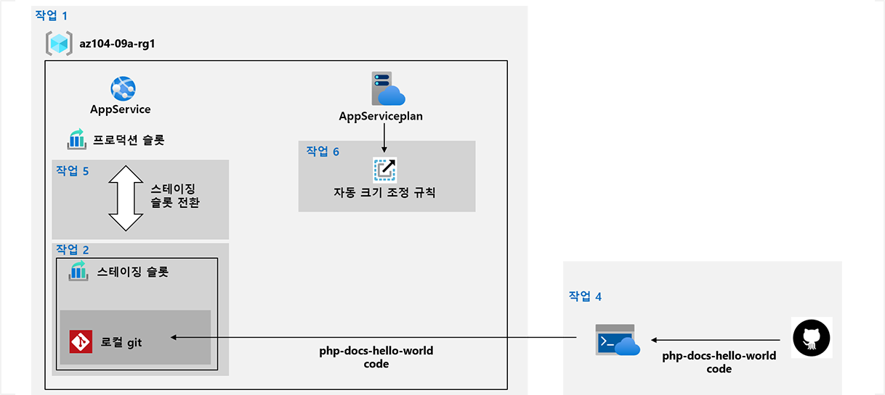

---
lab:
  title: 09a - 웹앱 구현
  module: Administer Serverless Computing
---

# <a name="lab-09a---implement-web-apps"></a>랩 09a - 웹앱 구현
# <a name="student-lab-manual"></a>학생용 랩 매뉴얼

## <a name="lab-scenario"></a>랩 시나리오

You need to evaluate the use of Azure Web apps for hosting Contoso's web sites, hosted currently in the company's on-premises data centers. The web sites are running on Windows servers using PHP runtime stack. You also need to determine how you can implement DevOps practices by leveraging Azure web apps deployment slots.

대화형 가이드 형식으로 이 랩을 미리 보려면 **[여기를 클릭하세요](https://mslabs.cloudguides.com/en-us/guides/AZ-104%20Exam%20Guide%20-%20Microsoft%20Azure%20Administrator%20Exercise%2013)** .

## <a name="objectives"></a>목표

이 랩에서는 다음을 수행합니다.

+ 작업 1: Azure 웹앱 만들기
+ 작업 2: 스테이징 배포 슬롯 만들기
+ 작업 3: 웹앱 배포 설정 구성
+ 작업 4: 스테이징 배포 슬롯에 코드 배포
+ 작업 5: 스테이징 슬롯 교환
+ 작업 6: Azure 웹앱의 자동 크기 조정 구성 및 테스트

## <a name="estimated-timing-30-minutes"></a>예상 소요 시간: 30분

## <a name="architecture-diagram"></a>아키텍처 다이어그램



## <a name="instructions"></a>Instructions

### <a name="exercise-1"></a>연습 1

#### <a name="task-1-create-an-azure-web-app"></a>작업 1: Azure 웹앱 만들기

이 작업에서는 Azure 웹앱을 만듭니다.

1. [**Azure Portal**](http://portal.azure.com)에 로그인합니다.

1. Azure Portal에서 **App Services**를 검색 및 선택하고 **App Services** 블레이드에서 **+ 만들기**를 클릭합니다.

1. **웹앱 만들기** 블레이드의 **기본** 탭에서 다음 설정을 지정합니다(다른 설정은 기본값으로 유지).

    | 설정 | 값 |
    | --- | ---|
    | Subscription | 이 랩에서 사용 중인 Azure 구독의 이름 |
    | Resource group | 새 리소스 그룹 **az104-09a-rg1**의 이름 |
    | 웹앱 이름 | 전역으로 고유한 이름 |
    | 게시 | **코드** |
    | 런타임 스택 | **PHP 7.4** |
    | 운영 체제 | **Windows** |
    | 지역 | Azure 웹앱을 프로비전할 수 있는 Azure 지역의 이름 |
    | App Service 플랜 | 기본 구성 수락 |

1. Click <bpt id="p1">**</bpt>Review + create<ept id="p1">**</ept>. On the <bpt id="p1">**</bpt>Review + create<ept id="p1">**</ept> tab of the <bpt id="p2">**</bpt>Create Web App<ept id="p2">**</ept> blade, ensure that the validation passed and click <bpt id="p3">**</bpt>Create<ept id="p3">**</ept>.

    ><bpt id="p1">**</bpt>Note<ept id="p1">**</ept>: Wait until the web app is created before you proceed to the next task. This should take about a minute.

1. 배포 블레이드에서 **리소스로 이동**을 클릭합니다.

#### <a name="task-2-create-a-staging-deployment-slot"></a>작업 2: 스테이징 배포 슬롯 만들기

이 작업에서는 스테이징 배포 슬롯을 만듭니다.

1. 새로 배포된 웹앱의 블레이드에서 **URL** 링크를 클릭하여 새 브라우저 탭에 기본 웹 페이지를 표시합니다.

1. 새 브라우저 탭을 닫고 Azure Portal로 돌아가 웹앱 블레이드의 **배포** 섹션에서 **배포 슬롯**을 클릭합니다.

    >**참고**: 이 시점에서 웹앱에는 **PRODUCTION** 레이블이 붙여진 단일 배포 슬롯이 있습니다.

1. **+ 슬롯 추가**를 클릭하고 다음 설정으로 새 슬롯을 추가합니다.

    | 설정 | 값 |
    | --- | ---|
    | Name | **staging** |
    | 설정 복제 위치 | **설정을 복제하지 않음**|

1. 웹앱의 **배포 슬롯** 블레이드로 돌아가서 새로 만든 스테이징 슬롯을 나타내는 항목을 클릭합니다.

    >**참고**: 이렇게 하면 스테이징 슬롯의 특성이 표시되는 블레이드가 열립니다.

1. 스테이징 슬롯 블레이드를 검토하고 URL이 프로덕션 슬롯에 할당된 URL과 다르다는 것에 유의합니다.

#### <a name="task-3-configure-web-app-deployment-settings"></a>작업 3: 웹앱 배포 설정 구성

이 작업에서는 웹앱 배포 설정을 구성합니다.

1. 스테이징 배포 슬롯 블레이드의 **배포** 섹션에서 **배포 센터**를 클릭하고 **설정** 탭을 클릭합니다.

    >**참고:** (프로덕션 슬롯이 아닌) 스테이징 슬롯 블레이드에 있는지 확인합니다.
    
1. **설정** 탭의 **소스** 드롭다운 목록에서 **로컬 Git**를 선택하고 **저장** 단추를 클릭합니다.

1. **배포 센터** 블레이드에서 **Git Clone Url** 항목을 메모장에 복사합니다.

    >**참고:** 이 랩의 다음 작업에는 Git Clone URL 값이 필요합니다.

1. **배포 센터** 블레이드에서 **로컬 Git/FTPS 자격 증명** 탭을 선택하고, **사용자 범위** 섹션에서 다음 설정을 지정하고 **저장**을 클릭합니다.

    | 설정 | 값 |
    | --- | ---|
    | 사용자 이름 | 전역적으로 고유한 이름(`@` 문자를 포함하면 안 됨) |
    | 암호 | 복잡성 요구 사항을 충족하는 모든 암호|

    >**참고:** 암호는 8자 이상이어야 하고 문자, 숫자, 영숫자가 아닌 문자 중 두 가지가 포함되어야 합니다.

    >**참고:** 이 랩의 다음 작업에서 이 자격 증명이 필요합니다.

#### <a name="task-4-deploy-code-to-the-staging-deployment-slot"></a>작업 4: 스테이징 배포 슬롯에 코드 배포

이 작업에서는 준비 배포 슬롯에 코드를 배포합니다.

1. Azure Portal에서 오른쪽 상단의 아이콘을 클릭하여 **Azure Cloud Shell**을 엽니다.

1. **Bash**와 **PowerShell** 중에서 선택하라는 메시지가 표시되면 **PowerShell**을 선택합니다.

    >**참고**: **Cloud Shell**을 처음 시작했는데 **탑재된 스토리지 없음**이라는 메시지가 표시되면 이 랩에서 사용하는 구독을 선택하고 **스토리지 만들기**를 클릭합니다.

1. Cloud Shell 창에서 다음을 실행하여 웹앱용 코드를 포함하고 있는 원격 리포지토리를 복제합니다.

   ```powershell
   git clone https://github.com/Azure-Samples/php-docs-hello-world
   ```

1. Cloud Shell 창에서 다음 명령을 실행하여 샘플 웹앱 코드를 포함하고 있는 로컬 리포지토리의 새로 만들어진 복제본으로 현재 위치를 설정합니다.

   ```powershell
   Set-Location -Path $HOME/php-docs-hello-world/
   ```

1. Cloud Shell 창에서 다음을 실행하여 원격 Git을 추가합니다(이전 작업에서 식별한 `[deployment_user_name]` 및 `[git_clone_url]` 자리 표시자를 각각 **배포 자격 증명** 사용자 이름 및 **Git Clone Url** 값으로 바꿔야 함).

   ```powershell
   git remote add [deployment_user_name] [git_clone_url]
   ```

    >**참고**: `git remote add` 뒤에 오는 값은 **배포 자격 증명** 사용자 이름과 일치하지 않아도 되지만 고유해야 합니다.

1. Cloud Shell 창에서 샘플 웹앱 코드를 로컬 리포지토리에서 Azure 웹앱 스테이징 배포 슬롯으로 푸시하려면 다음 명령을 실행합니다(`[deployment_user_name]` 자리 표시자를 이전 작업에서 식별한 **배포 자격 증명** 사용자 이름의 값으로 바꿔야 함).

   ```powershell
   git push [deployment_user_name] master
   ```

1. 인증하라는 메시지가 표시되면 `[deployment_user_name]`과 해당 암호(이전 작업에서 설정한 암호)를 입력합니다.

1. Cloud Shell 창을 닫습니다.

1. 스테이징 슬롯 블레이드에서 **개요**를 클릭한 다음 **URL** 링크를 클릭하여 새 브라우저 탭에 기본 웹 페이지를 표시합니다.

1. Verify that the browser page displays the <bpt id="p1">**</bpt>Hello World!<ept id="p1">**</ept> message and close the new tab.

#### <a name="task-5-swap-the-staging-slots"></a>작업 5: 스테이징 슬롯 교환

이 작업에서는 스테이징 슬롯을 프로덕션 슬롯으로 전환합니다.

1. 웹앱의 프로덕션 슬롯을 표시하는 블레이드로 다시 돌아갑니다.

1. **배포** 섹션에서 **배포 슬롯**을 클릭한 다음 **전환** 도구 모음 아이콘을 클릭합니다.

1. **교환** 블레이드에서 기본 설정을 검토하고 **교환**를 클릭합니다.

1. 웹앱의 프로덕션 슬롯 블레이드의 **개요**를 클릭한 다음 **URL** 링크를 클릭하여 브라우저 탭에 웹사이트 홈페이지를 표시합니다.

1. Verify the default web page has been replaced with the <bpt id="p1">**</bpt>Hello World!<ept id="p1">**</ept> page.

#### <a name="task-6-configure-and-test-autoscaling-of-the-azure-web-app"></a>작업 6: Azure 웹앱의 자동 크기 조정 구성 및 테스트

이 작업에서는 Azure 웹앱의 자동 크기 조정을 구성하고 테스트합니다.

1. 웹앱의 프로덕션 슬롯을 표시하는 블레이드의 **설정** 섹션에서 **규모 확장(App Service 계획)** 을 클릭합니다.

1. **사용자 지정 자동 크기 조정**을 클릭합니다.

    >**참고**: 또한 웹앱을 수동으로 크기 조정할 수 있는 옵션이 있습니다.

1. 기본 옵션인 **메트릭 기준 크기 조정**을 선택한 채로 두고 **+ 규칙 추가**를 클릭합니다

1. **스케일링 규칙** 블레이드에서 다음 설정을 지정합니다(다른 설정은 기본값으로 유지).

    | 설정 | 값 |
    | --- |--- |
    | 메트릭 원본 | **현재 리소스** |
    | 시간 집계 | **최댓값** |
    | 메트릭 네임스페이스 | **App Service 요금제 표준 메트릭** |
    | 메트릭 이름 | **CPU 비율** |
    | 연산자 | **보다 큼** |
    | 크기 조정 작업을 트리거하는 메트릭 임계값 | **10** |
    | 기간(분) | **1** |
    | 시간 조직 통계 | **최댓값** |
    | 작업 | **다음을 기준으로 개수 늘이기** |
    | 인스턴트 수 | **1** |
    | 정지 시간(분) | **5** |

    >**참고**: 이러한 값은 대기 기간이 연장되지 않고 가능한 한 빨리 자동 크기 조정을 트리거하는 것이 목적이기 때문에 사실적인 구성을 나타내지 않습니다.

1. **추가**를 클릭하고 App Service 계획 크기 조정 블레이드로 돌아가서 다음 설정을 지정합니다(나머지 설정은 기본값으로 남겨둡니다).

    | 설정 | 값 |
    | --- |--- |
    | 인스턴스 한도 최소 | **1** |
    | 인스턴스 한도 최대 | **2** |
    | 인스턴스 한도 기본 | **1** |

1. **저장**을 클릭합니다.

    >**참고**: ‘microsoft.insights’ 리소스 공급자가 등록되지 않았다는 오류가 발생하면 cloudshell에서 `az provider register --namespace 'Microsoft.Insights'`를 실행하고 자동 스케일링 규칙을 다시 저장합니다.

1. Azure Portal에서 오른쪽 상단의 아이콘을 클릭하여 **Azure Cloud Shell**을 엽니다.

1. **Bash**와 **PowerShell** 중에서 선택하라는 메시지가 표시되면 **PowerShell**을 선택합니다.

1. Cloud Shell 창에서 다음 명령을 실행하여 Azure 웹앱의 URL을 식별합니다.

   ```powershell
   $rgName = 'az104-09a-rg1'

   $webapp = Get-AzWebApp -ResourceGroupName $rgName
   ```

1. Cloud Shell 창에서 다음을 실행하여 HTTP 요청을 웹앱으로 보내는 시작 루프와 무한 루프를 실행합니다.

   ```powershell
   while ($true) { Invoke-WebRequest -Uri $webapp.DefaultHostName }
   ```

1. Cloud Shell 창을 최소화하고(닫지 않음) 웹앱 블레이드의 **모니터링** 섹션에서 **프로세스 탐색기**를 클릭합니다.

    >**참고**: 프로세스 탐색기는 인스턴스 수와 리소스 사용률 모니터링을 용이하게 합니다.

1. 사용률과 인스턴스 수를 몇 분 동안 모니터링합니다.

    >**참고**: 페이지 **새로 고침**이 필요할 수도 있습니다.

1. 인스턴스 수가 2개로 증가하면 Cloud Shell 창을 다시 열고 **Ctrl+C**를 눌러 스크립트를 종료합니다.

1. Cloud Shell 창을 닫습니다.

#### <a name="clean-up-resources"></a>리소스 정리

>현재 회사의 온-프레미스 데이터 센터에서 호스팅되는 Contoso의 웹 사이트를 호스팅하기 위해 Azure 웹앱의 사용을 평가해야 합니다.

>웹 사이트는 PHP 런타임 스택을 사용하여 Windows 서버에서 실행되고 있습니다. 

1. Azure Portal의 **Cloud Shell** 창에서 **PowerShell** 세션을 엽니다.

1. 다음 명령을 실행하여 이 모듈의 전체 랩에서 생성된 모든 리소스 그룹을 나열합니다.

   ```powershell
   Get-AzResourceGroup -Name 'az104-09a*'
   ```

1. 다음 명령을 실행하여 이 모듈의 랩 전체에서 만든 모든 리소스 그룹을 삭제합니다.

   ```powershell
   Get-AzResourceGroup -Name 'az104-09a*' | Remove-AzResourceGroup -Force -AsJob
   ```

    >**참고**: 이 명령은 -AsJob 매개 변수에 의해 결정되어 비동기로 실행되므로, 동일한 PowerShell 세션 내에서 이 명령을 실행한 직후 다른 PowerShell 명령을 실행할 수 있지만 리소스 그룹이 실제로 제거되기까지는 몇 분 정도 걸립니다.

#### <a name="review"></a>검토

이 랩에서는 다음을 수행합니다.

+ Azure 웹앱 만들기
+ 스테이징 배포 슬롯 만들기
+ 구성된 웹 앱 배포 설정
+ 스테이징 배포 슬롯에 코드 배포
+ 스테이징 슬롯 교체
+ Azure 웹 앱의 자동 크기 조정 구성 및 테스트
