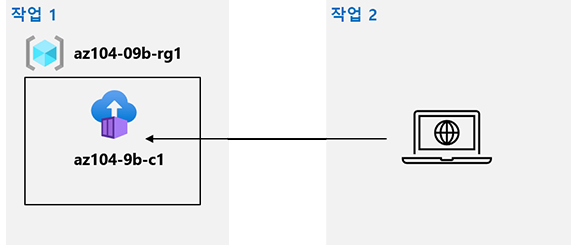

---
lab:
  title: '랩 09b: Azure Container Instances 구현'
  module: Administer PaaS Compute Options
---

# 랩 09b - Azure Container Instances 구현
# 학생용 랩 매뉴얼

## 랩 시나리오

Contoso는 가상화된 워크로드에 대한 새로운 플랫폼을 찾고자 합니다. 이 목표를 달성하기 위해 활용할 수 있는 여러 컨테이너 이미지를 식별했습니다. 컨테이너 관리를 최소화할 목적으로 Docker 이미지 배포에 대한 Azure Container Instances 사용을 평가할 계획입니다.

                **참고:** **[대화형 랩 시뮬레이션](https://mslabs.cloudguides.com/guides/AZ-104%20Exam%20Guide%20-%20Microsoft%20Azure%20Administrator%20Exercise%2014)** 을 사용하여 이 랩을 원하는 속도로 클릭할 수 있습니다. 대화형 시뮬레이션과 호스트된 랩 간에 약간의 차이가 있을 수 있지만 보여주는 핵심 개념과 아이디어는 동일합니다. 

## 목표

이 랩에서는 다음을 수행합니다.

- 작업 1: Docker 이미지를 사용하여 Azure Container Instance 배포
- 작업 2: Azure Container Instance의 기능 검토

## 예상 소요 시간: 20분

## 아키텍처 다이어그램



### 지침

## 연습 1

## 작업 1: Docker 이미지를 사용하여 Azure Container Instance 배포

이 작업에서는 웹 애플리케이션에 대한 새 컨테이너 인스턴스를 만듭니다.

1. [Azure Portal](https://portal.azure.com)에 로그인합니다.

1. Azure Portal에서 **컨테이너 인스턴스**를 찾은 다음 **컨테이너 인스턴스** 블레이드에서 **+ 만들기**를 클릭합니다.

1. **Container Instance 만들기** 블레이드의 **기본** 탭에서 다음 설정을 지정합니다(다른 설정은 기본값으로 남겨둠).

    | 설정 | 값 |
    | ---- | ---- |
    | 구독 | 이 랩에서 사용 중인 Azure 구독의 이름 |
    | Resource group | 새 리소스 그룹 **az104-09b-rg1**의 이름 |
    | 컨테이너 이름 | **az104-9b-c1** |
    | 지역 | Azure Container Instances를 프로비전할 수 있는 지역 이름 |
    | 이미지 원본 | **빠른 시작 이미지** |
    | 이미지 | **mcr.microsoft.com/azuredocs/aci-helloworld:latest(Linux)** |

1. **다음: 네트워킹 >** 및 **컨테이너 인스턴스 만들기** 블레이드의 **네트워킹** 탭에서 다음 설정을 지정합니다(다른 설정은 기본값으로 유지).

    | 설정 | 값 |
    | --- | --- |
    | DNS 이름 레이블 | 유효하고 전역적으로 고유한 DNS 호스트 이름 |

    >**참고**: dns-name-label.region.azurecontainer.io에서 컨테이너에 공개적으로 연결할 수 있습니다. **DNS 이름 레이블을 사용할 수 없음** 오류 메시지가 표시되면, 다른 값을 지정하세요.

1. **다음: 고급 >** , 변경하지 않고 **컨테이너 인스턴스 만들기** 블레이드의 **고급** 탭에서 설정을 검토하고 **검토 + 만들기**를 클릭한 다음, 유효성 검사를 통과했는지 확인하고 **만들기**를 클릭합니다.

    >**참고**: 배포가 완료될 때까지 기다리세요. 이 작업은 3분 정도 걸립니다.

    >**참고**: 기다리는 동안 [샘플 애플리케이션에 있는 코드](https://github.com/Azure-Samples/aci-helloworld)를 확인할 수 있습니다. 이 코드를 보려면 \\앱 폴더를 찾아보세요.

## 작업 2: Azure Container Instance의 기능 검토

이 작업에서는 컨테이너 인스턴스의 배포를 검토합니다.

1. 배포 블레이드에서 **리소스로 이동** 링크를 클릭합니다.

1. 컨테이너 인스턴스의 **개요** 블레이드에서 **상태**가 **실행 중**으로 보고되는지 확인합니다.

1. 컨테이너 인스턴스 **FQDN**의 값을 복사하고 새 브라우저 탭을 열고 해당 URL로 이동합니다.

1. **Azure Container Instance에 오신 것을 환영합니다** 페이지가 표시되는지 확인합니다.

1. 새 브라우저 탭을 닫고 Azure Portal로 돌아가서 컨테이너 인스턴스 블레이드의 **설정** 섹션에서 **컨테이너**를 클릭한 다음 **로그**를 클릭합니다.

1. 브라우저에 애플리케이션을 표시하여 생성된 HTTP GET 요청을 나타내는 로그 항목이 표시되는지 확인합니다.

## 리소스 정리

>**참고**: 더 이상 사용하지 않는 새로 만든 Azure 리소스는 모두 제거하세요. 사용되지 않는 리소스를 제거하면 예기치 않은 요금이 발생하지 않습니다.

>**참고**:  랩 리소스를 즉시 제거할 수 없어도 걱정하지 마세요. 리소스에 종속성이 있고 삭제하는 데 시간이 오래 걸리는 경우가 있습니다. 리소스 사용량을 모니터링하는 것은 일반적인 관리자 작업이므로 포털에서 리소스를 주기적으로 검토하여 정리가 어떻게 진행되고 있는지 확인합니다. 

1. Azure Portal의 **Cloud Shell** 창에서 **PowerShell** 세션을 엽니다.

    >**참고**: 이러한 명령이 작동하려면 Cloud Shell 스토리지를 만들어야 합니다. 

1. 다음 명령을 실행하여 이 모듈의 전체 랩에서 생성된 모든 리소스 그룹을 나열합니다.

   ```powershell
   Get-AzResourceGroup -Name 'az104-09b*'
   ```

1. 다음 명령을 실행하여 이 모듈의 랩 전체에서 만든 모든 리소스 그룹을 삭제합니다.

   ```powershell
   Get-AzResourceGroup -Name 'az104-09b*' | Remove-AzResourceGroup -Force -AsJob
   ```

    >**참고**: 이 명령은 -AsJob 매개 변수에 의해 결정되어 비동기로 실행되므로, 동일한 PowerShell 세션 내에서 이 명령을 실행한 직후 다른 PowerShell 명령을 실행할 수 있지만 리소스 그룹이 실제로 제거되기까지는 몇 분 정도 걸립니다.

## 검토

이 랩에서는 다음을 수행합니다.

- Azure Container Instance를 사용하여 Docker 이미지 배포
- Azure Container Instance 기능 검토
