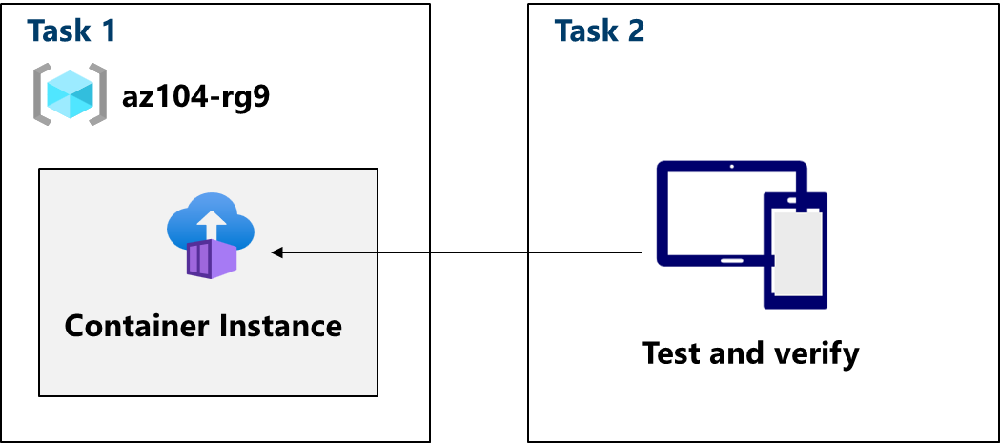

---
lab:
  title: '랩 09b: Azure Container Instances 구현'
  module: Administer PaaS Compute Options
---

# 랩 09b - Azure Container Instances 구현

## 랩 소개

이 랩에서는 Azure Container Instances를 구현하고 배포하는 방법을 알아봅니다.

이 랩에는 Azure 구독이 필요합니다. 구독 유형은 이 랩의 기능 가용성에 영향을 줄 수 있습니다. 지역을 변경할 수 있지만 단계는 미국** 동부를 사용하여 **작성됩니다.

## 예상 소요 시간: 15분

## 랩 시나리오

조직에는 온-프레미스 데이터 센터의 가상 머신에서 실행되는 웹 애플리케이션이 있습니다. 조직은 모든 애플리케이션을 클라우드로 이동하려고 하지만 관리할 서버가 많이 없도록 하고 싶지는 않습니다. Azure Container Instances 및 Docker를 평가하기로 결정합니다. 
## 대화형 랩 시뮬레이션

이 항목에 유용할 수 있는 대화형 랩 시뮬레이션이 있습니다. 시뮬레이션을 사용하면 비슷한 시나리오를 원하는 속도로 클릭할 수 있습니다. 대화형 시뮬레이션과 이 랩 사이에는 차이점이 있지만, 대부분의 핵심 개념은 동일합니다. Azure 구독은 필요하지 않습니다.

+ [Azure Container Instances를 배포합니다](https://mslearn.cloudguides.com/en-us/guides/AZ-900%20Exam%20Guide%20-%20Azure%20Fundamentals%20Exercise%203). Azure Container Instances를 사용하여 Docker 컨테이너를 만들고 구성하고 배포합니다.
  
+ [Azure Container Instances를 구현합니다](https://mslabs.cloudguides.com/guides/AZ-104%20Exam%20Guide%20-%20Microsoft%20Azure%20Administrator%20Exercise%2014).  Azure Container Instances를 사용하여 Docker 이미지를 배포합니다. 

## 작업 기술

- 작업 1: Docker 이미지를 사용하여 Azure Container Instance를 배포합니다.
- 작업 2: Azure Container Instance의 배포를 테스트하고 확인합니다.

## 아키텍처 다이어그램

## 작업 1: Docker 이미지를 사용하여 Azure Container Instance 배포

이 작업에서는 Docker 이미지를 사용하여 간단한 웹 애플리케이션을 만듭니다. Docker는 컨테이너라는 격리된 환경에서 애플리케이션을 패키지하고 실행하는 기능을 제공하는 플랫폼입니다. Azure Container Instances는 컨테이너 이미지에 대한 컴퓨팅 환경을 제공합니다.

1. **Azure Portal** - `https://portal.azure.com`에 로그인합니다.

1. Azure Portal에서 검색하여 선택한 `Container instances` 다음 컨테이너 인스턴스** 블레이드에서 **+ 만들기**를 클릭합니다**.

1. **Container Instance 만들기** 블레이드의 **기본** 탭에서 다음 설정을 지정합니다(다른 설정은 기본값으로 남겨둠).

    | 설정 | 값 |
    | ---- | ---- |
    | 구독 | Azure 구독 선택 |
    | Resource group | `az104-rg9` (필요한 ** 경우새로** 만들기) |
    | 컨테이너 이름 | `az104-c1` |
    | 지역 | **미국** 동부(또는 가까운 지역)|
    | 이미지 원본 | **빠른 시작 이미지** |
    | 이미지 | **mcr.microsoft.com/azuredocs/aci-helloworld:latest(Linux)** |

1. 다음: 네트워킹 >** 클릭하고 **다음 설정을 지정합니다(다른 설정은 기본값으로 유지).

    | 설정 | 값 |
    | --- | --- |
    | DNS 이름 레이블 | 유효하고 전역적으로 고유한 DNS 호스트 이름 |

    >**참고**: dns-name-label.region.azurecontainer.io에서 컨테이너에 공개적으로 연결할 수 있습니다. **DNS 이름 레이블을 사용할 수 없음** 오류 메시지가 표시되면, 다른 값을 지정하세요.

1. 다음: 고급 >** 클릭하고 **변경하지 않고 설정을 검토합니다.

 1. 검토 + 만들기를 클릭하고 **유효성 검사가 통과되었는지 확인하고 만들기**를 선택합니다**.**

    >**참고**: 배포가 완료될 때까지 기다립니다. 이 작업은 2-3분 정도 걸립니다.

    >**참고**: 기다리는 동안 [샘플 애플리케이션에 있는 코드](https://github.com/Azure-Samples/aci-helloworld)를 확인할 수 있습니다. 코드를 보려면 앱 폴더를 \\찾습니다.

## 작업 2: Azure Container Instance 배포 테스트 및 확인 

이 작업에서는 컨테이너 인스턴스의 배포를 검토합니다. 기본적으로 Azure Container Instance는 포트 80을 통해 액세스할 수 있습니다. 인스턴스가 배포된 후 이전 작업에서 제공한 DNS 이름을 사용하여 컨테이너로 이동할 수 있습니다.

1. 배포 블레이드에서 **리소스로 이동** 링크를 클릭합니다.

1. 컨테이너 인스턴스의 **개요** 블레이드에서 **상태**가 **실행 중**으로 보고되는지 확인합니다.

1. 컨테이너 인스턴스 **FQDN**의 값을 복사하고 새 브라우저 탭을 열고 해당 URL로 이동합니다.

     

1. **Azure Container Instance에 오신 것을 환영합니다** 페이지가 표시되는지 확인합니다. 페이지를 여러 번 새로 고쳐 일부 로그 항목을 만든 다음 브라우저 탭을 닫습니다.  

1. **컨테이너 인스턴스 블레이드의 설정** 섹션에서 컨테이너를** 클릭한 **다음 로그를** 클릭합니다**.

1. 브라우저에 애플리케이션을 표시하여 생성된 HTTP GET 요청을 나타내는 로그 항목이 표시되는지 확인합니다.
   
## 리소스 정리

고유한 구독**으로 **작업하는 경우 랩 리소스를 삭제하는 데 1분이 소요됩니다. 이렇게 하면 리소스가 해제되고 비용이 최소화됩니다. 랩 리소스를 삭제하는 가장 쉬운 방법은 랩 리소스 그룹을 삭제하는 것입니다. 

+ Azure Portal에서 리소스 그룹을 선택하고, 리소스 그룹 삭제를 선택하고 **, **리소스 그룹** 이름을** 입력한 다음, 삭제**를 클릭합니다**.
+ Azure PowerShell 사용. `Remove-AzResourceGroup -Name resourceGroupName` 
+ CLI `az group delete --name resourceGroupName`를 사용하여 .

## 핵심 내용

랩을 완료한 것을 축하합니다. 다음은 이 랩에 대한 기본 설명입니다. 

+ ACI(Azure Container Instances)는 Microsoft Azure 퍼블릭 클라우드에 컨테이너를 배포할 수 있는 서비스입니다.
+ ACI는 기본 인프라를 프로비전하거나 관리할 필요가 없습니다.
+ ACI는 Linux 컨테이너와 Windows 컨테이너를 모두 지원합니다.
+ ACI의 워크로드는 일반적으로 일종의 프로세스 또는 트리거에 의해 시작 및 중지되며 일반적으로 수명이 짧습니다. 

## 자기 주도적 학습을 통해 자세히 알아보기

+ [Azure Container Instances에서 컨테이너 이미지를 실행합니다](https://learn.microsoft.com/training/modules/create-run-container-images-azure-container-instances/). Azure Container Instances를 사용하여 컨테이너를 신속하게 배포하고, 환경 변수를 설정하고, 컨테이너 재시작 정책을 지정하는 방법을 알아봅니다.

    
