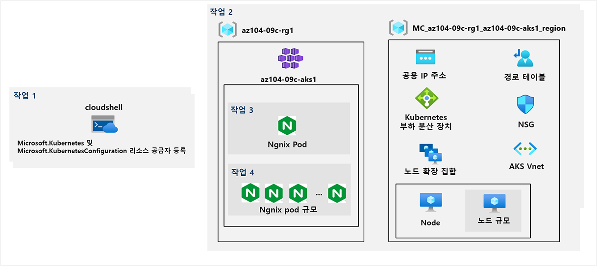

---
lab:
    title: '09c - Azure Kubernetes Service 구현'
    module: '모듈 09 - 서버리스 컴퓨팅'
---

# 랩 09c - Azure Kubernetes Service 구현
# 학생 랩 매뉴얼

## 랩 시나리오

Contoso에는 Azure Container Instances를 사용하여 실행하기에는 적합하지 않은 많은 다중 계층 애플리케이션이 있습니다. 컨테이너화된 워크로드로 실행할 수 있는지 여부를 확인하기 위해 Kubernetes를 컨테이너 오케스트레이터로 사용하여 평가하려고 합니다. 관리 오버헤드를 더욱 최소화하기 위해 간소화된 배포 환경 및 스케일링 기능을 포함하여 Azure Kubernetes Service를 테스트하려고 합니다.

## 목표

이 랩에서는 다음 작업을 수행합니다.

+ 작업 1: Microsoft.Kubernetes 및 Microsoft.KubernetesConfiguration 리소스 공급자를 등록합니다.
+ 작업 2: Azure Kubernetes Service 클러스터 배포
+ 작업 3: Azure Kubernetes Service 클러스터에 Pod 배포
+ 작업 4: Azure Kubernetes Service 클러스터에서 컨테이너화된 워크로드 크기 조정

## 예상 시간: 40분

## 아키텍처 다이어그램



## 지침

### 연습 1:

#### 작업 1: Microsoft.Kubernetes 및 Microsoft.KubernetesConfiguration 리소스 공급자를 등록합니다.

이 작업에서는 Azure Kubernetes Service 클러스터를 배포하는 데 필요한 리소스 공급자를 등록합니다.

1. [Azure Portal](https://portal.azure.com)에 로그인합니다.

1. Azure Portal에서 오른쪽 상단의 아이콘을 클릭하여 **Azure Cloud Shell**을 엽니다.

1. **Bash** 또는 **PowerShell**을 선택하라는 메시지가 표시되면 **PowerShell**을 선택합니다.

    >**참고**: 처음으로 **Cloud Shell**을 시작하고 **탑재된 스토리지가 없음** 메시지가 표시되면, 이 랩에서 사용하는 구독을 선택하고 **스토리지 만들기**를 클릭합니다.

1. Cloud Shell 창에서 다음 명령을 실행하여 Microsoft.Kubernetes와 Microsoft.KubernetesConfiguration 리소스 공급자를 등록합니다.

   ```powershell
   Register-AzResourceProvider -ProviderNamespace Microsoft.Kubernetes

   Register-AzResourceProvider -ProviderNamespace Microsoft.KubernetesConfiguration
   ```

1. Cloud Shell 창을 닫습니다.

#### 작업 2: Azure Kubernetes Service 클러스터 배포

이 작업에서는 Azure Portal을 사용하여 Azure Kubernetes Service 클러스터를 배포합니다.

1. Azure Portal에서 **Kubernetes 서비스**를 검색하여 찾고 **Kubernetes 서비스** 블레이드에서 **+ 만들기**, **+ Kubernetes 클러스터 만들기**를 차례로 클릭합니다.

1. **Kubernetes 클러스터 만들기** 블레이드의 **기본** 탭에서 다음 설정을 지정합니다(다른 설정은 기본값으로 유지).

    | 설정 | 값 |
    | ---- | ---- |
    | 구독 | 이 랩에서 사용 중인 Azure 구독의 이름 |
    | 리소스 그룹 | 새 리소스 그룹 **az104-09c-rg1** 의 이름 |
    | Kubernetes 클러스터 이름 | **az104-9c-aks1** |
    | 지역 | Kubernetes 클러스터를 프로비전할 수 있는 지역의 이름 |
    | 가용성 영역 | **없음** (모든 상자 선택 취소) |
    | Kubernetes 버전 | 기본값 수락 |
    | 노드 크기 | 기본값 수락 |
    | 노드 수 | **1** |

1. **다음: 노드 풀 >** 을 차례로 클릭합니다. **Kubernetes 클러스터 만들기** 블레이드의 **노드 풀** 탭에서 다음 설정을 지정합니다(다른 설정은 기본값으로 유지).

    | 설정 | 값 |
    | ---- | ---- |
    | 가상 노드 사용 | **사용 안 함**(기본값) |
    | 가상 머신 확장 집합 사용 | **사용**(기본값) |

1. **다음: 인증 >** 을 차례로 클릭합니다. **Kubernetes 클러스터 만들기** 블레이드의 **인증** 탭에서 다음 설정을 지정합니다(다른 설정은 기본값으로 유지).

    | 설정 | 값 |
    | ---- | ---- |
    | 인증 방법 | **시스템 할당 관리 ID**(기본값) | 
    | RBAC(역할 기반 액세스 제어) | **사용** |

1. **다음: 네트워킹 >** 을 차례로 클릭합니다. **Kubernetes 클러스터 만들기** 블레이드의 **네트워킹** 탭에서 다음 설정을 지정합니다(다른 설정은 기본 값으로 유지).

    | 설정 | 값 |
    | ---- | ---- |
    | 네트워크 구성 | **kubenet** |
    | DNS 이름 접두사 | 유효하고 전역적으로 고유한 DNS 호스트 이름 |

1. **다음: 통합 >** 을 차례로 클릭합니다. **Kubernetes 클러스터 만들기** 블레이드의 **통합** 탭에서 **컨테이너 모니터링**을 **사용 안 함**으로 설정하고 **검토 + 만들기**를 클릭한 다음 유효성 검사를 통과했는지 확인하고 만들기를 클릭합니다.

    >**참고**: 프로덕션 시나리오에서는 모니터링을 활성화하려고 합니다. 이 경우 랩에서 다루지 않으므로 모니터링이 비활성화됩니다.

    >**참고**: 배포가 완료될 때까지 기다립니다. 약 10분이 소요됩니다.

#### 작업 3: Azure Kubernetes Service 클러스터에 Pod 배포

이 작업에서는 Azure Kubernetes Service 클러스터에 Pod를 배포합니다.

1. 배포 블레이드에서 **리소스로 이동** 링크를 클릭합니다.

1. **az104-9c-aks1** Kubernetes 서비스 블레이드의 **설정** 섹션에서 **노드 풀**을 클릭합니다.

1. **az104-9c-aks1 - 노드 풀** 블레이드에서 클러스터가 하나의 노드가 있는 단일 풀로 구성되어 있는지 확인합니다.

1. Azure Portal에서 오른쪽 상단의 아이콘을 클릭하여 **Azure Cloud Shell**을 엽니다.

1. **Azure Cloud Shell**을 **Bash**(검은색 배경)로 전환합니다.

1. Cloud Shell 창에서 다음 명령을 실행하여 AKS 클러스터에 액세스할 때 필요한 자격 증명을 검색하세요.

    ```sh
    RESOURCE_GROUP='az104-09c-rg1'

    AKS_CLUSTER='az104-9c-aks1'

    az aks get-credentials --resource-group $RESOURCE_GROUP --name $AKS_CLUSTER
    ```

1. **Cloud Shell** 창에서 다음 명령을 실행하여 AKS 클러스터에 연결되었는지 확인하세요.

    ```sh
    kubectl get nodes
    ```

1. **Cloud Shell** 창에서 출력을 검토하고 이 시점에 클러스터를 구성하고 있는 하나의 노드가 **준비** 상태를 보고하고 있는지 확인합니다.

1. **Cloud Shell** 창에서 다음 명령을 실행하여 Docker Hub에서 **nginx** 이미지를 배포합니다.

    ```sh
    kubectl create deployment nginx-deployment --image=nginx
    ```

    > **참고**: 배포 이름(nginx-deployment)을 입력할 때 소문자를 사용해야 합니다.

1. **Cloud Shell** 창에서 다음 명령을 실행하여 Kubernetes Pod가 제대로 만들어졌는지 확인합니다.

    ```sh
    kubectl get pods
    ```

1. **Cloud Shell** 창에서 다음 명령을 실행하여 배포 상태를 확인합니다.

    ```sh
    kubectl get deployment
    ```

1. **Cloud Shell** 창에서 다음 명령을 실행하여 Pod를 인터넷에서 사용할 수 있게 만듭니다.

    ```sh
    kubectl expose deployment nginx-deployment --port=80 --type=LoadBalancer
    ```

1. **Cloud Shell** 창에서 다음 명령을 실행하여 공용 IP 주소가 프로비전되었는지 확인합니다.

    ```sh
    kubectl get service
    ```

1. **nginx-deployment** 항목에 대한 **EXTERNAL-IP** 열의 값이 **\<pending\>** 에서 공용 IP 주소로 바뀔 때까지 명령을 다시 실행합니다. **nginx-deployment** 에 대한 **EXTERNAL-IP** 열의 공용 IP 주소를 기록합니다.

1. 브라우저 창을 열고 이전 단계에서 식별한 IP 주소로 이동합니다. 브라우저 페이지에 **nginx에 오신 것을 환영합니다!** 메시지가 표시되는지 확인합니다.

#### 작업 4: Azure Kubernetes Service 클러스터에서 컨테이너화된 워크로드 크기 조정

이 작업에서는 Pod 갯수와 클러스터 노드 갯수를 수평으로 스케일링합니다.

1. **Cloud Shell** 창에서 다음 명령을 실행하여 Pod 수를 2로 늘려 배포를 스케일링합니다.

    ```sh

    RESOURCE_GROUP='az104-09c-rg1'

    AKS_CLUSTER='az104-9c-aks1'

    kubectl scale --replicas=2 deployment/nginx-deployment
    ```

1. **Cloud Shell** 창에서 다음 명령을 실행하여 배포가 잘 스케일링되었는지 확인합니다.

    ```sh
    kubectl get pods
    ```

    > **참고**: 명령의 출력을 검토하여 Pod 수가 2으로 증가했는지 확인합니다.

1. **Cloud Shell** 창에서 노드 수를 2로 늘려 클러스터를 스케일 아웃하려면 다음 명령을 실행합니다.

    ```sh
    az aks scale --resource-group $RESOURCE_GROUP --name $AKS_CLUSTER --node-count 2
    ```

    > **참고**: 추가 노드의 프로비전이 완료될 때까지 기다립니다. 완료되려면 약 3분이 소요됩니다. 실패한 경우 `az aks scale` 명령을 다시 실행합니다.

1. **Cloud Shell** 창에서 다음 명령을 실행하여 클러스터 스케일링이 잘 수행되었는지 확인합니다.

    ```sh
    kubectl get nodes
    ```

    > **참고**: 명령의 출력을 검토하여 노드 수가 2로 증가했는지 확인합니다.

1. **Cloud Shell** 창에서 다음 명령을 실행하여 배포를 스케일링합니다.

    ```sh
    kubectl scale --replicas=10 deployment/nginx-deployment
    ```

1. **Cloud Shell** 창에서 다음 명령을 실행하여 배포가 잘 스케일링되었는지 확인합니다.

    ```sh
    kubectl get pods
    ```

    > **참고**: 명령의 출력을 검토하여 Pod 수가 10으로 증가했는지 확인합니다.

1. **Cloud Shell** 창에서 다음 명령을 실행하여 클러스터 노드 간 Pod 분포를 검토합니다.

    ```sh
    kubectl get pod -o=custom-columns=NODE:.spec.nodeName,POD:.metadata.name
    ```

    > **참고**: 명령의 출력을 검토하여 두 노드에 Pod가 분산되어 있는지 확인합니다.

1. **Cloud Shell** 창에서 다음 명령을 실행하여 배포를 삭제합니다.

    ```sh
    kubectl delete deployment nginx-deployment
    ```

1. **Cloud Shell** 창을 닫습니다.

#### 리소스 정리

   >**참고**: 더 이상 사용하지 않는 새로 만든 Azure 리소스를 제거해야 합니다. 사용하지 않는 리소스를 제거하면 예기치 않은 비용이 발생하지 않습니다.

1. Azure Portal의 **Cloud Shell** 창에서 **Bash** 세션을 시작합니다.

1. 다음 명령을 실행하여 이 모듈의 전체 랩에서 생성된 모든 리소스 그룹을 나열합니다.

   ```sh
   az group list --query "[?starts_with(name,'az104-09c')].name" --output tsv
   ```

1. 다음 명령을 실행하여 이 모듈의 전체 랩에서 만든 모든 리소스 그룹을 삭제합니다.

   ```sh
   az group list --query "[?starts_with(name,'az104-09c')].[name]" --output tsv | xargs -L1 bash -c 'az group delete --name $0 --no-wait --yes'
   ```

    >**참고**: 명령은 비동기적으로 실행되므로(--nowait 매개 변수에 의해 결정됨) 동일한 Bash 세션 내에서 즉시 다른 Azure CLI 명령을 실행할 수 있지만 리소스 그룹이 실제로 제거되기까지 몇 분 정도 걸립니다.

#### 복습

이 랩에서는 다음을 수행했습니다.

+ Azure Kubernetes Service 클러스터 배포
+ Pod를 Azure Kubernetes Service 클러스터에 배포
+ Azure Kubernetes Service 클러스터에서 컨테이너화된 워크로드를 스케일링
