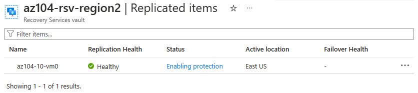

---
lab:
  title: '랩 10: 데이터 보호 구현'
  module: Administer Data Protection
---

# 랩 10 – 데이터 보호 구현

## 랩 소개    

이 랩에서는 Azure Virtual Machines의 백업 및 복구에 대해 알아봅니다. Azure Virtual Machines에 대한 복구 서비스 자격 증명 모음 및 백업 정책을 만드는 방법을 알아봅니다. Azure Site Recovery를 사용한 재해 복구에 대해 알아봅니다. 

이 랩을 수행하려면 Azure 구독이 필요합니다. 구독 유형은 이 랩의 기능 가용성에 영향을 미칠 수 있습니다. 지역을 변경할 수 있지만 단계는 **미국 동부** 및 **미국 서부**를 사용하여 작성되었습니다.

## 예상 소요 시간: 50분

## 랩 시나리오

조직에서는 우발적이거나 악의적인 데이터 손실로부터 Azure Virtual Machines를 백업하고 복원하는 방법을 평가하고 있습니다. 또한 조직에서는 재해 복구 시나리오를 위해 Azure Site Recovery를 사용하는 방법을 알아보려고 합니다. 

## 대화형 랩 시뮬레이션

이 항목에 유용할 수 있는 대화형 랩 시뮬레이션이 있습니다. 시뮬레이션을 통해 고유의 속도에 맞춰 유사한 시나리오를 클릭할 수 있습니다. 대화형 시뮬레이션과 이 랩에는 차이점이 있지만 핵심 개념은 대부분 동일합니다. Azure 구독은 필요하지 않습니다.

+ **[가상 머신 및 온-프레미스 파일을 백업합니다.](https://mslabs.cloudguides.com/guides/AZ-104%20Exam%20Guide%20-%20Microsoft%20Azure%20Administrator%20Exercise%2016)**. Recovery Services 자격 증명 모음을 만들고 Azure Virtual Machines 백업을 구현합니다. Microsoft Azure Recovery Services 에이전트를 사용하여 온-프레미스 파일 및 폴더 백업을 구현합니다. 온-프레미스 백업은 이 랩 범위를 벗어나지만 해당 단계를 살펴보는 것이 도움이 될 수 있습니다. 

## 작업 기술

+ 작업 1: 템플릿을 사용하여 인프라를 프로비전합니다.
+ 작업 2: Recovery Services 자격 증명 모음을 만들고 구성합니다.
+ 작업 3: Azure Virtual Machines 수준 백업을 구성합니다.
+ 작업 4: Azure Backup을 모니터링합니다.
+ 작업 5: 가상 머신 복제를 사용하도록 설정합니다. 

## 예상 소요 시간: 40분

## 아키텍처 다이어그램

## 작업 1: 템플릿을 사용하여 인프라 프로비전

이 작업에서는 템플릿을 사용하여 가상 머신을 배포합니다. 가상 머신은 다양한 백업 시나리오를 테스트하는 데 사용됩니다.

1. **\\Allfiles\\Lab10\\** 랩 파일을 다운로드합니다.

1. **Azure Portal** - `https://portal.azure.com`에 로그인합니다.

1. `Deploy a custom template`을 검색하고 선택합니다.

1. 사용자 지정 배포 페이지에서 **편집기에서 나만의 템플릿 만들기**를 선택합니다.

1. 템플릿 편집 페이지에서 **파일 로드**를 선택합니다.

1. **\\Allfiles\\Lab10\\az104-10-vms-edge-template.json** 파일을 찾아 선택하고 **열기**를 선택합니다.

   >**참고:** 템플릿을 검토해 보세요. 백업 및 복구를 시연할 수 있도록 가상 네트워크와 가상 머신을 배포하고 있습니다. 

1. 변경 내용을 **저장**합니다.

1. **매개 변수 편집**을 선택한 다음 **파일 로드**를 선택합니다.

1. **\\Allfiles\\Lab10\\az104-10-vms-edge-parameters.json** 파일을 로드하고 선택합니다.

1. 변경 내용을 **저장**합니다.

1. 다음 정보를 사용하여 사용자 지정 배포 필드를 완료하고 다른 모든 필드는 기본값으로 둡니다.

    | 설정       | 값         | 
    | ---           | ---           |
    | Subscription  | Azure 구독 |
    | Resource group| `az104-rg-region1`(필요한 경우 **새로 만들기** 선택)
    | 지역        | **미국 동부**   |
    | 사용자 이름      | **localadmin**   |
    | 암호      | 복잡한 암호 제공 |

1. **검토 + 만들기**, **만들기**를 차례로 선택합니다.

    >**참고:** 템플릿이 배포될 때까지 기다린 다음 **리소스로 이동**을 선택합니다. 하나의 가상 네트워크에는 하나의 가상 머신이 있어야 합니다. 

## 작업 2: Recovery Services 자격 증명 모음 만들기 및 구성

이 작업에서는 Recovery Services 자격 증명 모음을 만듭니다. Recovery Services 자격 증명 모음은 가상 머신 데이터에 대한 스토리지를 제공합니다. 

1. Azure Portal에서 `Recovery Services vaults`를 검색하여 선택하고 **Recovery Services 자격 증명 모음** 블레이드에서 **+ 만들기**를 클릭합니다.

1. **Recovery Services 자격 증명 모음 만들기** 블레이드에서 다음 설정을 지정합니다.

    | 설정 | 값 |
    | --- | --- |
    | 구독 | Azure 구독의 이름 |
    | Resource group | `az104-rg-region1`  |
    | 자격 증명 모음 이름 | `az104-rsv-region1` |
    | 지역 | **미국 동부** |

    >**참고**: 이전 작업에서 가상 머신을 배포한 지역과 같은 지역을 지정해야 합니다.

    

1. **검토 + 만들기**를 클릭하고 유효성 검사가 통과되었는지 유효성을 검사한 다음 **만들기**를 클릭합니다.

    >**참고**: 배포가 완료될 때까지 기다립니다. 배포에는 몇 분 정도 걸립니다. 

1. 배포가 완료되면 **리소스로 이동**을 클릭합니다.

1. Recovery Services 자격 증명 모음 블레이드의 **설정** 섹션에서 **속성**을 클릭합니다.

1. **백업 구성** 레이블 아래에서 **업데이트** 링크를 선택합니다.

1. **백업 구성** 블레이드에서 **스토리지 복제 형식** 선택 사항을 검토합니다. **지역 중복**의 기본 설정을 그대로 놔두고 블레이드를 닫습니다.

    >**참고**: 이 설정은 기존 백업 항목이 없는 경우에만 구성할 수 있습니다.
    
    >**유용한 정보** 지역 간 복원 옵션을 사용하면 [Azure 쌍을 이루는 지역](https://learn.microsoft.com/azure/backup/backup-create-recovery-services-vault#set-cross-region-restore)에서 데이터를 복원할 수 있습니다. 

1. Recovery Services 자격 증명 모음 블레이드로 돌아가서 **보안 설정 > 일시 삭제 및 보안 설정** 레이블 아래에 있는 **업데이트** 링크를 클릭합니다.

1. **보안 설정** 블레이드에서 **일시 삭제(Azure에서 실행되는 워크로드의 경우)** 가 **사용**으로 설정되어 있는지 확인합니다. **일시 삭제 보존 기간**은 **14**일입니다. 

1. Recovery Services 자격 증명 모음 블레이드로 돌아가서 **개요** 블레이드를 선택합니다.

>**유용한 정보** Azure에는 두 가지 형식의 자격 증명 모음이 있습니다. Recovery Services 자격 증명 모음 및 백업 자격 증명 모음. 이러한 두 가지 형식은 백업할 수 있는 데이터 원본에 차이가 있습니다. [차이점](https://learn.microsoft.com/answers/questions/405915/what-is-difference-between-recovery-services-vault)에 대해 자세히 알아봅니다.

## 작업 3: Azure Virtual Machines 수준 백업 구성

이 작업에서는 Azure 가상 머신 수준의 백업을 구현합니다. VM 백업의 일부로 백업에 적용되는 백업 및 보존 정책을 정의해야 합니다. VM마다 서로 다른 백업 및 보존 정책이 할당될 수 있습니다.

   >**참고**: 이 작업을 시작하기 전에 이 랩의 첫 번째 작업에서 시작한 배포가 성공적으로 완료되었는지 확인합니다.

1. Recovery Services 자격 증명 모음 블레이드에서 **개요**를 클릭한 다음 **+ 백업**을 클릭합니다.

1. **백업 목표** 블레이드에서 다음 설정을 지정합니다.

    | 설정 | 값 |
    | --- | --- |
    | 워크로드는 어디에서 실행되고 있습니까? | **Azure**(다른 옵션 확인) |
    | 백업하려는 것은 무엇입니까? | **가상 머신**(다른 옵션 확인) |

1. **백업**을 선택합니다.

1. 두 가지 **정책 하위 형식**이 있습니다. **고급** 및 **표준**. 선택 사항을 검토하고 **표준**을 선택합니다. 

1. **백업 정책**에서 **새 정책 만들기**를 선택합니다.

1. 다음 설정을 사용하여 새 백업 정책을 지정합니다(다른 설정은 기본값으로 유지).

    | 설정 | 값 |
    | ---- | ---- |
    | 정책 이름 | `az104-backup` |
    | 빈도 | **매일** |
    | Time | **오전 12:00** |
    | 표준 시간대 | 현지 표준 시간대의 이름 |
    | 인스턴트 복구 스냅을 유지 | **2**일 |

    

1. **확인**을 클릭하여 정책을 만든 다음 **가상 머신** 섹션에서 **추가**를 선택합니다.

1. **가상 머신 선택** 블레이드에서 **az-104-10-vm0**을 선택하고 **확인**을 클릭한 후 **백업** 블레이드에서 **백업 사용**을 클릭합니다.

    >**참고**: 백업 사용 설정이 완료될 때까지 기다립니다. 이 작업은 약 2분 정도 소요됩니다.

1. **보호된 항목** 섹션에서 **백업 항목**을 클릭한 다음 **Azure Virtual Machines** 항목을 클릭합니다.

1. **az104-10-vm0**에 대한 **세부 정보 보기** 링크를 선택하고 **백업 사전 확인** 및 **마지막 백업 상태** 항목의 값을 검토합니다.

    >**참고:** 백업이 보류 중인지 확인합니다.
    
1. **지금 백업**을 선택하고 **백업 보존 기간** 드롭다운 목록에서 기본값을 적용한 다음 **확인**을 클릭합니다.

    >**참고**: 백업이 완료될 때까지 기다리지 말고 다음 작업으로 진행하세요.

## 작업 4: Azure Backup 모니터링

이 작업에서는 Azure Storage 계정을 배포합니다. 그런 다음 로그 및 메트릭을 스토리지 계정으로 보내도록 자격 증명 모음을 구성합니다. 그런 다음 이 리포지토리를 Log Analytics 또는 기타 타사 모니터링 솔루션과 함께 사용할 수 있습니다.

1. Azure Portal에서 `Storage accounts`를 검색하여 선택합니다.

1. 스토리지 계정 페이지에서 **만들기**를 선택합니다.

1. 다음 정보를 사용하여 스토리지 계정을 정의한 후 **검토**를 선택합니다.

    | 설정 | 값 |
    | --- | --- | 
    | 구독          | *구독*    |
    | 리소스 그룹        | **az104-rg-region1**        |
    | 스토리지 계정 이름  | 전역적으로 고유한 이름 입력   |
    | 지역                | **미국 동부**   |

1. 검토 탭에서 **만들기**를 선택합니다.

    >**참고**: 배포가 완료될 때까지 기다립니다. 약 1분 정도 소요됩니다.

1. Recovery Services 자격 증명 모음을 검색하고 선택합니다.

1. **진단 설정**을 선택한 다음 **진단 설정 추가**를 선택합니다.

1. 설정 이름을 `Logs and Metrics to storage`로 지정합니다.

1. 다음 로그 및 메트릭 범주 옆에 확인 표시를 합니다.

    - **Azure Backup 보고 데이터**
    - **추가 기능 Azure Backup 작업 데이터**
    - **추가 기능 Azure Backup 경고 데이터**
    - **Azure Site Recovery 작업**
    - **Azure Site Recovery 이벤트**
    - **상태**

1. 대상 세부 정보에서 **스토리지 계정에 보관** 옆에 확인 표시를 합니다.

1. 스토리지 계정 드롭다운 필드에서 이 작업의 앞부분에서 배포한 스토리지 계정을 선택합니다.

1. **저장**을 선택합니다.

1. Recovery Services 자격 증명 모음으로 돌아가서 **모니터링** 블레이드에서 **백업 작업**을 선택합니다.

1. **az104-10-vm0** 가상 머신에 대한 백업 작업을 찾습니다. 

1. 백업 작업의 세부 정보를 검토합니다.

## 작업 5: 가상 머신 복제 사용

1. Azure Portal에서 `Recovery Services vaults`를 검색하여 선택하고 **Recovery Services 자격 증명 모음** 블레이드에서 **+ 만들기**를 클릭합니다.

1. **Recovery Services 자격 증명 모음 만들기** 블레이드에서 다음 설정을 지정합니다.

    | 설정 | 값 |
    | --- | --- |
    | 구독 | Azure 구독의 이름 |
    | Resource group | `az104-rg-region2`(필요한 경우 **새로 만들기** 선택) |
    | 자격 증명 모음 이름 | `az104-rsv-region2` |
    | 지역 | **미국 서부** |

    >**참고**: 가상 머신과 **다른** 지역을 지정했는지 확인합니다.

1. **검토 + 만들기**를 클릭하고 유효성 검사가 통과되었는지 유효성을 검사한 다음 **만들기**를 클릭합니다.

    >**참고**: 배포가 완료될 때까지 기다립니다. 배포에는 몇 분 정도 걸립니다. 

1. `az104-10-vm0` 가상 머신을 검색하고 선택합니다.

1. **백업 + 재해 복구** 블레이드에서 **재해 복구**를 선택합니다. 

1. **복제 사용**을 선택합니다.

1. **기본 사항** 탭에서 **대상 지역**을 확인합니다.

1. **고급 설정** 탭으로 이동합니다. 사용자를 위한 리소스가 선택되었습니다. 이를 검토해야 합니다. 

1. 구독, VM 리소스 그룹, 가상 네트워크 및 가용성(기본값 사용) 설정을 확인합니다.

1. **스토리지 설정**에서 **세부 정보 표시**를 선택합니다.

    | 설정 | 값 |
    | ---- | ---- |
    | vm에 대한 변동 | **일반 변동**  |
    | 캐시 스토리지 계정 | **(신규) xxx**  |

   >**참고:** 이 두 설정을 모두 채워야 합니다. 그렇지 않으면 유효성 검사가 실패합니다. 값이 표시되지 않으면 페이지를 새로 고쳐 보세요. 그래도 작동하지 않으면 빈 스토리지 계정을 만든 다음 이 페이지로 돌아옵니다.

1. **복제 설정**에서 **세부 정보 표시**를 선택합니다. 지역 2의 복구 리소스 자격 증명 모음이 자동으로 선택되었습니다.

1. **검토 + 복제 시작**을 선택한 다음 **복제 사용**을 선택합니다.

    >**참고**: 복제를 사용하도록 설정하는 데 10~15분이 소요됩니다. 포털 오른쪽 상단의 알림 메시지를 확인합니다. 기다리는 동안 이 페이지 끝에 있는 자습형 학습 링크를 검토해 보세요.
    
1. 복제가 완료되면 Recovery Services 자격 증명 모음(**az104-rsv-region2**)를 검색하여 찾습니다. 페이지를 **새로 고침**해야 할 수도 있습니다. 

1. **보호된 항목** 섹션에서 **복제된 항목**을 선택합니다.

1. 복제 상태에 대해 가상 머신이 정상으로 표시되는지 확인합니다. 상태에는 동기화(0%부터 시작) 상태가 표시되며 초기 동기화가 완료된 후 궁극적으로 **보호됨**이 표시됩니다.

   

1. 자세한 내용을 보려면 가상 머신을 선택합니다.
   
>**유용한 정보** [보호된 VM의 장애 조치(failover)를 테스트](https://learn.microsoft.com/azure/site-recovery/tutorial-dr-drill-azure#run-a-test-failover-for-a-single-vm)하는 것이 좋습니다.

## 리소스 정리

**고유의 구독**으로 작업하는 경우 랩 리소스를 삭제해 보세요. 이렇게 하면 리소스가 확보되고 비용이 최소화됩니다. 랩 리소스를 삭제하려면 랩 리소스 그룹을 삭제하는 것이 가장 쉽습니다. 

+ Azure Portal에서 리소스 그룹을 선택하고 **리소스 그룹 삭제**, **리소스 그룹 이름 입력**을 선택한 다음 **삭제**를 클릭합니다.
+ Azure PowerShell 사용, `Remove-AzResourceGroup -Name resourceGroupName`.
+ CLI 사용, `az group delete --name resourceGroupName`.

## 핵심 내용

축하합니다. 랩을 완료했습니다. 이 랩의 주요 내용은 다음과 같습니다. 

+ Azure Backup 서비스는 데이터를 백업하고 복구하기 위한 간단하고 안전하며 비용 효율적인 솔루션을 제공합니다.
+ Azure Backup은 가상 머신 및 파일 공유를 포함한 온-프레미스 및 클라우드 리소스를 보호할 수 있습니다.
+ Azure Backup 정책은 백업 빈도와 복구 지점의 보존 기간을 구성합니다. 
+ Azure Site Recovery는 가상 머신 및 애플리케이션에 대한 보호를 제공하는 재해 복구 솔루션입니다.
+ Azure Site Recovery는 워크로드를 보조 사이트에 복제하고, 가동 중단이나 재해가 발생하는 경우 보조 사이트로 장애 조치(failover)하고 가동 중지 시간을 최소화하면서 작업을 다시 시작할 수 있습니다.
+ Recovery Services 자격 증명 모음은 백업 데이터를 저장하고 관리 오버헤드를 최소화합니다.

## 자기 주도적 학습을 통해 자세히 알아보기

+ [Azure Backup을 사용하여 가상 머신 보호](https://learn.microsoft.com/training/modules/protect-virtual-machines-with-azure-backup/) Azure Backup을 사용하여 온-프레미스 서버, 가상 머신, SQL Server, Azure 파일 공유 및 기타 워크로드를 보호할 수 있습니다.
+ [Azure Site Recovery를 사용하여 Azure 인프라 보호](https://learn.microsoft.com/en-us/training/modules/protect-infrastructure-with-site-recovery/). Azure Site Recovery를 사용하여 Azure 가상 머신의 복제, 장애 조치(failover), 장애 복구(failback)를 사용자 지정하여 Azure 인프라에 대한 재해 복구를 제공합니다.
