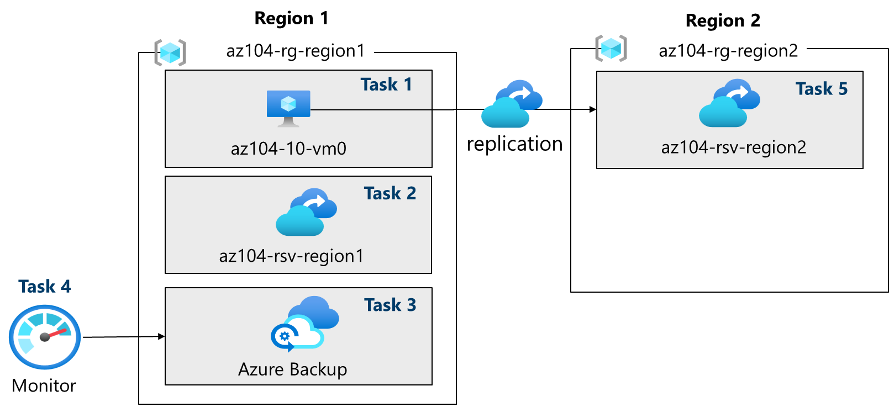
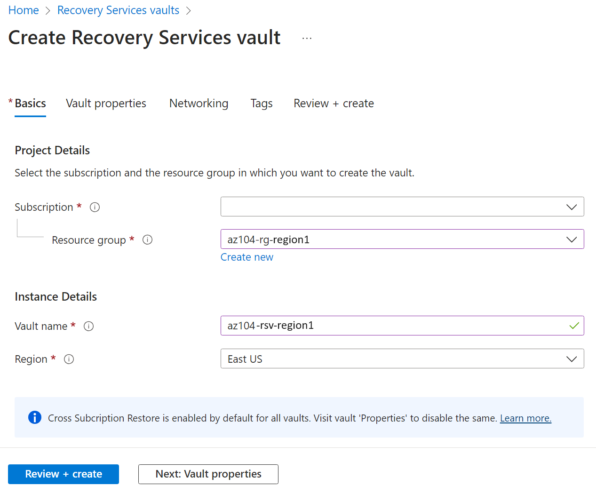

---
lab:
  title: '랩 10: 데이터 보호 구현'
  module: Administer Data Protection
---

# 랩 10 – 데이터 보호 구현

## 랩 소개    

이 랩에서는 Azure 가상 머신의 백업 및 복구에 대해 알아봅니다. Azure 가상 머신에 대한 Recovery Service 자격 증명 모음 및 백업 정책을 만드는 방법을 알아봅니다. Azure Site Recovery를 사용한 재해 복구에 대해 알아봅니다. 

이 랩에는 Azure 구독이 필요합니다. 구독 유형은 이 랩의 기능 가용성에 영향을 줄 수 있습니다. 지역을 변경할 수 있지만 단계는 미국 동부 및 **미국**** 서부를 사용하여 **작성됩니다.

## 예상 소요 시간: 50분

## 랩 시나리오

조직에서 실수로 또는 악의적인 데이터 손실로부터 Azure 가상 머신을 백업하고 복원하는 방법을 평가하고 있습니다. 또한 조직은 재해 복구 시나리오에 Azure Site Recovery를 사용하여 탐색하려고 합니다. 

## 대화형 랩 시뮬레이션

이 항목에 유용할 수 있는 대화형 랩 시뮬레이션이 있습니다. 시뮬레이션을 사용하면 비슷한 시나리오를 원하는 속도로 클릭할 수 있습니다. 대화형 시뮬레이션과 이 랩 사이에는 차이점이 있지만, 대부분의 핵심 개념은 동일합니다. Azure 구독은 필요하지 않습니다.

+ **[가상 머신 및 온-프레미스 파일을](https://mslabs.cloudguides.com/guides/AZ-104%20Exam%20Guide%20-%20Microsoft%20Azure%20Administrator%20Exercise%2016)** 백업합니다. 복구 서비스 자격 증명 모음을 만들고 Azure 가상 머신 백업을 구현합니다. Microsoft Azure Recovery Services 에이전트를 사용하여 온-프레미스 파일 및 폴더 백업을 구현합니다. 온-프레미스 백업은 이 랩의 범위를 벗어나지만 이러한 단계를 보는 것이 유용할 수 있습니다. 

## 작업 기술

+ 작업 1: 템플릿을 사용하여 인프라를 프로비전합니다.
+ 작업 2: Recovery Services 자격 증명 모음을 만들고 구성합니다.
+ 작업 3: Azure 가상 머신 수준 백업을 구성합니다.
+ 작업 4: Azure Backup을 모니터링합니다.
+ 작업 5: 가상 머신 복제본(replica)tion을 사용하도록 설정합니다. 

## 예상 소요 시간: 40분

## 아키텍처 다이어그램

## 작업 1: 템플릿을 사용하여 인프라 프로비전

이 작업에서는 템플릿을 사용하여 가상 머신을 배포합니다. 가상 머신은 다른 백업 시나리오를 테스트하는 데 사용됩니다.

1. **\\Allfiles\\Lab10\\** 랩 파일을 다운로드합니다.

1. **Azure Portal** - `https://portal.azure.com`에 로그인합니다.

1. `Deploy a custom template`을 검색하고 선택합니다.

1. 사용자 지정 배포 페이지에서 편집기**에서 고유한 템플릿 빌드를 선택합니다**.

1. 템플릿 편집 페이지에서 파일** 로드를 선택합니다**.

1. **\\Allfiles\\Lab10\\az104-10-vms-edge-template.json** 파일을 찾아 선택하고 열기**를 선택합니다**.

   >**참고:** 잠시 템플릿을 검토하세요. 백업 및 복구를 시연할 수 있도록 가상 네트워크 및 가상 머신을 배포하고 있습니다. 

1. 변경 내용을 **저장**합니다.

1. 매개 변수** 편집을 선택한 다음 **파일** 로드를 선택합니다**.

1. Allfiles Lab10 az104-10-vms-edge-parameters.json 파일을 로드하고 선택합니다**\\.**\\\\

1. 변경 내용을 **저장**합니다.

1. 다음 정보를 사용하여 사용자 지정 배포 필드를 완료하고 다른 모든 필드에 기본값을 남깁니다.

    | 설정       | 값         | 
    | ---           | ---           |
    | Subscription  | Azure 구독 |
    | Resource group| `az104-rg-region1` (필요한 ** 경우새로** 만들기)
    | 지역        | **미국 동부**   |
    | 사용자 이름      | **localadmin**   |
    | 암호      | 복잡한 암호 제공 |

1. **검토 + 만들기**, **만들기**를 차례로 선택합니다.

    >**참고:** 템플릿이 배포되기를 기다린 다음 리소스로 이동을** 선택합니다**. 하나의 가상 네트워크에 하나의 가상 머신이 있어야 합니다. 

## 작업 2: Recovery Services 자격 증명 모음 만들기 및 구성

이 작업에서는 Recovery Services 자격 증명 모음을 만듭니다. Recovery Services 자격 증명 모음은 가상 머신 데이터에 대한 스토리지를 제공합니다. 

1. Azure Portal에서 검색하여 선택하고 `Recovery Services vaults` Recovery Services** 자격 증명 모음 블레이드에서 **+ 만들기**를 클릭합니다**.

1. **Recovery Services 자격 증명 모음 만들기** 블레이드에서 다음 설정을 지정합니다.

    | 설정 | 값 |
    | --- | --- |
    | 구독 | Azure 구독의 이름 |
    | Resource group | `az104-rg-region1`  |
    | 자격 증명 모음 이름 | `az104-rsv-region1` |
    | 지역 | **미국 동부** |

    >**참고**: 이전 작업에서 가상 머신을 배포한 지역과 같은 지역을 지정해야 합니다.

    

1. 검토 + 만들기를 클릭하고 **유효성 검사가 통과되었는지 확인하고 만들기**를 클릭합니다**.**

    >**참고**: 배포가 완료될 때까지 기다립니다. 배포에는 몇 분 정도 걸립니다. 

1. 배포가 완료되면 **리소스로 이동**을 클릭합니다.

1. Recovery Services 자격 증명 모음 블레이드의 **설정** 섹션에서 속성을** 클릭합니다**.

1. **Backup 구성** 레이블 아래에서 **업데이트** 링크를 선택합니다.

1. Backup 구성 블레이드에서 **스토리지 복제본(replica)tion 유형에 대한 **선택 항목을 검토합니다**.** **지역 중복**의 기본 설정을 그대로 놔두고 블레이드를 닫습니다.

    >**참고**: 이 설정은 기존 백업 항목이 없는 경우에만 구성할 수 있습니다.
    
    >**알고 계셨나요?** 지역 간 복원 옵션을 사용하면 [Azure 쌍을 이루는 지역](https://learn.microsoft.com/azure/backup/backup-create-recovery-services-vault#set-cross-region-restore)에서 데이터를 복원할 수 있습니다. 

1. Recovery Services 자격 증명 모음 블레이드로 돌아가서 보안 설정 > 일시 삭제 및 보안 설정** 레이블 아래에서 **업데이트** 링크를 클릭합니다**.

1. **보안 설정** 블레이드에서 **일시 삭제(Azure에서 실행되는 워크로드의 경우)** 가 **사용**으로 설정되어 있는지 확인합니다. **일시 삭제 보존 기간**은 14**일입니다**. 

1. Recovery Services 자격 증명 모음 블레이드로 돌아가서 개요** 블레이드를 **선택합니다.

>**알고 계셨나요?** Azure에는 Recovery Services 자격 증명 모음과 Backup 자격 증명 모음이라는 두 가지 유형의 자격 증명 모음이 있습니다. 기본 차이점은 백업할 수 있는 데이터 원본입니다. 차이점에 대해 [자세히 알아봅니다](https://learn.microsoft.com/answers/questions/405915/what-is-difference-between-recovery-services-vault).

## 작업 3: Azure 가상 머신 수준 백업 구성

이 작업에서는 Azure 가상 머신 수준의 백업을 구현합니다. VM 백업의 일부로 백업에 적용되는 백업 및 보존 정책을 정의해야 합니다. VM에 다른 백업 및 보존 정책이 할당되어 있을 수 있습니다.

   >**참고**: 이 작업을 시작하기 전에 이 랩의 첫 번째 작업에서 시작한 배포가 성공적으로 완료되었는지 확인합니다.

1. Recovery Services 자격 증명 모음 블레이드에서 개요를 클릭한 **다음 + 백업**을 클릭합니다**.**

1. **백업 목표** 블레이드에서 다음 설정을 지정합니다.

    | 설정 | 값 |
    | --- | --- |
    | 워크로드는 어디에서 실행되고 있습니까? | **Azure** (다른 옵션 확인) |
    | 백업하려는 것은 무엇입니까? | **가상 머신** (다른 옵션 확인 |

1. **백업**을 선택합니다.

1. 두 가지 정책 하위 유형****인 **고급** 및 **표준**이 있습니다. 선택 항목을 검토하고 표준을** 선택합니다**. 

1. Backup 정책에서 **새 정책** 만들기를 선택합니다**.**

1. 다음 설정을 사용하여 새 백업 정책을 지정합니다(다른 설정은 기본값으로 유지).

    | 설정 | 값 |
    | ---- | ---- |
    | 정책 이름 | `az104-backup` |
    | 빈도 | **매일** |
    | Time | **오전 12:00** |
    | 표준 시간대 | 현지 표준 시간대의 이름 |
    | 인스턴트 복구 스냅을 유지 | **12** 일 |

    

1. **확인**을 클릭하여 정책을 만든 다음 **가상 머신** 섹션에서 **추가**를 선택합니다.

1. 가상 머신 선택 블레이드에서 **az-104-10-vm0**을 선택하고 **확인을** 클릭한 **다음 백업** 블레이드로 **돌아가서 백업** 사용을 클릭합니다**.**

    >**참고**: 백업 사용 설정이 완료될 때까지 기다립니다. 이 작업은 약 2분 정도 걸립니다.

1. **보호된 항목** 섹션에서 백업 항목을** 클릭한 **다음 Azure 가상 머신** 항목을 클릭합니다**.

1. **az104-10-vm0**에 대한 **세부 정보** 보기 링크를 선택하고 백업 사전 검사** 및 **마지막 백업 상태** 항목의 **값을 검토합니다.

    >**참고:** 백업이 보류 중입니다.
    
1. 지금 백업을 선택하고 **백업 보존** 드롭다운 목록에서 기본값을 **그대로 적용하고 확인을** 클릭합니다**.**

    >**참고**: 백업이 완료될 때까지 기다리지 말고 다음 작업으로 진행하세요.

## 작업 4: Azure Backup 모니터링

이 작업에서는 Azure Storage 계정을 배포합니다. 그런 다음 스토리지 계정에 로그 및 메트릭을 보내도록 자격 증명 모음을 구성합니다. 그런 다음 이 리포지토리를 Log Analytics 또는 기타 타사 모니터링 솔루션과 함께 사용할 수 있습니다.

1. Azure Portal에서 검색하여 선택합니다 `Storage accounts`.

1. Storage 계정 페이지에서 만들기**를 선택합니다**.

1. 다음 정보를 사용하여 스토리지 계정을 정의한 다음 검토를 선택합니다****.

    | 설정 | 값 |
    | --- | --- | 
    | 구독          | *구독*    |
    | 리소스 그룹        | **az104-rg-region1**        |
    | 스토리지 계정 이름  | 전역적으로 고유한 이름 제공   |
    | 지역                | **미국 동부**   |

1. 검토 탭에서 만들기**를 선택합니다**.

    >**참고**: 배포가 완료될 때까지 기다립니다. 약 1분 정도 걸릴 수 있습니다.

1. Recovery Services 자격 증명 모음을 검색하고 선택합니다.

1. 진단 설정 선택한 **다음 진단 설정** 추가를 선택합니다**.**

1. 설정 이름을 지정합니다 `Logs and Metrics to storage`.

1. 다음 로그 및 메트릭 범주 옆에 검사mark를 배치합니다.

    - **Azure Backup 보고 데이터**
    - **Addon Azure Backup 작업 데이터**
    - **Addon Azure Backup 경고 데이터**
    - **Azure Site Recovery 작업**
    - **Azure Site Recovery 이벤트**
    - **상태**

1. 대상 세부 정보에서 스토리지 계정에 보관 옆에 **검사 표시를 배치합니다**.

1. Storage 계정 드롭다운 필드에서 이 작업의 앞부분에서 배포한 스토리지 계정을 선택합니다.

1. **저장**을 선택합니다.

1. Recovery Services 자격 증명 모음으로 돌아가서 모니터링** 블레이드에서 **백업 작업을** 선택합니다**.

1. az104-10-vm0** 가상 머신에 대한 **백업 작업을 찾습니다. 

1. 백업 작업의 세부 정보를 검토합니다.

## 작업 5: 가상 머신 복제본(replica) 설정

1. Azure Portal에서 검색하여 선택하고 `Recovery Services vaults` Recovery Services** 자격 증명 모음 블레이드에서 **+ 만들기**를 클릭합니다**.

1. **Recovery Services 자격 증명 모음 만들기** 블레이드에서 다음 설정을 지정합니다.

    | 설정 | 값 |
    | --- | --- |
    | 구독 | Azure 구독의 이름 |
    | Resource group | `az104-rg-region2` (필요한 ** 경우새로** 만들기) |
    | 자격 증명 모음 이름 | `az104-rsv-region2` |
    | 지역 | **미국 서부** |

    >**참고**: 가상 머신과 **다른** 지역을 지정해야 합니다.

1. 검토 + 만들기를 클릭하고 **유효성 검사가 통과되었는지 확인하고 만들기**를 클릭합니다**.**

    >**참고**: 배포가 완료될 때까지 기다립니다. 배포에는 몇 분 정도 걸립니다. 

1. 가상 머신을 `az104-10-vm0` 검색하고 선택합니다.

1. **Backup + 재해 복구 블레이드에서 재해 복구****를 선택합니다**. 

1. **복제 사용**을 선택합니다.

1. 기본 사항 탭에서 **대상 지역을** 확인**합니다**.

1. 고급 설정** 탭으로 **이동합니다. 리소스를 선택했습니다. 검토하는 것이 중요합니다. 

1. 구독, vm 리소스 그룹, 가상 네트워크 및 가용성(기본값) 설정을 확인합니다.

1. 스토리지 설정에서 **세부 정보** 표시를 선택합니다**.**

    | 설정 | 값 |
    | ---- | ---- |
    | vm에 대한 변동 | **보통 변동**  |
    | 캐시 스토리지 계정 | **(신규) xxx**  |

   >**참고:** 이러한 설정을 모두 채웁니다. 그렇지 않으면 유효성 검사가 실패합니다. 값이 없으면 페이지를 새로 고쳐 보세요. 작동하지 않는 경우 빈 스토리지 계정을 만든 다음 이 페이지로 돌아갑니다.

1. 복제 설정에서 **세부 정보** 표시를 선택합니다**.** 지역 2의 복구 리소스 자격 증명 모음이 자동으로 선택되었습니다.

1. 검토 + 복제본(replica) 시작을** 선택한 **다음 **, 복제본(replica) 사용하도록** 설정합니다.

    >**참고**: 복제본(replica) 사용하려면 10~15분이 걸립니다. 포털의 오른쪽 위에 있는 알림 메시지를 확인합니다. 기다리는 동안 이 페이지 끝에 있는 자가 진행 학습 링크를 검토하는 것이 좋습니다.
    
1. 복제본(replica) 작업이 완료되면 Recovery Services 자격 **증명 모음 az104-rsv-region2**를 검색하여 찾습니다. 페이지를 **새로 고침**해야 할 수도 있습니다. 

1. **보호된 항목** 섹션에서 복제된 항목을** 선택합니다**.

1. 가상 머신이 복제본(replica) 상태에 대해 정상으로 표시되는지 확인합니다. 상태 상태 동기화(0%부터 시작)를 표시하고 초기 동기화가 완료된 후 보호됨**을 표시**합니다.

   

1. 자세한 내용을 보려면 가상 머신을 선택합니다.
   
>**알고 계셨나요?** 보호된 VM[의 장애 조치(failover)를 테스트하는 ](https://learn.microsoft.com/azure/site-recovery/tutorial-dr-drill-azure#run-a-test-failover-for-a-single-vm)것이 좋습니다.

## 리소스 정리

고유한 구독**으로 **작업하는 경우 랩 리소스를 삭제하는 데 1분이 소요됩니다. 이렇게 하면 리소스가 해제되고 비용이 최소화됩니다. 랩 리소스를 삭제하는 가장 쉬운 방법은 랩 리소스 그룹을 삭제하는 것입니다. 

+ Azure Portal에서 리소스 그룹을 선택하고, 리소스 그룹 삭제를 선택하고 **, **리소스 그룹** 이름을** 입력한 다음, 삭제**를 클릭합니다**.
+ Azure PowerShell 사용. `Remove-AzResourceGroup -Name resourceGroupName` 
+ CLI `az group delete --name resourceGroupName`를 사용하여 .

## 핵심 내용

랩을 완료한 것을 축하합니다. 다음은 이 랩에 대한 기본 설명입니다. 

+ Azure Backup 서비스는 데이터를 백업하고 복구하는 간단하고 안전하며 비용 효율적인 솔루션을 제공합니다.
+ Azure Backup은 가상 머신 및 파일 공유를 포함하여 온-프레미스 및 클라우드 리소스를 보호할 수 있습니다.
+ Azure Backup 정책은 복구 지점의 백업 빈도 및 보존 기간을 구성합니다. 
+ Azure Site Recovery는 가상 머신 및 애플리케이션에 대한 보호를 제공하는 재해 복구 솔루션입니다.
+ Azure Site Recovery는 보조 사이트에 워크로드를 복제본(replica), 중단 또는 재해가 발생할 경우 보조 사이트로 장애 조치(failover)하고 가동 중지 시간을 최소화하면서 작업을 다시 시작할 수 있습니다.
+ Recovery Services 자격 증명 모음은 백업 데이터를 저장하고 관리 오버헤드를 최소화합니다.

## 자기 주도적 학습을 통해 자세히 알아보기

+ [Azure Backup](https://learn.microsoft.com/training/modules/protect-virtual-machines-with-azure-backup/)을 사용하여 가상 머신을 보호합니다. Azure Backup을 사용하여 온-프레미스 서버, 가상 머신, SQL Server, Azure 파일 공유 및 기타 워크로드를 보호할 수 있습니다.
+ [Azure Site Recovery를 사용하여 Azure 인프라 보호](https://learn.microsoft.com/en-us/training/modules/protect-infrastructure-with-site-recovery/). Azure Site Recovery를 사용하여 Azure 가상 머신의 복제, 장애 조치(failover), 장애 복구(failback)를 사용자 지정하여 Azure 인프라에 대한 재해 복구를 제공합니다.
