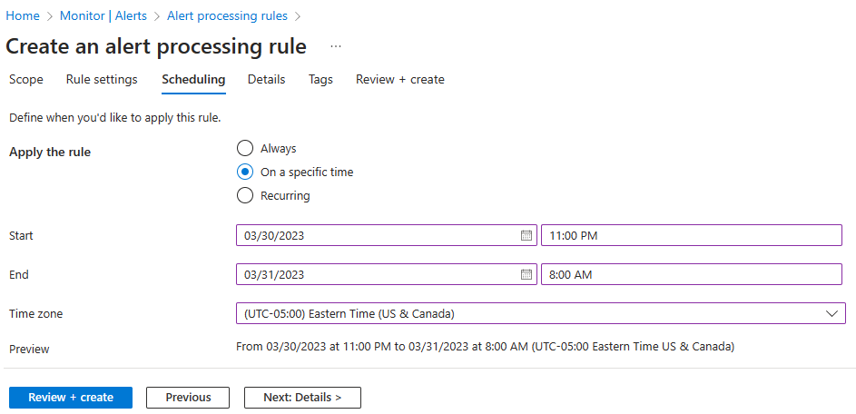

---
lab:
  title: '랩 11: 모니터링 구현'
  module: Administer Monitoring
---

# 랩 11 - 모니터링 구현

## 랩 소개

이 랩에서는 Azure Monitor에 대해 알아봅니다. 경고를 만들어 작업 그룹에 보내는 방법을 알아봅니다. 경고를 트리거 및 테스트하고 활동 로그를 검사.  

이 랩에는 Azure 구독이 필요합니다. 구독 유형은 이 랩의 기능 가용성에 영향을 줄 수 있습니다. 지역을 변경할 수 있지만 단계는 미국** 동부를 사용하여 **작성됩니다.

## 예상 소요 시간: 40분

## 랩 시나리오

조직에서 인프라를 Azure로 마이그레이션했습니다. 관리 담당자에게 중요한 인프라 변경에 대한 알림을 제공하는 것이 중요합니다. Log Analytics를 포함하여 Azure Monitor의 기능을 검사할 계획입니다.

## 대화형 랩 시뮬레이션

이 항목에 유용할 수 있는 대화형 랩 시뮬레이션이 있습니다. 시뮬레이션을 사용하면 비슷한 시나리오를 원하는 속도로 클릭할 수 있습니다. 대화형 시뮬레이션과 이 랩 사이에는 차이점이 있지만, 대부분의 핵심 개념은 동일합니다. Azure 구독은 필요하지 않습니다.

+ [모니터링을 구현합니다](https://mslabs.cloudguides.com/guides/AZ-104%20Exam%20Guide%20-%20Microsoft%20Azure%20Administrator%20Exercise%2017). Log Analytics 작업 영역 및 Azure 자동화 솔루션을 만듭니다. 가상 머신에 대한 모니터링 및 진단 설정을 검토합니다. Azure Monitor 및 Log Analytics 기능을 검토합니다. 

## 아키텍처 다이어그램


## 작업 기술

+ 작업 1: 템플릿을 사용하여 인프라를 프로비전합니다.
+ 작업 2: 경고를 만듭니다.
+ 작업 3: 작업 그룹 알림을 구성합니다.
+ 작업 4: 경고를 트리거하고 작동하는지 확인합니다.
+ 작업 5: 경고 처리 규칙을 구성합니다.
+ 작업 6: Azure Monitor 로그 쿼리를 사용합니다.

## 작업 1: 템플릿을 사용하여 인프라 프로비전

이 작업에서는 모니터링 시나리오를 테스트하는 데 사용할 가상 머신을 배포합니다.

1. 필요한 경우 Allfiles Lab11\\az104-11-vm-template.json** 랩 파일을 컴퓨터에 다운로드**\\합니다.\\

1. **Azure Portal** - `https://portal.azure.com`에 로그인합니다.

1. Azure Portal에서 검색하여 선택합니다 `Deploy a custom template`.

1. 사용자 지정 배포 페이지에서 편집기**에서 고유한 템플릿 빌드를 선택합니다**.

1. 템플릿 편집 페이지에서 파일** 로드를 선택합니다**.

1. **\\Allfiles\\Labs11\\az104-11-vm-template.json** 파일을 찾아 선택하고 열기**를 선택합니다**.

1. **저장**을 선택합니다.

1. 다음 정보를 사용하여 사용자 지정 배포 필드를 완료하고 다른 모든 필드에 기본값을 남깁니다.

    | 설정       | 값         | 
    | ---           | ---           |
    | Subscription  | Azure 구독 |
    | Resource group| `az104-rg11` (필요한 ** 경우새로** 만들기)
    | 지역        | **미국 동부**   |
    | 사용자 이름      | `localadmin`   |
    | 암호      | 복잡한 암호 제공 |
    
1. **검토 + 만들기**, **만들기**를 차례로 선택합니다.

1. 배포가 완료되기를 기다린 다음 리소스 그룹으로** 이동을 클릭합니다**.

1. 배포된 리소스를 검토합니다. 하나의 가상 머신이 있는 하나의 가상 네트워크가 있어야 합니다.

**가상 머신에 대한 Azure Monitor 구성(마지막 작업에서 사용됨)**

1. 포털에서 모니터**를 검색하고 선택합니다**.

1. 사용 가능한 모든 인사이트, 검색, 심사 및 진단 도구를 검토하는 데 잠시 시간이 걸릴 수 있습니다.

1. **VM 인사이트** 상자에서 **보기를** 선택한 다음, 인사이트 구성을** 선택합니다**.

1. 가상 머신을 선택한 다음 **사용** (두 번)합니다.

1. 구독 및 데이터 수집 규칙의 기본값을 선택한 다음 구성**을 선택합니다**. 

1. 가상 머신 에이전트가 설치 및 구성하고 다음 단계를 진행하는 데 몇 분 정도 걸립니다. 
   
## 작업 2: 경고 만들기

이 작업에서는 가상 머신이 삭제되는 시기에 대한 경고를 만듭니다. 

1. **모니터** 페이지에서 경고를 선택합니다****. 

1. **만들기 +** 를 선택하고 경고 규칙을** 선택합니다**. 

1. 리소스 그룹에 대한 상자를 선택한 다음 적용을 선택합니다****. 이 경고는 리소스 그룹의 모든 가상 머신에 적용됩니다. 또는 특정 컴퓨터를 하나만 지정할 수 있습니다. 

1. 조건 탭을 **선택한 다음 모든 신호** 보기 링크를 선택합니다**.**

1. Virtual Machine(Virtual Machines)을 검색하여 삭제를** 선택합니다**. 다른 기본 제공 신호를 확인합니다. **적용**을 선택합니다.

1. **경고 논리** 영역(아래로 스크롤)에서 이벤트 수준** 선택을 검토**합니다. 모두의 기본값을 **** 선택한 상태로 둡니다.

1. **상태** 선택을 검토합니다. 모두의 기본값을 **** 선택한 상태로 둡니다.

1. **다음 작업을 위해 경고 규칙** 만들기 창을 열어 둡니다.

## 작업 3: 작업 그룹 알림 구성

이 작업에서 경고가 트리거되면 운영 팀에 이메일 알림을 보냅니다. 

1. 경고 작업을 계속합니다. 다음: 작업을 선택한 **다음, 작업 그룹** 만들기를 선택합니다**.**

    >**알고 계셨나요?** 경고 규칙에는 최대 5개의 작업 그룹을 추가할 수 있습니다. 작업 그룹은 특정 순서 없이 동시에 실행됩니다. 여러 경고 규칙에서 동일한 작업 그룹을 사용할 수 있습니다. 

1. **기본** 탭에서 각 설정에 다음 값을 입력합니다.

    | 설정 | 값 |
    |---------|---------|
    | **프로젝트 세부 정보** |
    | Subscription | 구독 |
    | 리소스 그룹 | **az104-rg11** |
    | 지역 | **전역**(기본값) |
    | **인스턴스 세부 정보** |
    | 작업 그룹 이름 | `Alert the operations team` (리소스 그룹에서 고유해야 함) |
    | 표시 이름 | `AlertOpsTeam` |

1. 다음: 알림을 선택하고 **각 설정에 대해 다음 값을 입력합니다** .

    | 설정 | 값 |
    |---------|---------|
    | 알림 유형 | **메일/SMS 메시지/푸시/음성**을 선택합니다. |
    | 이름 | `VM was deleted` |

1. **이메일**을 선택하고 **이메일** 상자에 이메일 주소를 입력한 다음 **확인**을 선택합니다. 

    >**참고:** 작업 그룹에 추가되었다는 전자 메일 알림을 받아야 합니다. 몇 분 정도 지연될 수 있지만 이는 규칙이 배포되었다는 확실한 신호입니다.

1. 작업 그룹이 만들어지면 다음: 세부 정보** 탭으로 **이동하고 각 설정에 대해 다음 값을 입력합니다.

    | 설정 | 값 |
    |---------|---------|
    | 경고 규칙 이름 | `VM was deleted` |
    | 경고 규칙 설명 | `A VM in your resource group was deleted` |

1. **검토 + 만들기**를 선택하여 입력의 유효성을 검사한 다음, **만들기**를 선택합니다.

## 작업 4: 경고 트리거 및 작동 중 확인

이 작업에서는 경고를 트리거하고 알림이 전송되어 있는지 확인합니다. 

>**참고:** 경고 규칙이 배포되기 전에 가상 머신을 삭제하면 경고 규칙이 트리거되지 않을 수 있습니다. 

1. 포털에서 **가상 머신**을 검색하여 선택합니다.

1. az104-vm0** 가상 머신에 대한 **확인란을 선택합니다.

1. 메뉴 모음에서 **삭제**를 선택합니다.

1. 강제 삭제** 적용 확인란을 **선택합니다. 입력 `delete` 하여 확인한 다음 삭제**를 선택합니다**. 

1. 제목 표시줄에서 알림 아이콘을 **** 선택하고 vm0**이 성공적으로 삭제될 때까지 **기다립니다.

1. 다음과 같은 알림 이메일을 받아야 합니다. **중요 알림: Azure Monitor 경고 VM이 삭제되었습니다. 활성화되었습니다...** 그렇지 않은 경우 전자 메일 프로그램을 열고 .에서 azure-noreply@microsoft.com전자 메일을 찾습니다.

    
   
1. Azure Portal 리소스 메뉴에서 **모니터**를 선택한 다음, 왼쪽 메뉴에서 **경고**를 선택합니다.

1. vm0**을 삭제하여 **생성된 세 가지 자세한 경고가 있어야 합니다.

   >**참고:** 경고 전자 메일을 보내고 포털에서 경고를 업데이트하는 데 몇 분 정도 걸릴 수 있습니다. 기다리지 않으려면 다음 작업으로 계속 진행한 다음 반환합니다. 

1. 경고 중 하나의 이름을 선택합니다(예: **VM이 삭제되었음**). 이벤트에 대한 자세한 정보를 보여주는 **경고 정보** 창이 표시됩니다.

## 작업 5: 경고 처리 규칙 구성

이 작업에서는 기본 기간 동안 알림을 표시하지 않는 경고 규칙을 만듭니다. 

1. 경고 블레이드에서 **계속하여 경고** 처리 규칙을** 선택한 다음 **+ 만들기를 선택합니다****. 
   
1. 리소스 그룹을** 선택한 다음 적용을 선택합니다****.**
   
1. **다음: 규칙 설정**을 선택한 다음, **알림 표시 안 함**을 선택합니다.
   
1. **다음: 예약**을 선택합니다.
   
1. 기본적으로 규칙은 사용하지 않도록 설정하거나 일정을 구성하지 않는 한 항상 작동합니다. 야간 기본 동안 알림을 표시하지 않는 규칙을 정의하려고 합니다.
경고 처리 규칙의 일정에 대해 다음 설정을 입력합니다.

    | 설정 | 값 |
    |---------|---------|
    | 규칙 적용 | 특정 시간에 |
    | 시작 | 오늘 날짜를 오후 10시에 입력합니다. |
    | 종료 | 내일 오전 7시에 날짜를 입력합니다. |
    | 표준 시간대 | 로컬 표준 시간대를 선택합니다. |

    

1. **다음: 세부 정보**를 선택하고 다음 설정을 입력합니다.

    | 설정 | 값 |
    |---------|---------|
    | Resource group | **az104-rg11** |
    | 규칙 이름 | `Planned Maintenance` |
    | 설명 | `Suppress notifications during planned maintenance.` |

1. **검토 + 만들기**를 선택하여 입력의 유효성을 검사한 다음, **만들기**를 선택합니다.

## 작업 6: Azure Monitor 로그 쿼리 사용

이 작업에서는 Azure Monitor를 사용하여 가상 머신에서 캡처한 데이터를 쿼리합니다.

1. Azure Portal에서 블레이드를 검색하고 선택하고 `Monitor` 로그를** 클릭합니다**.

1. 필요한 경우 시작 화면을 닫습니다. 

1. 범위, **리소스 그룹을** 선택합니다. **적용**을 선택합니다. 

1. 쿼리 탭에서 **가상 머신 **(왼쪽 창)을 선택합니다**.** 

1. 사용 가능한 쿼리를 검토합니다. **Count 하트비트 쿼리를 **실행**합니다(쿼리를 마우스로 가리키기**).

1. 가상 머신이 실행 중일 때 하트비트 수를 받아야 합니다.

1. 쿼리를 검토합니다. 이 쿼리는 *하트비트* 테이블을 사용합니다. 

1. 쿼리를 이 쿼리로 바꾼 다음 실행을** 클릭합니다**. 결과 차트를 검토합니다. 

   ```
    InsightsMetrics
    | where TimeGenerated > ago(1h)
    | where Name == "UtilizationPercentage"
    | summarize avg(Val) by bin(TimeGenerated, 5m), Computer //split up by computer
    | render timechart
   ```

1. 시간이 지남에 따라 다른 쿼리를 검토하고 실행합니다. 

    >**알고 계셨나요?**: 다른 쿼리를 연습하려면 Log Analytics 데모 환경[이 ](https://learn.microsoft.com/azure/azure-monitor/logs/log-analytics-tutorial#open-log-analytics)있습니다.
    
    >**알고 계셨나요?**: 원하는 쿼리를 찾으면 경고를 만들 수 있습니다. 

## 리소스 정리

고유한 구독**으로 **작업하는 경우 랩 리소스를 삭제하는 데 1분이 소요됩니다. 이렇게 하면 리소스가 해제되고 비용이 최소화됩니다. 랩 리소스를 삭제하는 가장 쉬운 방법은 랩 리소스 그룹을 삭제하는 것입니다. 

+ Azure Portal에서 리소스 그룹을 선택하고, 리소스 그룹 삭제를 선택하고 **, **리소스 그룹** 이름을** 입력한 다음, 삭제**를 클릭합니다**.
+ Azure PowerShell 사용. `Remove-AzResourceGroup -Name resourceGroupName` 
+ CLI `az group delete --name resourceGroupName`를 사용하여 .

## 핵심 내용

랩을 완료한 것을 축하합니다. 다음은 이 랩에 대한 기본 설명입니다. 

+ 경고는 사용자가 인프라 또는 애플리케이션에 문제가 있을 수 있음을 알리기 전에 문제를 감지하고 해결하는 데 도움이 됩니다.
+ Azure Monitor 데이터 플랫폼의 모든 메트릭 또는 로그 데이터 원본에 대해 경고할 수 있습니다.
+ 경고 규칙은 데이터를 모니터링하고 지정된 리소스에서 문제가 발생하고 있음을 나타내는 신호를 캡처합니다.
+ 경고 규칙의 조건이 충족되면 경고이 트리거됩니다. 여러 작업(이메일, SMS, 푸시, 음성)을 트리거할 수 있습니다.
+ 작업 그룹에는 경고 알림을 받아야 하는 개인이 포함됩니다.

## 자기 주도적 학습을 통해 자세히 알아보기

+ [Azure에서 경고를 사용하여 인시던트 대응을 개선합니다](https://learn.microsoft.com/en-us/training/modules/incident-response-with-alerting-on-azure/). Azure Monitor의 경고 기능을 통해 인프라의 사고 및 작업에 응답합니다.
+ [Azure Monitor를 사용하여 Azure 가상 머신을 모니터링](https://learn.microsoft.com/en-us/training/modules/monitor-azure-vm-using-diagnostic-data/)합니다. Azure Monitor를 사용하여 VM 호스트 및 클라이언트 메트릭 및 로그를 수집하고 분석하여 Azure VM을 모니터링합니다.
